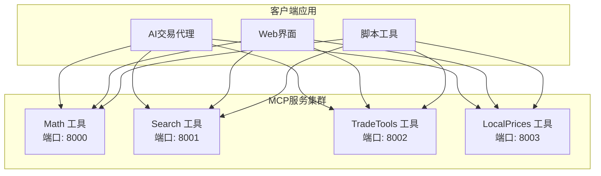
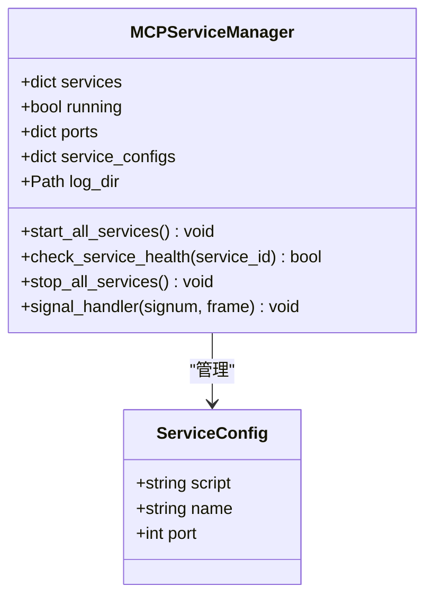
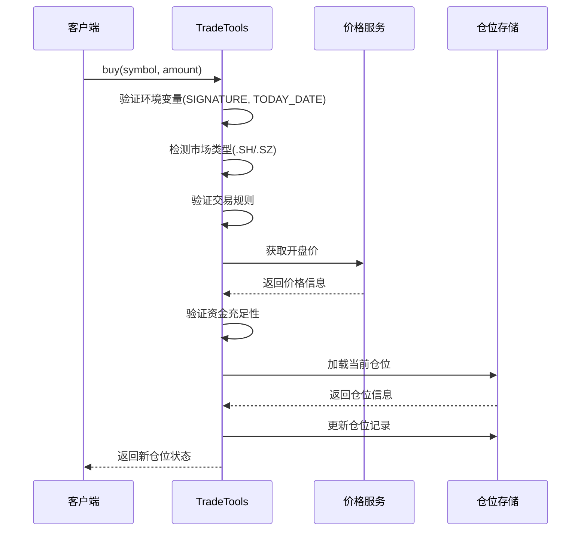
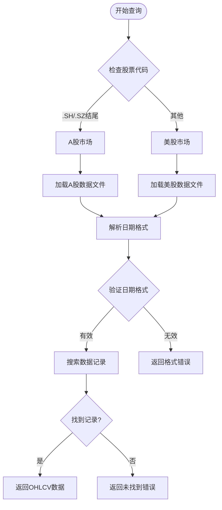
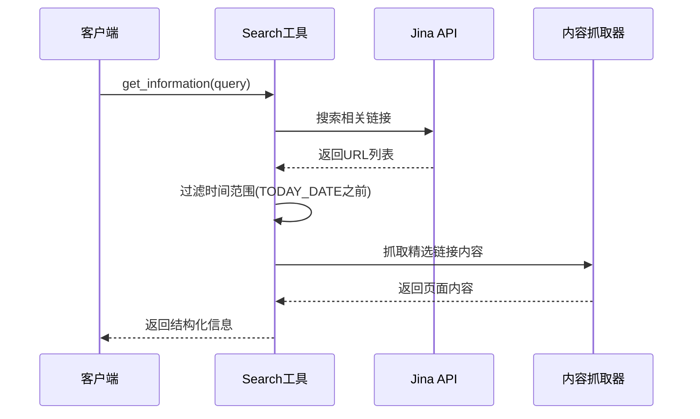
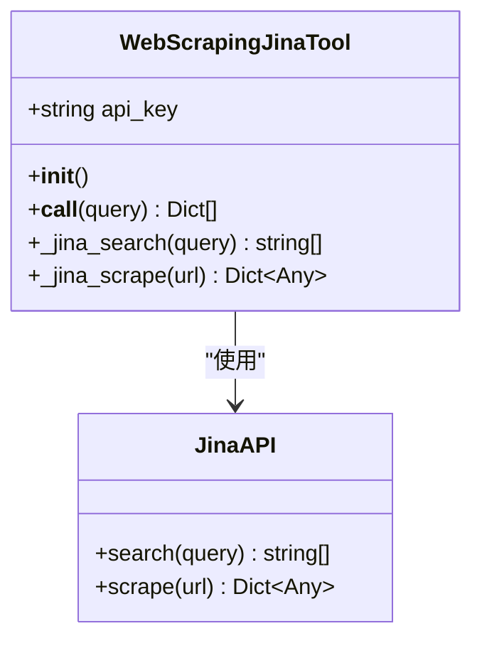
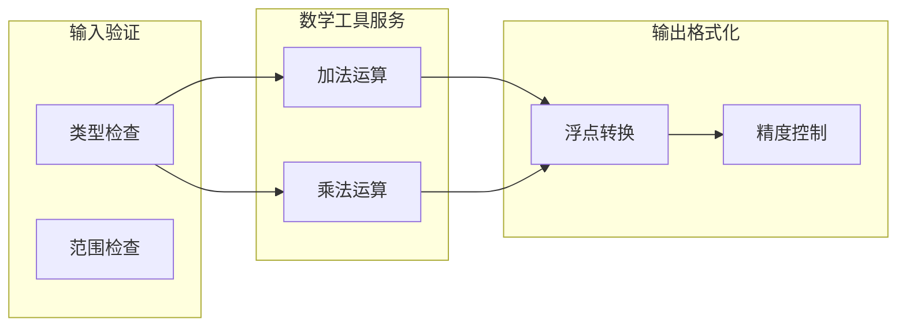

# API参考

<cite>
**本文档中引用的文件**
- [tool_trade.py](file://agent_tools/tool_trade.py)
- [tool_get_price_local.py](file://agent_tools/tool_get_price_local.py)
- [tool_jina_search.py](file://agent_tools/tool_jina_search.py)
- [tool_math.py](file://agent_tools/tool_math.py)
- [start_mcp_services.py](file://agent_tools/start_mcp_services.py)
- [general_tools.py](file://tools/general_tools.py)
- [price_tools.py](file://tools/price_tools.py)
- [default_config.json](file://configs/default_config.json)
</cite>

## 目录
1. [简介](#简介)
2. [MCP服务架构](#mcp服务架构)
3. [交易工具 (TradeTools)](#交易工具-tradetools)
4. [价格查询工具 (LocalPrices)](#价格查询工具-localprices)
5. [搜索工具 (Search)](#搜索工具-search)
6. [数学工具 (Math)](#数学工具-math)
7. [环境变量配置](#环境变量配置)
8. [调用示例](#调用示例)
9. [错误处理](#错误处理)

## 简介

AI-Trader系统采用Model Context Protocol (MCP) 架构，提供了四个核心工具服务：交易执行、价格查询、信息搜索和数学计算。每个工具都通过RESTful API提供服务，支持实时市场数据访问和自动化交易操作。

## MCP服务架构



**图表来源**
- [start_mcp_services.py](file://agent_tools/start_mcp_services.py#L25-L40)

### 服务管理器

MCP服务管理器负责启动、监控和管理所有工具服务：



**图表来源**
- [start_mcp_services.py](file://agent_tools/start_mcp_services.py#L18-L29)

**章节来源**
- [start_mcp_services.py](file://agent_tools/start_mcp_services.py#L1-L294)

## 交易工具 (TradeTools)

交易工具提供股票买卖功能，支持美股和A股市场的自动交易规则适配。

### 端点配置

| 工具 | HTTP端口 | 运输协议 | URL路径 |
|------|----------|----------|---------|
| TradeTools | 8002 | streamable-http | `/mcp` |

### buy函数

**HTTP方法**: POST  
**URL端点**: `http://localhost:8002/mcp`  
**请求体**: JSON格式

#### 请求参数

| 参数名 | 类型 | 必需 | 描述 |
|--------|------|------|------|
| `symbol` | string | 是 | 股票代码，如"AAPL"、"MSFT"或"600519.SH" |
| `amount` | integer | 是 | 买入数量，必须为正整数 |

#### 支持的市场规则

| 市场类型 | 交易单位 | 特殊规则 |
|----------|----------|----------|
| 美股 (US) | 1股 | 无限制 |
| A股 (CN) | 100股 | 手 (一手) 为单位，必须是100的倍数 |

#### 响应格式

**成功响应**:
```json
{
  "AAPL": 110,
  "MSFT": 5,
  "CASH": 5000.0,
  "600519.SH": 100
}
```

**错误响应**:
```json
{
  "error": "Chinese A-shares must be traded in multiples of 100 shares (1 lot = 100 shares). You tried to buy 10 shares.",
  "symbol": "600519.SH",
  "amount": 10,
  "date": "2025-10-30",
  "suggestion": "Please use 0 or 100 shares instead."
}
```

### sell函数

**HTTP方法**: POST  
**URL端点**: `http://localhost:8002/mcp`  
**请求体**: JSON格式

#### 请求参数

| 参数名 | 类型 | 必需 | 描述 |
|--------|------|------|------|
| `symbol` | string | 是 | 股票代码，如"AAPL"、"MSFT"或"600519.SH" |
| `amount` | integer | 是 | 卖出数量，必须为正整数 |

#### A股特殊规则

| 规则 | 描述 |
|------|------|
| T+1限制 | 当天买入的股票不能当天卖出 |
| 手单位 | 必须是100的倍数 |

#### 响应格式

**成功响应**:
```json
{
  "AAPL": 90,
  "MSFT": 5,
  "CASH": 15000.0,
  "600519.SH": 0
}
```

**错误响应**:
```json
{
  "error": "T+1 restriction violated! You bought 100 shares of 600519.SH today and cannot sell them until tomorrow.",
  "symbol": "600519.SH",
  "total_position": 100,
  "bought_today": 100,
  "sellable_today": 0,
  "want_to_sell": 100,
  "date": "2025-10-30"
}
```

### 交易流程图



**图表来源**
- [tool_trade.py](file://agent_tools/tool_trade.py#L45-L175)

**章节来源**
- [tool_trade.py](file://agent_tools/tool_trade.py#L1-L372)

## 价格查询工具 (LocalPrices)

本地价格查询工具提供历史和实时市场价格数据，支持美股和A股市场的自动路由。

### 端点配置

| 工具 | HTTP端口 | 运输协议 | URL路径 |
|------|----------|----------|---------|
| LocalPrices | 8003 | streamable-http | `/mcp` |

### get_price_local函数

**HTTP方法**: POST  
**URL端点**: `http://localhost:8003/mcp`  
**请求体**: JSON格式

#### 请求参数

| 参数名 | 类型 | 必需 | 描述 |
|--------|------|------|------|
| `symbol` | string | 是 | 股票代码，如"IBM"或"600243.SH" |
| `date` | string | 是 | 日期格式，支持两种格式之一 |

#### 支持的日期格式

| 格式 | 示例 | 描述 |
|------|------|------|
| 日度数据 | "2025-10-30" | 获取完整OHLCV数据 |
| 小时数据 | "2025-10-30 14:30:00" | 获取小时级数据 |

#### 自动市场检测



**图表来源**
- [tool_get_price_local.py](file://agent_tools/tool_get_price_local.py#L45-L75)

#### 响应格式

**成功响应**:
```json
{
  "symbol": "AAPL",
  "date": "2025-10-30",
  "ohlcv": {
    "open": 255.8850,
    "high": 264.3750,
    "low": 255.6300,
    "close": 262.2400,
    "volume": 90483029
  }
}
```

**当前交易日特殊处理**:
```json
{
  "symbol": "AAPL",
  "date": "2025-10-30",
  "ohlcv": {
    "open": 255.8850,
    "high": "You can not get the current high price",
    "low": "You can not get the current low price",
    "close": "You can not get the next close price",
    "volume": "You can not get the current volume"
  }
}
```

**错误响应**:
```json
{
  "error": "Data not found for date 2025-10-30. Please verify the date exists in data. Sample available dates: ['2025-10-29', '2025-10-28', '2025-10-27']",
  "symbol": "AAPL",
  "date": "2025-10-30"
}
```

### 数据文件结构

| 市场类型 | 数据文件 | 格式 | 描述 |
|----------|----------|------|------|
| 美股 | `merged.jsonl` | JSON Lines | 包含所有美股股票的历史数据 |
| A股 | `merged.jsonl` | JSON Lines | 包含所有A股股票的历史数据 |

**章节来源**
- [tool_get_price_local.py](file://agent_tools/tool_get_price_local.py#L1-L285)

## 搜索工具 (Search)

搜索工具集成Jina AI服务，提供实时市场信息检索和网页内容抓取功能。

### 端点配置

| 工具 | HTTP端口 | 运输协议 | URL路径 |
|------|----------|----------|---------|
| Search | 8001 | streamable-http | `/mcp` |

### get_information函数

**HTTP方法**: POST  
**URL端点**: `http://localhost:8001/mcp`  
**请求体**: JSON格式

#### 请求参数

| 参数名 | 类型 | 必需 | 描述 |
|--------|------|------|------|
| `query` | string | 是 | 搜索关键词或查询语句 |

#### 搜索流程



**图表来源**
- [tool_jina_search.py](file://agent_tools/tool_jina_search.py#L120-L180)

#### 支持的日期格式转换

| 输入格式 | 输出格式 | 示例 |
|----------|----------|------|
| ISO 8601 | "YYYY-MM-DD HH:MM:SS" | "2025-10-01T08:19:28+00:00" → "2025-10-01 08:19:28" |
| 相对时间 | "YYYY-MM-DD HH:MM:SS" | "4 hours ago" → "2025-10-30 14:15:00" |
| 常见格式 | "YYYY-MM-DD HH:MM:SS" | "May 31, 2025" → "2025-05-31 00:00:00" |

#### 响应格式

**成功响应**:
```
URL: https://example.com/article
Title: 股市新闻标题
Description: 新闻摘要描述
Publish Time: 2025-10-30 09:30:00
Content: 新闻内容的前1000个字符...

URL: https://another-example.com/report
Title: 季度财报报告
Description: 公司财务报告摘要
Publish Time: 2025-10-28 16:00:00
Content: 财报内容摘要...
```

**错误响应**:
```json
{
  "error": "Jina AI Reader Failed for https://example.com: 404 Not Found"
}
```

### WebScrapingJinaTool类



**图表来源**
- [tool_jina_search.py](file://agent_tools/tool_jina_search.py#L100-L200)

**章节来源**
- [tool_jina_search.py](file://agent_tools/tool_jina_search.py#L1-L281)

## 数学工具 (Math)

基础数学运算工具，提供加法和乘法功能。

### 端点配置

| 工具 | HTTP端口 | 运输协议 | URL路径 |
|------|----------|----------|---------|
| Math | 8000 | streamable-http | `/mcp` |

### add函数

**HTTP方法**: POST  
**URL端点**: `http://localhost:8000/mcp`  
**请求体**: JSON格式

#### 请求参数

| 参数名 | 类型 | 必需 | 描述 |
|--------|------|------|------|
| `a` | float | 是 | 第一个数字 |
| `b` | float | 是 | 第二个数字 |

#### 响应格式
```json
{
  "result": 15.5
}
```

### multiply函数

**HTTP方法**: POST  
**URL端点**: `http://localhost:8000/mcp`  
**请求体**: JSON格式

#### 请求参数

| 参数名 | 类型 | 必需 | 描述 |
|--------|------|------|------|
| `a` | float | 是 | 第一个数字 |
| `b` | float | 是 | 第二个数字 |

#### 响应格式
```json
{
  "result": 150.0
}
```

### 数学工具架构



**图表来源**
- [tool_math.py](file://agent_tools/tool_math.py#L15-L40)

**章节来源**
- [tool_math.py](file://agent_tools/tool_math.py#L1-L45)

## 环境变量配置

所有MCP工具服务都依赖以下环境变量进行配置：

### 核心环境变量

| 变量名 | 默认值 | 描述 | 必需 |
|--------|--------|------|------|
| `SIGNATURE` | - | AI模型签名标识 | 是 |
| `TODAY_DATE` | - | 当前交易日期 | 是 |
| `LOG_PATH` | "./data/agent_data" | 日志文件路径 | 否 |
| `MATH_HTTP_PORT` | 8000 | 数学工具端口 | 否 |
| `SEARCH_HTTP_PORT` | 8001 | 搜索工具端口 | 否 |
| `TRADE_HTTP_PORT` | 8002 | 交易工具端口 | 否 |
| `GETPRICE_HTTP_PORT` | 8003 | 价格工具端口 | 否 |

### API密钥配置

| 变量名 | 来源 | 描述 |
|--------|------|------|
| `OPENAI_API_KEY` | OpenAI | AI模型API密钥 |
| `JINA_API_KEY` | Jina AI | 市场信息搜索API密钥 |
| `ALPHAADVANTAGE_API_KEY` | Alpha Vantage | 美股数据API密钥 |
| `TUSHARE_TOKEN` | Tushare | A股数据API令牌 |

### 配置示例

```bash
# AI模型配置
OPENAI_API_KEY=sk-your-openai-key
OPENAI_API_BASE=https://api.openai.com/v1

# 数据源配置
ALPHAADVANTAGE_API_KEY=your-alpha-vantage-key
JINA_API_KEY=jina-your-jina-key
TUSHARE_TOKEN=your-tushare-token

# 服务配置
MATH_HTTP_PORT=8000
SEARCH_HTTP_PORT=8001
TRADE_HTTP_PORT=8002
GETPRICE_HTTP_PORT=8003

# AI代理配置
SIGNATURE=qwen3-max
TODAY_DATE=2025-10-30
LOG_PATH=./data/agent_data
```

**章节来源**
- [general_tools.py](file://tools/general_tools.py#L30-L50)
- [default_config.json](file://configs/default_config.json#L1-L53)

## 调用示例

### Python客户端示例

```python
import requests
import json

class MCPClient:
    def __init__(self, base_url="http://localhost"):
        self.base_url = base_url
        
    def call_tool(self, service, endpoint, params):
        """调用MCP工具"""
        url = f"{self.base_url}:{service}/mcp"
        response = requests.post(url, json={
            "jsonrpc": "2.0",
            "id": "1",
            "method": endpoint,
            "params": params
        })
        return response.json()

# 创建客户端实例
client = MCPClient()

# 1. 交易示例
buy_result = client.call_tool(8002, "buy", {
    "symbol": "AAPL",
    "amount": 10
})
print("买入结果:", buy_result)

# 2. 价格查询示例
price_result = client.call_tool(8003, "get_price_local", {
    "symbol": "AAPL",
    "date": "2025-10-30"
})
print("价格数据:", price_result)

# 3. 搜索示例
search_result = client.call_tool(8001, "get_information", {
    "query": "苹果公司最新财报"
})
print("搜索结果:", search_result)

# 4. 数学计算示例
add_result = client.call_tool(8000, "add", {
    "a": 10.5,
    "b": 5.2
})
print("加法结果:", add_result)
```

### cURL命令示例

```bash
# 1. 交易 - 买入AAPL 10股
curl -X POST http://localhost:8002/mcp \
  -H "Content-Type: application/json" \
  -d '{
    "jsonrpc": "2.0",
    "id": "1",
    "method": "buy",
    "params": {
      "symbol": "AAPL",
      "amount": 10
    }
  }'

# 2. 价格查询 - 获取AAPL 2025-10-30的价格
curl -X POST http://localhost:8003/mcp \
  -H "Content-Type: application/json" \
  -d '{
    "jsonrpc": "2.0",
    "id": "1",
    "method": "get_price_local",
    "params": {
      "symbol": "AAPL",
      "date": "2025-10-30"
    }
  }'

# 3. 搜索 - 查询市场新闻
curl -X POST http://localhost:8001/mcp \
  -H "Content-Type: application/json" \
  -d '{
    "jsonrpc": "2.0",
    "id": "1",
    "method": "get_information",
    "params": {
      "query": "市场趋势分析"
    }
  }'

# 4. 数学计算 - 10.5 + 5.2
curl -X POST http://localhost:8000/mcp \
  -H "Content-Type: application/json" \
  -d '{
    "jsonrpc": "2.0",
    "id": "1",
    "method": "add",
    "params": {
      "a": 10.5,
      "b": 5.2
    }
  }'
```

### JavaScript客户端示例

```javascript
class MCPClient {
    constructor(baseURL = 'http://localhost') {
        this.baseURL = baseURL;
    }
    
    async callTool(service, endpoint, params) {
        const response = await fetch(`${this.baseURL}:${service}/mcp`, {
            method: 'POST',
            headers: {
                'Content-Type': 'application/json'
            },
            body: JSON.stringify({
                jsonrpc: '2.0',
                id: '1',
                method: endpoint,
                params: params
            })
        });
        
        return await response.json();
    }
}

// 使用示例
const client = new MCPClient();

// 交易操作
const buyResult = await client.callTool(8002, 'buy', {
    symbol: 'AAPL',
    amount: 10
});
console.log('买入结果:', buyResult);

// 价格查询
const priceResult = await client.callTool(8003, 'get_price_local', {
    symbol: 'AAPL',
    date: '2025-10-30'
});
console.log('价格数据:', priceResult);
```

## 错误处理

### 常见错误类型

| 错误代码 | 描述 | 解决方案 |
|----------|------|----------|
| `400` | 请求参数错误 | 检查参数格式和必需字段 |
| `404` | 工具端点不存在 | 确认服务已启动且端口正确 |
| `500` | 服务器内部错误 | 检查服务日志和环境变量 |
| `429` | API限流 | 实现重试机制和指数退避 |

### 错误响应格式

```json
{
  "jsonrpc": "2.0",
  "id": "1",
  "error": {
    "code": -32603,
    "message": "Internal error",
    "data": {
      "error_type": "ValidationError",
      "details": "Invalid symbol format"
    }
  }
}
```

### 错误处理最佳实践

```python
import requests
from typing import Dict, Any

def safe_mcp_call(client, service, endpoint, params, max_retries=3):
    """安全的MCP调用，包含重试机制"""
    for attempt in range(max_retries):
        try:
            response = client.call_tool(service, endpoint, params)
            
            # 检查是否为错误响应
            if 'error' in response:
                error_code = response['error'].get('code', -1)
                error_msg = response['error'].get('message', 'Unknown error')
                
                if error_code == -32603:  # 内部错误
                    if attempt < max_retries - 1:
                        continue  # 重试
                    else:
                        raise Exception(f"Service failed after {max_retries} attempts: {error_msg}")
                else:
                    return response  # 返回错误信息
                    
            return response
            
        except requests.exceptions.ConnectionError:
            if attempt < max_retries - 1:
                time.sleep(2 ** attempt)  # 指数退避
                continue
            raise Exception("Cannot connect to MCP service")
            
        except Exception as e:
            if attempt < max_retries - 1:
                time.sleep(1)
                continue
            raise e
```

### 服务健康检查

```python
def check_mcp_services():
    """检查所有MCP服务的健康状态"""
    services = {
        'math': 8000,
        'search': 8001,
        'trade': 8002,
        'price': 8003
    }
    
    results = {}
    
    for name, port in services.items():
        try:
            response = requests.get(f'http://localhost:{port}/health', timeout=5)
            results[name] = {
                'status': 'healthy' if response.status_code == 200 else 'unhealthy',
                'port': port
            }
        except:
            results[name] = {
                'status': 'unreachable',
                'port': port
            }
    
    return results
```

**章节来源**
- [start_mcp_services.py](file://agent_tools/start_mcp_services.py#L140-L180)