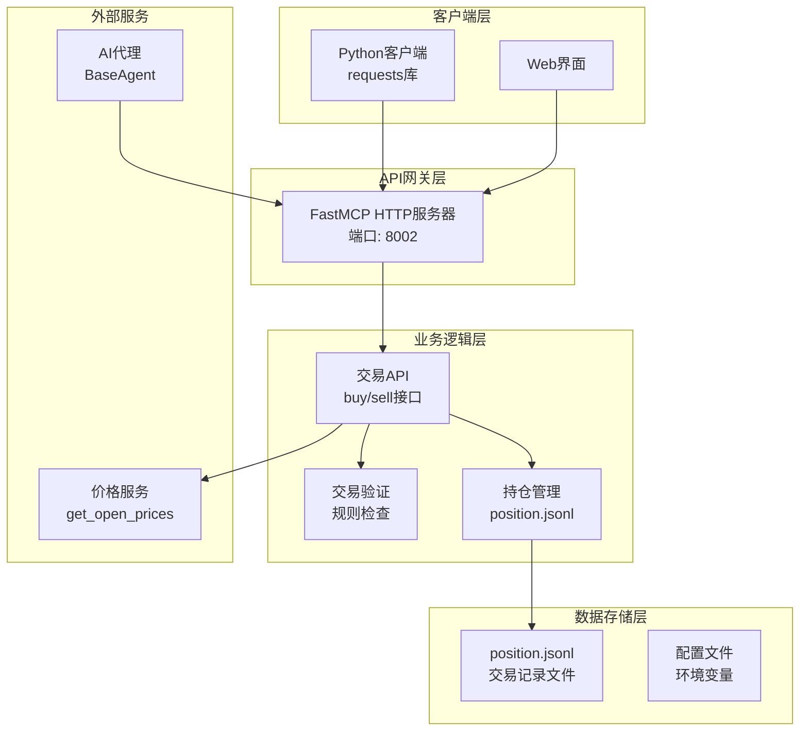
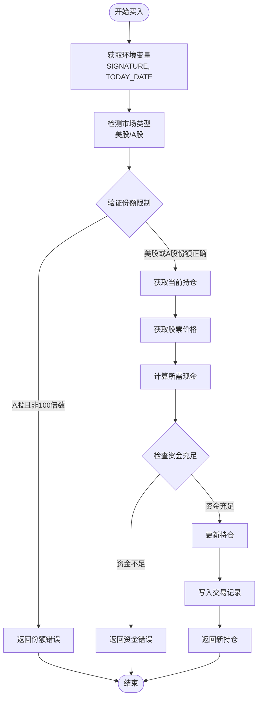
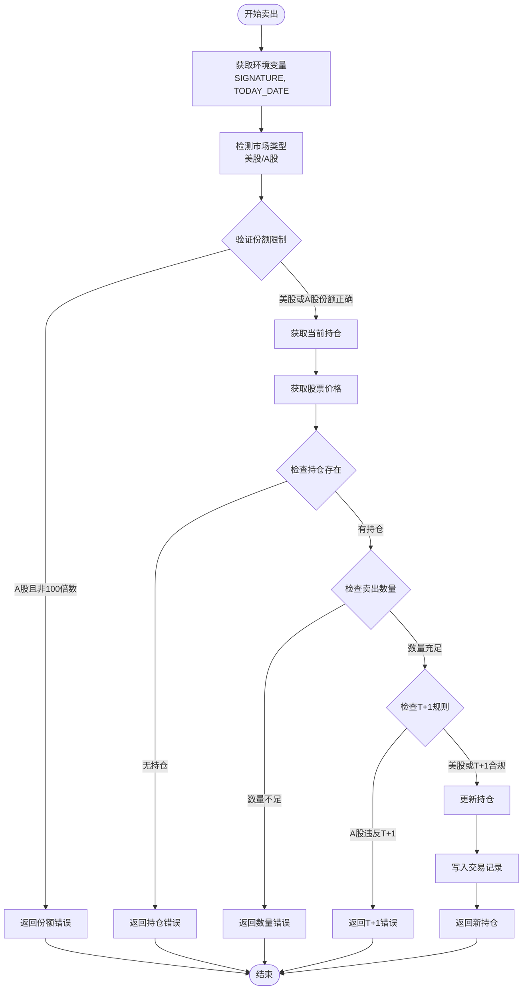
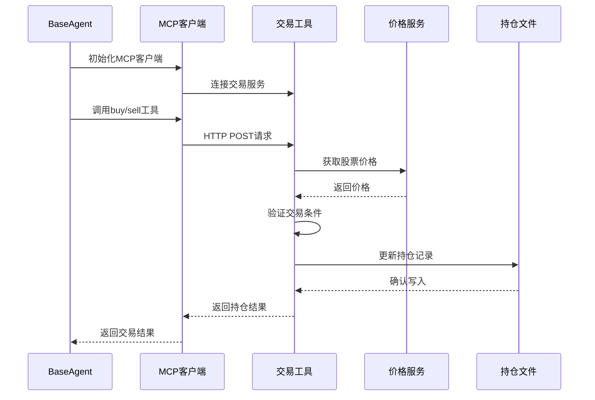

# 交易工具API文档

<cite>
**本文档中引用的文件**
- [tool_trade.py](file://agent_tools/tool_trade.py)
- [base_agent.py](file://agent/base_agent/base_agent.py)
- [base_agent_astock.py](file://agent/base_agent_astock/base_agent_astock.py)
- [general_tools.py](file://tools/general_tools.py)
- [price_tools.py](file://tools/price_tools.py)
- [default_config.json](file://configs/default_config.json)
- [start_mcp_services.py](file://agent_tools/start_mcp_services.py)
</cite>

## 目录
1. [简介](#简介)
2. [系统架构](#系统架构)
3. [API端点详情](#api端点详情)
4. [交易执行逻辑](#交易执行逻辑)
5. [持仓文件管理](#持仓文件管理)
6. [A股市场适配](#a股市场适配)
7. [Python调用示例](#python调用示例)
8. [错误处理机制](#错误处理机制)
9. [集成方式](#集成方式)
10. [故障排除指南](#故障排除指南)

## 简介

交易工具API是一个基于FastMCP框架构建的HTTP服务，提供买入（buy）和卖出（sell）股票的功能。该工具支持美股和A股两种市场，具有严格的交易规则检查和持仓管理功能。

### 核心特性

- **多市场支持**：同时支持美股（NASDAQ 100）和A股（上证50）交易
- **严格规则检查**：包含资金验证、份额限制、T+1规则等
- **原子性操作**：使用文件锁确保交易的原子性
- **实时持仓跟踪**：通过position.jsonl文件实时记录交易历史
- **错误恢复机制**：完善的异常处理和重试机制

## 系统架构



**图表来源**
- [tool_trade.py](file://agent_tools/tool_trade.py#L1-L50)
- [start_mcp_services.py](file://agent_tools/start_mcp_services.py#L20-L40)

## API端点详情

### HTTP POST /buy

**请求格式**

| 字段 | 类型 | 必需 | 描述 |
|------|------|------|------|
| symbol | string | 是 | 股票代码，如"AAPL"或"600519.SH" |
| amount | integer | 是 | 买入数量，必须为正整数 |

**美股请求示例**
```json
{
  "symbol": "AAPL",
  "amount": 10
}
```

**A股请求示例**
```json
{
  "symbol": "600519.SH", 
  "amount": 100
}
```

**响应格式**

成功响应：
```json
{
  "AAPL": 110,
  "MSFT": 5,
  "CASH": 5000.0,
  "600519.SH": 100
}
```

失败响应：
```json
{
  "error": "Insufficient cash! This action will not be allowed.",
  "required_cash": 1000.0,
  "cash_available": 500.0,
  "symbol": "AAPL",
  "date": "2025-10-13"
}
```

### HTTP POST /sell

**请求格式**

| 字段 | 类型 | 必需 | 描述 |
|------|------|------|------|
| symbol | string | 是 | 股票代码，如"AAPL"或"600519.SH" |
| amount | integer | 是 | 卖出数量，必须为正整数 |

**美股请求示例**
```json
{
  "symbol": "AAPL",
  "amount": 10
}
```

**A股请求示例**
```json
{
  "symbol": "600519.SH", 
  "amount": 100
}
```

**响应格式**

成功响应：
```json
{
  "AAPL": 90,
  "MSFT": 5,
  "CASH": 15000.0,
  "600519.SH": 0
}
```

失败响应：
```json
{
  "error": "T+1 restriction violated! You bought 100 shares of 600519.SH today and cannot sell them until tomorrow.",
  "symbol": "600519.SH",
  "total_position": 100,
  "bought_today": 100,
  "sellable_today": 0,
  "want_to_sell": 100,
  "date": "2025-10-13"
}
```

**节来源**
- [tool_trade.py](file://agent_tools/tool_trade.py#L40-L120)
- [tool_trade.py](file://agent_tools/tool_trade.py#L240-L330)

## 交易执行逻辑

### 买入流程



**图表来源**
- [tool_trade.py](file://agent_tools/tool_trade.py#L65-L175)

### 卖出流程



**图表来源**
- [tool_trade.py](file://agent_tools/tool_trade.py#L240-L370)

**节来源**
- [tool_trade.py](file://agent_tools/tool_trade.py#L65-L175)
- [tool_trade.py](file://agent_tools/tool_trade.py#L240-L370)

## 持仓文件管理

### 文件结构

交易记录存储在`position.jsonl`文件中，采用JSON Lines格式：

```json
{
  "date": "2025-10-13",
  "id": 1,
  "this_action": {
    "action": "buy",
    "symbol": "AAPL",
    "amount": 10
  },
  "positions": {
    "AAPL": 100,
    "MSFT": 5,
    "CASH": 10000.0
  }
}
```

### 文件路径

```
{project_root}/data/{log_path}/{signature}/position/position.jsonl
```

默认路径：
```
./data/agent_data/{signature}/position/position.jsonl
```

### 锁机制

使用文件锁确保并发安全：

```python
@contextmanager
def _position_lock(signature: str):
    # 创建锁文件
    lock_path = Path(project_root) / "data" / "agent_data" / signature / ".position.lock"
    with open(lock_path, "a+") as fh:
        fcntl.flock(fh.fileno(), fcntl.LOCK_EX)
        yield
        fcntl.flock(fh.fileno(), fcntl.LOCK_UN)
```

**节来源**
- [tool_trade.py](file://agent_tools/tool_trade.py#L18-L35)
- [tool_trade.py](file://agent_tools/tool_trade.py#L148-L175)

## A股市场适配

### 特殊规则

1. **份额限制**：A股必须以100股为单位交易（一手）
2. **T+1规则**：当日买入的股票不能在同一天卖出
3. **市场标识**：通过`.SH`和`.SZ`后缀识别A股

### A股配置

```python
# 默认A股股票列表（上证50）
DEFAULT_SSE50_SYMBOLS = [
    "600519.SH", "601318.SH", "600036.SH", "601899.SH", 
    "600900.SH", "601166.SH", "600276.SH", "600030.SH",
    # ... 更多A股代码
]
```

### T+1规则实现

```python
def _get_today_buy_amount(symbol: str, today_date: str, signature: str) -> int:
    """获取当天买入的总份额"""
    # 读取position.jsonl文件
    # 过滤当天买入的记录
    # 返回总买入份额
```

**节来源**
- [tool_trade.py](file://agent_tools/tool_trade.py#L75-L85)
- [tool_trade.py](file://agent_tools/tool_trade.py#L180-L220)
- [base_agent_astock.py](file://agent/base_agent_astock/base_agent_astock.py#L85-L105)

## Python调用示例

### 基础调用

```python
import requests
import json

# 设置API地址
api_url = "http://localhost:8002"

# 买入AAPL 10股
def buy_aapl_10_shares():
    payload = {
        "symbol": "AAPL",
        "amount": 10
    }
    
    response = requests.post(f"{api_url}/buy", json=payload)
    
    if response.status_code == 200:
        result = response.json()
        print("买入成功:", result)
        return result
    else:
        error = response.json()
        print("买入失败:", error)
        return error

# 卖出AAPL 10股  
def sell_aapl_10_shares():
    payload = {
        "symbol": "AAPL",
        "amount": 10
    }
    
    response = requests.post(f"{api_url}/sell", json=payload)
    
    if response.status_code == 200:
        result = response.json()
        print("卖出成功:", result)
        return result
    else:
        error = response.json()
        print("卖出失败:", error)
        return error
```

### A股交易示例

```python
# 买入A股100股（必须是100的倍数）
def buy_astock_100_shares():
    payload = {
        "symbol": "600519.SH",
        "amount": 100  # 必须是100的倍数
    }
    
    response = requests.post(f"{api_url}/buy", json=payload)
    
    if response.status_code == 200:
        result = response.json()
        print("A股买入成功:", result)
        return result
    else:
        error = response.json()
        print("A股买入失败:", error)
        return error
```

### 错误处理示例

```python
def safe_trade_operation(operation_func, symbol, amount):
    """安全的交易操作包装器"""
    try:
        # 设置环境变量
        os.environ["SIGNATURE"] = "test_agent"
        os.environ["TODAY_DATE"] = "2025-10-13"
        
        result = operation_func(symbol, amount)
        
        if isinstance(result, dict) and "error" in result:
            print(f"交易失败: {result['error']}")
            return None
        else:
            print(f"交易成功: 新持仓 {result}")
            return result
            
    except Exception as e:
        print(f"交易异常: {str(e)}")
        return None
```

### 批量交易示例

```python
def batch_trades(trade_list):
    """批量执行交易"""
    results = []
    
    for trade in trade_list:
        symbol = trade["symbol"]
        amount = trade["amount"]
        action = trade["action"]
        
        if action == "buy":
            result = buy(symbol, amount)
        elif action == "sell":
            result = sell(symbol, amount)
        else:
            print(f"未知操作: {action}")
            continue
        
        results.append({
            "symbol": symbol,
            "action": action,
            "amount": amount,
            "result": result
        })
    
    return results
```

**节来源**
- [tool_trade.py](file://agent_tools/tool_trade.py#L370-L372)

## 错误处理机制

### 常见错误类型

| 错误代码 | 描述 | 示例 |
|----------|------|------|
| 余额不足 | 资金不足以完成交易 | `"error": "Insufficient cash! This action will not be allowed."` |
| 股票代码无效 | 股票不存在或价格数据缺失 | `"error": "Symbol AAPL not found! This action will not be allowed."` |
| 份额限制 | A股必须以100股为单位交易 | `"error": "Chinese A-shares must be traded in multiples of 100 shares"` |
| 数量不足 | 持仓数量不足以卖出 | `"error": "Insufficient shares! This action will not be allowed."` |
| T+1限制 | A股当日买入不能当日卖出 | `"error": "T+1 restriction violated!"` |
| 环境变量缺失 | SIGNATURE环境变量未设置 | `"error": "SIGNATURE environment variable is not set"` |

### 错误响应结构

```json
{
  "error": "错误描述信息",
  "symbol": "股票代码",
  "amount": 交易数量,
  "date": "交易日期",
  "required_cash": 可选: 需要的现金金额,
  "cash_available": 可选: 可用现金金额,
  "have": 可选: 当前持有数量,
  "want_to_sell": 可选: 想要卖出的数量,
  "bought_today": 可选: 当天买入的数量,
  "sellable_today": 可选: 当天可卖数量,
  "suggestion": 可选: 建议的修正方案
}
```

### 错误处理最佳实践

```python
def handle_trade_error(error_response):
    """处理交易错误响应"""
    error_msg = error_response.get("error", "")
    
    if "Insufficient cash" in error_msg:
        required = error_response.get("required_cash", 0)
        available = error_response.get("cash_available", 0)
        print(f"资金不足: 需要 {required}, 可用 {available}")
        return "资金不足，请充值或减少购买数量"
    
    elif "Chinese A-shares" in error_msg:
        symbol = error_response.get("symbol", "")
        amount = error_response.get("amount", 0)
        suggestion = error_response.get("suggestion", "")
        print(f"A股份额错误: {symbol} {amount}股")
        print(f"建议: {suggestion}")
        return "A股必须以100股为单位交易"
    
    elif "T+1 restriction" in error_msg:
        symbol = error_response.get("symbol", "")
        bought_today = error_response.get("bought_today", 0)
        sellable = error_response.get("sellable_today", 0)
        print(f"T+1限制: {symbol} 当天买入 {bought_today}股，可卖 {sellable}股")
        return "A股T+1规则：当日买入的股票次日才能卖出"
    
    else:
        print(f"其他错误: {error_msg}")
        return error_msg
```

**节来源**
- [tool_trade.py](file://agent_tools/tool_trade.py#L85-L95)
- [tool_trade.py](file://agent_tools/tool_trade.py#L130-L145)
- [tool_trade.py](file://agent_tools/tool_trade.py#L300-L320)

## 集成方式

### 与BaseAgent集成

交易工具通过MCP（Model Context Protocol）与BaseAgent集成：



**图表来源**
- [base_agent.py](file://agent/base_agent/base_agent.py#L300-L320)
- [base_agent_astock.py](file://agent/base_agent_astock/base_agent_astock.py#L240-L260)

### 配置集成

```python
# BaseAgent配置中的MCP设置
mcp_config = {
    "trade": {
        "transport": "streamable_http",
        "url": "http://localhost:8002/mcp"
    }
}

# 初始化Agent时自动连接交易服务
async def initialize(self):
    self.client = MultiServerMCPClient(self.mcp_config)
    self.tools = await self.client.get_tools()
```

### 环境变量配置

```bash
# 交易服务端口
export TRADE_HTTP_PORT=8002

# 签名标识（用于定位持仓文件）
export SIGNATURE=test_agent

# 当前交易日期
export TODAY_DATE=2025-10-13

# 日志路径
export LOG_PATH=./data/agent_data
```

**节来源**
- [base_agent.py](file://agent/base_agent/base_agent.py#L300-L320)
- [base_agent_astock.py](file://agent/base_agent_astock/base_agent_astock.py#L240-L260)
- [start_mcp_services.py](file://agent_tools/start_mcp_services.py#L20-L40)

## 故障排除指南

### 常见问题及解决方案

#### 1. 服务启动问题

**问题**：交易服务无法启动
```
❌ Failed to initialize MCP client: [Errno 98] Address already in use
```

**解决方案**：
```bash
# 检查端口占用
lsof -i :8002

# 杀死占用进程
kill -9 PID

# 或者修改端口
export TRADE_HTTP_PORT=8003
```

#### 2. 环境变量问题

**问题**：签名环境变量未设置
```
ValueError: SIGNATURE environment variable is not set
```

**解决方案**：
```bash
# 设置签名
export SIGNATURE=my_trading_agent

# 或在代码中设置
import os
os.environ["SIGNATURE"] = "my_trading_agent"
```

#### 3. 文件权限问题

**问题**：无法写入持仓文件
```
Permission denied: './data/agent_data/my_agent/position/position.jsonl'
```

**解决方案**：
```bash
# 检查目录权限
ls -la ./data/agent_data/

# 修改权限
chmod -R 755 ./data/agent_data/
mkdir -p ./data/agent_data/my_agent/position/
chmod -R 755 ./data/agent_data/my_agent/
```

#### 4. 交易失败问题

**问题**：交易总是失败
```
{"error": "Symbol AAPL not found! This action will not be allowed."}
```

**解决方案**：
1. 检查股票代码是否正确
2. 确认价格服务正常运行
3. 验证交易日期是否为交易日
4. 检查持仓文件是否存在

#### 5. 并发访问问题

**问题**：多个交易同时进行导致数据不一致

**解决方案**：
```python
# 工具内部已使用文件锁保护
# 不需要额外处理，系统自动保证原子性
```

### 调试技巧

#### 启用详细日志

```python
# 在tool_trade.py中添加调试输出
print(f"Debug: Processing buy for {symbol} x {amount}")
print(f"Debug: Current position: {current_position}")
print(f"Debug: Price: {this_symbol_price}")
print(f"Debug: Cash left: {cash_left}")
```

#### 检查持仓文件

```bash
# 查看最近的交易记录
tail -10 ./data/agent_data/test_agent/position/position.jsonl

# 检查文件格式
cat ./data/agent_data/test_agent/position/position.jsonl | jq .
```

#### 验证价格服务

```python
# 测试价格获取
from tools.price_tools import get_open_prices

prices = get_open_prices("2025-10-13", ["AAPL", "600519.SH"])
print(prices)
```

### 性能优化建议

1. **批量交易**：尽量减少HTTP请求次数
2. **缓存价格**：避免重复查询相同价格
3. **异步处理**：使用异步客户端提高并发性能
4. **连接池**：复用HTTP连接

```python
import aiohttp
import asyncio

async def async_buy(symbol, amount):
    async with aiohttp.ClientSession() as session:
        payload = {"symbol": symbol, "amount": amount}
        async with session.post(f"{api_url}/buy", json=payload) as response:
            return await response.json()
```

**节来源**
- [tool_trade.py](file://agent_tools/tool_trade.py#L370-L372)
- [general_tools.py](file://tools/general_tools.py#L30-L50)