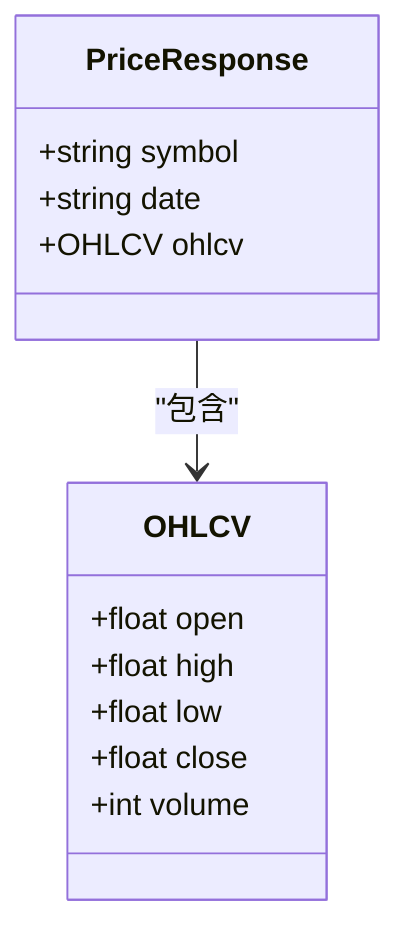
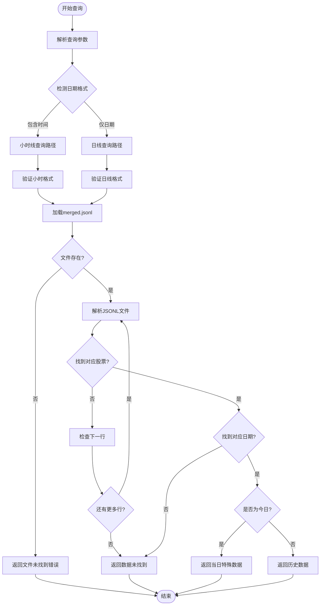
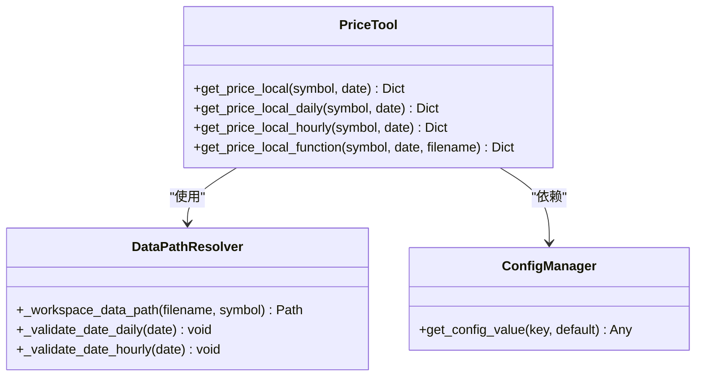
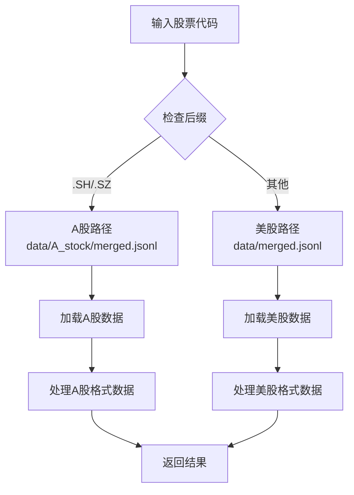
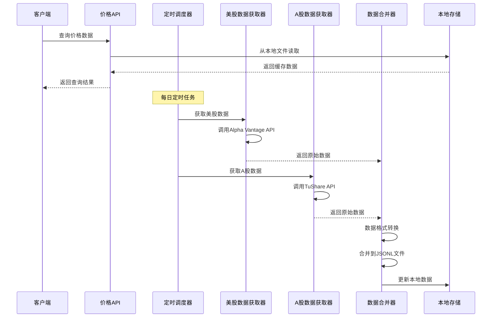
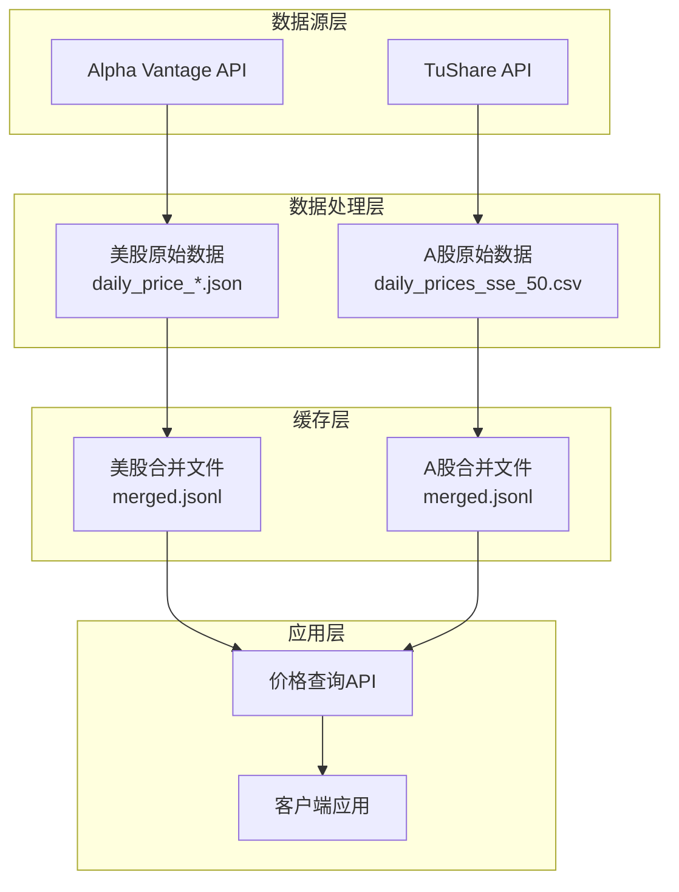
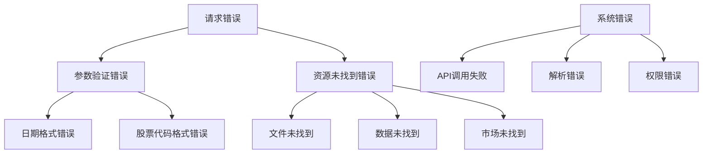

# 价格查询工具API文档

<cite>
**本文档中引用的文件**
- [tool_get_price_local.py](file://agent_tools/tool_get_price_local.py)
- [get_daily_price.py](file://data/get_daily_price.py)
- [get_daily_price_a_stock.py](file://data/A_stock/get_daily_price_a_stock.py)
- [price_tools.py](file://tools/price_tools.py)
- [merge_jsonl.py](file://data/merge_jsonl.py)
- [merge_a_stock_jsonl.py](file://data/A_stock/merge_a_stock_jsonl.py)
- [start_mcp_services.py](file://agent_tools/start_mcp_services.py)
- [default_config.json](file://configs/default_config.json)
</cite>

## 目录
1. [简介](#简介)
2. [API端点概述](#api端点概述)
3. [HTTP接口规范](#http接口规范)
4. [查询参数详解](#查询参数详解)
5. [响应数据结构](#响应数据结构)
6. [内部实现机制](#内部实现机制)
7. [数据源与市场识别](#数据源与市场识别)
8. [调用示例](#调用示例)
9. [数据更新流程](#数据更新流程)
10. [缓存策略](#缓存策略)
11. [错误处理](#错误处理)
12. [故障排除指南](#故障排除指南)

## 简介

价格查询工具是一个基于FastMCP框架构建的本地价格数据API服务，专门用于获取股票历史价格数据。该工具支持美股和A股两种市场的实时价格查询，通过统一的HTTP接口提供OHLCV（开盘价、最高价、最低价、收盘价、成交量）数据。

### 核心特性

- **多市场支持**：自动识别美股（.XSHG、.XSHE后缀）和A股市场
- **多种时间周期**：支持日线和小时线数据查询
- **本地数据缓存**：基于JSONL格式的高效数据存储
- **智能路由**：根据股票代码自动路由到对应的数据源
- **实时更新**：与外部数据源同步更新本地数据

## API端点概述

### 主要端点

| 端点 | 方法 | 描述 |
|------|------|------|
| `/get_price` | GET | 获取指定股票在指定日期的价格数据 |

### 端点详情

- **基础URL**: `http://localhost:8003/get_price`
- **传输协议**: HTTP/HTTPS
- **认证方式**: 无需认证
- **内容类型**: `application/json`

## HTTP接口规范

### 请求格式

```http
GET /get_price?symbol={symbol}&date={date} HTTP/1.1
Host: localhost:8003
Accept: application/json
```

### 响应格式

成功响应返回JSON对象，包含股票代码、日期和OHLCV数据：
```json
{
    "symbol": "TSLA",
    "date": "2025-10-30",
    "ohlcv": {
        "open": 250.12,
        "high": 255.67,
        "low": 248.90,
        "close": 254.32,
        "volume": 12345678
    }
}
```

## 查询参数详解

### 必需参数

| 参数名 | 类型 | 描述 | 示例值 |
|--------|------|------|--------|
| `symbol` | string | 股票代码 | `"TSLA"` 或 `"600519.SH"` |
| `date` | string | 查询日期 | `"2025-10-30"` 或 `"2025-10-30 14:30:00"` |

### 参数说明

#### symbol参数
- **美股格式**: 直接使用股票代码，如`TSLA`、`AAPL`
- **A股格式**: 使用完整代码，包括交易所后缀，如`600519.SH`、`000001.SZ`
- **自动识别**: 系统根据`.SH`、`.SZ`后缀自动识别A股市场

#### date参数
- **日线数据**: 使用`YYYY-MM-DD`格式，如`2025-10-30`
- **小时线数据**: 使用`YYYY-MM-DD HH:MM:SS`格式，如`2025-10-30 14:30:00`
- **自动检测**: 系统根据是否包含空格或`T`字符自动选择数据周期

## 响应数据结构

### 成功响应结构



**图表来源**
- [tool_get_price_local.py](file://agent_tools/tool_get_price_local.py#L145-L181)

### 字段说明

| 字段名 | 类型 | 描述 | 备注 |
|--------|------|------|------|
| `symbol` | string | 股票代码 | 原始输入的股票代码 |
| `date` | string | 查询日期 | 原始输入的日期格式 |
| `ohlcv.open` | float | 开盘价 | 买入价格 |
| `ohlcv.high` | float | 最高价 | 当前不可用时返回特殊值 |
| `ohlcv.low` | float | 最低价 | 当前不可用时返回特殊值 |
| `ohlcv.close` | float | 收盘价 | 卖出价格 |
| `ohlcv.volume` | int | 成交量 | 当前不可用时返回特殊值 |

### 特殊情况处理

对于当日数据查询，系统会返回特殊标记：
- `high`: `"You can not get the current high price"`
- `low`: `"You can not get the current low price"`
- `close`: `"You can not get the next close price"`
- `volume`: `"You can not get the current volume"`

## 内部实现机制

### 数据加载流程



**图表来源**
- [tool_get_price_local.py](file://agent_tools/tool_get_price_local.py#L71-L115)
- [tool_get_price_local.py](file://agent_tools/tool_get_price_local.py#L183-L246)

### 工具函数架构



**图表来源**
- [tool_get_price_local.py](file://agent_tools/tool_get_price_local.py#L20-L50)
- [tool_get_price_local.py](file://agent_tools/tool_get_price_local.py#L52-L70)

**章节来源**
- [tool_get_price_local.py](file://agent_tools/tool_get_price_local.py#L1-L285)

## 数据源与市场识别

### 自动市场识别机制

系统根据股票代码后缀自动识别数据源：



**图表来源**
- [tool_get_price_local.py](file://agent_tools/tool_get_price_local.py#L20-L50)

### 数据文件位置

| 市场类型 | 数据文件路径 | 文件格式 | 描述 |
|----------|--------------|----------|------|
| 美股 | `data/merged.jsonl` | JSON Lines | 包含纳斯达克100成分股的每日价格数据 |
| A股 | `data/A_stock/merged.jsonl` | JSON Lines | 包含上证50成分股的每日价格数据 |

### 数据格式兼容性

系统确保不同数据源的数据格式一致性：

- **开盘价**: 统一使用`1. buy price`字段
- **最高价**: 统一使用`2. high`字段  
- **最低价**: 统一使用`3. low`字段
- **收盘价**: 统一使用`4. sell price`字段
- **成交量**: 统一使用`5. volume`字段

**章节来源**
- [tool_get_price_local.py](file://agent_tools/tool_get_price_local.py#L20-L50)
- [price_tools.py](file://tools/price_tools.py#L100-L130)

## 调用示例

### 获取TSLA日线数据

```bash
curl "http://localhost:8003/get_price?symbol=TSLA&date=2025-10-30"
```

**响应示例**:
```json
{
    "symbol": "TSLA",
    "date": "2025-10-30",
    "ohlcv": {
        "open": 250.12,
        "high": 255.67,
        "low": 248.90,
        "close": 254.32,
        "volume": 12345678
    }
}
```

### 获取贵州茅台小时线数据

```bash
curl "http://localhost:8003/get_price?symbol=600519.SH&date=2025-10-30 14:30:00"
```

**响应示例**:
```json
{
    "symbol": "600519.SH",
    "date": "2025-10-30 14:30:00",
    "ohlcv": {
        "open": 1850.50,
        "high": 1865.25,
        "low": 1845.75,
        "close": 1860.00,
        "volume": 234567
    }
}
```

### 错误处理示例

#### 日期格式错误
```bash
curl "http://localhost:8003/get_price?symbol=TSLA&date=30-10-2025"
```

**响应**:
```json
{
    "error": "date must be in YYYY-MM-DD format",
    "symbol": "TSLA",
    "date": "30-10-2025"
}
```

#### 数据未找到
```bash
curl "http://localhost:8003/get_price?symbol=TSLA&date=2025-01-01"
```

**响应**:
```json
{
    "error": "Data not found for date 2025-01-01. Please verify the date exists in data. Sample available dates: ['2025-10-29', '2025-10-28', '2025-10-27', '2025-10-26', '2025-10-25']",
    "symbol": "TSLA",
    "date": "2025-01-01"
}
```

## 数据更新流程

### 数据获取架构



**图表来源**
- [get_daily_price.py](file://data/get_daily_price.py#L60-L85)
- [get_daily_price_a_stock.py](file://data/A_stock/get_daily_price_a_stock.py#L40-L120)

### 美股数据更新流程

美股数据通过Alpha Vantage API获取：

1. **批量获取**: 一次性获取纳斯达克100指数成分股数据
2. **API调用**: 使用`TIME_SERIES_DAILY`函数
3. **数据验证**: 检查API响应状态和数据完整性
4. **本地存储**: 保存为JSON格式的每日价格文件

### A股数据更新流程

A股数据通过TuShare API获取：

1. **指数成分**: 获取上证50指数成分股列表
2. **分批下载**: 基于API限制进行分批数据获取
3. **数据转换**: 转换为Alpha Vantage兼容格式
4. **合并处理**: 合并多个股票的数据到单一文件

**章节来源**
- [get_daily_price.py](file://data/get_daily_price.py#L60-L85)
- [get_daily_price_a_stock.py](file://data/A_stock/get_daily_price_a_stock.py#L40-L120)
- [merge_jsonl.py](file://data/merge_jsonl.py#L50-L120)
- [merge_a_stock_jsonl.py](file://data/A_stock/merge_a_stock_jsonl.py#L15-L80)

## 缓存策略

### 本地缓存架构



**图表来源**
- [merge_jsonl.py](file://data/merge_jsonl.py#L50-L120)
- [merge_a_stock_jsonl.py](file://data/A_stock/merge_a_stock_jsonl.py#L15-L80)

### 缓存优化策略

#### 1. 文件格式优化
- **JSON Lines格式**: 每行一个JSON对象，支持流式读取
- **压缩存储**: 减少磁盘占用空间
- **增量更新**: 仅更新新增或修改的数据

#### 2. 内存访问优化
- **按需加载**: 仅加载查询相关的股票数据
- **索引机制**: 基于日期的快速查找
- **缓存预热**: 热点数据提前加载到内存

#### 3. 数据去重策略
- **时间戳去重**: 相同时间戳的数据优先使用新数据
- **股票去重**: 确保每个股票只有一个数据源
- **格式统一**: 所有数据源转换为统一格式

### 缓存失效机制

| 触发条件 | 处理方式 | 时间窗口 |
|----------|----------|----------|
| 数据更新 | 全量重新生成 | 每日凌晨 |
| 文件损坏 | 自动重建 | 下次访问时 |
| 格式变更 | 版本化处理 | 手动触发 |
| 存储不足 | 清理旧数据 | 自动清理 |

**章节来源**
- [merge_jsonl.py](file://data/merge_jsonl.py#L50-L120)
- [merge_a_stock_jsonl.py](file://data/A_stock/merge_a_stock_jsonl.py#L15-L80)
- [tool_get_price_local.py](file://agent_tools/tool_get_price_local.py#L20-L50)

## 错误处理

### 错误分类体系



### 错误响应格式

所有错误响应都遵循统一格式：

```json
{
    "error": "错误描述信息",
    "symbol": "输入的股票代码",
    "date": "输入的日期"
}
```

### 常见错误及解决方案

| 错误类型 | 错误信息 | 原因 | 解决方案 |
|----------|----------|------|----------|
| 参数验证错误 | `date must be in YYYY-MM-DD format` | 日期格式不正确 | 使用正确的日期格式 |
| 文件未找到 | `Data file not found: ...` | 数据文件缺失 | 等待数据更新或检查配置 |
| 数据未找到 | `Data not found for date ...` | 指定日期无数据 | 检查可用日期范围 |
| 股票代码错误 | `No records found for stock ...` | 股票代码不存在 | 验证股票代码准确性 |

**章节来源**
- [tool_get_price_local.py](file://agent_tools/tool_get_price_local.py#L115-L145)
- [tool_get_price_local.py](file://agent_tools/tool_get_price_local.py#L183-L211)

## 故障排除指南

### 常见问题诊断

#### 1. API服务无法启动

**症状**: 无法连接到`http://localhost:8003`
**排查步骤**:
1. 检查MCP服务是否已启动
2. 验证端口8003是否被占用
3. 查看服务启动日志

**解决方案**:
```bash
# 启动MCP服务
cd agent_tools
python start_mcp_services.py
```

#### 2. 数据查询超时

**症状**: API响应缓慢或无响应
**排查步骤**:
1. 检查本地数据文件大小
2. 验证磁盘空间充足
3. 监控系统资源使用

**解决方案**:
- 清理临时文件
- 重启MCP服务
- 检查网络连接

#### 3. 数据不一致

**症状**: 不同时间查询结果不一致
**排查步骤**:
1. 检查数据更新时间
2. 验证数据文件完整性
3. 确认缓存状态

**解决方案**:
- 等待数据更新完成
- 手动触发数据刷新
- 检查配置文件设置

### 性能优化建议

#### 1. 查询性能优化
- 使用精确的日期范围查询
- 避免频繁查询相同数据
- 利用缓存机制减少重复请求

#### 2. 系统资源优化
- 定期清理临时文件
- 监控磁盘空间使用
- 优化内存使用效率

#### 3. 网络连接优化
- 配置合适的超时时间
- 实现重试机制
- 监控API调用频率

### 监控指标

| 指标类型 | 监控项目 | 正常范围 | 告警阈值 |
|----------|----------|----------|----------|
| 响应时间 | API查询延迟 | < 2秒 | > 5秒 |
| 可用性 | 服务响应率 | > 99% | < 95% |
| 资源使用 | CPU使用率 | < 70% | > 85% |
| 资源使用 | 内存使用率 | < 80% | > 90% |

**章节来源**
- [start_mcp_services.py](file://agent_tools/start_mcp_services.py#L143-L187)
- [tool_get_price_local.py](file://agent_tools/tool_get_price_local.py#L270-L285)