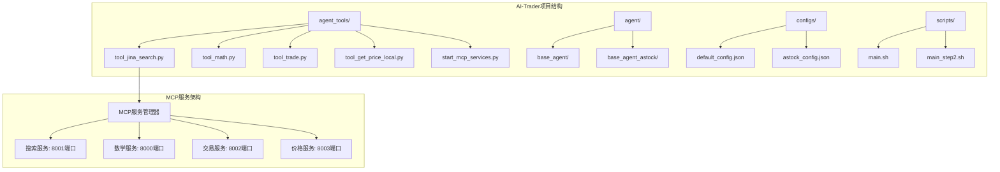
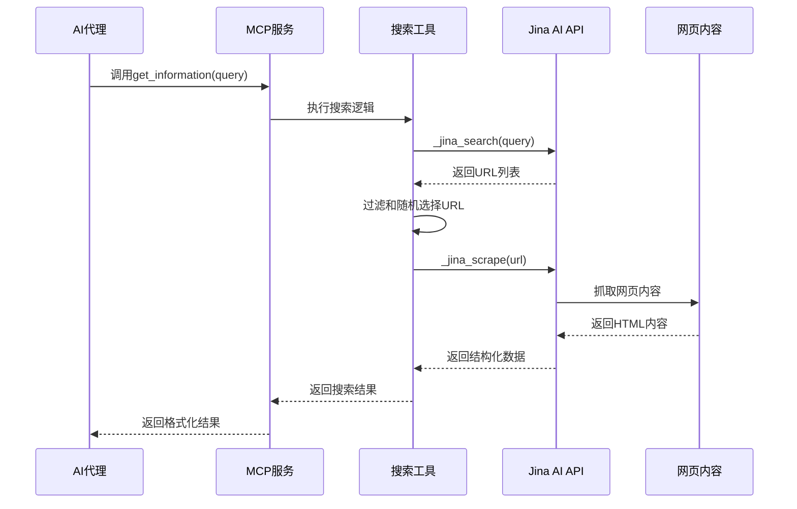
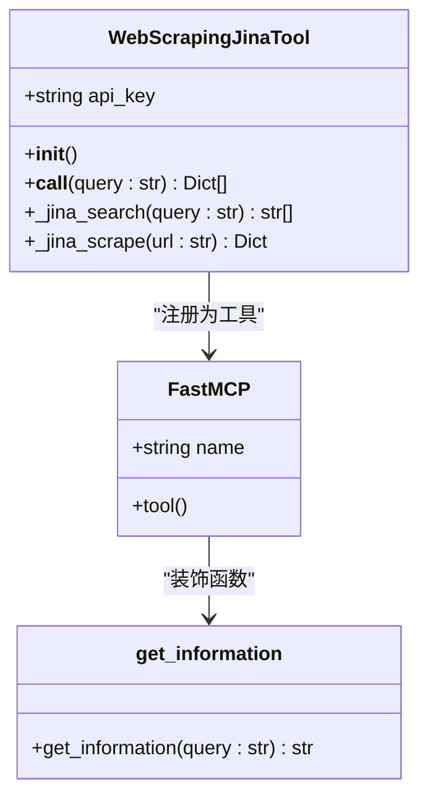
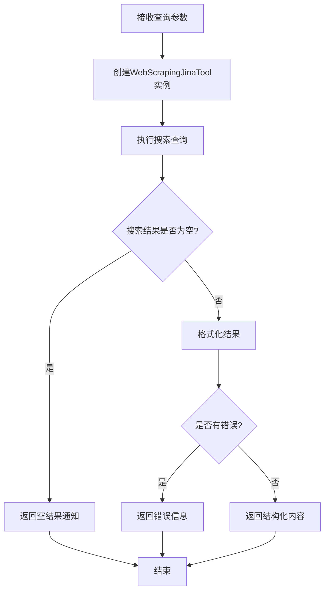
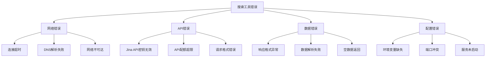

# 搜索工具API文档

<cite>
**本文档中引用的文件**
- [tool_jina_search.py](file://agent_tools/tool_jina_search.py)
- [README.md](file://README.md)
- [README_CN.md](file://README_CN.md)
- [requirements.txt](file://requirements.txt)
- [start_mcp_services.py](file://agent_tools/start_mcp_services.py)
- [base_agent.py](file://agent/base_agent/base_agent.py)
- [base_agent_astock.py](file://agent/base_agent_astock/base_agent_astock.py)
</cite>

## 目录
1. [简介](#简介)
2. [项目结构](#项目结构)
3. [核心组件](#核心组件)
4. [架构概览](#架构概览)
5. [详细组件分析](#详细组件分析)
6. [API规范](#api规范)
7. [调用示例](#调用示例)
8. [错误处理](#错误处理)
9. [性能考虑](#性能考虑)
10. [故障排除指南](#故障排除指南)
11. [结论](#结论)

## 简介

搜索工具API是一个基于Jina AI Reader API的网络搜索服务，专门设计用于AI代理市场研究。该工具通过封装Jina AI的搜索和网页抓取功能，为AI交易代理提供实时的市场信息和新闻内容，支持生成投资决策依据。

该工具采用MCP（Model Context Protocol）架构，通过HTTP传输协议提供标准化的搜索服务，支持多种市场研究需求，包括公司财报分析、行业趋势跟踪、新闻事件监控等。

## 项目结构

搜索工具位于AI-Trader项目的`agent_tools`目录下，与其他MCP工具共同构成了完整的AI交易工具链。



**图表来源**
- [tool_jina_search.py](file://agent_tools/tool_jina_search.py#L1-L50)
- [start_mcp_services.py](file://agent_tools/start_mcp_services.py#L20-L46)

**章节来源**
- [tool_jina_search.py](file://agent_tools/tool_jina_search.py#L1-L281)
- [README.md](file://README.md#L1-L100)

## 核心组件

搜索工具的核心组件包括WebScrapingJinaTool类、FastMCP服务实例和get_information函数，它们协同工作提供完整的搜索功能。

### 主要组件功能

| 组件 | 功能 | 输入参数 | 输出格式 |
|------|------|----------|----------|
| WebScrapingJinaTool | Jina AI API封装 | query: str | List[Dict] |
| get_information | 结构化信息检索 | query: str | str |
| _jina_search | 搜索结果获取 | query: str | List[str] |
| _jina_scrape | 网页内容抓取 | url: str | Dict |

**章节来源**
- [tool_jina_search.py](file://agent_tools/tool_jina_search.py#L106-L281)

## 架构概览

搜索工具采用分层架构设计，从底层的Jina AI API到高层的MCP服务接口，形成了完整的工具链体系。



**图表来源**
- [tool_jina_search.py](file://agent_tools/tool_jina_search.py#L106-L143)
- [tool_jina_search.py](file://agent_tools/tool_jina_search.py#L230-L279)

## 详细组件分析

### WebScrapingJinaTool类

WebScrapingJinaTool是搜索工具的核心类，负责封装Jina AI API的调用逻辑。



**图表来源**
- [tool_jina_search.py](file://agent_tools/tool_jina_search.py#L95-L105)
- [tool_jina_search.py](file://agent_tools/tool_jina_search.py#L230-L235)

#### 初始化过程

工具初始化时会检查Jina API密钥的存在性，这是确保服务正常运行的关键验证步骤。

#### 搜索执行流程

搜索过程包含两个主要阶段：搜索查询和内容抓取。搜索阶段使用Jina AI的搜索API获取相关URL，内容抓取阶段则通过Jina Reader API获取网页的结构化内容。

**章节来源**
- [tool_jina_search.py](file://agent_tools/tool_jina_search.py#L95-L105)
- [tool_jina_search.py](file://agent_tools/tool_jina_search.py#L106-L143)

### get_information函数

get_information函数是MCP服务暴露给外部的接口，提供结构化的搜索结果输出。



**图表来源**
- [tool_jina_search.py](file://agent_tools/tool_jina_search.py#L230-L279)

**章节来源**
- [tool_jina_search.py](file://agent_tools/tool_jina_search.py#L230-L279)

## API规范

### HTTP POST端点

搜索工具通过MCP服务提供HTTP接口，支持标准的RESTful API调用模式。

| 属性 | 值 |
|------|-----|
| 端点地址 | `/mcp` |
| 传输协议 | streamable-http |
| 默认端口 | 8001 |
| 环境变量 | SEARCH_HTTP_PORT |

### 请求格式

#### 查询参数

| 参数名 | 类型 | 必需 | 描述 |
|--------|------|------|------|
| query | string | 是 | 搜索关键词或主题，用于在网络中查找最匹配的结果 |

#### 可选参数

| 参数名 | 类型 | 默认值 | 描述 |
|--------|------|--------|------|
| max_results | integer | 1 | 最大返回结果数量（目前固定为1） |

### 响应格式

搜索工具返回结构化的JSON数组，每个元素包含网页的详细信息。

| 字段名 | 类型 | 描述 |
|--------|------|------|
| url | string | 原始网页链接 |
| title | string | 网页标题 |
| description | string | 网页简短描述 |
| publish_time | string | 内容发布时间（如果可用） |
| content | string | 网页主要内容（前1000字符） |
| error | string | 错误信息（如果抓取失败） |

### 状态码

| 状态码 | 描述 | 场景 |
|--------|------|------|
| 200 | 成功 | 搜索和抓取成功完成 |
| 400 | 请求错误 | API密钥缺失或无效 |
| 500 | 服务器错误 | Jina API调用失败 |

**章节来源**
- [tool_jina_search.py](file://agent_tools/tool_jina_search.py#L145-L182)
- [tool_jina_search.py](file://agent_tools/tool_jina_search.py#L230-L279)

## 调用示例

### 基本搜索调用

以下是搜索"NVIDIA最新财报分析"的完整调用示例：

```bash
# 设置环境变量
export JINA_API_KEY="your_jina_api_key_here"
export SEARCH_HTTP_PORT=8001

# 启动MCP服务
python agent_tools/tool_jina_search.py

# 调用搜索API
curl -X POST "http://localhost:8001/mcp" \
  -H "Content-Type: application/json" \
  -d '{
    "method": "get_information",
    "arguments": {
      "query": "NVIDIA最新财报分析"
    }
  }'
```

### Python客户端示例

```python
import requests
import os

class JinaSearchClient:
    def __init__(self, api_key=None, port=8001):
        self.api_key = api_key or os.environ.get("JINA_API_KEY")
        self.port = port
        self.base_url = f"http://localhost:{port}/mcp"
    
    def search(self, query: str) -> dict:
        """执行搜索查询"""
        payload = {
            "method": "get_information",
            "arguments": {"query": query}
        }
        
        response = requests.post(self.base_url, json=payload)
        response.raise_for_status()
        
        return response.json()

# 使用示例
client = JinaSearchClient()
results = client.search("NVIDIA最新财报分析")
print(results)
```

### 解析返回的JSON结果

典型的搜索结果返回格式如下：

```json
{
  "url": "https://example.com/nvidia-quarterly-report",
  "title": "NVIDIA 2024年第四季度财报分析",
  "description": "深入分析NVIDIA最新财报数据和市场影响",
  "publish_time": "2024-12-15 10:30:00",
  "content": "NVIDIA在2024年第四季度实现了显著的收入增长..."
}
```

**章节来源**
- [tool_jina_search.py](file://agent_tools/tool_jina_search.py#L230-L279)

## 错误处理

搜索工具实现了完善的错误处理机制，涵盖网络请求、API调用和数据解析等多个层面。

### 错误类型分类



**图表来源**
- [tool_jina_search.py](file://agent_tools/tool_jina_search.py#L184-L221)

### 错误处理策略

| 错误类型 | 处理方式 | 返回信息 |
|----------|----------|----------|
| API密钥缺失 | 抛出ValueError异常 | "Jina API key not provided!" |
| 网络请求失败 | 捕获requests.exceptions.RequestException | "Jina API request failed: {error}" |
| 响应解析失败 | 捕获ValueError异常 | "Jina API response parsing failed: {error}" |
| 未知错误 | 捕获通用Exception | "Jina search unknown error: {error}" |
| 抓取失败 | 记录日志并返回错误信息 | {"url": url, "content": "", "error": str(e)} |

### 超时和速率限制

搜索工具内置了多种防护机制：

- **请求超时**: Jina Reader API设置了10秒的超时时间
- **随机采样**: 当找到多个结果时，随机选择一个进行抓取
- **错误恢复**: 对于单个URL抓取失败的情况，不会中断整个搜索流程

**章节来源**
- [tool_jina_search.py](file://agent_tools/tool_jina_search.py#L145-L182)
- [tool_jina_search.py](file://agent_tools/tool_jina_search.py#L184-L221)

## 性能考虑

### 并发处理

搜索工具支持并发执行多个搜索请求，但需要注意以下性能因素：

- **API限制**: Jina AI API有速率限制，建议合理控制请求频率
- **内存使用**: 大量并发搜索可能导致内存占用增加
- **网络带宽**: 网页抓取会消耗较多网络资源

### 优化建议

| 优化方面 | 建议措施 |
|----------|----------|
| 请求频率 | 控制每秒请求数不超过API限制 |
| 结果缓存 | 对重复查询结果进行本地缓存 |
| 并发控制 | 使用线程池限制并发请求数 |
| 超时设置 | 根据网络状况调整超时时间 |

### 内存管理

工具采用了以下内存优化策略：
- 只抓取网页内容的前1000字符
- 随机选择单个URL进行抓取
- 及时释放不再使用的资源

## 故障排除指南

### 常见问题及解决方案

#### 1. API密钥问题

**症状**: "Jina API key not provided!" 错误
**解决方案**: 
- 确保设置了JINA_API_KEY环境变量
- 检查API密钥格式是否正确
- 验证API密钥是否有效

#### 2. 网络连接问题

**症状**: "Jina API request failed" 错误
**解决方案**:
- 检查网络连接状态
- 验证防火墙设置
- 尝试更换网络环境

#### 3. 服务启动问题

**症状**: MCP服务无法启动
**解决方案**:
- 检查端口8001是否被占用
- 确认依赖包已正确安装
- 查看服务启动日志

#### 4. 搜索结果为空

**症状**: 搜索返回空结果
**解决方案**:
- 检查查询关键词是否过于宽泛
- 验证Jina API服务状态
- 尝试使用不同的关键词

### 调试技巧

```python
# 启用详细日志
import logging
logging.basicConfig(level=logging.DEBUG)

# 测试API连通性
def test_api_connection():
    import requests
    try:
        response = requests.get("https://s.jina.ai/", timeout=10)
        print(f"API状态: {response.status_code}")
        return response.status_code == 200
    except Exception as e:
        print(f"API连接失败: {e}")
        return False
```

**章节来源**
- [tool_jina_search.py](file://agent_tools/tool_jina_search.py#L95-L105)
- [tool_jina_search.py](file://agent_tools/tool_jina_search.py#L184-L221)

## 结论

搜索工具API为AI-Trader项目提供了强大的市场研究能力，通过封装Jina AI的搜索和网页抓取功能，为AI代理提供了实时、准确的市场信息。该工具具有以下优势：

### 主要优势

1. **自动化程度高**: 完全自主的搜索和内容提取流程
2. **结构化输出**: 提供标准化的搜索结果格式
3. **错误处理完善**: 多层次的错误捕获和恢复机制
4. **易于集成**: 基于MCP协议的标准接口设计
5. **性能优化**: 内置超时控制和资源管理

### 应用场景

- **市场新闻监控**: 实时跟踪上市公司公告和行业新闻
- **财报分析**: 获取和分析公司财务报告内容
- **技术研究**: 搜索相关的技术文章和研究报告
- **投资决策支持**: 为AI代理提供数据驱动的投资建议

### 发展方向

未来的改进方向包括：
- 增加更多的搜索结果数量选项
- 实现搜索结果的智能排序和筛选
- 添加内容质量评估功能
- 支持多语言搜索和本地化内容

搜索工具作为AI-Trader生态系统的重要组成部分，为AI代理的市场研究能力提供了坚实的技术基础，是实现完全自主交易决策的关键支撑工具。