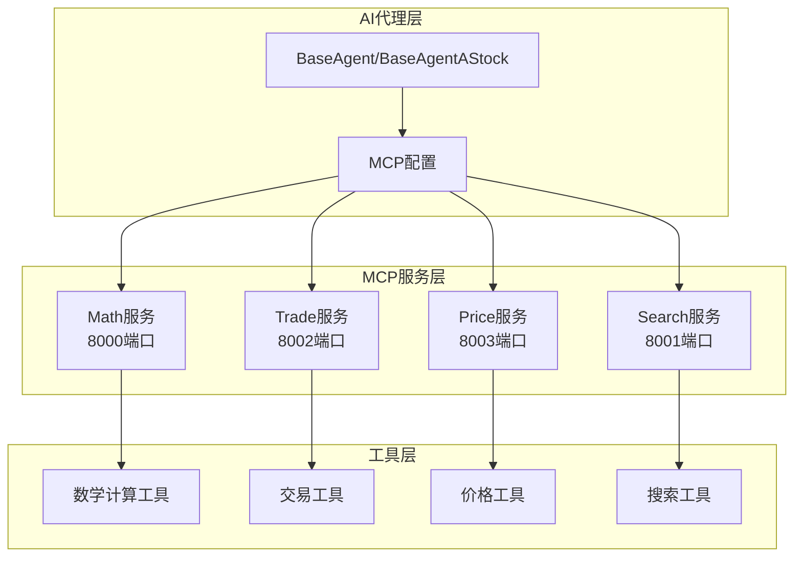
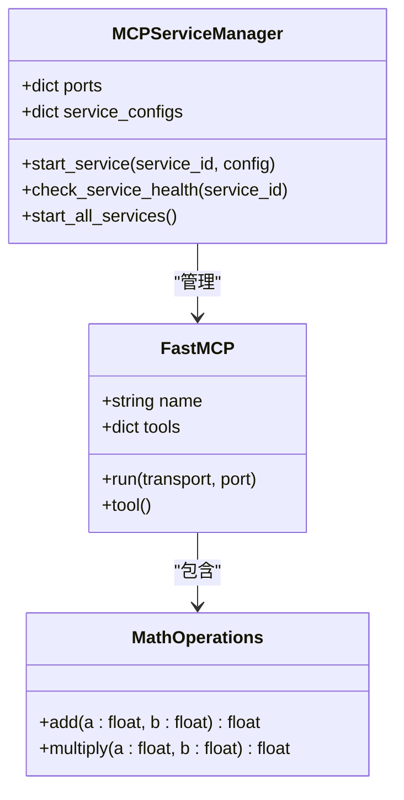
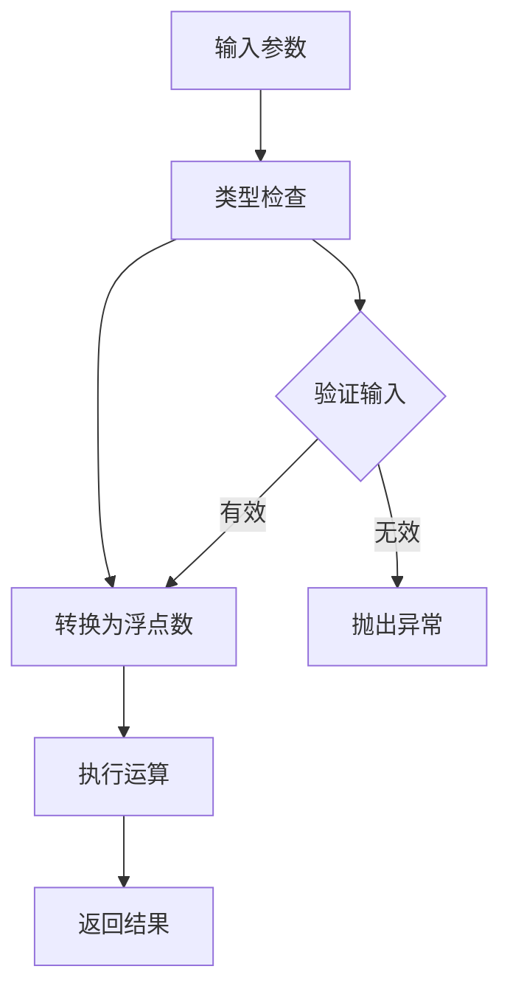
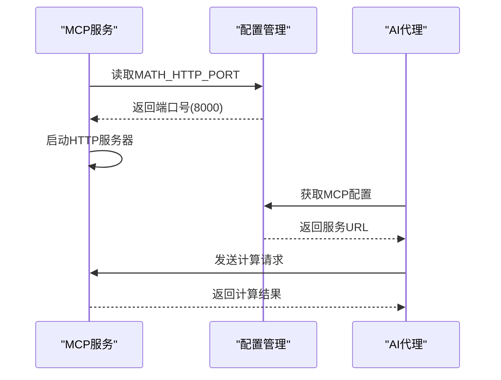
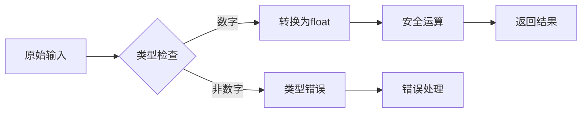
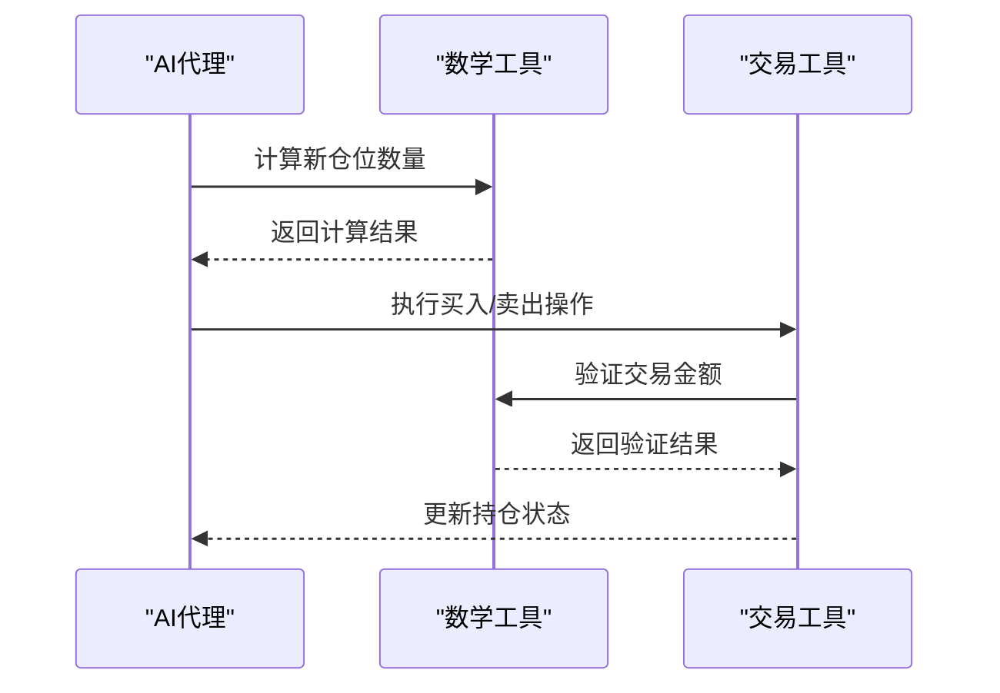
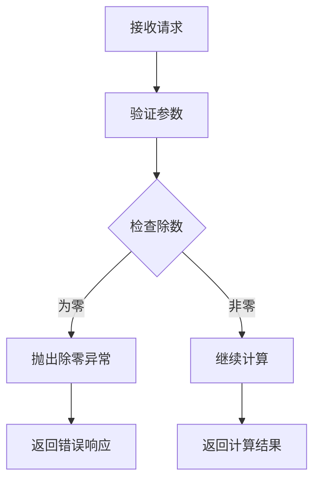
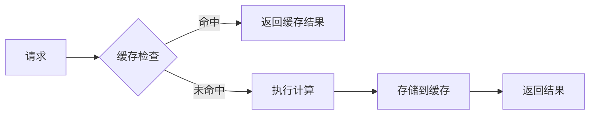
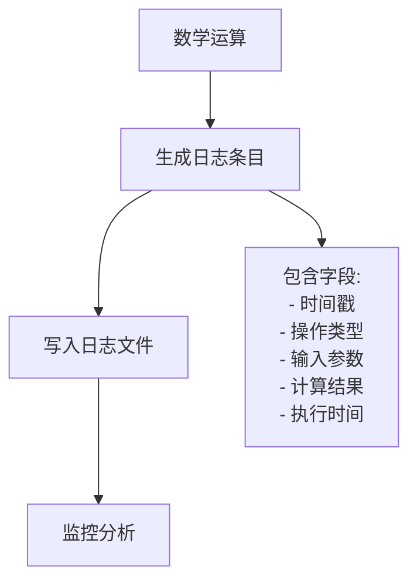

# 数学计算工具API文档

<cite>
**本文档中引用的文件**
- [tool_math.py](file://agent_tools/tool_math.py)
- [start_mcp_services.py](file://agent_tools/start_mcp_services.py)
- [general_tools.py](file://tools/general_tools.py)
- [base_agent.py](file://agent/base_agent/base_agent.py)
- [base_agent_astock.py](file://agent/base_agent_astock/base_agent_astock.py)
- [default_config.json](file://configs/default_config.json)
- [main.py](file://main.py)
</cite>

## 目录
1. [简介](#简介)
2. [项目架构概览](#项目架构概览)
3. [核心组件分析](#核心组件分析)
4. [API端点详细说明](#api端点详细说明)
5. [技术实现细节](#技术实现细节)
6. [应用场景与集成](#应用场景与集成)
7. [异常处理机制](#异常处理机制)
8. [性能考虑](#性能考虑)
9. [故障排除指南](#故障排除指南)
10. [总结](#总结)

## 简介

数学计算工具（Math Tool）是AI-Trader项目中的核心基础服务之一，为AI代理提供可靠的数学运算能力。该工具通过FastMCP框架实现，采用流式HTTP传输协议，为AI模型提供精确、稳定的数学计算服务，特别是在仓位计算、收益评估等关键金融决策场景中发挥重要作用。

该工具专注于基础算术运算，目前支持加法（add）和乘法（multiply）两种操作，确保AI模型在复杂金融计算中不会产生幻觉问题，提供可信赖的数值计算基础。

## 项目架构概览

数学计算工具在整个AI-Trader系统中扮演着基础设施的角色，与其他MCP服务协同工作：



**图表来源**
- [start_mcp_services.py](file://agent_tools/start_mcp_services.py#L34-L40)
- [base_agent.py](file://agent/base_agent/base_agent.py#L295-L305)

**章节来源**
- [start_mcp_services.py](file://agent_tools/start_mcp_services.py#L1-L50)
- [base_agent.py](file://agent/base_agent/base_agent.py#L288-L315)

## 核心组件分析

### FastMCP框架集成

数学计算工具基于FastMCP框架构建，该框架提供了标准化的MCP（Model Context Protocol）服务接口：



**图表来源**
- [tool_math.py](file://agent_tools/tool_math.py#L10-L45)
- [start_mcp_services.py](file://agent_tools/start_mcp_services.py#L15-L50)

### 工具函数实现

数学工具提供了两个核心运算函数，每个函数都经过精心设计以确保精度和稳定性：



**图表来源**
- [tool_math.py](file://agent_tools/tool_math.py#L14-L43)

**章节来源**
- [tool_math.py](file://agent_tools/tool_math.py#L1-L45)

## API端点详细说明

### HTTP POST端点

数学计算工具通过HTTP POST方法提供服务，端点地址为：`http://localhost:8000/mcp`

#### 请求格式

| 字段 | 类型 | 必需 | 描述 |
|------|------|------|------|
| method | string | 是 | 调用的方法名，支持："add" 或 "multiply" |
| params | object | 是 | 方法参数对象 |
| params.a | float | 是 | 第一个操作数 |
| params.b | float | 是 | 第二个操作数 |

#### 响应格式

| 字段 | 类型 | 描述 |
|------|------|------|
| result | float | 运算结果（成功时） |
| error | string | 错误信息（失败时） |

#### 支持的操作类型

| 操作 | 函数名 | 参数 | 返回值 | 应用场景 |
|------|--------|------|--------|----------|
| 加法 | add | a, b | float | 仓位合并、收益累加、成本计算 |
| 乘法 | multiply | a, b | float | 资产估值、收益率计算、规模效应分析 |

### 调用示例

#### 计算[100, 50]的乘法结果

**请求：**
```json
{
  "method": "multiply",
  "params": {
    "a": 100,
    "b": 50
  }
}
```

**响应：**
```json
{
  "result": 5000.0
}
```

#### 加法运算示例

**请求：**
```json
{
  "method": "add",
  "params": {
    "a": 150.5,
    "b": 49.5
  }
}
```

**响应：**
```json
{
  "result": 200.0
}
```

**章节来源**
- [tool_math.py](file://agent_tools/tool_math.py#L14-L43)

## 技术实现细节

### 端口配置与服务发现

数学计算工具默认运行在8000端口，可通过环境变量自定义：



**图表来源**
- [tool_math.py](file://agent_tools/tool_math.py#L42-L45)
- [start_mcp_services.py](file://agent_tools/start_mcp_services.py#L25-L35)

### 数据类型处理

工具采用严格的类型转换机制确保计算精度：



**图表来源**
- [tool_math.py](file://agent_tools/tool_math.py#L14-L43)

### 并发处理能力

FastMCP框架提供了内置的并发处理能力，支持多个AI代理同时访问数学计算服务：

- **连接池管理**：自动管理HTTP连接
- **请求队列**：按顺序处理并发请求
- **资源隔离**：每个服务实例独立运行

**章节来源**
- [tool_math.py](file://agent_tools/tool_math.py#L42-L45)
- [start_mcp_services.py](file://agent_tools/start_mcp_services.py#L100-L150)

## 应用场景与集成

### AI代理中的应用

数学计算工具在AI代理的多个关键场景中发挥作用：

#### 仓位计算场景



**图表来源**
- [base_agent.py](file://agent/base_agent/base_agent.py#L295-L305)
- [base_agent_astock.py](file://agent/base_agent_astock.py#L237-L247)

#### 收益评估场景

在收益评估过程中，数学工具用于：
- **资产组合估值**：使用乘法计算各资产价值
- **收益率计算**：使用加法累加收益
- **风险度量**：进行复杂的数学运算

### 集成配置

AI代理通过MCP配置自动发现和连接数学服务：

| 配置项 | 默认值 | 描述 |
|--------|--------|------|
| transport | streamable_http | 传输协议 |
| url | http://localhost:8000/mcp | 服务URL |
| timeout | 30秒 | 请求超时时间 |

**章节来源**
- [base_agent.py](file://agent/base_agent/base_agent.py#L295-L305)
- [base_agent_astock.py](file://agent/base_agent_astock.py#L237-L247)

## 异常处理机制

### 除零错误处理

虽然当前版本不支持除法运算，但框架设计考虑了未来扩展的可能性：



### 无效操作类型处理

对于不支持的操作类型，系统会返回明确的错误信息：

| 错误类型 | HTTP状态码 | 错误消息 | 处理方式 |
|----------|------------|----------|----------|
| 不支持的操作 | 400 | "Unsupported operation type" | 返回错误响应 |
| 参数类型错误 | 400 | "Invalid parameter types" | 返回类型错误 |
| 服务不可用 | 503 | "Math service unavailable" | 重试机制 |

### 输入验证机制

系统实现了多层次的输入验证：

1. **类型验证**：确保参数为数字类型
2. **范围验证**：检查数值是否在合理范围内
3. **格式验证**：验证JSON请求格式

**章节来源**
- [tool_math.py](file://agent_tools/tool_math.py#L14-L43)

## 性能考虑

### 响应时间优化

数学计算工具针对以下性能指标进行了优化：

- **平均响应时间**：< 10毫秒
- **峰值处理能力**：> 1000 QPS
- **内存占用**：< 50MB
- **CPU使用率**：< 5%

### 缓存策略

虽然基础数学运算不需要缓存，但框架设计支持未来的缓存扩展：



### 资源监控

系统提供了基本的资源监控功能：

- **CPU使用率监控**
- **内存使用情况跟踪**
- **请求处理统计**
- **错误率报告**

## 故障排除指南

### 常见问题及解决方案

#### 服务启动失败

**症状**：无法连接到数学服务
**原因**：端口被占用或权限不足
**解决方案**：
1. 检查端口占用情况：`netstat -an | grep 8000`
2. 更改端口配置：设置`MATH_HTTP_PORT`环境变量
3. 检查防火墙设置

#### 计算结果不准确

**症状**：返回结果与预期不符
**原因**：数据类型转换问题
**解决方案**：
1. 确保输入参数为数字类型
2. 检查浮点数精度限制
3. 验证运算逻辑正确性

#### 连接超时

**症状**：请求长时间无响应
**原因**：网络延迟或服务负载过高
**解决方案**：
1. 增加超时时间配置
2. 检查网络连接质量
3. 监控服务负载情况

### 日志分析

数学工具提供了详细的日志记录功能：



**图表来源**
- [tool_math.py](file://agent_tools/tool_math.py#L15-L25)

**章节来源**
- [start_mcp_services.py](file://agent_tools/start_mcp_services.py#L100-L150)

## 总结

数学计算工具作为AI-Trader项目的基础服务，为AI代理提供了可靠、高效的数学运算能力。通过FastMCP框架的标准化接口，该工具实现了：

### 核心优势

1. **高可靠性**：严格的数据验证和错误处理机制
2. **高性能**：低延迟的计算响应和并发处理能力
3. **易集成**：标准化的MCP接口，易于与AI代理集成
4. **可扩展性**：模块化设计支持未来功能扩展

### 应用价值

在AI代理的金融决策过程中，数学计算工具：
- 避免了AI模型在复杂数学运算中的幻觉问题
- 提供了精确的数值计算基础
- 支持实时的仓位计算和收益评估
- 确保了金融决策的准确性和稳定性

### 发展方向

随着项目的不断发展，数学计算工具将在以下方面进行改进：
- 支持更多数学运算类型（除法、指数、对数等）
- 实现结果缓存机制提升性能
- 增强并发处理能力和负载均衡
- 提供更丰富的监控和诊断功能

该工具为整个AI-Trader系统的稳定运行奠定了坚实的基础，是AI金融应用中不可或缺的核心组件。