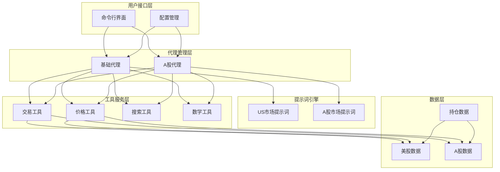
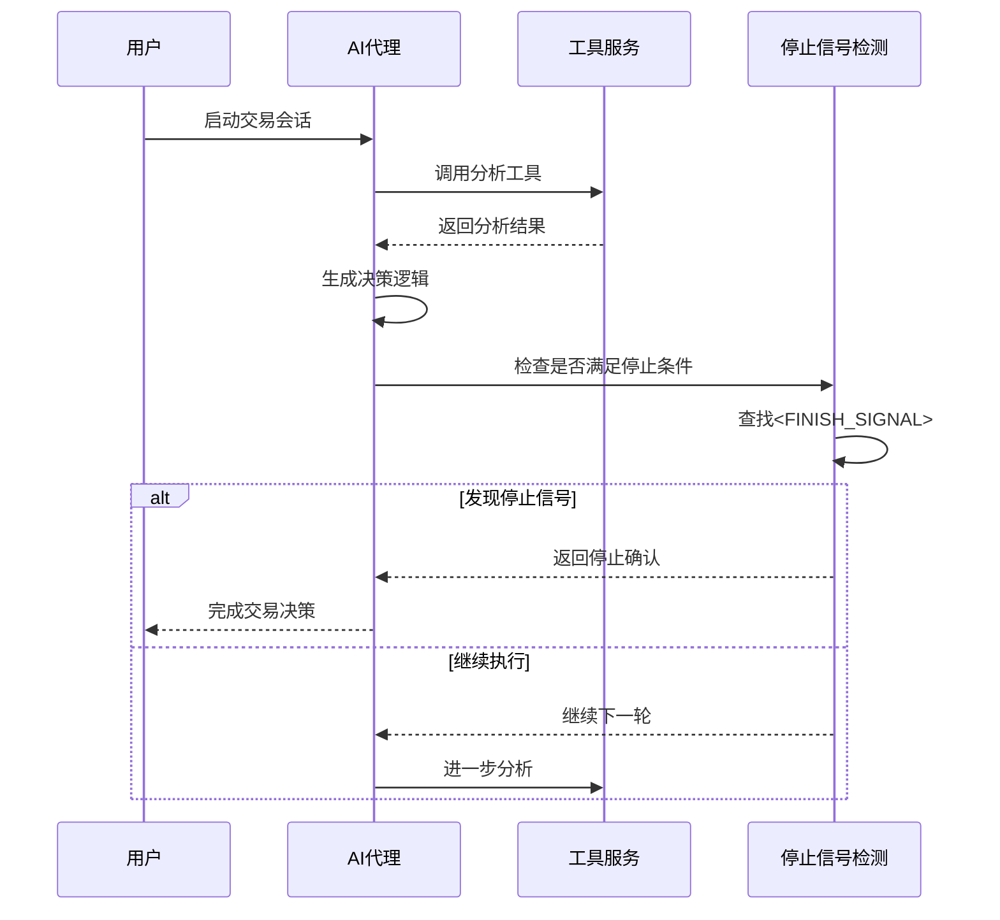
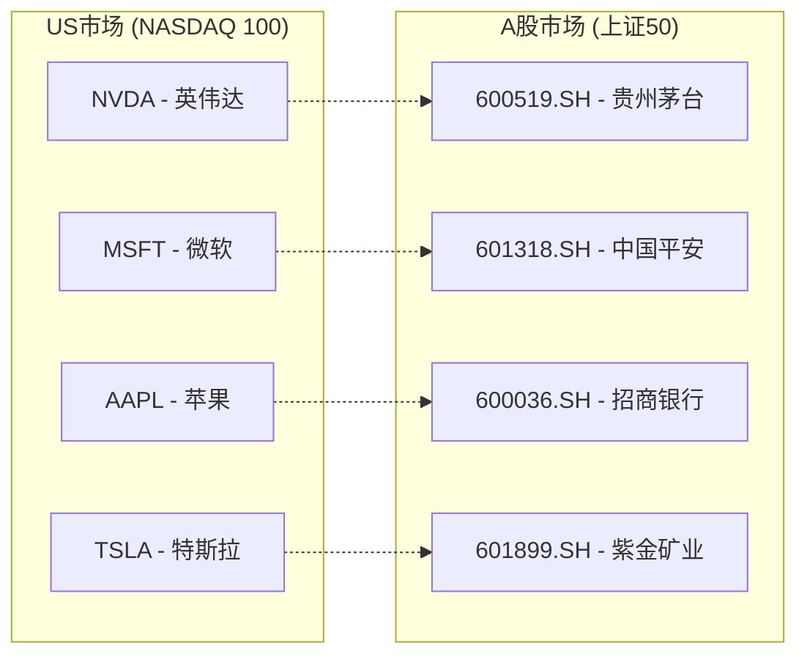
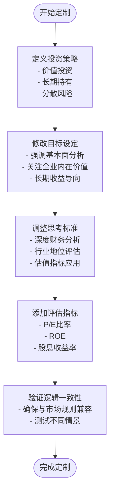
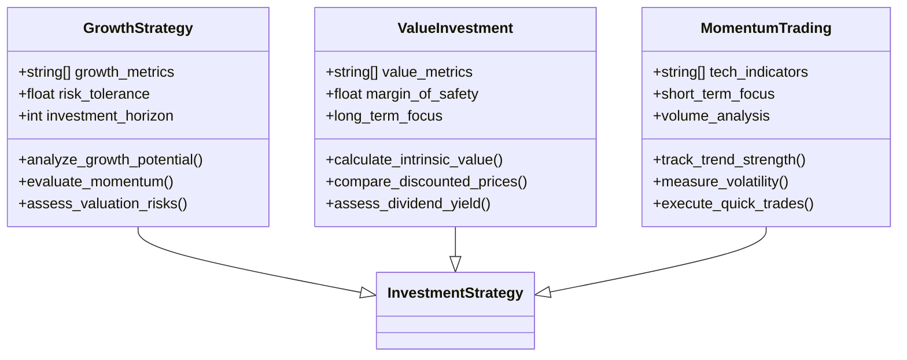
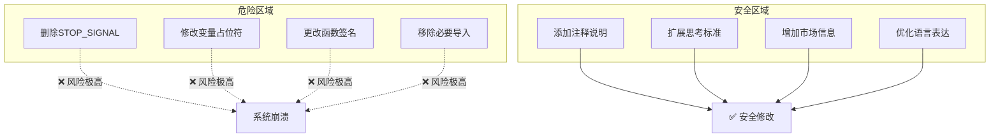
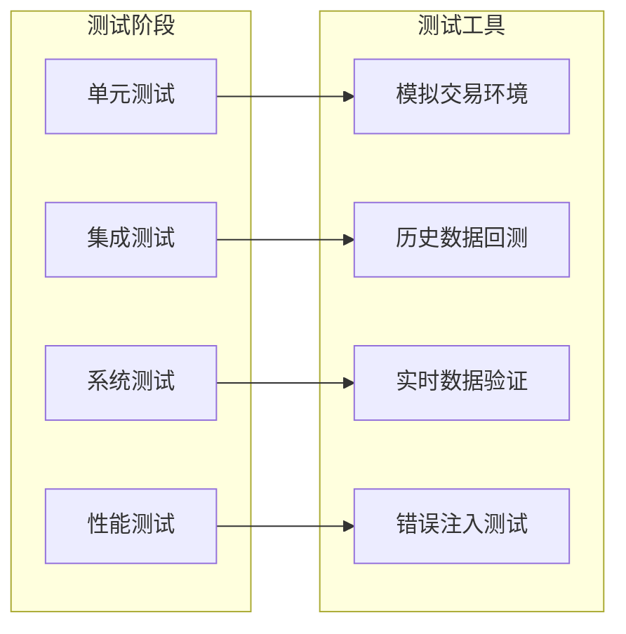

# 提示词定制指南

<cite>
**本文档引用的文件**
- [agent_prompt.py](file://prompts/agent_prompt.py)
- [agent_prompt_astock.py](file://prompts/agent_prompt_astock.py)
- [base_agent.py](file://agent/base_agent/base_agent.py)
- [base_agent_astock.py](file://agent/base_agent_astock/base_agent_astock.py)
- [price_tools.py](file://tools/price_tools.py)
- [general_tools.py](file://tools/general_tools.py)
- [tool_trade.py](file://agent_tools/tool_trade.py)
- [default_config.json](file://configs/default_config.json)
</cite>

## 目录
1. [简介](#简介)
2. [系统架构概览](#系统架构概览)
3. [提示词核心结构分析](#提示词核心结构分析)
4. [US市场与A股市场的差异](#us市场与a股市场的差异)
5. [投资策略定制方法](#投资策略定制方法)
6. [提示词修改最佳实践](#提示词修改最佳实践)
7. [安全修改建议](#安全修改建议)
8. [测试与验证](#测试与验证)
9. [故障排除指南](#故障排除指南)
10. [总结](#总结)

## 简介

AI-Trader系统采用基于提示词的智能代理架构，通过精心设计的系统提示词引导AI代理做出符合特定投资策略的决策。本指南将深入分析agent_prompt.py和agent_prompt_astock.py的核心结构，帮助用户理解如何根据不同的投资策略和市场环境定制提示词内容。

系统支持两种主要市场：美国股市（US市场）和中国A股市场（A股市场），每种市场都有专门优化的提示词模板，包含独特的交易规则和市场特征。

## 系统架构概览

AI-Trader采用分层架构设计，核心组件包括：

**图表来源**
- [base_agent.py](file://agent/base_agent/base_agent.py#L1-L50)
- [base_agent_astock.py](file://agent/base_agent_astock/base_agent_astock.py#L1-L50)

## 提示词核心结构分析

### 停止信号机制

系统使用统一的停止信号机制来识别AI代理的决策完成状态：

**图表来源**
- [agent_prompt.py](file://prompts/agent_prompt.py#L23)
- [agent_prompt_astock.py](file://prompts/agent_prompt_astock.py#L23)

### US市场提示词结构

US市场提示词针对纳斯达克100指数成分股进行了优化：

| 组件 | 功能描述 | 关键特性 |
|------|----------|----------|
| 角色设定 | 股票基本面分析交易助手 | 强调价值投资和长期收益最大化 |
| 决策目标 | 思考和推理 | 通过工具调用进行深度分析 |
| 行为准则 | 明确的中间步骤展示 | 清晰的思考过程记录 |
| 市场适应性 | 支持多种投资策略 | 可扩展的价值投资框架 |

**章节来源**
- [agent_prompt.py](file://prompts/agent_prompt.py#L25-L70)

### A股市场提示词结构

A股市场提示词包含了独特的中国证券市场规则：

| 交易规则 | 具体要求 | 影响说明 |
|----------|----------|----------|
| 一手交易要求 | 必须是100股的整数倍 | 影响买卖数量计算 |
| T+1结算规则 | 当天买入不能当天卖出 | 影响交易时机选择 |
| 涨跌停限制 | 普通股票±10%，ST股票±5% | 限制单日最大波动 |
| 市场特色 | 中文界面和股票名称 | 本地化用户体验 |

**章节来源**
- [agent_prompt_astock.py](file://prompts/agent_prompt_astock.py#L43-L65)

## US市场与A股市场的差异

### 股票符号体系

两个市场使用完全不同的股票代码体系：

**图表来源**
- [price_tools.py](file://tools/price_tools.py#L15-L100)
- [base_agent_astock.py](file://agent/base_agent_astock/base_agent_astock.py#L107-L130)

### 市场规则对比

| 规则类型 | US市场 | A股市场 | 影响程度 |
|----------|--------|---------|----------|
| 最小交易单位 | 单股 | 100股 | 高 |
| 结算周期 | T+2 | T+1 | 中 |
| 涨跌限制 | 无 | ±10%/±5%/±20% | 高 |
| 交易时间 | 标准美股时间 | 上午9:30-11:30, 下午1:00-3:00 | 中 |
| 停牌制度 | 较少 | 常见 | 中 |

**章节来源**
- [tool_trade.py](file://agent_tools/tool_trade.py#L43-L66)
- [tool_trade.py](file://agent_tools/tool_trade.py#L212-L239)

## 投资策略定制方法

### 价值投资策略定制

针对价值投资者的提示词修改示例：

**图表来源**
- [agent_prompt.py](file://prompts/agent_prompt.py#L25-L40)

### 动量交易策略定制

动量交易策略的提示词调整重点：

| 调整要点 | 修改内容 | 预期效果 |
|----------|----------|----------|
| 时间框架 | 强调短期技术分析 | 提高交易频率 |
| 信号识别 | 添加技术指标监控 | 增强趋势判断能力 |
| 风险控制 | 加强止损和止盈设置 | 控制回撤幅度 |
| 市场情绪 | 关注成交量和技术形态 | 提升市场敏感度 |

### 成长型投资策略定制

成长型策略的提示词优化方向：

**图表来源**
- [agent_prompt.py](file://prompts/agent_prompt.py#L25-L45)

## 提示词修改最佳实践

### 结构化修改流程

1. **备份原始文件**
   - 创建版本控制分支
   - 备份原始提示词文件
   - 记录修改前的状态

2. **明确修改目标**
   - 确定具体的投资策略
   - 列出期望的行为改变
   - 设定可衡量的成功标准

3. **渐进式修改**
   - 一次只修改一个方面
   - 保持核心结构不变
   - 逐步验证修改效果

4. **全面测试**
   - 在模拟环境中测试
   - 验证边界条件处理
   - 检查错误处理机制

### 内容修改指导

#### 角色设定修改

修改角色定位时应考虑：
- 明确的投资哲学
- 风险偏好声明
- 决策时间框架
- 信息来源优先级

#### 决策目标调整

目标设定的优化要点：
- 具体可衡量的结果
- 实际可行的路径
- 风险与收益平衡
- 长期可持续性

#### 行为准则优化

思考标准的改进方向：
- 步骤清晰度提升
- 逻辑连贯性增强
- 信息处理效率
- 决策透明度

**章节来源**
- [agent_prompt.py](file://prompts/agent_prompt.py#L25-L50)
- [agent_prompt_astock.py](file://prompts/agent_prompt_astock.py#L25-L50)

## 安全修改建议

### 避免破坏指令结构

修改提示词时必须注意以下关键点：

**图表来源**
- [agent_prompt.py](file://prompts/agent_prompt.py#L23)
- [agent_prompt_astock.py](file://prompts/agent_prompt_astock.py#L23)

### 关键保护要素

| 保护要素 | 重要性 | 修改建议 |
|----------|--------|----------|
| STOP_SIGNAL常量 | 极高 | 严禁修改或删除 |
| 变量占位符 | 高 | 确保格式正确 |
| 函数签名 | 高 | 保持向后兼容 |
| 导入语句 | 中 | 仅在必要时添加 |

### 版本控制策略

推荐的版本控制实践：

1. **分支管理**
   - 主分支用于稳定版本
   - 功能分支用于新特性开发
   - 实验分支用于大胆创新

2. **提交规范**
   - 使用清晰的提交消息
   - 包含修改的具体内容
   - 记录预期的影响

3. **标签管理**
   - 为稳定版本打标签
   - 记录重要的里程碑
   - 方便快速回滚

**章节来源**
- [agent_prompt.py](file://prompts/agent_prompt.py#L23-L25)
- [agent_prompt_astock.py](file://prompts/agent_prompt_astock.py#L23-L25)

## 测试与验证

### 测试环境搭建

建立完整的测试环境：

### 验证检查清单

| 检查项目 | 验证方法 | 通过标准 |
|----------|----------|----------|
| 基础功能 | 启动代理并观察初始化 | 无异常错误 |
| 提示词加载 | 检查系统提示词内容 | 格式正确，信息完整 |
| 工具调用 | 执行简单分析任务 | 工具正常响应 |
| 停止信号识别 | 观察决策完成标志 | 正确识别<FINISH_SIGNAL> |
| 错误处理 | 故意触发错误场景 | 系统优雅降级 |

### 回归测试策略

定期执行回归测试确保：
- 新修改不影响现有功能
- 不同市场环境下的稳定性
- 性能指标的持续改善
- 用户体验的一致性

**章节来源**
- [base_agent.py](file://agent/base_agent/base_agent.py#L300-L350)
- [base_agent_astock.py](file://agent/base_agent_astock/base_agent_astock.py#L300-L350)

## 故障排除指南

### 常见问题及解决方案

| 问题类型 | 症状描述 | 可能原因 | 解决方案 |
|----------|----------|----------|----------|
| 提示词加载失败 | 初始化时出错 | 文件路径或权限问题 | 检查文件存在性和访问权限 |
| 停止信号未识别 | 代理无法结束 | STOP_SIGNAL格式错误 | 验证信号格式和位置 |
| 工具调用失败 | 分析任务中断 | 工具服务未启动 | 检查MCP服务状态 |
| 数据获取异常 | 价格信息缺失 | 网络连接或API问题 | 验证网络和API配置 |

### 调试技巧

1. **日志分析**
   - 启用详细日志记录
   - 分析错误堆栈信息
   - 跟踪消息传递流程

2. **断点调试**
   - 在关键函数设置断点
   - 检查变量值和状态
   - 单步执行验证逻辑

3. **单元测试**
   - 编写针对性测试用例
   - 验证各组件独立功能
   - 模拟各种异常场景

### 性能优化

监控和优化系统性能：
- 分析响应时间分布
- 识别瓶颈环节
- 优化资源使用
- 平衡准确性和速度

**章节来源**
- [general_tools.py](file://tools/general_tools.py#L111-L146)
- [base_agent.py](file://agent/base_agent/base_agent.py#L400-L450)

## 总结

提示词定制是AI-Trader系统个性化的重要手段，通过合理的修改可以显著提升AI代理的投资表现。关键成功因素包括：

1. **理解系统架构** - 深入了解提示词在整体架构中的作用
2. **遵循最佳实践** - 采用结构化的方法进行修改
3. **注重安全性** - 保护核心指令结构不被破坏
4. **全面测试验证** - 确保修改后的系统稳定可靠
5. **持续优化改进** - 基于实际效果不断调整优化

通过本指南提供的方法和建议，用户可以根据自己的投资理念和市场特点，定制出最适合的AI交易代理，实现更高效、更智能的投资决策。