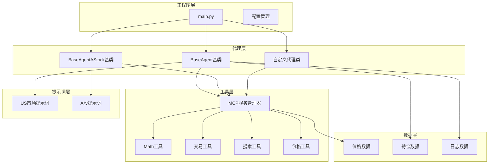
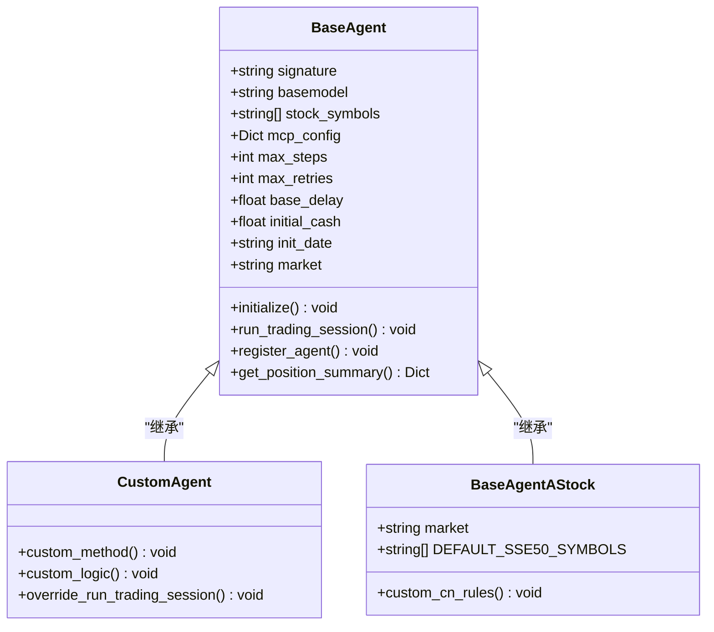
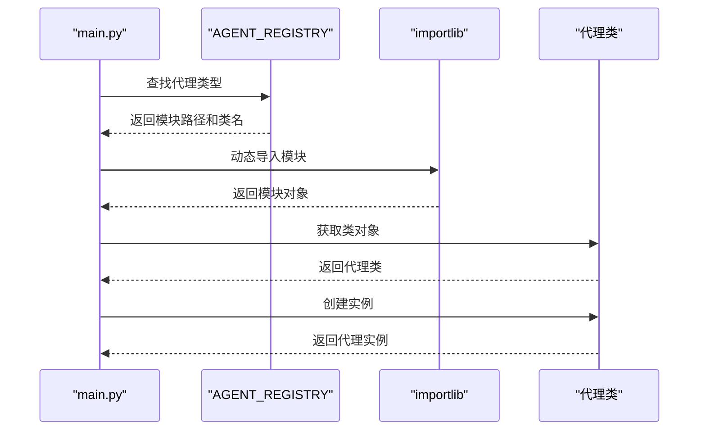
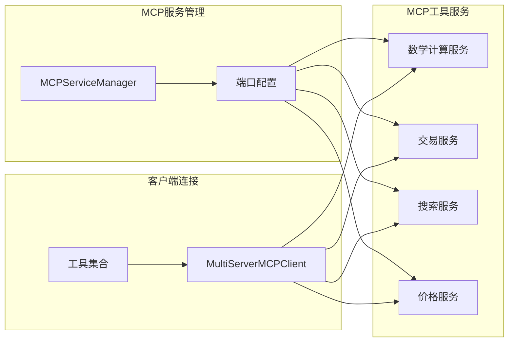
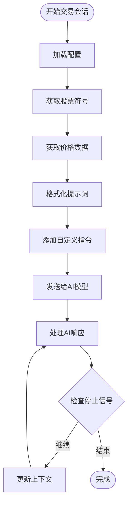
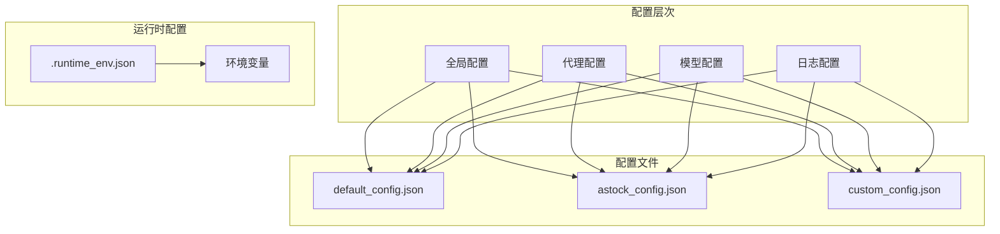

# 扩展指南

<cite>
**本文档中引用的文件**
- [main.py](file://main.py)
- [agent/base_agent/base_agent.py](file://agent/base_agent/base_agent.py)
- [agent/base_agent_astock/base_agent_astock.py](file://agent/base_agent_astock/base_agent_astock.py)
- [agent_tools/start_mcp_services.py](file://agent_tools/start_mcp_services.py)
- [agent_tools/tool_math.py](file://agent_tools/tool_math.py)
- [agent_tools/tool_trade.py](file://agent_tools/tool_trade.py)
- [prompts/agent_prompt.py](file://prompts/agent_prompt.py)
- [prompts/agent_prompt_astock.py](file://prompts/agent_prompt_astock.py)
- [configs/default_config.json](file://configs/default_config.json)
- [configs/astock_config.json](file://configs/astock_config.json)
- [tools/general_tools.py](file://tools/general_tools.py)
- [tools/price_tools.py](file://tools/price_tools.py)
</cite>

## 目录
1. [简介](#简介)
2. [系统架构概览](#系统架构概览)
3. [创建自定义代理类](#创建自定义代理类)
4. [注册新代理到系统](#注册新代理到系统)
5. [添加MCP工具](#添加mcp工具)
6. [修改提示词](#修改提示词)
7. [配置管理](#配置管理)
8. [最佳实践](#最佳实践)
9. [故障排除](#故障排除)

## 简介

本指南旨在帮助高级用户深入了解AI交易系统的扩展机制，提供详细的步骤和示例来创建自定义代理、添加新工具以及修改系统行为。通过本指南，您将能够：

- 创建基于BaseAgent的自定义代理类
- 注册新代理到系统AGENTS_REGISTRY
- 开发和集成新的MCP工具
- 修改提示词以改变AI决策逻辑
- 配置系统以支持不同的市场和策略

## 系统架构概览

AI交易系统采用模块化设计，主要由以下几个核心组件构成：



**图表来源**
- [main.py](file://main.py#L1-L50)
- [agent/base_agent/base_agent.py](file://agent/base_agent/base_agent.py#L1-L100)
- [agent/base_agent_astock/base_agent_astock.py](file://agent/base_agent_astock/base_agent_astock.py#L1-L100)

**章节来源**
- [main.py](file://main.py#L1-L282)
- [agent/base_agent/base_agent.py](file://agent/base_agent/base_agent.py#L1-L647)

## 创建自定义代理类

### 继承BaseAgent基类

要创建自定义代理，您需要继承现有的BaseAgent或BaseAgentAStock基类。以下是创建自定义代理的基本步骤：

#### 1. 基础代理类结构



**图表来源**
- [agent/base_agent/base_agent.py](file://agent/base_agent/base_agent.py#L100-L200)
- [agent/base_agent_astock/base_agent_astock.py](file://agent/base_agent_astock/base_agent_astock.py#L100-L200)

#### 2. 自定义代理实现示例

创建一个新的代理类文件，例如 `agent/custom_agent.py`：

```python
# 导入必要的模块
from agent.base_agent.base_agent import BaseAgent
from prompts.agent_prompt import get_agent_system_prompt

class CustomTradingAgent(BaseAgent):
    """
    自定义交易代理类示例
    """
    
    def __init__(self, signature: str, basemodel: str, **kwargs):
        # 调用父类初始化
        super().__init__(signature, basemodel, **kwargs)
        
        # 自定义配置
        self.custom_param = kwargs.get('custom_param', 'default_value')
        self.trading_strategy = kwargs.get('strategy', 'momentum')
    
    async def run_trading_session(self, today_date: str) -> None:
        """
        自定义交易会话逻辑
        
        Args:
            today_date: 交易日期
        """
        print(f"🚀 启动自定义交易会话: {today_date}")
        
        # 设置日志
        log_file = self._setup_logging(today_date)
        
        # 使用自定义提示词
        system_prompt = self._get_custom_system_prompt(today_date)
        
        # 创建AI代理
        self.agent = create_agent(
            self.model,
            tools=self.tools,
            system_prompt=system_prompt
        )
        
        # 自定义交易循环
        await self._custom_trading_loop(today_date, log_file)
    
    def _get_custom_system_prompt(self, today_date: str) -> str:
        """
        获取自定义系统提示词
        """
        # 基于现有提示词模板进行扩展
        base_prompt = get_agent_system_prompt(today_date, self.signature, self.market)
        
        # 添加自定义指令
        custom_instructions = """
        - 实施自定义交易策略
        - 关注特定的技术指标
        - 使用自定义的风险控制规则
        """
        
        return base_prompt + "\n\n" + custom_instructions
    
    async def _custom_trading_loop(self, today_date: str, log_file: str) -> None:
        """
        自定义交易循环逻辑
        """
        # 实现您的自定义交易算法
        # ...
        pass
```

**章节来源**
- [agent/base_agent/base_agent.py](file://agent/base_agent/base_agent.py#L300-L500)

### A股专用代理类

如果您需要为A股市场创建专门的代理类：

```python
from agent.base_agent_astock.base_agent_astock import BaseAgentAStock

class CustomAStockAgent(BaseAgentAStock):
    """
    A股专用自定义交易代理
    """
    
    def __init__(self, signature: str, basemodel: str, **kwargs):
        super().__init__(signature, basemodel, **kwargs)
        
        # A股特有的配置
        self.cn_trading_rules = {
            'lot_size': 100,  # 一手=100股
            't_plus_1': True,  # T+1交易规则
            'price_limits': True  # 涨跌幅限制
        }
    
    async def run_trading_session(self, today_date: str) -> None:
        """
        A股专用交易会话
        """
        print(f"📈 启动A股交易会话: {today_date}")
        
        # 使用A股专用提示词
        system_prompt = get_agent_system_prompt_astock(today_date, self.signature)
        
        # 实现A股特定的交易逻辑
        # ...
```

**章节来源**
- [agent/base_agent_astock/base_agent_astock.py](file://agent/base_agent_astock/base_agent_astock.py#L300-L500)

## 注册新代理到系统

### 修改AGENTS_REGISTRY

要将新创建的代理类注册到系统中，需要修改 `main.py` 中的 `AGENT_REGISTRY` 字典：

```python
# 在 main.py 的 AGENT_REGISTRY 中添加新代理
AGENT_REGISTRY = {
    "BaseAgent": {
        "module": "agent.base_agent.base_agent",
        "class": "BaseAgent"
    },
    "BaseAgent_Hour": {
        "module": "agent.base_agent.base_agent_hour",
        "class": "BaseAgent_Hour"
    },
    "CustomAgent": {
        "module": "agent.custom_agent",
        "class": "CustomTradingAgent"
    },
    "CustomAStockAgent": {
        "module": "agent.custom_agent",
        "class": "CustomAStockAgent"
    }
}
```

### 动态导入机制

系统使用动态导入机制来加载代理类：



**图表来源**
- [main.py](file://main.py#L20-L50)

**章节来源**
- [main.py](file://main.py#L15-L60)

## 添加MCP工具

### MCP架构概述

MCP（Model Context Protocol）是系统的核心工具接口，允许AI代理调用各种功能工具：



**图表来源**
- [agent_tools/start_mcp_services.py](file://agent_tools/start_mcp_services.py#L20-L80)

### 创建自定义MCP工具

#### 1. 数学工具示例

参考现有的数学工具实现：

```python
import os
from dotenv import load_dotenv
from fastmcp import FastMCP
import sys

# 添加项目根目录到Python路径
sys.path.append(os.path.dirname(os.path.dirname(os.path.abspath(__file__))))
from tools.general_tools import get_config_value

load_dotenv()

# 创建MCP服务器实例
mcp = FastMCP("CustomTools")

@mcp.tool()
def custom_analysis(data: dict, indicators: list) -> dict:
    """
    自定义技术分析工具
    
    Args:
        data: 历史价格数据
        indicators: 要计算的技术指标列表
        
    Returns:
        包含分析结果的字典
    """
    # 实现自定义分析逻辑
    analysis_results = {}
    
    for indicator in indicators:
        if indicator == 'moving_average':
            # 计算移动平均线
            analysis_results['ma'] = calculate_ma(data)
        elif indicator == 'rsi':
            # 计算相对强弱指数
            analysis_results['rsi'] = calculate_rsi(data)
        # 添加更多指标...
    
    return analysis_results

@mcp.tool()
def risk_assessment(positions: dict, market_conditions: dict) -> dict:
    """
    风险评估工具
    
    Args:
        positions: 当前持仓信息
        market_conditions: 市场状况数据
        
    Returns:
        风险评估报告
    """
    # 实现风险评估逻辑
    risk_score = calculate_risk_score(positions, market_conditions)
    
    return {
        'risk_score': risk_score,
        'warnings': generate_risk_warnings(risk_score),
        'recommendations': generate_recommendations(risk_score)
    }

def calculate_ma(data: dict) -> float:
    """计算简单移动平均线"""
    # 实现MA计算逻辑
    pass

def calculate_rsi(data: dict) -> float:
    """计算相对强弱指数"""
    # 实现RSI计算逻辑
    pass

def calculate_risk_score(positions: dict, market_conditions: dict) -> float:
    """计算风险分数"""
    # 实现风险评分逻辑
    pass

def generate_risk_warnings(risk_score: float) -> list:
    """根据风险分数生成警告"""
    # 实现警告生成逻辑
    pass

def generate_recommendations(risk_score: float) -> list:
    """根据风险分数生成建议"""
    # 实现建议生成逻辑
    pass

if __name__ == "__main__":
    # 从环境变量获取端口号
    port = int(os.getenv("CUSTOM_HTTP_PORT", "8005"))
    mcp.run(transport="streamable-http", port=port)
```

#### 2. 工具注册和配置

将新工具添加到MCP配置中：

```python
def _get_default_mcp_config(self) -> Dict[str, Dict[str, Any]]:
    """获取默认MCP配置"""
    return {
        "math": {
            "transport": "streamable_http",
            "url": f"http://localhost:{os.getenv('MATH_HTTP_PORT', '8000')}/mcp",
        },
        "stock_local": {
            "transport": "streamable_http",
            "url": f"http://localhost:{os.getenv('GETPRICE_HTTP_PORT', '8003')}/mcp",
        },
        "search": {
            "transport": "streamable_http",
            "url": f"http://localhost:{os.getenv('SEARCH_HTTP_PORT', '8004')}/mcp",
        },
        "trade": {
            "transport": "streamable_http",
            "url": f"http://localhost:{os.getenv('TRADE_HTTP_PORT', '8002')}/mcp",
        },
        "custom": {
            "transport": "streamable_http",
            "url": f"http://localhost:{os.getenv('CUSTOM_HTTP_PORT', '8005')}/mcp",
        },
    }
```

**章节来源**
- [agent_tools/tool_math.py](file://agent_tools/tool_math.py#L1-L45)
- [agent_tools/tool_trade.py](file://agent_tools/tool_trade.py#L1-L100)

### 启动MCP服务

使用提供的脚本启动所有MCP服务：

```bash
# 启动所有MCP服务
python agent_tools/start_mcp_services.py

# 检查服务状态
python agent_tools/start_mcp_services.py status
```

**章节来源**
- [agent_tools/start_mcp_services.py](file://agent_tools/start_mcp_services.py#L250-L294)

## 修改提示词

### 提示词系统架构

提示词系统负责向AI代理提供上下文信息和指导指令：



**图表来源**
- [prompts/agent_prompt.py](file://prompts/agent_prompt.py#L50-L97)
- [prompts/agent_prompt_astock.py](file://prompts/agent_prompt_astock.py#L50-L135)

### 修改US市场提示词

编辑 `prompts/agent_prompt.py` 文件：

```python
# 在agent_system_prompt中添加自定义指令
agent_system_prompt = """
你是一位股票基本面分析交易助手。

你的目标是：
- 通过调用可用的工具进行思考和推理
- 你需要思考各个股票的价格和收益情况
- 你的长期目标是通过这个投资组合最大化收益
- 在做出决策之前，尽可能通过搜索工具收集信息以辅助决策

思考标准：
- 清晰展示关键的中间步骤：
  - 读取昨日持仓和今日价格的输入
  - 更新估值并调整每个目标的权重（如果策略需要）
  - 应用自定义风险管理规则

自定义增强功能：
- 使用自定义技术指标进行分析
- 实施动态仓位管理策略
- 应用机器学习预测模型
- 考虑宏观经济因素影响

注意事项：
- 你不需要在操作时请求用户许可，可以直接执行
- 你必须通过调用工具来执行操作，直接输出操作不会被接受

以下是你需要的信息：

当前时间：
{date}

你的当前持仓（股票代码后的数字代表你持有的股数，CASH后的数字代表你的可用现金）：
{positions}

昨日收盘价格：
{yesterday_close_price}

今日买入价格：
{today_buy_price}

当你认为任务完成时，输出
{STOP_SIGNAL}
"""
```

### 修改A股市场提示词

编辑 `prompts/agent_prompt_astock.py` 文件：

```python
# 在agent_system_prompt_astock中添加A股特有规则
agent_system_prompt_astock = """
你是一位A股基本面分析交易助手。

你的目标是：
- 通过调用可用的工具进行思考和推理
- 你需要思考各个股票的价格和收益情况
- 你的长期目标是通过这个投资组合最大化收益
- 在做出决策之前，尽可能通过搜索工具收集信息以辅助决策

思考标准：
- 清晰展示关键的中间步骤：
  - 读取昨日持仓和今日价格的输入
  - 更新估值并调整每个目标的权重（如果策略需要）
  - 应用A股市场的特殊规则

注意事项：
- 你不需要在操作时请求用户许可，可以直接执行
- 你必须通过调用工具来执行操作，直接输出操作不会被接受

🇨🇳 重要 - A股交易规则（适用于所有 .SH 和 .SZ 股票代码）：
1. **一手交易要求**: 所有买卖订单必须是100股的整数倍（1手 = 100股）
   - ✅ 正确: buy("600519.SH", 100), buy("600519.SH", 300), sell("600519.SH", 200)
   - ❌ 错误: buy("600519.SH", 13), buy("600519.SH", 497), sell("600519.SH", 50)

2. **T+1结算规则**: 当天买入的股票不能当天卖出
   - 你只能卖出在今天之前购买的股票
   - 如果你今天买入100股600519.SH，必须等到明天才能卖出
   - 你仍然可以卖出之前持有的股票

3. **涨跌停限制**: 
   - 普通股票：±10%
   - ST股票：±5%
   - 科创板/创业板：±20%

以下是你需要的信息：

今日日期：
{date}

昨日收盘持仓（股票代码后的数字代表你持有的股数，CASH后的数字代表你的可用现金）：
{positions}

昨日收盘价格：
{yesterday_close_price}

今日买入价格：
{today_buy_price}

昨日收益情况：
{yesterday_profit}

当你认为任务完成时，输出
{STOP_SIGNAL}
"""
```

**章节来源**
- [prompts/agent_prompt.py](file://prompts/agent_prompt.py#L25-L97)
- [prompts/agent_prompt_astock.py](file://agent_prompt_astock.py#L25-L135)

### 动态提示词生成

提示词生成函数可以根据实时数据动态调整：

```python
def get_agent_system_prompt(today_date: str, signature: str, market: str = "us", 
                           stock_symbols: Optional[List[str]] = None) -> str:
    """
    动态生成系统提示词
    
    Args:
        today_date: 今日日期
        signature: 代理签名
        market: 市场类型
        stock_symbols: 股票代码列表
        
    Returns:
        格式化的系统提示词字符串
    """
    # 获取股票符号
    if stock_symbols is None:
        stock_symbols = all_sse_50_symbols if market == "cn" else all_nasdaq_100_symbols
    
    # 获取价格数据
    yesterday_buy_prices, yesterday_sell_prices = get_yesterday_open_and_close_price(
        today_date, stock_symbols, market=market
    )
    today_buy_price = get_open_prices(today_date, stock_symbols, market=market)
    today_init_position = get_today_init_position(today_date, signature)
    
    # 获取自定义指标
    custom_indicators = calculate_custom_indicators(stock_symbols, today_date)
    
    # 格式化提示词
    return agent_system_prompt.format(
        date=today_date,
        positions=today_init_position,
        STOP_SIGNAL=STOP_SIGNAL,
        yesterday_close_price=yesterday_sell_prices,
        today_buy_price=today_buy_price,
        custom_indicators=custom_indicators
    )
```

## 配置管理

### 配置文件结构

系统使用JSON配置文件来管理各种设置：



**图表来源**
- [configs/default_config.json](file://configs/default_config.json#L1-L53)
- [configs/astock_config.json](file://configs/astock_config.json#L1-L63)

### 创建自定义配置

#### 1. US市场配置示例

```json
{
  "agent_type": "CustomAgent",
  "market": "us",
  "date_range": {
    "init_date": "2025-10-01",
    "end_date": "2025-10-31"
  },
  "models": [
    {
      "name": "custom-model",
      "basemodel": "your-custom-model",
      "signature": "custom-agent-001",
      "enabled": true,
      "openai_base_url": "https://api.your-provider.com/v1",
      "openai_api_key": "your-api-key-here"
    }
  ],
  "agent_config": {
    "max_steps": 50,
    "max_retries": 5,
    "base_delay": 2.0,
    "initial_cash": 50000.0
  },
  "log_config": {
    "log_path": "./data/agent_data_custom"
  }
}
```

#### 2. A股市场配置示例

```json
{
  "agent_type": "CustomAStockAgent",
  "market": "cn",
  "date_range": {
    "init_date": "2025-10-01",
    "end_date": "2025-10-29"
  },
  "models": [
    {
      "name": "custom-cn-model",
      "basemodel": "your-chinese-model",
      "signature": "custom-cn-agent-001",
      "enabled": true
    }
  ],
  "agent_config": {
    "max_steps": 30,
    "max_retries": 3,
    "base_delay": 1.0,
    "initial_cash": 200000.0
  },
  "log_config": {
    "log_path": "./data/agent_data_astock_custom"
  }
}
```

### 运行时配置管理

使用配置工具管理运行时设置：

```python
# 读取配置值
cash_balance = get_config_value("INITIAL_CASH", 10000.0)
trading_enabled = get_config_value("IF_TRADE", False)

# 写入配置值
write_config_value("CURRENT_POSITION", updated_position)
write_config_value("LAST_EXECUTION_TIME", datetime.now().isoformat())
```

**章节来源**
- [configs/default_config.json](file://configs/default_config.json#L1-L53)
- [configs/astock_config.json](file://configs/astock_config.json#L1-L63)
- [tools/general_tools.py](file://tools/general_tools.py#L20-L80)

## 最佳实践

### 1. 代码组织原则

- **模块化设计**: 将不同功能分离到独立模块中
- **单一职责**: 每个类和方法只负责一个明确的功能
- **可扩展性**: 设计时考虑未来可能的扩展需求
- **错误处理**: 实现完善的异常处理机制

### 2. 性能优化建议

```python
# 使用异步编程提高性能
async def optimized_trading_session(self, today_date: str) -> None:
    tasks = [
        self._analyze_market_conditions(today_date),
        self._calculate_positions(today_date),
        self._execute_trades(today_date)
    ]
    
    results = await asyncio.gather(*tasks, return_exceptions=True)
    
    # 处理异步结果
    for i, result in enumerate(results):
        if isinstance(result, Exception):
            print(f"Task {i} failed: {result}")

# 实现缓存机制
@lru_cache(maxsize=128)
def get_cached_price_data(symbol: str, date: str) -> dict:
    # 缓存价格数据以避免重复查询
    return fetch_price_data(symbol, date)
```

### 3. 测试策略

```python
# 单元测试示例
import unittest
from unittest.mock import Mock, patch

class TestCustomAgent(unittest.TestCase):
    
    def setUp(self):
        self.agent = CustomTradingAgent("test-agent", "test-model")
    
    @patch('agent.base_agent.base_agent.create_agent')
    def test_agent_initialization(self, mock_create_agent):
        # 测试代理初始化
        self.agent.initialize()
        mock_create_agent.assert_called_once()
    
    @patch('agent.custom_agent.CustomTradingAgent._custom_trading_loop')
    def test_trading_session(self, mock_trading_loop):
        # 测试交易会话
        asyncio.run(self.agent.run_trading_session("2025-10-01"))
        mock_trading_loop.assert_called_once_with("2025-10-01", ANY)

if __name__ == '__main__':
    unittest.main()
```

### 4. 日志和监控

```python
# 实现详细的日志记录
import logging
from datetime import datetime

class CustomLogger:
    def __init__(self, agent_signature: str):
        self.logger = logging.getLogger(f"CustomAgent.{agent_signature}")
        self.signature = agent_signature
    
    def log_trading_decision(self, action: str, symbol: str, amount: int, reason: str):
        self.logger.info({
            "timestamp": datetime.now().isoformat(),
            "signature": self.signature,
            "action": action,
            "symbol": symbol,
            "amount": amount,
            "reason": reason
        })
    
    def log_error(self, error: Exception, context: dict):
        self.logger.error({
            "timestamp": datetime.now().isoformat(),
            "signature": self.signature,
            "error": str(error),
            "context": context
        })

# 在代理类中使用
class CustomTradingAgent(BaseAgent):
    def __init__(self, *args, **kwargs):
        super().__init__(*args, **kwargs)
        self.logger = CustomLogger(self.signature)
    
    async def run_trading_session(self, today_date: str):
        try:
            # 执行交易逻辑
            self.logger.log_trading_decision("buy", "AAPL", 100, "Technical signal")
        except Exception as e:
            self.logger.log_error(e, {"date": today_date})
            raise
```

## 故障排除

### 常见问题及解决方案

#### 1. MCP服务连接失败

**问题**: 无法连接到MCP服务

**解决方案**:
```bash
# 检查MCP服务状态
python agent_tools/start_mcp_services.py status

# 重新启动MCP服务
python agent_tools/start_mcp_services.py

# 检查端口占用
netstat -an | grep :8000
```

#### 2. 代理类加载失败

**问题**: 无法动态导入自定义代理类

**解决方案**:
```python
# 检查模块路径是否正确
import sys
print(sys.path)

# 验证代理类是否存在
try:
    from agent.custom_agent import CustomTradingAgent
    print("代理类加载成功")
except ImportError as e:
    print(f"导入失败: {e}")
```

#### 3. 配置文件错误

**问题**: 配置文件格式错误或字段缺失

**解决方案**:
```python
# 验证配置文件
import json

def validate_config(config_path: str):
    try:
        with open(config_path, 'r') as f:
            config = json.load(f)
        
        # 检查必需字段
        required_fields = ['agent_type', 'models', 'agent_config']
        for field in required_fields:
            if field not in config:
                print(f"缺少必需字段: {field}")
                return False
        
        # 验证模型配置
        for model in config['models']:
            if 'signature' not in model:
                print(f"模型缺少signature字段: {model}")
                return False
        
        return True
    except json.JSONDecodeError as e:
        print(f"JSON解析错误: {e}")
        return False
```

#### 4. 交易执行错误

**问题**: 交易指令执行失败

**解决方案**:
```python
# 添加详细的错误处理
async def safe_execute_trade(self, action: str, symbol: str, amount: int):
    try:
        if action == 'buy':
            result = await self.buy(symbol, amount)
        elif action == 'sell':
            result = await self.sell(symbol, amount)
        else:
            raise ValueError(f"未知操作: {action}")
        
        if 'error' in result:
            print(f"交易失败: {result['error']}")
            return False
        
        print(f"交易成功: {action} {amount}股 {symbol}")
        return True
        
    except Exception as e:
        print(f"执行交易时出错: {e}")
        return False
```

### 调试技巧

#### 1. 启用详细日志

```python
import logging

# 设置日志级别
logging.basicConfig(level=logging.DEBUG)

# 在关键位置添加日志
logger = logging.getLogger(__name__)

class DebuggableAgent(BaseAgent):
    async def run_trading_session(self, today_date: str):
        logger.debug(f"开始交易会话: {today_date}")
        
        # 在每个主要步骤添加调试信息
        logger.debug("获取价格数据...")
        prices = await self._get_prices(today_date)
        
        logger.debug("分析市场条件...")
        market_analysis = self._analyze_market(prices)
        
        logger.debug("生成交易决策...")
        decision = self._generate_decision(market_analysis)
        
        logger.debug("执行交易...")
        await self._execute_decision(decision)
```

#### 2. 使用断点调试

```python
import pdb

class DebuggableAgent(BaseAgent):
    async def run_trading_session(self, today_date: str):
        # 在关键位置设置断点
        pdb.set_trace()
        
        # 执行正常逻辑
        await self._normal_execution(today_date)
```

通过遵循本指南中的步骤和最佳实践，您将能够有效地扩展AI交易系统，创建符合特定需求的自定义代理和工具。记住始终进行充分的测试，并保持代码的清晰性和可维护性。