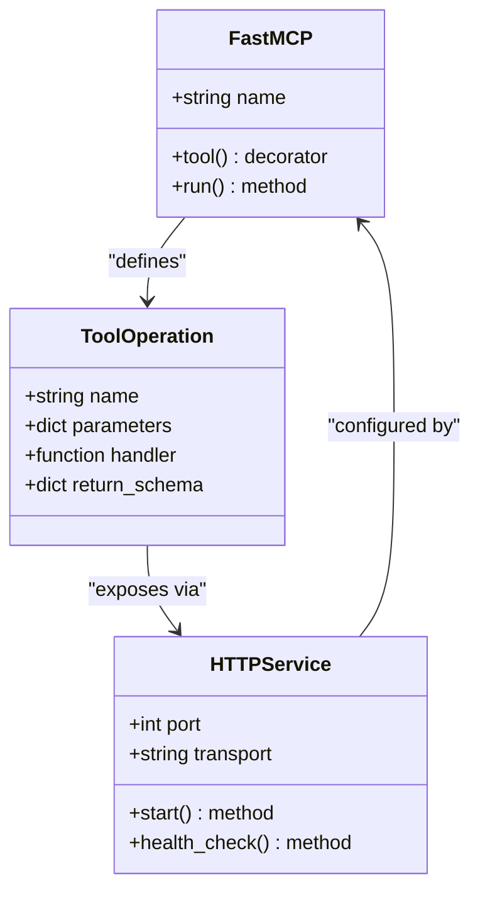
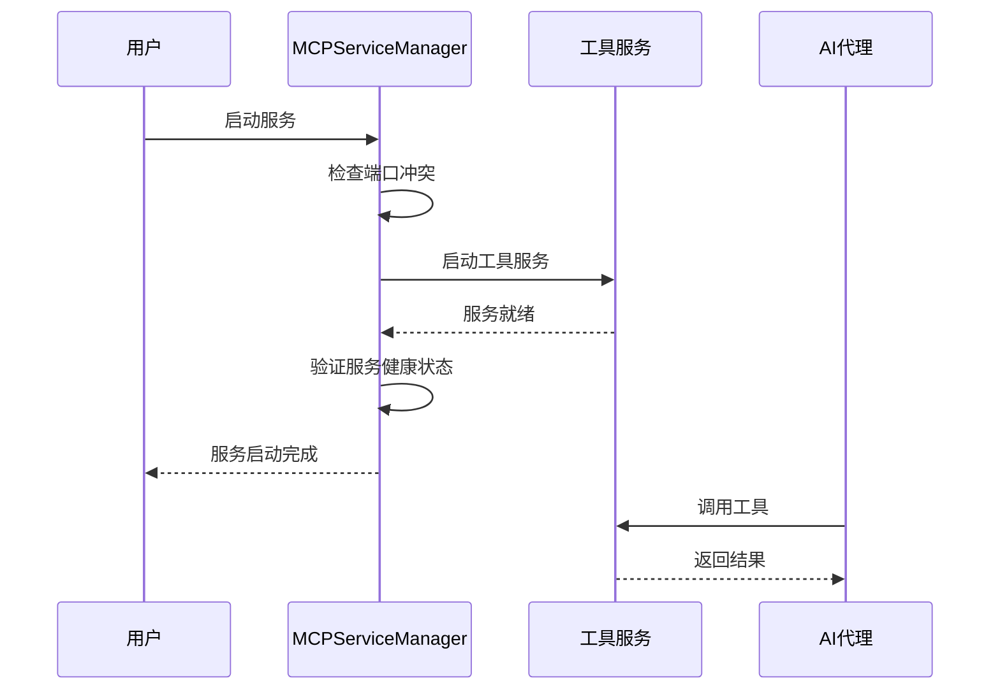

# 添加新工具

<cite>
**本文档中引用的文件**
- [start_mcp_services.py](file://agent_tools/start_mcp_services.py)
- [tool_trade.py](file://agent_tools/tool_trade.py)
- [tool_math.py](file://agent_tools/tool_math.py)
- [tool_jina_search.py](file://agent_tools/tool_jina_search.py)
- [tool_get_price_local.py](file://agent_tools/tool_get_price_local.py)
- [requirements.txt](file://requirements.txt)
- [default_config.json](file://configs/default_config.json)
</cite>

## 目录
1. [概述](#概述)
2. [现有工具架构分析](#现有工具架构分析)
3. [新工具开发规范](#新工具开发规范)
4. [完整开发流程示例](#完整开发流程示例)
5. [服务注册与配置](#服务注册与配置)
6. [测试与验证](#测试与验证)
7. [最佳实践](#最佳实践)

## 概述

AI-Trader系统采用MCP（Model Context Protocol）工具链架构，通过独立的HTTP服务提供各种功能工具。每个工具都必须遵循统一的开发规范，包含Tool和Operation定义，并通过FastAPI暴露HTTP接口。

### 核心特性
- **模块化设计**：每个工具运行在独立的HTTP服务中
- **标准化接口**：统一的FastMCP框架支持
- **自动发现机制**：AI代理可动态发现和调用工具
- **类型安全**：严格的输入输出参数验证

## 现有工具架构分析

### 工具结构模式

所有现有工具都遵循相同的架构模式：



**图表来源**
- [tool_math.py](file://agent_tools/tool_math.py#L1-L45)
- [tool_trade.py](file://agent_tools/tool_trade.py#L1-L372)

### 现有工具对比

| 工具名称 | 功能描述 | 输入参数 | 输出格式 | 端口配置 |
|---------|----------|----------|----------|----------|
| Math | 基础数学运算 | a: float, b: float | float | 8000 |
| TradeTools | 股票交易操作 | symbol: str, amount: int | Dict | 8002 |
| Search | 市场信息检索 | query: str | str | 8001 |
| LocalPrices | 价格查询 | symbol: str, date: str | Dict | 8003 |

**节来源**
- [start_mcp_services.py](file://agent_tools/start_mcp_services.py#L30-L45)

## 新工具开发规范

### 必需组件

每个新工具必须包含以下核心组件：

#### 1. FastMCP实例化
```python
from fastmcp import FastMCP

mcp = FastMCP("ToolName")
```

#### 2. Tool装饰器
```python
@mcp.tool()
def operation_name(param1: type, param2: type) -> ReturnType:
    """操作描述"""
    # 实现逻辑
    return result
```

#### 3. HTTP服务启动
```python
if __name__ == "__main__":
    port = int(os.getenv("TOOL_HTTP_PORT", "默认端口"))
    mcp.run(transport="streamable-http", port=port)
```

### JSON Schema定义规范

工具的输入输出参数必须符合JSON Schema规范，确保与LangChain兼容：

#### 参数验证规则
- **类型声明**：使用Python类型注解
- **必填字段**：明确标记必需参数
- **默认值**：为可选参数提供默认值
- **范围限制**：对数值参数添加范围约束

#### 返回值规范
- **成功响应**：返回预期的数据结构
- **错误处理**：返回标准化错误对象
- **日志记录**：可选的日志记录机制

**节来源**
- [tool_math.py](file://agent_tools/tool_math.py#L12-L45)
- [tool_trade.py](file://agent_tools/tool_trade.py#L25-L150)

## 完整开发流程示例

### 示例：宏观经济数据查询工具

我们将创建一个名为`tool_economic_data.py`的工具，用于查询宏观经济数据。

#### 1. 工具文件结构

```python
#!/usr/bin/env python3
"""
宏观经济数据查询工具
提供GDP、CPI、失业率等宏观经济指标查询功能
"""

import os
import sys
from typing import Dict, List, Optional, Any
from datetime import datetime
import json
from fastmcp import FastMCP

# 添加项目根目录到Python路径
project_root = os.path.dirname(os.path.dirname(os.path.abspath(__file__)))
sys.path.insert(0, project_root)

from tools.general_tools import get_config_value

mcp = FastMCP("EconomicData")

class EconomicDataFetcher:
    """宏观经济数据获取器"""
    
    def __init__(self):
        self.data_sources = {
            "gdp": "https://api.economic-data.com/gdp",
            "cpi": "https://api.economic-data.com/cpi",
            "unemployment": "https://api.economic-data.com/unemployment"
        }
    
    def fetch_gdp_data(self, country: str, year: int) -> Dict[str, Any]:
        """获取GDP数据"""
        # 实现API调用逻辑
        return {
            "country": country,
            "year": year,
            "gdp": 1000000,  # 示例值
            "growth_rate": 2.5,
            "currency": "USD"
        }
    
    def fetch_cpi_data(self, country: str, month: str) -> Dict[str, Any]:
        """获取CPI数据"""
        # 实现API调用逻辑
        return {
            "country": country,
            "month": month,
            "cpi": 120.5,
            "inflation_rate": 1.8
        }
    
    def fetch_unemployment_data(self, country: str, quarter: str) -> Dict[str, Any]:
        """获取失业率数据"""
        # 实现API调用逻辑
        return {
            "country": country,
            "quarter": quarter,
            "unemployment_rate": 5.2,
            "seasonally_adjusted": True
        }

fetcher = EconomicDataFetcher()

@mcp.tool()
def get_gdp_data(country: str, year: int) -> Dict[str, Any]:
    """
    获取指定国家和年份的GDP数据
    
    Args:
        country: 国家名称或代码
        year: 年份（四位数字）
        
    Returns:
        包含GDP数据的字典
    """
    try:
        return fetcher.fetch_gdp_data(country, year)
    except Exception as e:
        return {"error": f"获取GDP数据失败: {str(e)}"}

@mcp.tool()
def get_cpi_data(country: str, month: str) -> Dict[str, Any]:
    """
    获取指定国家和月份的CPI数据
    
    Args:
        country: 国家名称或代码
        month: 月份格式 (YYYY-MM)
        
    Returns:
        包含CPI数据的字典
    """
    try:
        return fetcher.fetch_cpi_data(country, month)
    except Exception as e:
        return {"error": f"获取CPI数据失败: {str(e)}"}

@mcp.tool()
def get_unemployment_data(country: str, quarter: str) -> Dict[str, Any]:
    """
    获取指定国家和季度的失业率数据
    
    Args:
        country: 国家名称或代码
        quarter: 季度格式 (YYYY-QN)
        
    Returns:
        包含失业率数据的字典
    """
    try:
        return fetcher.fetch_unemployment_data(country, quarter)
    except Exception as e:
        return {"error": f"获取失业率数据失败: {str(e)}"}

if __name__ == "__main__":
    port = int(os.getenv("ECONOMIC_DATA_HTTP_PORT", "8004"))
    mcp.run(transport="streamable-http", port=port)
```

#### 2. 端口配置

在`start_mcp_services.py`中添加新工具配置：

```python
class MCPServiceManager:
    def __init__(self):
        # 设置默认端口
        self.ports = {
            "math": int(os.getenv("MATH_HTTP_PORT", "8000")),
            "search": int(os.getenv("SEARCH_HTTP_PORT", "8001")),
            "trade": int(os.getenv("TRADE_HTTP_PORT", "8002")),
            "price": int(os.getenv("GETPRICE_HTTP_PORT", "8003")),
            "economic": int(os.getenv("ECONOMIC_DATA_HTTP_PORT", "8004")),  # 新增端口
        }

        # 服务配置
        self.service_configs = {
            "math": {"script": "tool_math.py", "name": "Math", "port": self.ports["math"]},
            "search": {"script": "tool_jina_search.py", "name": "Search", "port": self.ports["search"]},
            "trade": {"script": "tool_trade.py", "name": "TradeTools", "port": self.ports["trade"]},
            "price": {"script": "tool_get_price_local.py", "name": "LocalPrices", "port": self.ports["price"]},
            "economic": {"script": "tool_economic_data.py", "name": "EconomicData", "port": self.ports["economic"]},  # 新增配置
        }
```

#### 3. 环境变量配置

创建或更新`.env`文件：

```bash
# 🌐 服务端口配置
MATH_HTTP_PORT=8000
SEARCH_HTTP_PORT=8001
TRADE_HTTP_PORT=8002
GETPRICE_HTTP_PORT=8003
ECONOMIC_DATA_HTTP_PORT=8004  # 新增端口配置
```

#### 4. 配置文件更新

在`default_config.json`中添加工具配置：

```json
{
  "agent_type": "BaseAgent",
  "market": "us",
  "date_range": {
    "init_date": "2025-10-01",
    "end_date": "2025-10-21"
  },
  "models": [
    {
      "name": "claude-3.7-sonnet",
      "basemodel": "anthropic/claude-3.7-sonnet", 
      "signature": "claude-3.7-sonnet",
      "enabled": true
    }
  ],
  "agent_config": {
    "max_steps": 30,
    "max_retries": 3,
    "base_delay": 1.0,
    "initial_cash": 10000.0
  },
  "log_config": {
    "log_path": "./data/agent_data"
  }
}
```

**节来源**
- [start_mcp_services.py](file://agent_tools/start_mcp_services.py#L30-L45)
- [tool_economic_data.py](file://agent_tools/tool_economic_data.py)

## 服务注册与配置

### 自动服务管理

系统通过`MCPServiceManager`类自动管理所有工具服务：



**图表来源**
- [start_mcp_services.py](file://agent_tools/start_mcp_services.py#L143-L217)

### 端口分配策略

1. **默认端口范围**：8000-8010
2. **冲突检测**：自动检测端口占用情况
3. **自动调整**：可选择自动分配可用端口
4. **持久化配置**：端口配置保存到环境变量

### URL路由配置

每个工具服务通过以下URL结构暴露接口：
- **基础路径**：`http://localhost:{port}/`
- **MCP端点**：`http://localhost:{port}/mcp`
- **健康检查**：`http://localhost:{port}/health`

**节来源**
- [start_mcp_services.py](file://agent_tools/start_mcp_services.py#L80-L111)

## 测试与验证

### 服务可用性验证

#### 1. 启动服务
```bash
cd agent_tools
python start_mcp_services.py
```

#### 2. 状态检查
```bash
python start_mcp_services.py status
```

#### 3. 手动测试
```bash
# 测试工具服务
curl -X GET "http://localhost:8004/mcp" \
  -H "Content-Type: application/json" \
  -d '{"method": "tools.list"}'
```

### AI代理集成测试

#### 1. 配置AI代理
```python
# 在AI代理配置中添加新工具
mcp_config = {
    "economic": {
        "transport": "streamable_http",
        "url": f"http://localhost:{os.getenv('ECONOMIC_DATA_HTTP_PORT', '8004')}/mcp",
    }
}
```

#### 2. 工具调用测试
```python
# AI代理调用示例
result = await client.call_tool(
    "economic",
    "get_gdp_data",
    {"country": "USA", "year": 2024}
)
```

### 性能监控

#### 日志记录
- **请求日志**：记录所有工具调用
- **错误日志**：记录异常和错误信息
- **性能日志**：记录响应时间和资源使用

#### 健康检查
- **端口监听**：验证HTTP服务正常运行
- **工具可用性**：验证工具函数可正常调用
- **依赖检查**：验证外部API连接状态

**节来源**
- [start_mcp_services.py](file://agent_tools/start_mcp_services.py#L246-L292)

## 最佳实践

### 1. 错误处理
- **优雅降级**：API不可用时提供缓存数据
- **详细错误信息**：返回具体的错误原因和解决方案
- **重试机制**：对临时性错误实施指数退避重试

### 2. 性能优化
- **连接池**：复用HTTP连接减少开销
- **缓存策略**：缓存频繁查询的静态数据
- **异步处理**：对耗时操作使用异步处理

### 3. 安全考虑
- **输入验证**：严格验证所有输入参数
- **速率限制**：防止API滥用和DDoS攻击
- **认证授权**：必要时添加访问控制

### 4. 可维护性
- **文档完善**：提供详细的API文档
- **版本控制**：支持向后兼容的API版本
- **监控告警**：设置服务状态监控

### 5. 扩展性设计
- **插件架构**：支持动态加载新工具
- **配置驱动**：通过配置文件管理工具行为
- **模块化开发**：保持工具间的低耦合高内聚

通过遵循这些规范和最佳实践，您可以创建高质量、可维护且易于集成的MCP工具，为AI代理提供强大的功能扩展能力。