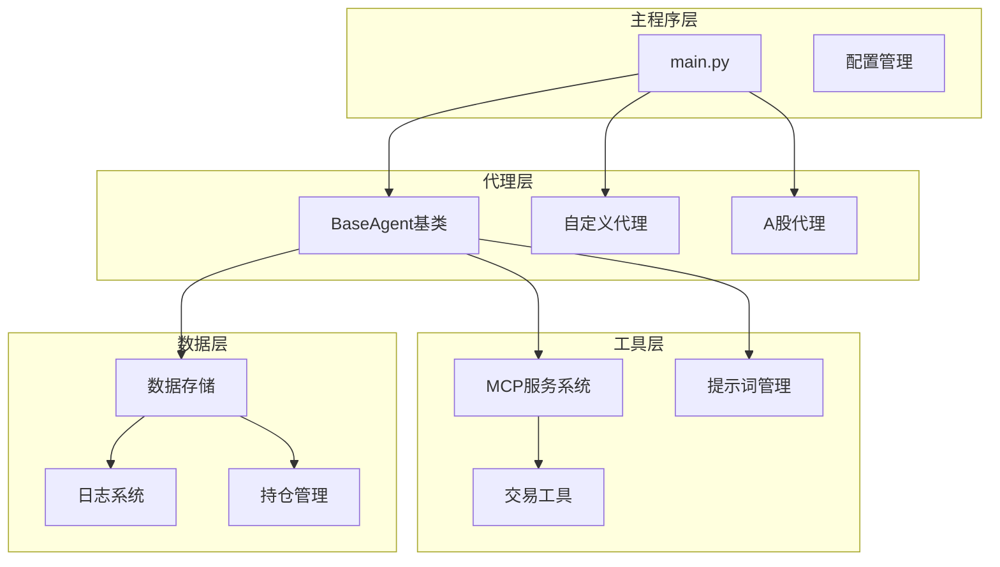
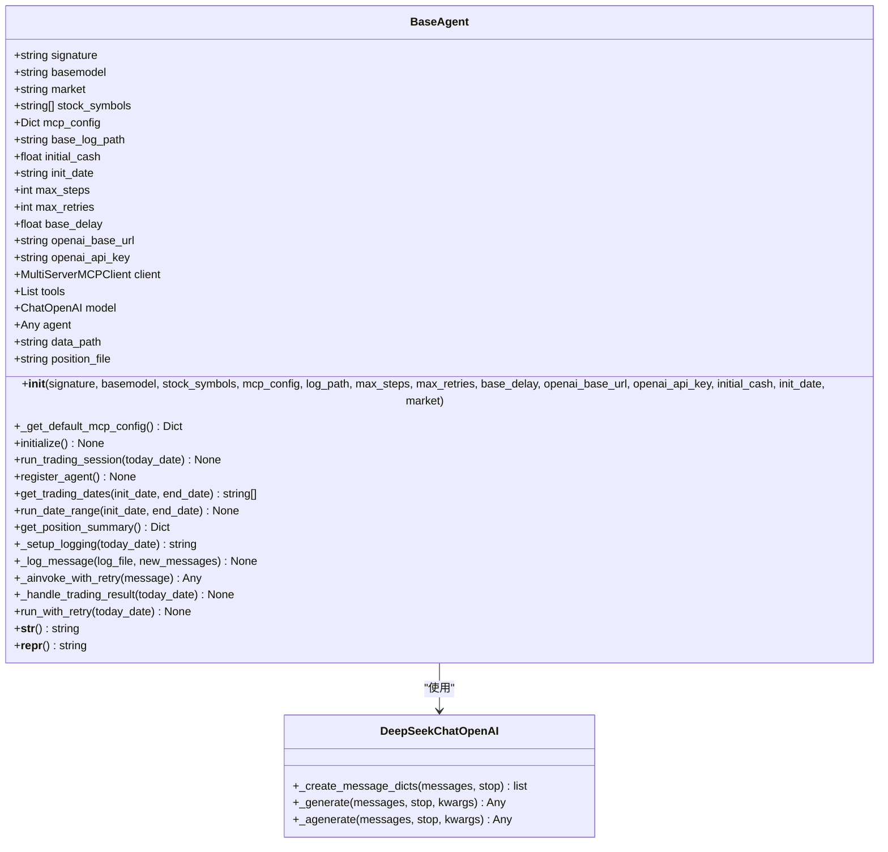
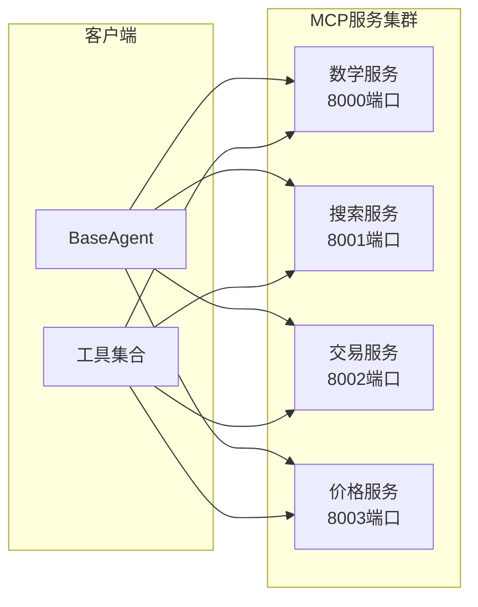

# 自定义代理开发指南

<cite>
**本文档引用的文件**
- [base_agent.py](file://agent/base_agent/base_agent.py)
- [main.py](file://main.py)
- [default_config.json](file://configs/default_config.json)
- [agent_prompt.py](file://prompts/agent_prompt.py)
- [start_mcp_services.py](file://agent_tools/start_mcp_services.py)
- [tool_math.py](file://agent_tools/tool_math.py)
- [general_tools.py](file://tools/general_tools.py)
- [base_agent_astock.py](file://agent/base_agent_astock/base_agent_astock.py)
</cite>

## 目录
1. [简介](#简介)
2. [项目架构概览](#项目架构概览)
3. [BaseAgent核心类分析](#baseagent核心类分析)
4. [创建自定义代理的完整流程](#创建自定义代理的完整流程)
5. [MCP服务系统详解](#mcp服务系统详解)
6. [配置管理与环境变量](#配置管理与环境变量)
7. [常见错误排查](#常见错误排查)
8. [最佳实践与优化建议](#最佳实践与优化建议)
9. [总结](#总结)

## 简介

AI-Trader是一个基于人工智能的自动化交易系统，采用模块化设计，支持多种市场和交易策略。本指南将详细介绍如何通过继承BaseAgent类创建自定义交易代理，包括核心方法的使用、配置管理、MCP服务集成以及常见问题的解决方案。

## 项目架构概览

系统采用分层架构设计，主要包含以下核心组件：



**图表来源**
- [main.py](file://main.py#L1-L50)
- [base_agent.py](file://agent/base_agent/base_agent.py#L1-L100)

## BaseAgent核心类分析

### 类结构与继承关系



**图表来源**
- [base_agent.py](file://agent/base_agent/base_agent.py#L80-L320)

### 核心方法详解

#### 1. `__init__` 方法

构造函数负责初始化代理的基本属性和配置：

**关键参数说明：**
- `signature`: 代理标识符，用于区分不同实例
- `basemodel`: 基础模型名称，如"gpt-4"、"claude-3.7-sonnet"
- `stock_symbols`: 股票代码列表，默认根据市场类型自动选择
- `mcp_config`: MCP工具配置字典
- `log_path`: 日志存储路径
- `max_steps`: 最大推理步数
- `max_retries`: 最大重试次数
- `base_delay`: 基础延迟时间
- `openai_api_key`: API密钥
- `initial_cash`: 初始资金
- `init_date`: 初始化日期
- `market`: 市场类型（"us"或"cn"）

**节来源**
- [base_agent.py](file://agent/base_agent/base_agent.py#L130-L286)

#### 2. `_get_default_mcp_config` 方法

返回默认的MCP服务配置，包含四个核心服务：

| 服务名称 | 默认端口 | 功能描述 |
|---------|---------|----------|
| math | 8000 | 数学计算服务 |
| stock_local | 8003 | 本地股票价格查询 |
| search | 8004 | 信息搜索服务 |
| trade | 8002 | 交易执行服务 |

**节来源**
- [base_agent.py](file://agent/base_agent/base_agent.py#L288-L315)

#### 3. `initialize` 方法

异步初始化方法，负责建立MCP连接和AI模型：

**初始化流程：**
1. 验证OpenAI API配置
2. 创建MCP客户端连接
3. 加载可用工具
4. 初始化AI模型（支持DeepSeek特殊处理）
5. 设置日志路径

**节来源**
- [base_agent.py](file://agent/base_agent/base_agent.py#L317-L380)

#### 4. `run_trading_session` 方法

单日交易会话的核心执行逻辑：

**执行步骤：**
1. 设置日志文件
2. 创建AI代理实例
3. 发送初始用户查询
4. 进入交易循环：
   - 调用AI代理
   - 处理响应结果
   - 提取工具消息
   - 更新对话历史
5. 处理交易结果

**节来源**
- [base_agent.py](file://agent/base_agent/base_agent.py#L382-L470)

### 数据管理与存储

#### 位置文件结构

系统使用JSON Lines格式存储交易数据：

```json
{
  "date": "2025-10-13",
  "id": 0,
  "positions": {
    "NVDA": 10,
    "MSFT": 5,
    "CASH": 10000.0
  }
}
```

#### 日志管理系统

采用分层目录结构：
- `./data/agent_data/{signature}/log/{date}/log.jsonl`
- `./data/agent_data/{signature}/position/position.jsonl`

**节来源**
- [base_agent.py](file://agent/base_agent/base_agent.py#L382-L470)

## 创建自定义代理的完整流程

### 步骤1：创建代理类

```python
# 示例：创建CustomAgent类
class CustomAgent(BaseAgent):
    def __init__(self, signature: str, basemodel: str, **kwargs):
        super().__init__(signature, basemodel, **kwargs)
        # 自定义初始化逻辑
        self.custom_param = kwargs.get('custom_param', 'default_value')
        
    async def initialize(self):
        # 重写初始化逻辑
        print(f"自定义初始化: {self.signature}")
        await super().initialize()
        # 添加自定义初始化步骤
        await self._custom_setup()
    
    async def _custom_setup(self):
        # 自定义设置逻辑
        print("执行自定义设置...")
```

### 步骤2：注册新代理

在`main.py`的`AGENT_REGISTRY`中添加新代理：

```python
# 在main.py中添加
AGENT_REGISTRY = {
    "BaseAgent": {
        "module": "agent.base_agent.base_agent",
        "class": "BaseAgent"
    },
    "BaseAgentAStock": {
        "module": "agent.base_agent_astock.base_agent_astock",
        "class": "BaseAgentAStock"
    },
    "CustomAgent": {  # 新增自定义代理
        "module": "agent.custom.custom_agent",
        "class": "CustomAgent"
    },
}
```

### 步骤3：配置文件设置

```json
{
  "agent_type": "CustomAgent",
  "models": [
    {
      "name": "custom-strategy",
      "basemodel": "gpt-4",
      "signature": "custom-agent-001",
      "enabled": true,
      "custom_param": "my_custom_value"
    }
  ]
}
```

### 步骤4：实现自定义策略

```python
async def run_trading_session(self, today_date: str) -> None:
    # 自定义交易逻辑
    print(f"执行自定义策略: {today_date}")
    
    # 获取当前持仓
    current_positions = self.get_current_positions()
    
    # 实现自定义决策逻辑
    for symbol in self.stock_symbols:
        # 自定义选股逻辑
        if self.should_buy(symbol, today_date):
            await self.execute_buy(symbol, quantity=10)
        elif self.should_sell(symbol, today_date):
            await self.execute_sell(symbol, quantity=5)
    
    # 调用父类方法完成标准流程
    await super().run_trading_session(today_date)
```

## MCP服务系统详解

### 服务架构



**图表来源**
- [start_mcp_services.py](file://agent_tools/start_mcp_services.py#L20-L46)

### 启动MCP服务

使用提供的脚本启动所有MCP服务：

```bash
python agent_tools/start_mcp_services.py
```

**服务配置选项：**
- `MATH_HTTP_PORT`: 数学服务端口（默认8000）
- `SEARCH_HTTP_PORT`: 搜索服务端口（默认8001）
- `TRADE_HTTP_PORT`: 交易服务端口（默认8002）
- `GETPRICE_HTTP_PORT`: 价格服务端口（默认8003）

**节来源**
- [start_mcp_services.py](file://agent_tools/start_mcp_services.py#L1-L46)

### 自定义MCP工具

```python
# 创建自定义MCP工具
from fastmcp import FastMCP

mcp = FastMCP("CustomTool")

@mcp.tool()
def custom_analysis(param1: str, param2: float) -> dict:
    """执行自定义分析"""
    # 实现分析逻辑
    result = {
        "analysis": "custom_analysis_result",
        "confidence": 0.95,
        "recommendation": "buy" if param2 > 100 else "hold"
    }
    return result

if __name__ == "__main__":
    port = int(os.getenv("CUSTOM_HTTP_PORT", "8005"))
    mcp.run(transport="streamable-http", port=port)
```

**节来源**
- [tool_math.py](file://agent_tools/tool_math.py#L1-L45)

## 配置管理与环境变量

### 环境变量配置

| 变量名 | 默认值 | 描述 |
|--------|--------|------|
| OPENAI_API_KEY | - | OpenAI API密钥 |
| OPENAI_API_BASE | https://api.openai.com/v1 | OpenAI API基础URL |
| MATH_HTTP_PORT | 8000 | 数学服务端口 |
| SEARCH_HTTP_PORT | 8001 | 搜索服务端口 |
| TRADE_HTTP_PORT | 8002 | 交易服务端口 |
| GETPRICE_HTTP_PORT | 8003 | 价格服务端口 |

### 配置文件结构

```json
{
  "agent_type": "BaseAgent",
  "market": "us",
  "date_range": {
    "init_date": "2025-10-01",
    "end_date": "2025-10-21"
  },
  "models": [...],
  "agent_config": {
    "max_steps": 30,
    "max_retries": 3,
    "base_delay": 1.0,
    "initial_cash": 10000.0
  },
  "log_config": {
    "log_path": "./data/agent_data"
  }
}
```

**节来源**
- [default_config.json](file://configs/default_config.json#L1-L53)

### 运行时配置管理

系统使用运行时环境文件管理动态配置：

```python
# 配置读取
config_value = get_config_value("TODAY_DATE")

# 配置写入
write_config_value("IF_TRADE", True)
```

**节来源**
- [general_tools.py](file://tools/general_tools.py#L1-L171)

## 常见错误排查

### 1. MCP服务未启动

**错误现象：**
```
❌ Failed to initialize MCP client: Connection refused
   Please ensure MCP services are running at the configured ports.
   Run: python agent_tools/start_mcp_services.py
```

**解决方案：**
```bash
# 启动MCP服务
cd /path/to/AI-Trader
python agent_tools/start_mcp_services.py

# 或检查端口占用
netstat -an | grep :8000
```

### 2. 模型API密钥缺失

**错误现象：**
```
❌ OpenAI API key not set. Please configure OPENAI_API_KEY in environment or config file.
```

**解决方案：**
```bash
# 设置环境变量
export OPENAI_API_KEY="your-api-key-here"

# 或在.env文件中配置
echo "OPENAI_API_KEY=your-api-key-here" > .env
```

### 3. 位置文件冲突

**错误现象：**
```
⚠️ Position file ./data/agent_data/custom-agent/position/position.jsonl already exists, skipping registration
```

**解决方案：**
```bash
# 删除现有位置文件重新注册
rm ./data/agent_data/custom-agent/position/position.jsonl
# 或修改signature避免冲突
```

### 4. 市场参数配置错误

**错误现象：**
```python
# 错误的市场配置
agent = CustomAgent(signature="test", basemodel="gpt-4", market="invalid")
```

**正确配置：**
```python
# US市场
agent = CustomAgent(signature="test", basemodel="gpt-4", market="us")

# A股市场  
agent = CustomAgent(signature="test", basemodel="gpt-4", market="cn")
```

### 5. 依赖包缺失

**常见缺失包：**
- langchain
- langchain-core
- langchain-mcp-adapters
- langchain-openai
- fastmcp

**安装命令：**
```bash
pip install langchain langchain-core langchain-mcp-adapters langchain-openai fastmcp
```

## 最佳实践与优化建议

### 1. 性能优化

**批量操作优化：**
```python
async def optimize_batch_operations(self):
    # 批量获取价格数据
    prices = await self.get_multiple_prices(self.stock_symbols)
    
    # 批量执行交易决策
    actions = await self.analyze_multiple_stocks(prices)
    
    # 批量执行交易
    await self.execute_batch_actions(actions)
```

**缓存机制：**
```python
from functools import lru_cache

@lru_cache(maxsize=100)
def cached_price_fetch(self, symbol: str, date: str):
    # 缓存价格查询结果
    return self.fetch_price(symbol, date)
```

### 2. 错误处理

**优雅降级：**
```python
async def safe_execute_with_fallback(self, primary_func, fallback_func, *args):
    try:
        return await primary_func(*args)
    except Exception as e:
        print(f"Primary execution failed: {e}")
        return await fallback_func(*args)
```

**重试机制：**
```python
async def robust_api_call(self, api_func, max_retries=3):
    for attempt in range(max_retries):
        try:
            return await api_func()
        except Exception as e:
            if attempt == max_retries - 1:
                raise
            await asyncio.sleep(2 ** attempt)  # 指数退避
```

### 3. 日志记录

**结构化日志：**
```python
def log_trading_decision(self, symbol: str, action: str, reason: str, confidence: float):
    log_entry = {
        "timestamp": datetime.now().isoformat(),
        "agent": self.signature,
        "symbol": symbol,
        "action": action,
        "reason": reason,
        "confidence": confidence,
        "portfolio_value": self.calculate_portfolio_value()
    }
    
    self._log_message(self.current_log_file, [log_entry])
```

### 4. 测试策略

**单元测试模板：**
```python
import unittest
from unittest.mock import AsyncMock, patch

class TestCustomAgent(unittest.TestCase):
    def setUp(self):
        self.agent = CustomAgent(
            signature="test",
            basemodel="gpt-4",
            stock_symbols=["AAPL", "MSFT"]
        )
    
    @patch('agent.base_agent.base_agent.MultiServerMCPClient')
    async def test_initialization(self, mock_client):
        # 测试初始化过程
        await self.agent.initialize()
        self.assertIsNotNone(self.agent.client)
        self.assertIsNotNone(self.agent.model)
```

### 5. 部署建议

**生产环境配置：**
```json
{
  "agent_config": {
    "max_steps": 50,
    "max_retries": 5,
    "base_delay": 2.0,
    "initial_cash": 100000.0
  },
  "log_config": {
    "log_path": "/production/logs/agent_data"
  }
}
```

**监控指标：**
- 交易成功率
- 平均响应时间
- 错误率统计
- 资产组合表现

## 总结

本指南详细介绍了如何在AI-Trader系统中创建和部署自定义交易代理。通过继承BaseAgent类，开发者可以：

1. **灵活定制交易策略**：重写核心方法实现个性化交易逻辑
2. **集成MCP服务生态**：利用丰富的工具生态系统扩展功能
3. **完善配置管理体系**：通过环境变量和配置文件实现灵活部署
4. **构建健壮的错误处理**：确保系统稳定性和可靠性
5. **优化性能和可维护性**：遵循最佳实践提升代码质量

关键要点：
- 正确配置MCP服务是系统正常运行的基础
- 合理设计初始化逻辑确保代理状态一致性
- 完善的日志记录有助于调试和监控
- 充分测试验证自定义逻辑的正确性
- 遵循系统架构规范保持代码可维护性

通过本指南的学习，开发者应该能够成功创建功能完善的自定义交易代理，并将其集成到AI-Trader系统中进行实际应用。