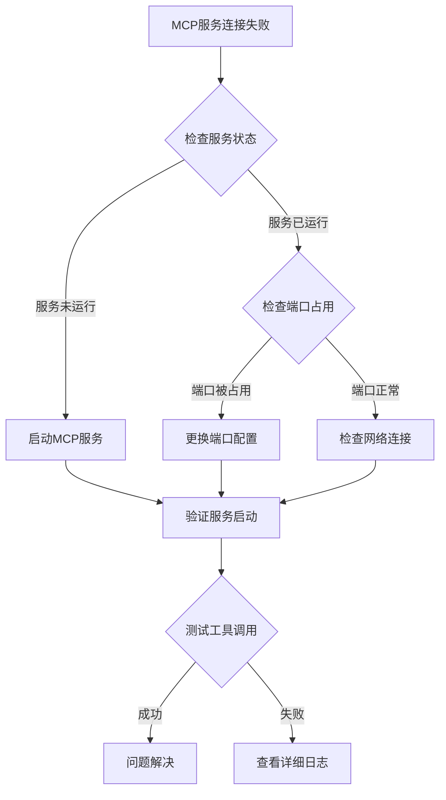
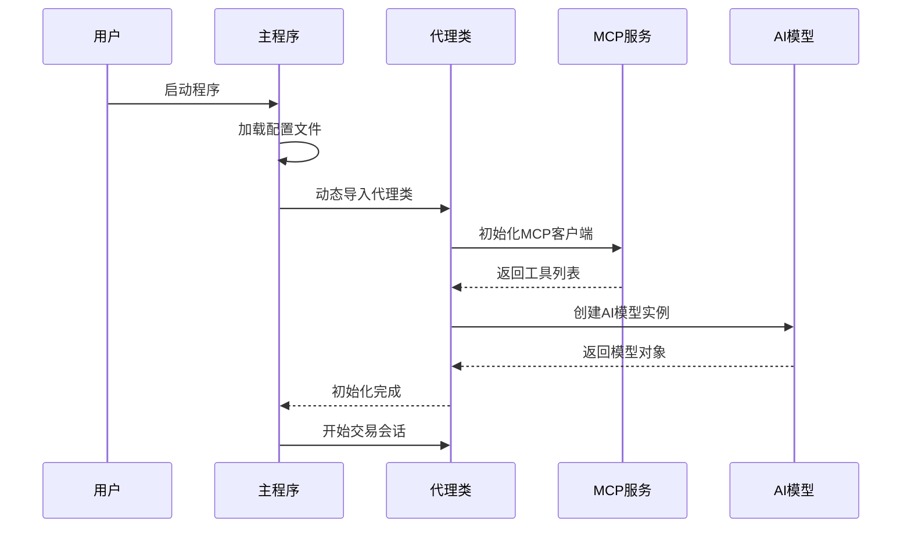
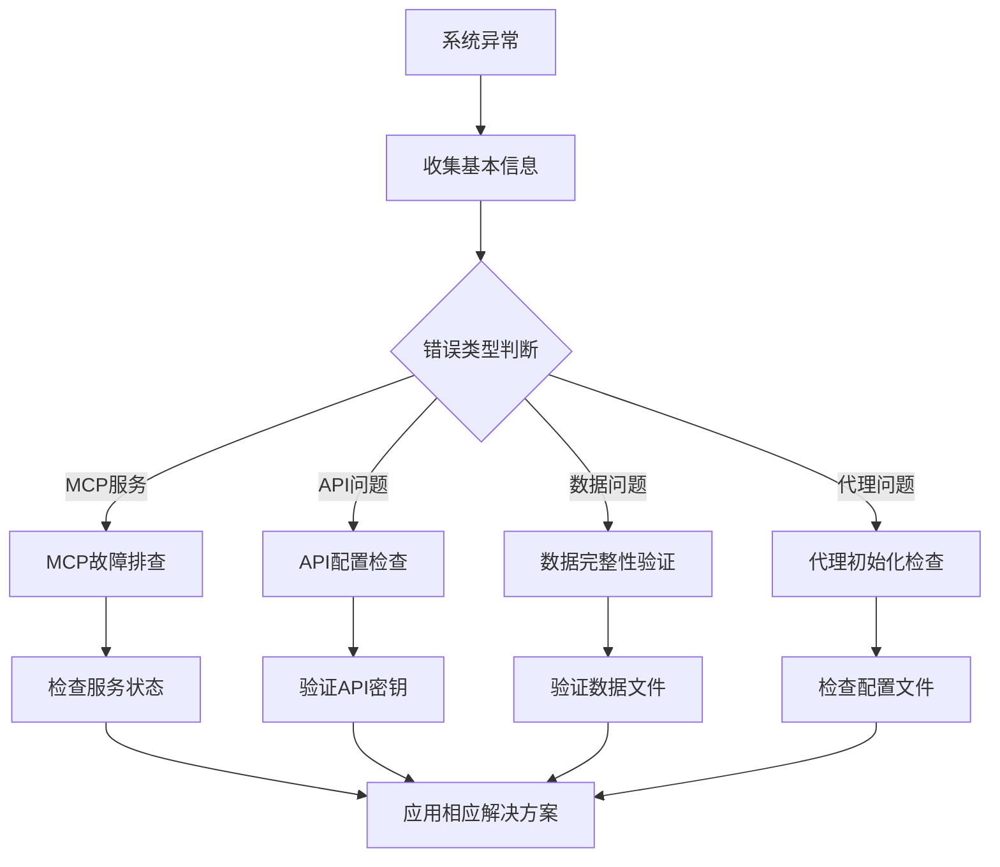

# 故障排除指南

<cite>
**本文档中引用的文件**
- [README.md](file://README.md)
- [main.py](file://main.py)
- [agent/base_agent/base_agent.py](file://agent/base_agent/base_agent.py)
- [agent_tools/start_mcp_services.py](file://agent_tools/start_mcp_services.py)
- [agent_tools/tool_trade.py](file://agent_tools/tool_trade.py)
- [agent_tools/tool_get_price_local.py](file://agent_tools/tool_get_price_local.py)
- [agent_tools/tool_jina_search.py](file://agent_tools/tool_jina_search.py)
- [tools/general_tools.py](file://tools/general_tools.py)
- [configs/default_config.json](file://configs/default_config.json)
- [requirements.txt](file://requirements.txt)
- [data/get_daily_price.py](file://data/get_daily_price.py)
- [scripts/main.sh](file://scripts/main.sh)
</cite>

## 目录
1. [简介](#简介)
2. [常见问题分类](#常见问题分类)
3. [MCP服务相关问题](#mcp服务相关问题)
4. [API密钥配置问题](#api密钥配置问题)
5. [数据文件问题](#数据文件问题)
6. [代理初始化问题](#代理初始化问题)
7. [日志分析与调试](#日志分析与调试)
8. [性能优化建议](#性能优化建议)
9. [故障排除流程](#故障排除流程)
10. [预防措施](#预防措施)

## 简介

AI-Trader是一个基于人工智能的自动化交易系统，采用模型上下文协议(MCP)工具链实现完全自主的市场交易。本指南旨在帮助用户快速识别、诊断和解决系统运行过程中遇到的各种问题。

## 常见问题分类

### 系统级问题
- MCP服务无法连接
- 端口冲突或占用
- 环境变量配置错误
- 依赖包版本不兼容

### 数据相关问题
- API密钥无效或过期
- 数据文件缺失或损坏
- 网络连接问题
- 数据格式不匹配

### 代理执行问题
- 初始化失败
- 工具调用异常
- 交易决策错误
- 日志记录异常

## MCP服务相关问题

### 问题描述
MCP服务是AI-Trader的核心组件，负责提供各种交易工具功能。如果MCP服务无法正常启动或连接，整个系统将无法工作。

### 常见症状
- "Failed to initialize MCP client" 错误
- "MCP services may not be running" 警告
- 端口连接超时
- 工具加载失败

### 解决方案

#### 1. 检查MCP服务状态
```bash
# 查看MCP服务运行状态
python agent_tools/start_mcp_services.py status
```

#### 2. 启动MCP服务
```bash
# 启动所有MCP服务
python agent_tools/start_mcp_services.py
```

#### 3. 检查端口配置
确认以下端口是否可用：
- Math服务: 8000 (MATH_HTTP_PORT)
- Search服务: 8001 (SEARCH_HTTP_PORT)
- Trade服务: 8002 (TRADE_HTTP_PORT)
- Price服务: 8003 (GETPRICE_HTTP_PORT)

#### 4. 手动启动单个服务
```bash
# 启动数学计算服务
python agent_tools/tool_math.py

# 启动价格查询服务
python agent_tools/tool_get_price_local.py

# 启动搜索服务
python agent_tools/tool_jina_search.py

# 启动交易服务
python agent_tools/tool_trade.py
```

### 诊断步骤



**图表来源**
- [agent_tools/start_mcp_services.py](file://agent_tools/start_mcp_services.py#L250-L293)

**章节来源**
- [agent_tools/start_mcp_services.py](file://agent_tools/start_mcp_services.py#L1-L293)

## API密钥配置问题

### 问题描述
AI-Trader需要多个API密钥才能正常运行，包括OpenAI API、Alpha Vantage、Jina AI等。

### 常见症状
- "OpenAI API key not set" 错误
- "Jina API key not provided" 错误
- "Alpha Vantage API key invalid" 错误
- 认证失败或权限不足

### 解决方案

#### 1. 创建环境配置文件
```bash
# 复制示例配置文件
cp .env.example .env

# 编辑配置文件
nano .env
```

#### 2. 配置必需的API密钥
```bash
# AI模型API配置
OPENAI_API_BASE=https://your-openai-proxy.com/v1
OPENAI_API_KEY=your_openai_key_here

# 数据源配置
ALPHAADVANTAGE_API_KEY=your_alpha_vantage_key
JINA_API_KEY=your_jina_api_key
TUSHARE_TOKEN=your_tushare_token  # 可选，用于A股数据

# 系统配置
RUNTIME_ENV_PATH=./runtime_env.json
```

#### 3. 验证配置
```bash
# 检查环境变量是否正确加载
python -c "import os; print(os.getenv('OPENAI_API_KEY'))"
```

### 支持的API提供商

| 服务类型 | 必需性 | 获取方式 | 用途 |
|---------|--------|----------|------|
| OpenAI API | 必需 | 注册OpenAI账户 | AI模型推理 |
| Alpha Vantage | 必需 | 注册免费账户 | 美股历史数据 |
| Jina AI | 必需 | 注册免费账户 | 市场信息搜索 |
| Tushare | 可选 | 注册专业版 | A股市场数据 |

**章节来源**
- [README.md](file://README.md#L400-L450)
- [main.py](file://main.py#L180-L200)

## 数据文件问题

### 问题描述
AI-Trader依赖于预处理的市场数据文件，如果这些文件缺失或损坏，系统将无法正常运行。

### 常见症状
- "Data file not found" 错误
- "Configuration file does not exist" 错误
- "JSON format error" 错误
- 数据读取失败

### 解决方案

#### 1. 检查数据目录结构
```
data/
├── merged.jsonl          # 统一格式的美股数据
├── agent_data/           # 代理交易记录
│   └── {signature}/
│       ├── position/
│       │   └── position.jsonl
│       └── log/
└── A_stock/             # A股市场数据
    ├── merged.jsonl     # 统一格式的A股数据
    ├── daily_prices_sse_50.csv
    └── index_daily_sse_50.json
```

#### 2. 获取数据文件

##### 美股数据获取
```bash
# 下载美股价格数据
cd data
python get_daily_price.py

# 合并数据为统一格式
python merge_jsonl.py
```

##### A股数据获取
```bash
# 下载A股价格数据
cd data/A_stock
python get_daily_price_a_stock.py

# 合并A股数据
python merge_a_stock_jsonl.py
```

#### 3. 验证数据完整性
```bash
# 检查数据文件是否存在
ls -la data/

# 验证JSON格式
python -m json.tool data/merged.jsonl
```

### 数据文件说明

| 文件名 | 类型 | 描述 | 必需性 |
|--------|------|------|--------|
| merged.jsonl | 数据文件 | 统一格式的市场数据 | 必需 |
| position.jsonl | 记录文件 | 交易持仓记录 | 必需 |
| log.jsonl | 日志文件 | 交易过程日志 | 可选 |
| .runtime_env.json | 配置文件 | 运行时配置 | 必需 |

**章节来源**
- [data/get_daily_price.py](file://data/get_daily_price.py#L1-L138)
- [README.md](file://README.md#L300-L350)

## 代理初始化问题

### 问题描述
AI代理在启动时需要进行多项初始化操作，包括MCP客户端连接、AI模型加载、配置验证等。

### 常见症状
- "Unable to import agent module" 错误
- "Unsupported agent type" 错误
- "Failed to initialize AI model" 错误
- 配置加载失败

### 解决方案

#### 1. 检查代理类型配置
```json
{
  "agent_type": "BaseAgent",  // 或 "BaseAgentAStock"
  "market": "us",            // 或 "cn"
  "models": [...]
}
```

#### 2. 验证模块导入
```python
# 检查代理类是否可导入
from agent.base_agent.base_agent import BaseAgent
from agent.base_agent_astock.base_agent_astock import BaseAgentAStock
```

#### 3. 配置验证
```bash
# 使用默认配置测试
python main.py configs/default_config.json

# 使用A股配置测试
python main.py configs/astock_config.json
```

### 初始化流程图



**图表来源**
- [main.py](file://main.py#L25-L50)
- [agent/base_agent/base_agent.py](file://agent/base_agent/base_agent.py#L200-L250)

**章节来源**
- [main.py](file://main.py#L25-L100)
- [agent/base_agent/base_agent.py](file://agent/base_agent/base_agent.py#L200-L300)

## 日志分析与调试

### 日志文件位置
AI-Trader的日志系统分为多个层次，便于问题诊断：

```
data/agent_data/
├── {signature}/
│   ├── position/           # 交易持仓记录
│   │   └── position.jsonl
│   └── log/
│       └── {date}/
│           └── log.jsonl   # 交易过程日志
└── .runtime_env.json       # 运行时配置
```

### 日志内容分析

#### 1. 交易日志结构
```json
{
  "signature": "claude-3.7-sonnet",
  "new_messages": [
    {
      "role": "assistant",
      "content": "AI分析结果和决策过程"
    },
    {
      "role": "user",
      "content": "工具调用结果"
    }
  ]
}
```

#### 2. 关键错误模式
- **工具调用失败**: 检查工具返回的错误信息
- **AI响应异常**: 分析助手消息的内容和格式
- **交易决策错误**: 查看买卖指令的具体原因
- **数据访问错误**: 检查价格查询和时间戳

#### 3. 调试技巧

##### 启用详细日志
```python
# 在代码中添加调试输出
import logging
logging.basicConfig(level=logging.DEBUG)
```

##### 分析错误堆栈
```bash
# 查看最近的错误日志
tail -n 100 data/agent_data/{signature}/log/{date}/log.jsonl

# 搜索特定错误模式
grep -i "error\|exception\|failed" data/agent_data/{signature}/log/{date}/log.jsonl
```

### 性能监控

#### 1. 交易频率分析
```python
# 分析每日交易次数
import json
with open("position.jsonl", "r") as f:
    trades = [line for line in f if "this_action" in line]
    print(f"总交易次数: {len(trades)}")
```

#### 2. 决策链追踪
```python
# 提取AI决策过程
from tools.general_tools import extract_conversation

# 分析特定会话的决策链
conversation = {...}  # 从日志中提取
decision = extract_conversation(conversation, "final")
```

**章节来源**
- [tools/general_tools.py](file://tools/general_tools.py#L50-L120)
- [agent/base_agent/base_agent.py](file://agent/base_agent/base_agent.py#L370-L420)

## 性能优化建议

### 系统级优化

#### 1. 资源配置
- **内存使用**: 确保系统有足够的内存处理大型数据集
- **CPU性能**: 使用多核处理器加速AI推理
- **网络带宽**: 确保稳定的网络连接用于API调用

#### 2. 并发控制
```json
{
  "agent_config": {
    "max_steps": 30,
    "max_retries": 3,
    "base_delay": 1.0
  }
}
```

#### 3. 缓存策略
- 利用MCP服务的本地缓存机制
- 实现自定义的数据缓存层
- 优化API调用频率

### 算法级优化

#### 1. 交易策略优化
- 调整最大步数限制
- 优化重试机制参数
- 实现智能等待策略

#### 2. 数据处理优化
```python
# 使用更高效的数据结构
from collections import defaultdict

# 优化持仓记录处理
positions = defaultdict(float)
```

### 监控指标

| 指标类型 | 监控项目 | 正常范围 | 告警阈值 |
|---------|----------|----------|----------|
| 性能指标 | 单次交易耗时 | < 30秒 | > 60秒 |
| 资源指标 | 内存使用率 | < 80% | > 90% |
| 错误指标 | 失败率 | < 5% | > 10% |
| 业务指标 | 交易成功率 | > 80% | < 60% |

## 故障排除流程

### 1. 问题识别阶段



### 2. 诊断工具清单

#### 核心诊断命令
```bash
# 1. 系统状态检查
python agent_tools/start_mcp_services.py status

# 2. 配置验证
python main.py --dry-run

# 3. 日志分析
tail -f data/agent_data/*/log/*/log.jsonl

# 4. 网络连通性测试
curl -I http://localhost:8000/mcp
```

#### 自动化诊断脚本
```bash
#!/bin/bash
# AI-Trader诊断脚本

echo "=== AI-Trader系统诊断 ==="
echo "1. 检查MCP服务状态"
python agent_tools/start_mcp_services.py status

echo "2. 检查API密钥配置"
echo "OPENAI_API_KEY: ${OPENAI_API_KEY:+已设置}"
echo "ALPHAADVANTAGE_API_KEY: ${ALPHAADVANTAGE_API_KEY:+已设置}"
echo "JINA_API_KEY: ${JINA_API_KEY:+已设置}"

echo "3. 检查数据文件"
ls -la data/merged.jsonl 2>/dev/null || echo "数据文件缺失"

echo "4. 检查Python环境"
python --version
pip list | grep -E "(langchain|fastmcp)"
```

### 3. 解决方案优先级

| 优先级 | 问题类型 | 解决方案 | 预期效果 |
|--------|----------|----------|----------|
| 1 | MCP服务不可用 | 重启MCP服务 | 系统恢复 |
| 2 | API密钥无效 | 更新配置文件 | 功能恢复 |
| 3 | 数据文件缺失 | 重新下载数据 | 数据完整 |
| 4 | 配置错误 | 修正配置文件 | 参数生效 |

## 预防措施

### 1. 系统监控
- 设置定期健康检查
- 监控资源使用情况
- 建立告警机制

### 2. 备份策略
```bash
# 定期备份重要文件
tar -czf backup_$(date +%Y%m%d).tar.gz data/agent_data/ configs/
```

### 3. 版本管理
- 使用Git跟踪配置变更
- 维护不同环境的配置文件
- 建立回滚机制

### 4. 文档维护
- 定期更新故障排除文档
- 记录常见问题解决方案
- 建立知识库系统

### 5. 测试流程
```bash
# 集成测试脚本
#!/bin/bash
# 测试AI-Trader核心功能

echo "开始集成测试..."

# 1. 启动MCP服务
python agent_tools/start_mcp_services.py &
MCP_PID=$!

# 2. 等待服务启动
sleep 5

# 3. 运行测试交易
python main.py --test-mode

# 4. 清理资源
kill $MCP_PID
```

通过遵循本故障排除指南，用户应该能够快速识别和解决AI-Trader系统中的大多数问题。如果遇到本指南未涵盖的问题，请参考项目的GitHub Issues页面或联系技术支持团队。