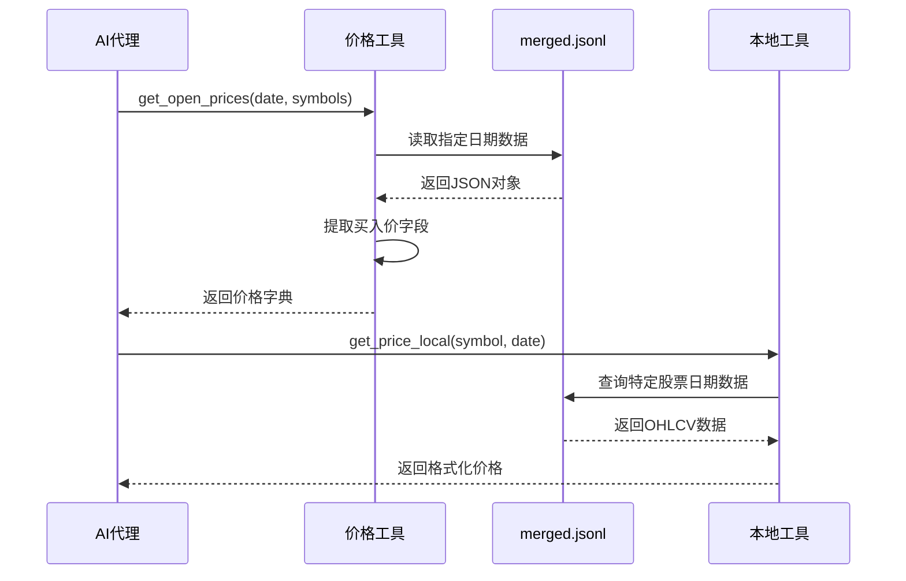

# 数据格式

<cite>
**本文档引用的文件**
- [merge_jsonl.py](file://data/merge_jsonl.py)
- [merge_a_stock_jsonl.py](file://data/A_stock/merge_a_stock_jsonl.py)
- [get_daily_price.py](file://data/get_daily_price.py)
- [get_daily_price_a_stock.py](file://data/A_stock/get_daily_price_a_stock.py)
- [price_tools.py](file://tools/price_tools.py)
- [tool_get_price_local.py](file://agent_tools/tool_get_price_local.py)
- [default_config.json](file://configs/default_config.json)
- [README.md](file://README.md)
</cite>

## 目录
1. [简介](#简介)
2. [项目架构概览](#项目架构概览)
3. [US股票数据格式](#us股票数据格式)
4. [A股数据格式](#a股数据格式)
5. [数据格式兼容性](#数据格式兼容性)
6. [AI代理使用说明](#ai代理使用说明)
7. [数据处理流程](#数据处理流程)
8. [性能考虑](#性能考虑)
9. [故障排除指南](#故障排除指南)
10. [总结](#总结)

## 简介

AI-Trader项目采用统一的merged.jsonl数据格式来支持美股(NASDAQ 100)和A股(SSE 50)市场的自动化交易。该格式设计遵循Alpha Vantage API标准结构，确保不同市场数据的无缝集成和AI代理的统一处理能力。

## 项目架构概览


**图表来源**
- [merge_jsonl.py](file://data/merge_jsonl.py#L1-L157)
- [merge_a_stock_jsonl.py](file://data/A_stock/merge_a_stock_jsonl.py#L1-L123)
- [price_tools.py](file://tools/price_tools.py#L1-L809)

## US股票数据格式

### 格式结构

US股票数据采用标准化的JSONL格式，每行包含单个股票的完整历史数据：

```json
{
  "Meta Data": {
    "1. Information": "Daily Prices (buy price, high, low, sell price) and Volumes",
    "2. Symbol": "AAPL",
    "3. Last Refreshed": "2025-01-20",
    "4. Output Size": "Compact",
    "5. Time Zone": "UTC"
  },
  "Time Series (Daily)": {
    "2025-01-20": {
      "1. buy price": "255.8850",
      "2. high": "264.3750",
      "3. low": "255.6300",
      "4. sell price": "262.2400",
      "5. volume": "90483029"
    }
  }
}
```

### 字段说明

| 字段路径 | 类型 | 描述 | 示例值 |
|---------|------|------|--------|
| `Meta Data.1. Information` | String | 数据信息描述 | "Daily Prices (buy price, high, low, sell price) and Volumes" |
| `Meta Data.2. Symbol` | String | 股票代码 | "AAPL" |
| `Meta Data.3. Last Refreshed` | String | 最后刷新日期 | "2025-01-20" |
| `Meta Data.5. Time Zone` | String | 时区信息 | "UTC" |
| `Time Series (Daily).date.1. buy price` | String | 开盘买入价 | "255.8850" |
| `Time Series (Daily).date.2. high` | String | 当日最高价 | "264.3750" |
| `Time Series (Daily).date.3. low` | String | 当日最低价 | "255.6300" |
| `Time Series (Daily).date.4. sell price` | String | 收盘卖出价 | "262.2400" |
| `Time Series (Daily).date.5. volume` | String | 成交量 | "90483029" |

### 关键特性

1. **字段重命名**: 将Alpha Vantage的原始字段重命名为更具语义化的名称
   - `"1. open"` → `"1. buy price"`
   - `"4. close"` → `"4. sell price"`

2. **最新交易日优化**: 仅保留最新交易日的买入价，防止未来信息泄露
   ```python
   # 最新日期仅保留买入价
   latest_date = max(series.keys())
   latest_bar = series.get(latest_date, {})
   series[latest_date] = {"1. buy price": buy_val} if buy_val is not None else {}
   ```

**节来源**
- [merge_jsonl.py](file://data/merge_jsonl.py#L115-L143)

## A股数据格式

### 格式结构

A股数据同样采用统一的JSONL格式，但针对中国市场的特殊需求进行了优化：

```json
{
  "Meta Data": {
    "1. Information": "Daily Prices (buy price, high, low, sell price) and Volumes",
    "2. Symbol": "600519.SH",
    "2.1. Name": "贵州茅台",
    "3. Last Refreshed": "2025-01-20",
    "4. Output Size": "Full",
    "5. Time Zone": "Asia/Shanghai"
  },
  "Time Series (Daily)": {
    "2025-01-20": {
      "1. buy price": "255.8850",
      "2. high": "264.3750",
      "3. low": "255.6300",
      "4. sell price": "262.2400",
      "5. volume": "9048302900"
    }
  }
}
```

### 特殊处理

1. **成交量单位转换**: 将手转换为股（1手=100股）
   ```python
   # A股成交量单位转换：手→股
   "5. volume": str(int(row["vol"] * 100)) if pd.notna(row["vol"]) else "0"
   ```

2. **股票名称映射**: 从权重文件中获取股票全称
   ```python
   # 从映射中获取股票名称
   stock_name = stock_name_map.get(ts_code, "Unknown")
   ```

3. **时区设置**: 明确标注Asia/Shanghai时区

**节来源**
- [merge_a_stock_jsonl.py](file://data/A_stock/merge_a_stock_jsonl.py#L70-L92)
- [merge_a_stock_jsonl.py](file://data/A_stock/merge_a_stock_jsonl.py#L91-L121)

## 数据格式兼容性

### Alpha Vantage标准兼容

merged.jsonl格式完全兼容Alpha Vantage API的标准结构：


**图表来源**
- [merge_jsonl.py](file://data/merge_jsonl.py#L115-L143)
- [merge_a_stock_jsonl.py](file://data/A_stock/merge_a_stock_jsonl.py#L91-L121)

### 字段映射关系

| Alpha Vantage字段 | US merged.jsonl | A-share merged.jsonl | 说明 |
|------------------|-----------------|---------------------|------|
| `"1. open"` | `"1. buy price"` | `"1. buy price"` | 开盘买入价 |
| `"2. high"` | `"2. high"` | `"2. high"` | 当日最高价 |
| `"3. low"` | `"3. low"` | `"3. low"` | 当日最低价 |
| `"4. close"` | `"4. sell price"` | `"4. sell price"` | 收盘卖出价 |
| `"5. volume"` | `"5. volume"` | `"5. volume"` | 成交量（A股已转换） |

## AI代理使用说明

### 价格查询接口

AI代理通过统一的价格查询接口访问数据：



**图表来源**
- [price_tools.py](file://tools/price_tools.py#L400-L450)
- [tool_get_price_local.py](file://agent_tools/tool_get_price_local.py#L117-L149)

### 数据访问模式

1. **批量价格查询**
   ```python
   # 获取多个股票的开盘价
   prices = get_open_prices("2025-01-20", ["AAPL", "MSFT", "GOOGL"])
   ```

2. **历史数据回溯**
   ```python
   # 获取昨日开盘价和收盘价
   buy_prices, sell_prices = get_yesterday_open_and_close_price(
       "2025-01-20", ["AAPL", "MSFT"]
   )
   ```

3. **实时价格查询**
   ```python
   # 查询当日价格（仅限买入价）
   price_data = get_price_local("AAPL", "2025-01-20")
   ```

**节来源**
- [price_tools.py](file://tools/price_tools.py#L400-L500)

## 数据处理流程

### US股票数据处理流程

```mermaid
flowchart TD
A[获取Alpha Vantage数据] --> B[检查文件名匹配]
B --> C{是否为纳指100成分股?}
C --> |否| D[跳过文件]
C --> |是| E[加载JSON数据]
E --> F[查找Time Series键]
F --> G[重命名字段]
G --> H[处理最新交易日]
H --> I[更新Meta Data]
I --> J[写入merged.jsonl]
G1["1. open" → "1. buy price"] --> G
G2["4. close" → "4. sell price"] --> G
H1[保留最新买入价] --> H
I1[添加信息描述] --> I
```

**图表来源**
- [merge_jsonl.py](file://data/merge_jsonl.py#L115-L143)

### A股数据处理流程


**图表来源**
- [merge_a_stock_jsonl.py](file://data/A_stock/merge_a_stock_jsonl.py#L70-L92)

## 性能考虑

### 文件大小优化

1. **增量更新**: 仅处理新增或修改的股票数据
2. **内存管理**: 流式处理避免大文件内存溢出
3. **压缩存储**: JSONL格式便于压缩和传输

### 查询性能优化

1. **索引策略**: 基于日期的快速查找
2. **缓存机制**: 频繁访问的数据缓存
3. **并行处理**: 多线程数据处理

### 存储空间优化

1. **字段精简**: 仅保留关键价格信息
2. **数据压缩**: 自动压缩减少存储空间
3. **清理策略**: 定期清理过期数据

## 故障排除指南

### 常见问题及解决方案

1. **文件不存在错误**
   ```
   Error: merged.jsonl file does not exist at {path}
   ```
   **解决方案**: 确保数据转换脚本已正确执行

2. **日期格式错误**
   ```
   Error: Invalid date format. Expected YYYY-MM-DD
   ```
   **解决方案**: 检查日期格式是否符合规范

3. **股票代码缺失**
   ```
   Error: No records found for stock {symbol}
   ```
   **解决方案**: 验证股票代码是否存在于数据集中

4. **API配额超限**
   ```
   Error: API rate limit exceeded
   ```
   **解决方案**: 检查API密钥配置和使用频率

### 调试技巧

1. **启用详细日志**: 设置环境变量控制日志级别
2. **数据验证**: 使用内置函数验证数据完整性
3. **逐步测试**: 分模块测试数据获取和转换功能

**节来源**
- [price_tools.py](file://tools/price_tools.py#L335-L373)

## 总结

AI-Trader项目的merged.jsonl数据格式设计体现了以下核心优势：

1. **统一性**: US和A股市场采用相同的数据格式，简化了AI代理开发
2. **兼容性**: 完全兼容Alpha Vantage标准，便于数据迁移和扩展
3. **优化性**: 针对不同市场特点进行专门优化，如A股成交量转换
4. **安全性**: 通过字段重命名和信息过滤防止未来信息泄露
5. **可扩展性**: 支持多种市场和数据源的灵活集成

该格式为AI代理提供了稳定可靠的数据基础，支持复杂的交易策略开发和性能评估。通过标准化的数据接口，实现了跨市场的统一管理和分析能力。