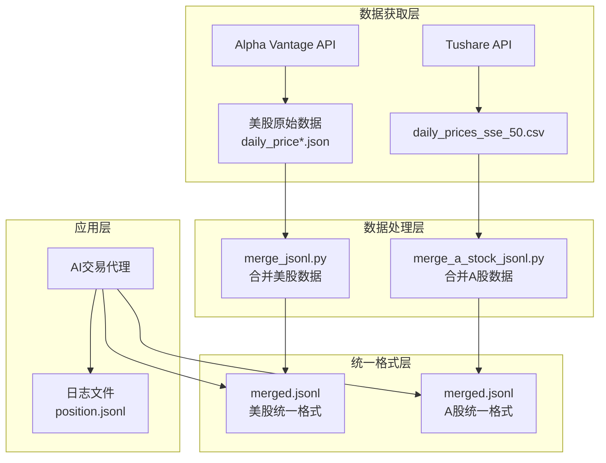
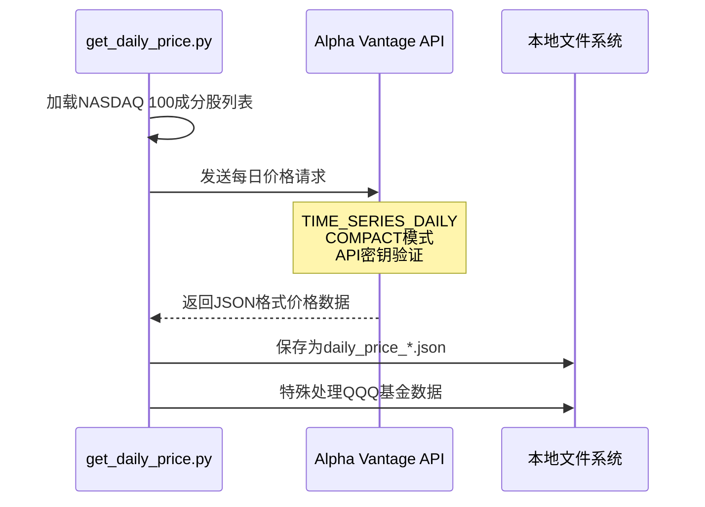
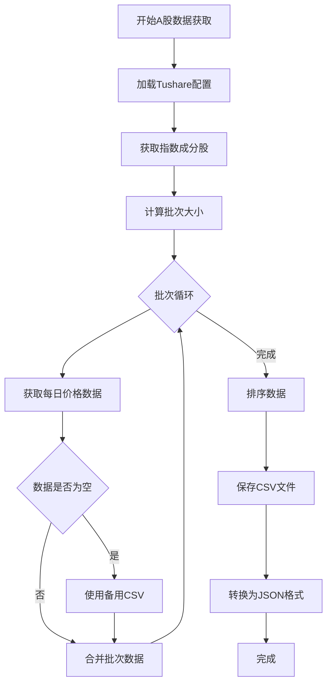
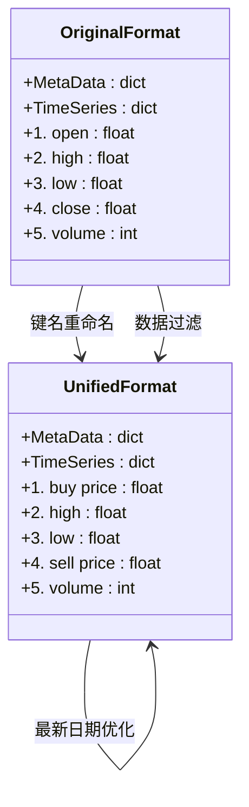
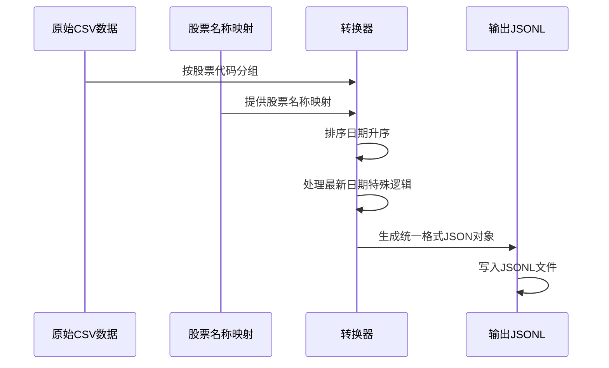
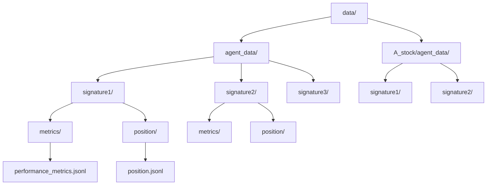
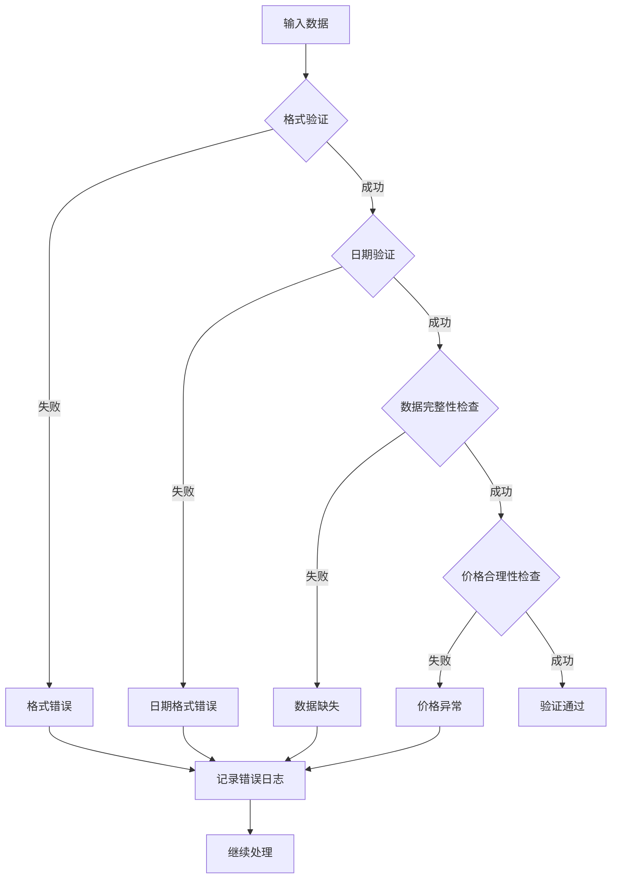

# 数据系统

<cite>
**本文档引用的文件**
- [get_daily_price.py](file://data/get_daily_price.py)
- [get_daily_price_a_stock.py](file://data/A_stock/get_daily_price_a_stock.py)
- [merge_jsonl.py](file://data/merge_jsonl.py)
- [merge_a_stock_jsonl.py](file://data/A_stock/merge_a_stock_jsonl.py)
- [main.sh](file://scripts/main.sh)
- [main_a_stock_step1.sh](file://scripts/main_a_stock_step1.sh)
- [default_config.json](file://configs/default_config.json)
- [general_tools.py](file://tools/general_tools.py)
- [price_tools.py](file://tools/price_tools.py)
- [result_tools.py](file://tools/result_tools.py)
- [tool_get_price_local.py](file://agent_tools/tool_get_price_local.py)
- [tool_trade.py](file://agent_tools/tool_trade.py)
</cite>

## 目录
1. [简介](#简介)
2. [数据架构概览](#数据架构概览)
3. [美股数据获取流程](#美股数据获取流程)
4. [A股数据获取流程](#a股数据获取流程)
5. [数据格式转换](#数据格式转换)
6. [position.jsonl文件结构](#positionjsonl文件结构)
7. [日志文件存储](#日志文件存储)
8. [数据验证与质量控制](#数据验证与质量控制)
9. [使用指南](#使用指南)
10. [故障排除](#故障排除)

## 简介

AI-Trader数据系统是一个完整的金融数据处理框架，负责从多个数据源获取、转换和管理股票市场数据。该系统支持美股（NASDAQ 100）和A股（SSE 50）两个主要市场的数据处理，为AI交易代理提供标准化的市场数据接口。

系统的核心功能包括：
- 从Alpha Vantage API获取美股历史价格数据
- 从Tushare API获取A股历史价格数据
- 将原始数据转换为统一的JSONL格式
- 管理交易日志和持仓记录
- 提供数据验证和质量控制机制

## 数据架构概览



**图表来源**
- [get_daily_price.py](file://data/get_daily_price.py#L1-L139)
- [get_daily_price_a_stock.py](file://data/A_stock/get_daily_price_a_stock.py#L1-L272)
- [merge_jsonl.py](file://data/merge_jsonl.py#L1-L157)
- [merge_a_stock_jsonl.py](file://data/A_stock/merge_a_stock_jsonl.py#L1-L123)

## 美股数据获取流程

### 数据源和API配置

美股数据通过Alpha Vantage API获取，系统预定义了NASDAQ 100指数的所有成分股：



**图表来源**
- [get_daily_price.py](file://data/get_daily_price.py#L70-L85)

### 关键特性

1. **自动化批量获取**：系统自动遍历所有NASDAQ 100成分股
2. **错误处理机制**：检测API限制和网络错误
3. **特殊符号处理**：QQQ基金数据单独处理
4. **数据完整性检查**：验证返回数据的有效性

**章节来源**
- [get_daily_price.py](file://data/get_daily_price.py#L70-L139)

## A股数据获取流程

### 数据源和API配置

A股数据通过Tushare API获取，支持SSE 50指数成分股的历史价格数据：



**图表来源**
- [get_daily_price_a_stock.py](file://data/A_stock/get_daily_price_a_stock.py#L40-L120)

### 核心功能特性

1. **智能批次处理**：根据API限制动态调整数据获取批次
2. **备用数据源**：当API返回空数据时使用CSV备份
3. **时间序列转换**：将Tushare格式转换为Alpha Vantage兼容格式
4. **数据验证**：确保数据完整性和格式正确性

**章节来源**
- [get_daily_price_a_stock.py](file://data/A_stock/get_daily_price_a_stock.py#L40-L272)

## 数据格式转换

### 美股数据转换流程

系统将Alpha Vantage原始数据转换为统一的JSONL格式：



**图表来源**
- [merge_jsonl.py](file://data/merge_jsonl.py#L50-L100)

### A股数据转换流程

A股数据转换涉及更复杂的格式映射和数据处理：



**图表来源**
- [merge_a_stock_jsonl.py](file://data/A_stock/merge_a_stock_jsonl.py#L20-L80)

### 格式转换规则

| 字段类型 | 原始字段 | 转换后字段 | 处理逻辑 |
|---------|----------|-----------|----------|
| 价格数据 | 1. open | 1. buy price | 买入价格标识 |
| 价格数据 | 4. close | 4. sell price | 卖出价格标识 |
| 时间序列 | 最新日期 | 仅保留买入价 | 防止未来信息泄露 |
| 交易量 | vol | volume | 单位转换（手→股） |
| 元数据 | symbol | symbol + name | 添加股票名称 |

**章节来源**
- [merge_jsonl.py](file://data/merge_jsonl.py#L50-L157)
- [merge_a_stock_jsonl.py](file://data/A_stock/merge_a_stock_jsonl.py#L20-L123)

## position.jsonl文件结构

### 文件位置和组织

position.jsonl文件存储在配置的日志路径下，按模型签名组织：

```
data/agent_data/{signature}/position/position.jsonl
data/A_stock/agent_data/{signature}/position/position.jsonl
```

### 数据结构详解

每个position.jsonl文件包含多行JSON对象，每行表示一个交易日的持仓状态：

```json
{
  "date": "2025-10-30",
  "id": 123,
  "this_action": {
    "action": "buy",
    "symbol": "AAPL",
    "amount": 10
  },
  "positions": {
    "CASH": 8500.0,
    "AAPL": 15,
    "MSFT": 8,
    "GOOGL": 5
  },
  "portfolio_summary": {
    "initial_value": 10000.0,
    "final_value": 11200.0,
    "value_change": 1200.0,
    "value_change_percent": 0.12
  }
}
```

### 字段说明

| 字段名 | 类型 | 描述 |
|--------|------|------|
| date | string | 交易日期，YYYY-MM-DD格式 |
| id | integer | 操作ID，确保唯一性 |
| this_action | dict | 当前操作详情 |
| positions | dict | 当前持仓组合 |
| portfolio_summary | dict | 投资组合汇总信息 |

### 操作类型

系统支持以下操作类型：
- **buy**: 买入股票
- **sell**: 卖出股票  
- **no_trade**: 不进行交易

**章节来源**
- [price_tools.py](file://tools/price_tools.py#L650-L770)
- [result_tools.py](file://tools/result_tools.py#L700-L740)

## 日志文件存储

### 存储结构

系统采用分层存储结构，按市场类型和模型签名组织：



**图表来源**
- [price_tools.py](file://tools/price_tools.py#L690-L730)

### 配置参数

日志路径可通过配置文件或环境变量设置：

```json
{
  "log_config": {
    "log_path": "./data/agent_data"
  }
}
```

### 文件类型

1. **performance_metrics.jsonl**：性能指标记录
2. **position.jsonl**：持仓状态记录
3. **.runtime_env.json**：运行时环境配置

**章节来源**
- [default_config.json](file://configs/default_config.json#L45-L47)
- [general_tools.py](file://tools/general_tools.py#L15-L45)

## 数据验证与质量控制

### 输入验证机制

系统实现了多层次的数据验证：



**图表来源**
- [tool_get_price_local.py](file://agent_tools/tool_get_price_local.py#L47-L69)

### 质量控制措施

1. **日期格式验证**：确保日期符合YYYY-MM-DD格式
2. **数据完整性检查**：验证必需字段的存在性
3. **价格范围验证**：检查价格是否在合理范围内
4. **时间序列连续性**：确保交易日历的连续性

### 错误处理策略

| 错误类型 | 处理方式 | 示例 |
|---------|----------|------|
| API限制 | 重试机制 | 等待后重新请求 |
| 数据缺失 | 使用备用数据源 | 降级到CSV数据 |
| 格式错误 | 记录并跳过 | 跳过无效记录 |
| 网络错误 | 指数退避重试 | 逐步延长等待时间 |

**章节来源**
- [tool_get_price_local.py](file://agent_tools/tool_get_price_local.py#L117-L181)
- [tool_trade.py](file://agent_tools/tool_trade.py#L120-L146)

## 使用指南

### 环境配置

1. **安装依赖**：
```bash
pip install -r requirements.txt
```

2. **设置环境变量**：
```bash
export ALPHAADVANTAGE_API_KEY=your_alpha_vantage_key
export TUSHARE_TOKEN=your_tushare_token
```

3. **配置文件设置**：
编辑`configs/default_config.json`或创建自定义配置文件

### 数据准备流程

#### 美股数据准备

```bash
# 步骤1：获取原始数据
cd data
python get_daily_price.py

# 步骤2：合并数据
python merge_jsonl.py

# 步骤3：启动服务
cd ..
python main.py configs/default_config.json
```

#### A股数据准备

```bash
# 步骤1：获取A股数据
cd data/A_stock
python get_daily_price_a_stock.py

# 步骤2：合并A股数据
python merge_a_stock_jsonl.py

# 步骤3：启动A股交易
cd ../../
python main.py configs/astock_config.json
```

### 自动化脚本使用

系统提供了完整的自动化脚本：

```bash
# 美股全流程
bash scripts/main.sh

# A股全流程  
bash scripts/main_a_stock_step1.sh
```

**章节来源**
- [main.sh](file://scripts/main.sh#L1-L39)
- [main_a_stock_step1.sh](file://scripts/main_a_stock_step1.sh#L1-L16)

## 故障排除

### 常见问题及解决方案

#### API访问问题

**问题**：Alpha Vantage API返回限制提示
**解决方案**：
1. 检查API密钥有效性
2. 确认账户配额充足
3. 实施适当的请求间隔

**问题**：Tushare API连接超时
**解决方案**：
1. 检查网络连接
2. 验证Token有效性
3. 使用备用CSV数据源

#### 数据格式问题

**问题**：合并后的JSONL文件格式错误
**解决方案**：
1. 检查原始数据完整性
2. 验证转换脚本输出
3. 确认文件编码格式

**问题**：position.jsonl文件损坏
**解决方案**：
1. 检查文件权限
2. 验证JSON格式正确性
3. 重建日志文件

#### 性能问题

**问题**：数据处理速度慢
**解决方案**：
1. 增加并发处理
2. 优化内存使用
3. 使用更快的存储设备

**问题**：内存占用过高
**解决方案**：
1. 分批处理大数据集
2. 及时释放不需要的数据
3. 使用流式处理技术

### 调试工具

系统提供了多种调试和监控工具：

1. **日志查看**：通过position.jsonl文件监控交易过程
2. **性能分析**：使用performance_metrics.jsonl分析投资表现
3. **数据验证**：通过工具函数验证数据完整性

**章节来源**
- [price_tools.py](file://tools/price_tools.py#L180-L199)
- [general_tools.py](file://tools/general_tools.py#L15-L45)