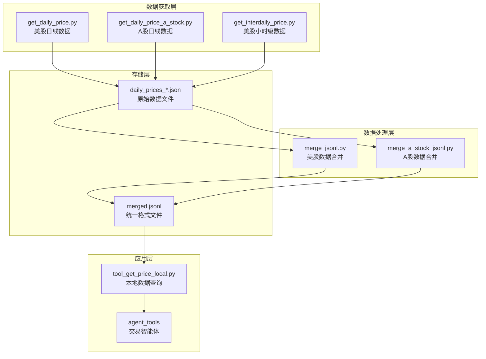
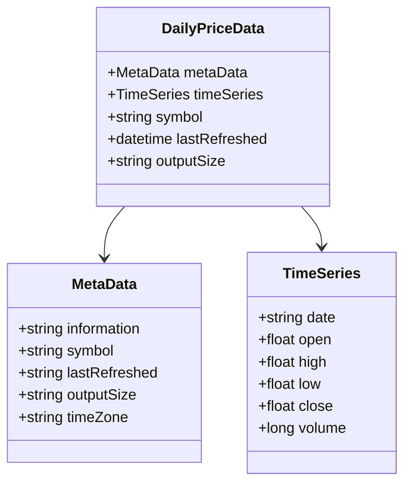
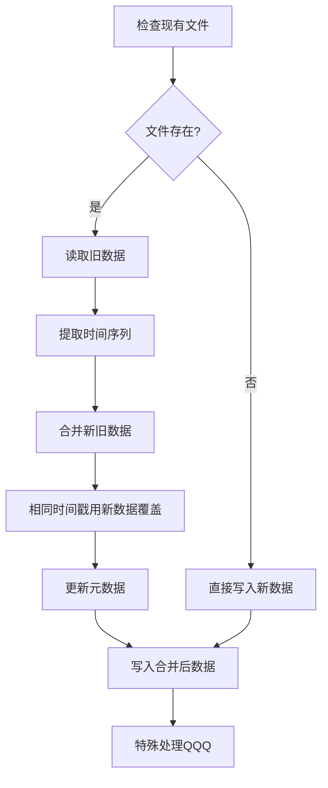
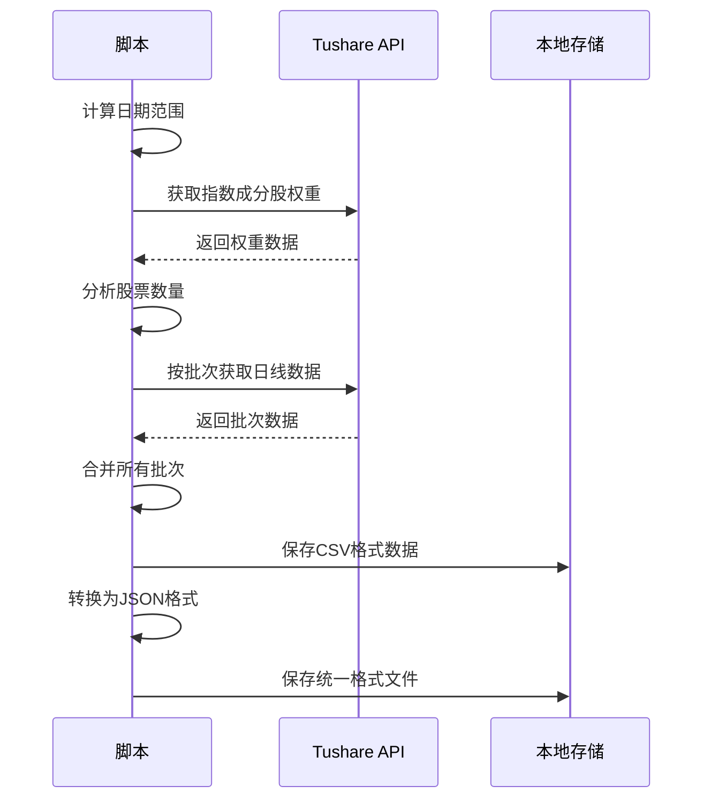
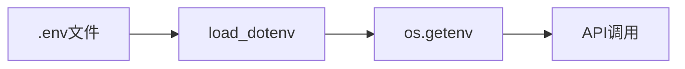
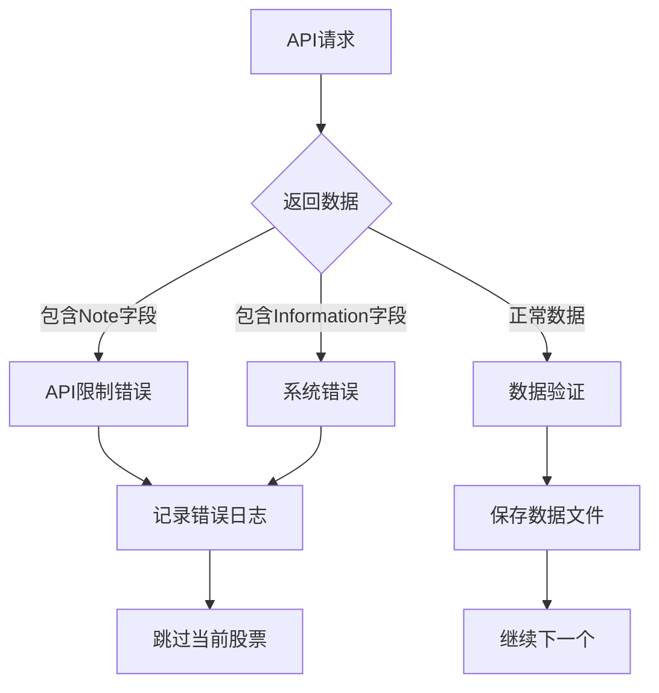
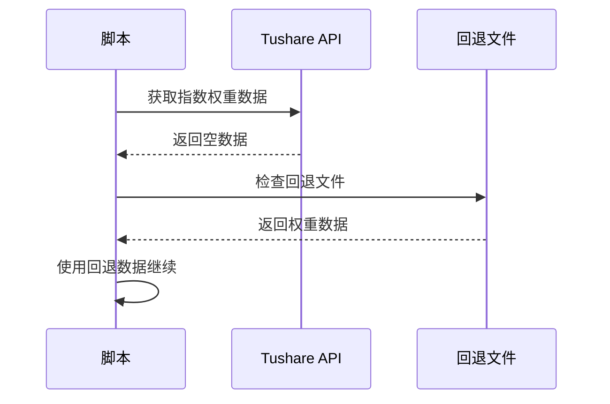
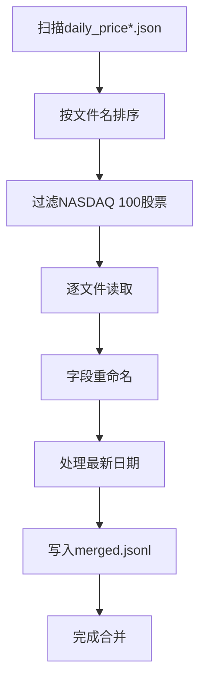

# 数据获取

<cite>
**本文档引用的文件**
- [data/get_daily_price.py](file://data/get_daily_price.py)
- [data/get_daily_price_a_stock.py](file://data/A_stock/get_daily_price_a_stock.py)
- [data/get_interdaily_price.py](file://data/get_interdaily_price.py)
- [data/merge_jsonl.py](file://data/merge_jsonl.py)
- [data/A_stock/merge_a_stock_jsonl.py](file://data/A_stock/merge_a_stock_jsonl.py)
- [data/A_stock/index_daily_sse_50.json](file://data/A_stock/index_daily_sse_50.json)
- [configs/default_config.json](file://configs/default_config.json)
- [configs/astock_config.json](file://configs/astock_config.json)
- [scripts/main_step1.sh](file://scripts/main_step1.sh)
- [agent_tools/tool_get_price_local.py](file://agent_tools/tool_get_price_local.py)
</cite>

## 目录
1. [简介](#简介)
2. [项目架构概览](#项目架构概览)
3. [美股数据获取](#美股数据获取)
4. [A股数据获取](#a股数据获取)
5. [小时级交易数据获取](#小时级交易数据获取)
6. [API密钥配置](#api密钥配置)
7. [数据存储与命名规则](#数据存储与命名规则)
8. [错误处理机制](#错误处理机制)
9. [数据合并流程](#数据合并流程)
10. [使用示例](#使用示例)
11. [故障排除指南](#故障排除指南)

## 简介

AI Trader项目提供了完整的多市场数据获取解决方案，支持美股（NASDAQ 100）和A股（SSE 50）市场的历史和实时数据获取。系统采用模块化设计，通过不同的脚本处理不同类型的市场数据，确保数据质量和一致性。

## 项目架构概览



**图表来源**
- [data/get_daily_price.py](file://data/get_daily_price.py#L1-L139)
- [data/get_daily_price_a_stock.py](file://data/A_stock/get_daily_price_a_stock.py#L1-L272)
- [data/get_interdaily_price.py](file://data/get_interdaily_price.py#L1-L189)

## 美股数据获取

### get_daily_price.py - 日线数据获取

该脚本专门用于从Alpha Vantage API获取NASDAQ 100指数成分股的日线价格数据。

#### 核心功能特性

- **NASDAQ 100全指数覆盖**：包含30只主要科技股的完整历史数据
- **紧凑输出模式**：默认获取最近100个交易日的数据
- **双重存储机制**：QQQ ETF同时保存到两个文件中
- **错误检测**：自动识别API限制和数据问题

#### 数据结构



**图表来源**
- [data/get_daily_price.py](file://data/get_daily_price.py#L113-L137)

#### 使用方法

```bash
# 运行美股日线数据获取
python data/get_daily_price.py
```

**章节来源**
- [data/get_daily_price.py](file://data/get_daily_price.py#L113-L137)

### get_interdaily_price.py - 小时级数据获取

该脚本实现小时级别的高频交易数据获取，为技术分析和算法交易提供更细粒度的数据。

#### 关键特性

- **60分钟间隔**：获取每小时的开盘、最高、最低、收盘价
- **完整历史数据**：支持全量数据获取
- **增量更新**：自动合并新旧数据，避免重复下载
- **特殊处理**：QQQ ETF同时保存到两个文件

#### 数据合并机制



**图表来源**
- [data/get_interdaily_price.py](file://data/get_interdaily_price.py#L113-L142)

**章节来源**
- [data/get_interdaily_price.py](file://data/get_interdaily_price.py#L113-L189)

## A股数据获取

### get_daily_price_a_stock.py - A股日线数据获取

该脚本专门处理中国A股市场的数据获取，支持SSE 50指数成分股的完整历史数据。

#### 核心功能

- **Tushare API集成**：使用官方API获取高质量A股数据
- **智能批次管理**：根据API限制自动调整数据获取批次
- **权重数据同步**：自动获取指数成分股权重信息
- **CSV到JSON转换**：将原始CSV数据转换为统一格式

#### 数据获取流程



**图表来源**
- [data/A_stock/get_daily_price_a_stock.py](file://data/A_stock/get_daily_price_a_stock.py#L50-L120)

#### 配置参数

| 参数 | 类型 | 默认值 | 说明 |
|------|------|--------|------|
| index_code | string | "000016.SH" | 指数代码，默认为SSE 50 |
| daily_start_date | string | "20250101" | 数据起始日期 |
| output_dir | Path | None | 输出目录，None时使用默认路径 |
| fallback_csv | Path | None | 权重数据回退文件路径 |

**章节来源**
- [data/A_stock/get_daily_price_a_stock.py](file://data/A_stock/get_daily_price_a_stock.py#L50-L120)

### A股数据格式转换

系统提供专门的转换工具将A股原始数据转换为与美股数据兼容的格式。

#### 转换特性

- **标准化字段映射**：将A股字段映射到标准OHLCV格式
- **单位转换**：将成交量从"手"转换为"股"
- **名称映射**：添加股票名称便于AI理解
- **时间戳格式化**：统一日期格式

**章节来源**
- [data/A_stock/merge_a_stock_jsonl.py](file://data/A_stock/merge_a_stock_jsonl.py#L10-L122)

## 小时级交易数据获取

### get_interdaily_price.py详解

该脚本实现了美股市场的高频数据获取，支持60分钟间隔的交易数据。

#### API调用参数

| 参数 | 值 | 说明 |
|------|-----|------|
| function | TIME_SERIES_INTRADAY | 内盘数据类型 |
| interval | 60min | 数据间隔 |
| outputsize | full | 完整历史数据 |
| entitlement | delayed | 延迟数据权限 |
| extended_hours | false | 不包含扩展交易时间 |

#### 数据合并策略

系统采用智能合并策略，确保数据完整性：

1. **时间戳优先**：新数据覆盖相同时间戳的旧数据
2. **元数据保护**：保留重要的元数据信息
3. **增量更新**：只下载新增数据，提高效率

**章节来源**
- [data/get_interdaily_price.py](file://data/get_interdaily_price.py#L167-L189)

## API密钥配置

### ALPHAADVANTAGE_API_KEY配置

系统通过环境变量管理API密钥，确保安全性。

#### 配置步骤

1. **创建.env文件**：
```bash
# 在项目根目录创建.env文件
cp .env.example .env
```

2. **编辑API密钥**：
```bash
# 编辑 .env 文件，填入你的API密钥
ALPHAADVANTAGE_API_KEY=your_alpha_vantage_key
TUSHARE_TOKEN=your_tushare_token
OPENAI_API_KEY=your_openai_key
```

#### 环境变量加载



**图表来源**
- [data/get_daily_price.py](file://data/get_daily_price.py#L1-L10)
- [data/get_interdaily_price.py](file://data/get_interdaily_price.py#L1-L10)

**章节来源**
- [data/get_daily_price.py](file://data/get_daily_price.py#L1-L10)
- [data/get_interdaily_price.py](file://data/get_interdaily_price.py#L1-L10)

## 数据存储与命名规则

### 存储路径结构

```
AI-Trader/
├── data/
│   ├── get_daily_price.py          # 美股日线数据脚本
│   ├── get_interdaily_price.py     # 美股小时级数据脚本
│   ├── merge_jsonl.py              # 数据合并脚本
│   ├── daily_prices_*.json         # 原始美股数据文件
│   └── merged.jsonl                # 统一格式合并文件
│
└── data/A_stock/
    ├── get_daily_price_a_stock.py  # A股数据脚本
    ├── merge_a_stock_jsonl.py      # A股数据合并脚本
    ├── daily_prices_sse_50.csv     # 原始A股CSV数据
    ├── index_daily_sse_50.json     # A股指数JSON数据
    └── sse_50_weight.csv           # 权重数据文件
```

### 文件命名规范

#### 美股数据文件
- **格式**：`daily_prices_{SYMBOL}.json`
- **示例**：`daily_prices_NVDA.json`
- **特殊**：QQQ ETF同时生成两个文件：`daily_prices_QQQ.json` 和 `Adaily_prices_QQQ.json`

#### A股数据文件
- **日线数据**：`daily_prices_sse_50.csv`
- **指数数据**：`index_daily_sse_50.json`
- **权重数据**：`sse_50_weight.csv`

#### 合并后文件
- **统一格式**：`merged.jsonl`（JSON Lines格式）
- **用途**：供交易智能体使用的统一数据接口

**章节来源**
- [data/get_daily_price.py](file://data/get_daily_price.py#L125-L137)
- [data/A_stock/get_daily_price_a_stock.py](file://data/A_stock/get_daily_price_a_stock.py#L246-L270)

## 错误处理机制

### Alpha Vantage API限制处理

系统实现了多层次的错误处理机制来应对API限制和网络问题。

#### 错误检测流程



**图表来源**
- [data/get_daily_price.py](file://data/get_daily_price.py#L120-L130)
- [data/get_interdaily_price.py](file://data/get_interdaily_price.py#L175-L185)

#### 常见错误类型

| 错误类型 | 症状 | 处理方式 |
|----------|------|----------|
| API限制 | 返回Note字段 | 自动跳过，后续重试 |
| 系统维护 | 返回Information字段 | 暂停执行，等待恢复 |
| 网络超时 | 请求失败 | 重试机制 |
| 数据缺失 | 股票不存在 | 记录警告，继续处理 |

#### 异常处理代码示例

```python
# 错误检测逻辑
if data.get("Note") is not None or data.get("Information") is not None:
    print(f"Error: {data.get('Note', data.get('Information'))}")
    return
```

**章节来源**
- [data/get_daily_price.py](file://data/get_daily_price.py#L120-L130)
- [data/get_interdaily_price.py](file://data/get_interdaily_price.py#L175-L185)

### Tushare API错误处理

A股数据获取同样实现了robust的错误处理：

#### 权重数据回退机制



**图表来源**
- [data/A_stock/get_daily_price_a_stock.py](file://data/A_stock/get_daily_price_a_stock.py#L70-L85)

**章节来源**
- [data/A_stock/get_daily_price_a_stock.py](file://data/A_stock/get_daily_price_a_stock.py#L70-L85)

## 数据合并流程

### 美股数据合并

系统通过`merge_jsonl.py`脚本将多个单独的JSON文件合并为统一的JSON Lines格式。

#### 合并过程



**图表来源**
- [data/merge_jsonl.py](file://data/merge_jsonl.py#L60-L110)

#### 字段标准化

| 原字段名 | 新字段名 | 用途 |
|----------|----------|------|
| 1. open | 1. buy price | 买入价格 |
| 4. close | 4. sell price | 卖出价格 |
| 2. high | 2. high | 当日最高价 |
| 3. low | 3. low | 当日最低价 |

#### 最新日期特殊处理

对于当日数据，系统只保留买入价格，防止未来信息泄露：

```python
# 最新日期特殊处理逻辑
latest_date = max(series.keys())
latest_bar = series.get(latest_date, {})
series[latest_date] = {"1. buy price": buy_val} if buy_val is not None else {}
```

**章节来源**
- [data/merge_jsonl.py](file://data/merge_jsonl.py#L60-L110)

### A股数据合并

A股数据合并通过`merge_a_stock_jsonl.py`实现，提供更复杂的转换逻辑。

#### 转换特性

- **成交量转换**：将"手"转换为"股"（1手=100股）
- **股票名称映射**：添加股票名称便于AI理解
- **时间戳标准化**：统一日期格式
- **字段映射**：标准化OHLCV字段

**章节来源**
- [data/A_stock/merge_a_stock_jsonl.py](file://data/A_stock/merge_a_stock_jsonl.py#L10-L122)

## 使用示例

### 完整数据获取工作流程

#### 美股市场数据获取

```bash
# 1. 准备数据（第一步）
bash scripts/main_step1.sh

# 2. 启动MCP服务（第二步）
bash scripts/main_step2.sh

# 3. 运行交易智能体（第三步）
bash scripts/main_step3.sh
```

#### A股市场数据获取

```bash
# 1. 准备A股数据
bash scripts/main_a_stock_step1.sh

# 2. 启动MCP服务
bash scripts/main_a_stock_step2.sh

# 3. 运行A股交易智能体
bash scripts/main_a_stock_step3.sh
```

### 单个股票数据获取示例

#### 获取特定美股数据

```python
# 直接调用函数获取单个股票数据
from data.get_daily_price import get_daily_price

# 获取单个股票数据
get_daily_price("AAPL")

# 获取QQQ ETF数据（会生成两个文件）
get_daily_price("QQQ")
```

#### 获取A股数据示例

```python
# 导入A股数据获取函数
from data.A_stock.get_daily_price_a_stock import get_daily_price_a_stock

# 获取SSE 50成分股数据
df = get_daily_price_a_stock(
    index_code="000016.SH",
    daily_start_date="20250101"
)
```

### 数据查询示例

#### 本地数据查询

```python
# 使用本地工具查询数据
from agent_tools.tool_get_price_local import get_price_local

# 查询美股数据
result = get_price_local("AAPL", "2025-10-30")

# 查询A股数据
result = get_price_local("600243.SH", "2025-10-30")
```

**章节来源**
- [scripts/main_step1.sh](file://scripts/main_step1.sh#L1-L16)
- [agent_tools/tool_get_price_local.py](file://agent_tools/tool_get_price_local.py#L60-L85)

## 故障排除指南

### 常见问题及解决方案

#### 1. API密钥问题

**问题症状**：
- "Error: ALPHAADVANTAGE_API_KEY not found"
- "Error: TUSHARE_TOKEN not found"

**解决方案**：
```bash
# 1. 检查.env文件是否存在
ls -la .env

# 2. 确认API密钥已正确配置
cat .env | grep ALPHAADVANTAGE_API_KEY

# 3. 重新启动脚本
source .env
python data/get_daily_price.py
```

#### 2. API限制问题

**问题症状**：
- 返回包含"Note"字段的JSON数据
- 数据获取速度异常缓慢

**解决方案**：
```python
# 检查API限制状态
if data.get("Note") is not None:
    print(f"API限制: {data['Note']}")
    # 等待一段时间后重试
    time.sleep(60)
```

#### 3. 数据文件问题

**问题症状**：
- "Data file not found"错误
- 合并后的merged.jsonl为空

**解决方案**：
```bash
# 检查原始数据文件
ls -la data/daily_prices_*.json

# 检查合并后的文件
ls -la data/merged.jsonl

# 重新运行数据获取脚本
python data/get_daily_price.py
python data/merge_jsonl.py
```

#### 4. Tushare API问题

**问题症状**：
- 权重数据为空
- 数据获取失败

**解决方案**：
```python
# 检查回退文件
ls -la data/A_stock/sse_50_weight.csv

# 手动下载权重数据
# 访问Tushare官网获取最新权重数据
```

### 性能优化建议

#### 1. 并发控制

```python
# 使用线程池控制并发数量
import concurrent.futures

def process_symbols(symbols):
    with concurrent.futures.ThreadPoolExecutor(max_workers=5) as executor:
        executor.map(get_daily_price, symbols)
```

#### 2. 断点续传

```python
# 实现断点续传机制
def resume_download(last_successful_symbol):
    symbols_to_process = symbols[symbols.index(last_successful_symbol):]
    for symbol in symbols_to_process:
        get_daily_price(symbol)
```

#### 3. 缓存策略

```python
# 实现本地缓存机制
import hashlib

def get_cached_data(symbol, date):
    cache_key = hashlib.md5(f"{symbol}_{date}".encode()).hexdigest()
    cache_file = f"cache/{cache_key}.json"
    
    if os.path.exists(cache_file):
        with open(cache_file, 'r') as f:
            return json.load(f)
    
    # 从API获取并缓存
    data = get_daily_price(symbol)
    with open(cache_file, 'w') as f:
        json.dump(data, f)
    return data
```

### 监控和日志

#### 数据质量监控

```python
# 监控数据完整性
def validate_data_integrity():
    import glob
    
    files = glob.glob("data/daily_prices_*.json")
    for file in files:
        with open(file, 'r') as f:
            data = json.load(f)
            # 检查必需字段
            assert "Meta Data" in data
            assert "Time Series (Daily)" in data
```

#### 错误日志记录

```python
# 记录详细的错误日志
import logging

logging.basicConfig(
    filename='data_errors.log',
    level=logging.ERROR,
    format='%(asctime)s - %(message)s'
)

try:
    get_daily_price(symbol)
except Exception as e:
    logging.error(f"Failed to get data for {symbol}: {str(e)}")
```

**章节来源**
- [data/get_daily_price.py](file://data/get_daily_price.py#L120-L130)
- [data/get_interdaily_price.py](file://data/get_interdaily_price.py#L175-L185)
- [data/A_stock/get_daily_price_a_stock.py](file://data/A_stock/get_daily_price_a_stock.py#L70-L85)