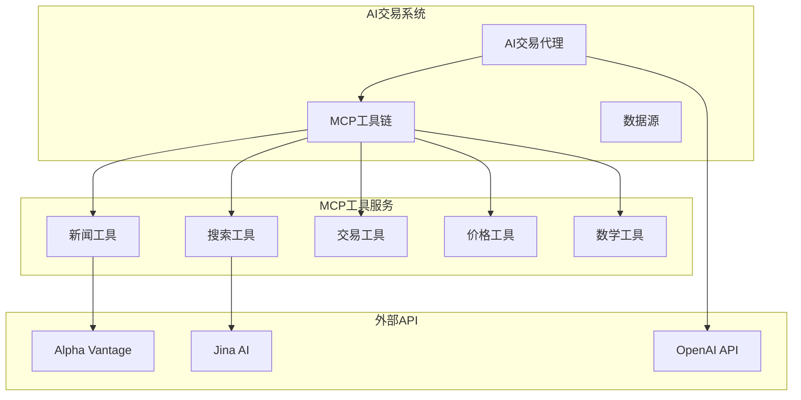
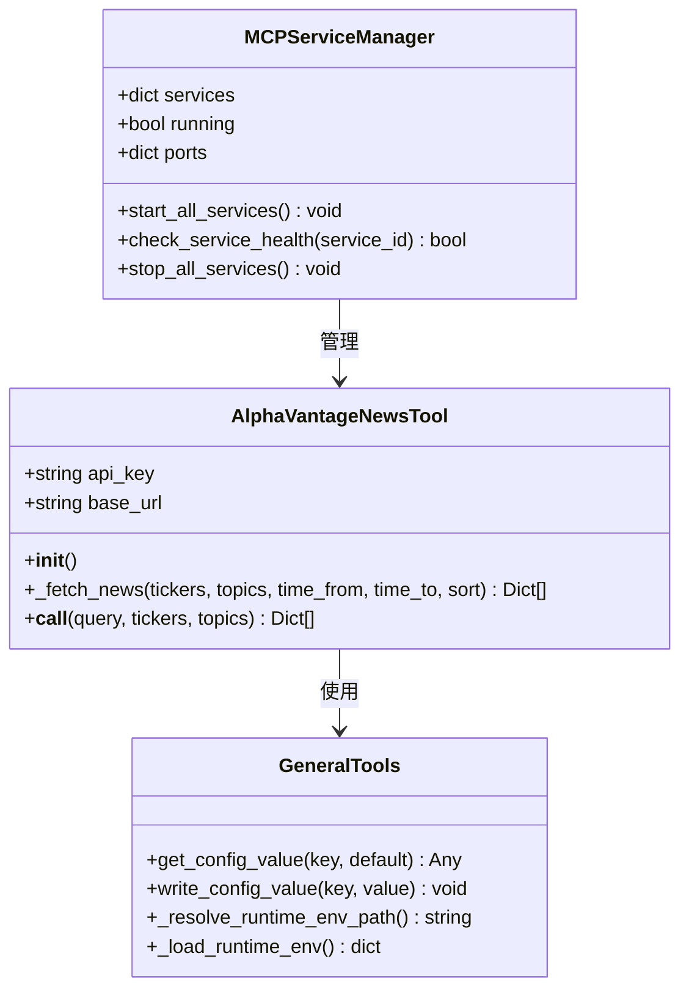
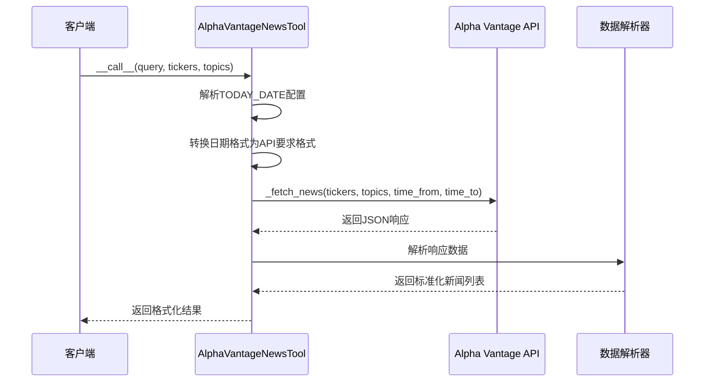
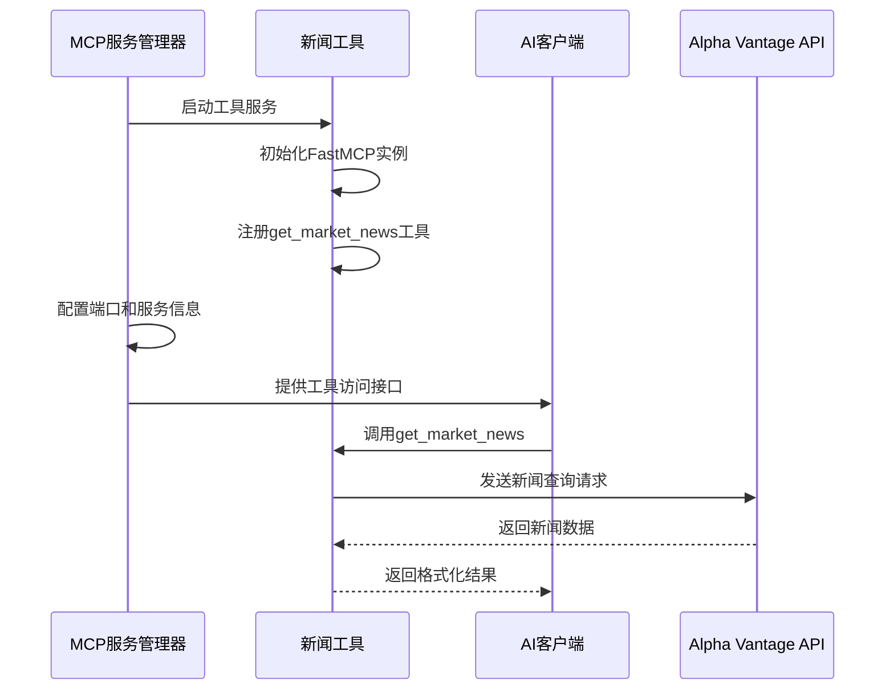
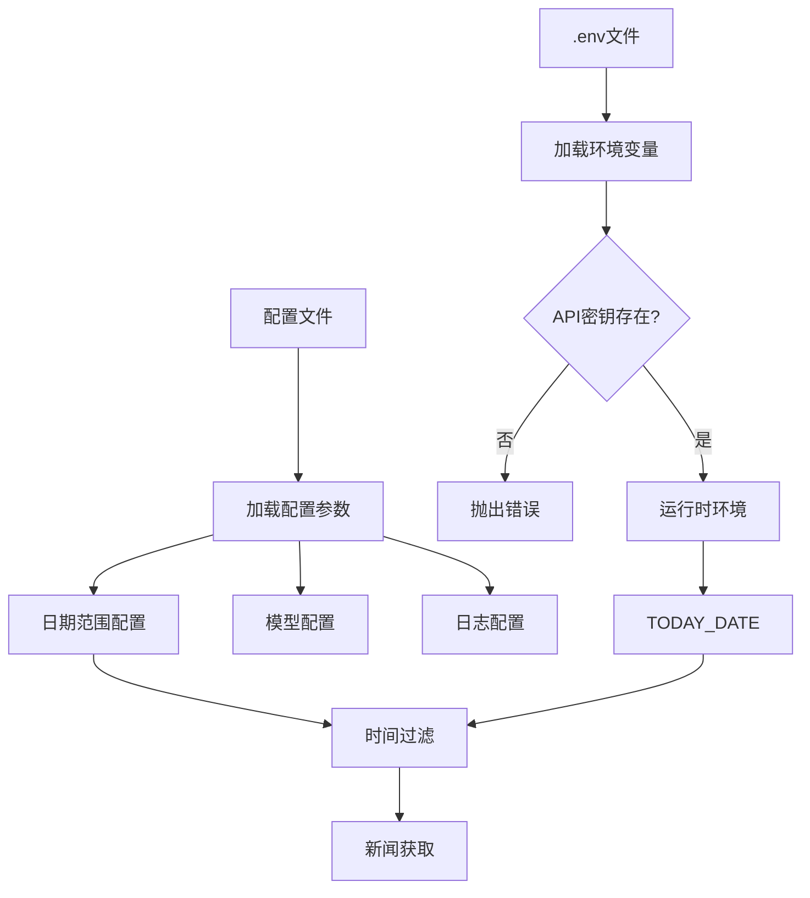
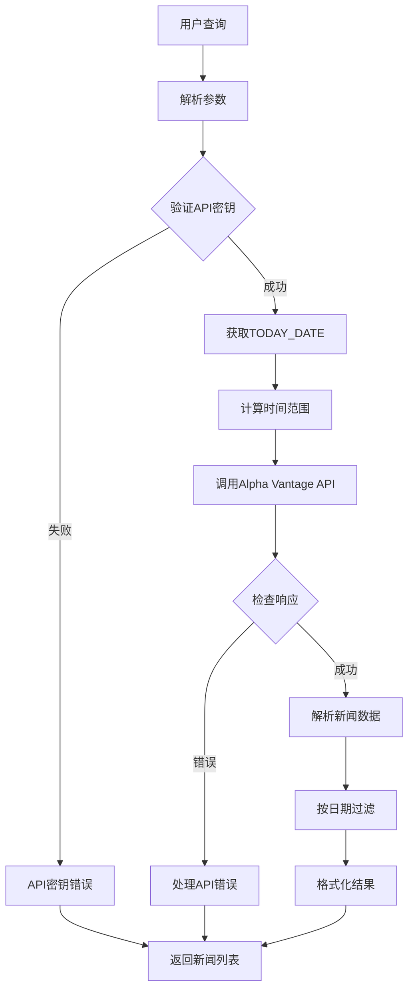

# AlphaVantage 新闻工具

<cite>
**本文档中引用的文件**
- [tool_alphavantage_news.py](file://agent_tools/tool_alphavantage_news.py)
- [start_mcp_services.py](file://agent_tools/start_mcp_services.py)
- [general_tools.py](file://tools/general_tools.py)
- [README.md](file://README.md)
- [requirements.txt](file://requirements.txt)
- [default_config.json](file://configs/default_config.json)
- [astock_config.json](file://configs/astock_config.json)
- [tool_jina_search.py](file://agent_tools/tool_jina_search.py)
- [tool_math.py](file://agent_tools/tool_math.py)
</cite>

## 目录
1. [简介](#简介)
2. [项目架构概览](#项目架构概览)
3. [核心组件分析](#核心组件分析)
4. [AlphaVantage新闻工具详解](#alphavantage新闻工具详解)
5. [MCP工具链集成](#mcp工具链集成)
6. [配置管理](#配置管理)
7. [数据流分析](#数据流分析)
8. [性能考虑](#性能考虑)
9. [故障排除指南](#故障排除指南)
10. [总结](#总结)

## 简介

AlphaVantage新闻工具是AI-Trader项目中的一个关键组件，专门负责从Alpha Vantage API获取市场新闻和情感分析数据。该工具采用Model Context Protocol (MCP) 架构，为AI交易代理提供实时的市场情报支持，帮助其做出更明智的投资决策。

该项目是一个完全自主的AI交易系统，支持NASDAQ 100和SSE 50市场的自动化交易，通过五大AI模型进行竞争性交易，无需人工干预。

## 项目架构概览

AI-Trader项目采用模块化的MCP工具链架构，主要包含以下核心组件：



**图表来源**
- [start_mcp_services.py](file://agent_tools/start_mcp_services.py#L35-L39)
- [tool_alphavantage_news.py](file://agent_tools/tool_alphavantage_news.py#L219-L220)

**章节来源**
- [README.md](file://README.md#L53-L110)
- [start_mcp_services.py](file://agent_tools/start_mcp_services.py#L1-L50)

## 核心组件分析

### 系统架构设计

AI-Trader采用分层架构设计，确保各组件之间的松耦合和高内聚：



**图表来源**
- [tool_alphavantage_news.py](file://agent_tools/tool_alphavantage_news.py#L88-L217)
- [general_tools.py](file://tools/general_tools.py#L50-L70)
- [start_mcp_services.py](file://agent_tools/start_mcp_services.py#L20-L40)

**章节来源**
- [tool_alphavantage_news.py](file://agent_tools/tool_alphavantage_news.py#L88-L161)
- [general_tools.py](file://tools/general_tools.py#L1-L55)

## AlphaVantage新闻工具详解

### 工具类设计

AlphaVantageNewsTool是新闻获取的核心类，提供了完整的新闻数据获取和处理功能：



**图表来源**
- [tool_alphavantage_news.py](file://agent_tools/tool_alphavantage_news.py#L162-L217)
- [tool_alphavantage_news.py](file://agent_tools/tool_alphavantage_news.py#L97-L161)

### API调用机制

工具支持多种过滤条件和严格的时间限制：

| 参数类型 | 描述 | 示例值 | 默认行为 |
|---------|------|--------|----------|
| tickers | 股票/加密货币/外汇代码 | "AAPL" 或 "COIN,CRYPTO:BTC,FOREX:USD" | 可选，无限制 |
| topics | 新闻主题分类 | "technology" 或 "technology,ipo" | 支持多个主题组合 |
| time_from | 开始时间（YYYYMMDDTHHMM） | "20251001T0000" | 基于TODAY_DATE自动计算 |
| time_to | 结束时间（YYYYMMDDTHHMM） | "20251031T2359" | 基于TODAY_DATE自动计算 |
| sort | 排序方式 | "LATEST", "EARLIEST", "RELEVANCE" | 默认最新优先 |

### 日期处理机制

工具具备强大的日期格式转换能力，支持多种输入格式：

```mermaid
flowchart TD
Start([输入日期字符串]) --> CheckEmpty{是否为空或"unknown"?}
CheckEmpty --> |是| ReturnUnknown[返回"unknown"]
CheckEmpty --> |否| CheckFormat{检查日期格式}
CheckFormat --> CheckT{T分隔符存在?}
CheckT --> |是| ParseAlphaVantage[解析Alpha Vantage格式]
CheckT --> |否| CheckISO{ISO 8601格式?}
ParseAlphaVantage --> CheckSeconds{包含秒数?}
CheckSeconds --> |是| ParseWithSeconds[YYYYMMDDTHHMMSS格式]
CheckSeconds --> |否| ParseWithoutSeconds[YYYYMMDDTHHMM格式]
CheckISO --> CheckPlus{包含+号?}
CheckPlus --> |是| RemoveTZ[移除时区信息]
CheckPlus --> |否| CheckZ{包含Z?}
CheckZ --> |是| RemoveZ[移除Z标识]
CheckZ --> |否| KeepOriginal[保持原格式]
RemoveTZ --> ParseISO[解析ISO格式]
RemoveZ --> ParseISO
KeepOriginal --> ParseISO
ParseWithSeconds --> FormatOutput[格式化输出]
ParseWithoutSeconds --> FormatOutput
ParseISO --> FormatOutput
CheckFormat --> |否| CheckStandard{标准格式?}
CheckStandard --> |是| ParseStandard[YYYY-MM-DD HH:MM:SS]
CheckStandard --> |否| CheckDateOnly{仅日期?}
ParseStandard --> FormatOutput
CheckDateOnly --> |是| ParseDateOnly[YYYY-MM-DD]
CheckDateOnly --> |否| ReturnOriginal[返回原始字符串]
ParseDateOnly --> AddTime[添加默认时间]
AddTime --> FormatOutput
FormatOutput --> End([返回标准格式])
ReturnOriginal --> End
ReturnUnknown --> End
```

**图表来源**
- [tool_alphavantage_news.py](file://agent_tools/tool_alphavantage_news.py#L20-L85)

**章节来源**
- [tool_alphavantage_news.py](file://agent_tools/tool_alphavantage_news.py#L20-L85)
- [tool_alphavantage_news.py](file://agent_tools/tool_alphavantage_news.py#L97-L161)

## MCP工具链集成

### 工具注册与发现

AlphaVantage新闻工具通过MCP协议注册为可用工具：



**图表来源**
- [tool_alphavantage_news.py](file://agent_tools/tool_alphavantage_news.py#L219-L220)
- [start_mcp_services.py](file://agent_tools/start_mcp_services.py#L35-L39)

### 端口配置管理

MCP服务管理器负责协调多个工具服务的端口分配：

| 服务名称 | 默认端口 | 环境变量 | 功能描述 |
|---------|----------|----------|----------|
| Math | 8000 | MATH_HTTP_PORT | 数学计算工具 |
| Search | 8001 | SEARCH_HTTP_PORT | 新闻和搜索工具 | 
| Trade | 8002 | TRADE_HTTP_PORT | 交易执行工具 |
| Price | 8003 | GETPRICE_HTTP_PORT | 价格查询工具 |

**章节来源**
- [start_mcp_services.py](file://agent_tools/start_mcp_services.py#L26-L31)
- [tool_alphavantage_news.py](file://agent_tools/tool_alphavantage_news.py#L312-L319)

## 配置管理

### 环境变量配置

系统通过环境变量和配置文件双重机制管理设置：



**图表来源**
- [general_tools.py](file://tools/general_tools.py#L50-L55)
- [tool_alphavantage_news.py](file://agent_tools/tool_alphavantage_news.py#L89-L95)

### 运行时配置

系统支持动态配置更新和持久化存储：

| 配置项 | 类型 | 描述 | 默认值 |
|--------|------|------|--------|
| TODAY_DATE | string | 当前交易日期 | 从配置文件读取 |
| ALPHAADVANTAGE_API_KEY | string | Alpha Vantage API密钥 | 必需 |
| RUNTIME_ENV_PATH | string | 运行时配置路径 | data/.runtime_env.json |

**章节来源**
- [general_tools.py](file://tools/general_tools.py#L10-L32)
- [general_tools.py](file://tools/general_tools.py#L50-L70)

## 数据流分析

### 新闻获取流程

新闻工具的数据处理遵循严格的过滤和格式化流程：



**图表来源**
- [tool_alphavantage_news.py](file://agent_tools/tool_alphavantage_news.py#L162-L217)
- [tool_alphavantage_news.py](file://agent_tools/tool_alphavantage_news.py#L105-L161)

### 错误处理机制

工具实现了多层次的错误处理策略：

1. **API级别错误**：网络请求超时、认证失败
2. **数据级别错误**：无效的响应格式、空数据集
3. **业务逻辑错误**：日期格式错误、参数验证失败

**章节来源**
- [tool_alphavantage_news.py](file://agent_tools/tool_alphavantage_news.py#L134-L161)

## 性能考虑

### 并发处理

MCP服务管理器支持多线程并发启动和监控多个工具服务：

- **端口冲突检测**：自动寻找可用端口
- **健康检查**：定期检查服务状态
- **优雅关闭**：信号处理确保资源正确释放

### 缓存策略

虽然当前实现没有内置缓存，但系统设计支持扩展缓存机制：

- **响应缓存**：缓存API响应避免重复请求
- **配置缓存**：减少频繁的文件I/O操作
- **连接池**：复用HTTP连接提高效率

## 故障排除指南

### 常见问题及解决方案

| 问题类型 | 症状 | 可能原因 | 解决方案 |
|---------|------|----------|----------|
| API密钥错误 | ValueError异常 | ALPHAADVANTAGE_API_KEY未设置 | 设置正确的API密钥 |
| 网络连接失败 | RequestException | 网络问题或API限制 | 检查网络连接和API配额 |
| 日期格式错误 | 解析失败 | TODAY_DATE格式不正确 | 使用YYYY-MM-DD格式 |
| 端口冲突 | 服务启动失败 | 端口被占用 | 更改端口配置或停止冲突服务 |

### 调试技巧

1. **启用详细日志**：检查logs目录下的日志文件
2. **验证环境变量**：确认所有必需的API密钥已正确设置
3. **测试API连接**：直接使用API密钥测试Alpha Vantage API
4. **检查服务状态**：使用`python agent_tools/start_mcp_services.py status`查看服务状态

**章节来源**
- [tool_alphavantage_news.py](file://agent_tools/tool_alphavantage_news.py#L91-L95)
- [start_mcp_services.py](file://agent_tools/start_mcp_services.py#L266-L279)

## 总结

AlphaVantage新闻工具是AI-Trader生态系统中的重要情报来源，通过MCP协议实现了与其他组件的无缝集成。该工具的主要优势包括：

1. **灵活的过滤机制**：支持股票代码、新闻主题和时间范围的多重过滤
2. **智能的日期处理**：自动适配不同的日期格式和时间限制
3. **健壮的错误处理**：多层次的异常捕获和恢复机制
4. **模块化架构**：基于MCP协议的可扩展设计

该工具为AI交易代理提供了及时、准确的市场新闻和情感分析数据，是实现完全自主交易决策的重要基础设施。随着系统的不断发展，该工具将继续演进以支持更多的市场和更复杂的数据分析需求。