# MCP工具链架构文档

<cite>
**本文档引用的文件**
- [start_mcp_services.py](file://agent_tools/start_mcp_services.py)
- [tool_trade.py](file://agent_tools/tool_trade.py)
- [tool_get_price_local.py](file://agent_tools/tool_get_price_local.py)
- [tool_jina_search.py](file://agent_tools/tool_jina_search.py)
- [tool_math.py](file://agent_tools/tool_math.py)
- [general_tools.py](file://tools/general_tools.py)
- [price_tools.py](file://tools/price_tools.py)
- [base_agent.py](file://agent/base_agent/base_agent.py)
- [base_agent_astock.py](file://agent/base_agent_astock/base_agent_astock.py)
- [default_config.json](file://configs/default_config.json)
</cite>

## 目录
1. [项目概述](#项目概述)
2. [MCP协议架构](#mcp协议架构)
3. [工具链组件分析](#工具链组件分析)
4. [服务启动与管理](#服务启动与管理)
5. [客户端集成](#客户端集成)
6. [数据流与交互](#数据流与交互)
7. [性能与扩展性](#性能与扩展性)
8. [故障排除指南](#故障排除指南)
9. [总结](#总结)

## 项目概述

AI-Trader是一个基于模型上下文协议(MCP)的智能交易系统，通过FastMCP框架将多种交易功能以HTTP服务形式暴露给AI代理调用。该系统采用模块化设计，支持US股票和中国A股市场的自动化交易，为AI模型提供完整的工具链支持。

### 核心特性

- **完全自主决策**：AI代理独立完成市场分析、决策制定和执行
- **纯工具驱动架构**：基于MCP协议的标准工具调用机制
- **多模型竞争环境**：支持GPT、Claude、Qwen等AI模型的公平竞争
- **实时性能分析**：全面的交易记录、仓位监控和盈亏分析
- **智能市场情报**：集成Jina AI进行实时市场新闻检索

## MCP协议架构

### 协议基础

MCP（Model Context Protocol）是专门为AI代理与外部工具交互设计的协议标准。在AI-Trader中，MCP协议通过以下方式实现：

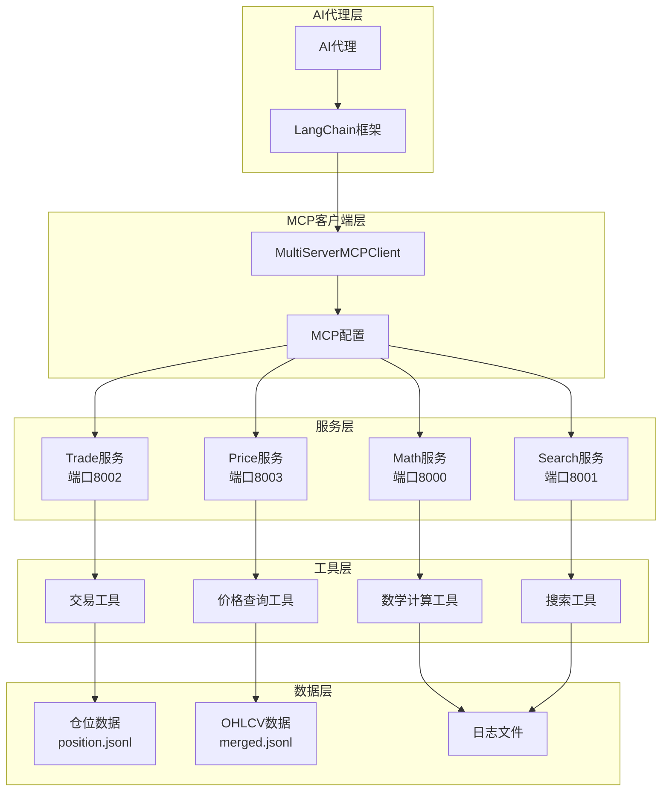

**图表来源**
- [start_mcp_services.py](file://agent_tools/start_mcp_services.py#L20-L40)
- [base_agent.py](file://agent/base_agent/base_agent.py#L288-L315)

### FastMCP框架集成

每个工具都使用FastMCP框架作为HTTP传输层，提供标准化的服务接口：

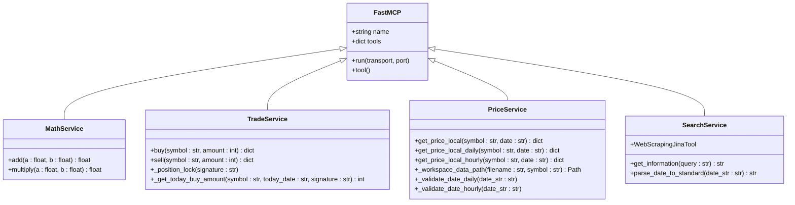

**图表来源**
- [tool_math.py](file://agent_tools/tool_math.py#L10-L15)
- [tool_trade.py](file://agent_tools/tool_trade.py#L20-L25)
- [tool_get_price_local.py](file://agent_tools/tool_get_price_local.py#L15-L20)
- [tool_jina_search.py](file://agent_tools/tool_jina_search.py#L120-L125)

**章节来源**
- [start_mcp_services.py](file://agent_tools/start_mcp_services.py#L1-L50)
- [tool_math.py](file://agent_tools/tool_math.py#L1-L45)

## 工具链组件分析

### 数学计算工具 (tool_math.py)

数学计算工具提供基础的算术运算能力，支持整数和浮点数操作。

#### 核心功能

- **加法运算**：`add(a: float, b: float) -> float`
- **乘法运算**：`multiply(a: float, b: float) -> float`

#### 实现特点

- 使用`@mcp.tool()`装饰器注册为MCP工具
- 支持类型注解确保参数正确性
- 返回值自动转换为浮点数

#### 配置端口

默认监听端口：8000

**章节来源**
- [tool_math.py](file://agent_tools/tool_math.py#L15-L45)

### 交易工具 (tool_trade.py)

交易工具实现了完整的买入/卖出交易逻辑，包括交易验证、持仓更新和资金计算。

#### 交易流程

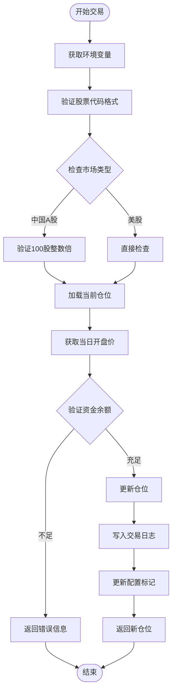

**图表来源**
- [tool_trade.py](file://agent_tools/tool_trade.py#L40-L120)
- [tool_trade.py](file://agent_tools/tool_trade.py#L200-L280)

#### 关键特性

1. **多市场支持**：自动识别US股票和中国A股市场
2. **交易规则验证**：
   - 美股：最小交易单位为1股
   - 中国A股：必须为100股的整数倍
   - T+1规则：当日买入的股票次日才能卖出
3. **并发安全**：使用文件锁确保仓位更新的原子性
4. **日志记录**：详细的交易记录保存到JSONL文件

#### 文件锁机制

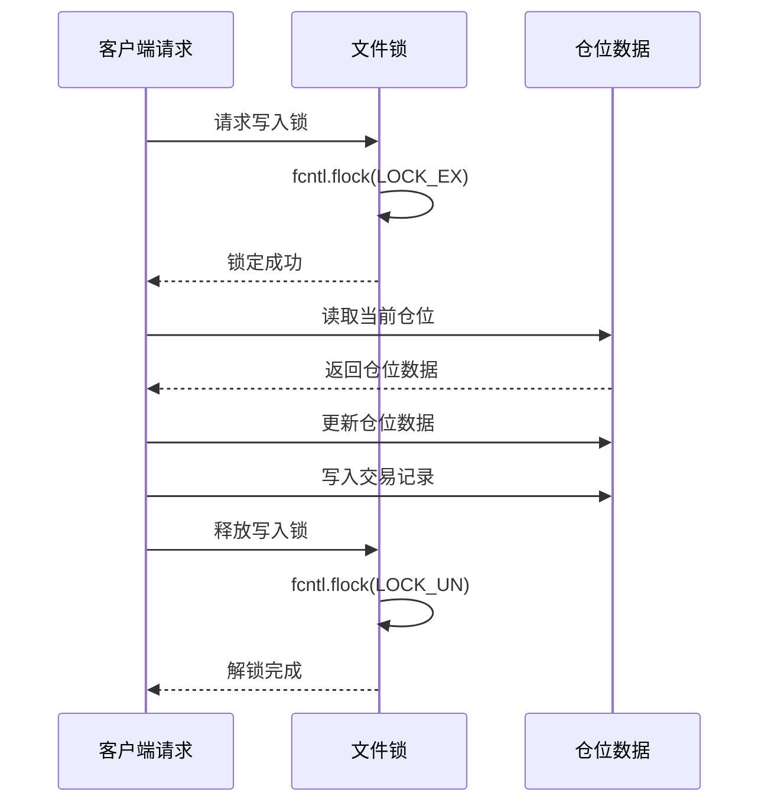

**图表来源**
- [tool_trade.py](file://agent_tools/tool_trade.py#L25-L40)

**章节来源**
- [tool_trade.py](file://agent_tools/tool_trade.py#L1-L372)

### 本地价格查询工具 (tool_get_price_local.py)

本地价格查询工具从本地merged.jsonl文件查询OHLCV价格数据，支持日线和小时线数据。

#### 数据格式支持

- **日线数据**：`YYYY-MM-DD`格式（如'2025-10-30'）
- **小时线数据**：`YYYY-MM-DD HH:MM:SS`格式（如'2025-10-30 14:30:00'）

#### 查询逻辑

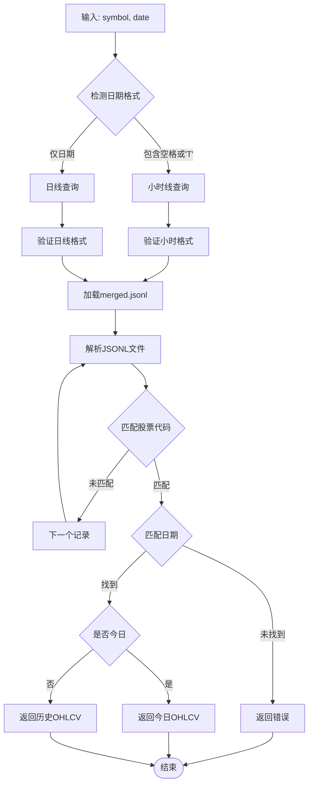

**图表来源**
- [tool_get_price_local.py](file://agent_tools/tool_get_price_local.py#L50-L80)
- [tool_get_price_local.py](file://agent_tools/tool_get_price_local.py#L85-L150)

#### 市场类型自动检测

工具根据股票代码自动检测市场类型：

- **中国A股**：代码以`.SH`或`.SZ`结尾
- **美股**：默认市场类型

#### 数据访问控制

- **未来数据限制**：当日数据无法获取实时高低价和成交量
- **历史数据完整**：历史交易日数据包含完整的OHLCV信息

**章节来源**
- [tool_get_price_local.py](file://agent_tools/tool_get_price_local.py#L1-L285)

### Jina搜索工具 (tool_jina_search.py)

Jina搜索工具集成了Jina AI服务，提供市场情报搜索和网页内容抓取功能。

#### 搜索流程

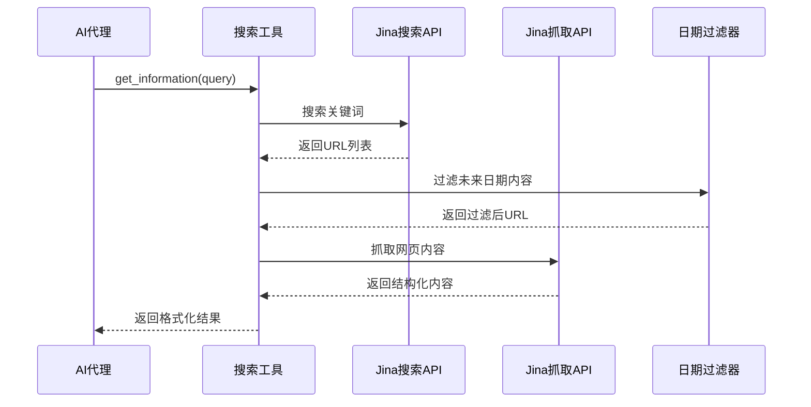

**图表来源**
- [tool_jina_search.py](file://agent_tools/tool_jina_search.py#L130-L150)
- [tool_jina_search.py](file://agent_tools/tool_jina_search.py#L155-L200)

#### 日期处理功能

支持多种日期格式的标准化处理：

- **相对时间**：`4 hours ago`, `1 day ago`, `2 weeks ago`
- **ISO格式**：`2025-10-01T08:19:28+00:00`
- **常见格式**：`May 31, 2025`, `2025-10-01`

#### 内容过滤机制

- **时间过滤**：只保留早于当前交易日的信息
- **质量控制**：随机选择高质量内容进行抓取
- **错误处理**：完善的异常捕获和错误报告

**章节来源**
- [tool_jina_search.py](file://agent_tools/tool_jina_search.py#L1-L281)

## 服务启动与管理

### 启动管理器架构

MCPServiceManager类负责所有MCP服务的启动、监控和管理。

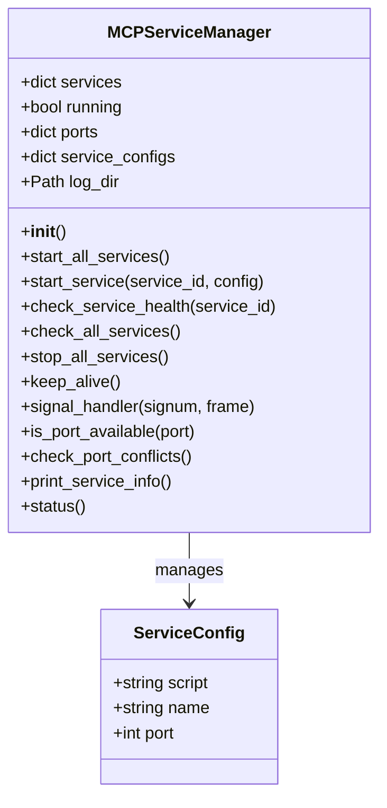

**图表来源**
- [start_mcp_services.py](file://agent_tools/start_mcp_services.py#L15-L45)

### 端口配置与冲突检测

#### 默认端口分配

| 服务名称 | 默认端口 | 环境变量 |
|---------|---------|---------|
| Math | 8000 | MATH_HTTP_PORT |
| Search | 8001 | SEARCH_HTTP_PORT |
| Trade | 8002 | TRADE_HTTP_PORT |
| Price | 8003 | GETPRICE_HTTP_PORT |

#### 端口冲突处理

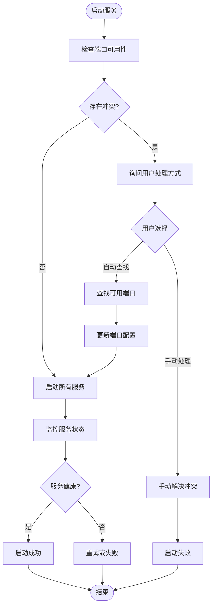

**图表来源**
- [start_mcp_services.py](file://agent_tools/start_mcp_services.py#L60-L120)

### 服务监控与健康检查

#### 健康检查机制

1. **进程状态检查**：验证子进程是否正常运行
2. **端口响应检查**：测试HTTP服务是否可访问
3. **自动重启**：检测到服务异常时自动重启

#### 日志管理

- **日志文件**：每个服务单独的日志文件
- **日志轮转**：支持日志文件大小管理和清理
- **错误追踪**：详细的错误信息记录

**章节来源**
- [start_mcp_services.py](file://agent_tools/start_mcp_services.py#L1-L294)

## 客户端集成

### MultiServerMCPClient配置

AI代理通过MultiServerMCPClient连接到各个MCP服务，实现工具的动态发现和调用。

#### 配置结构

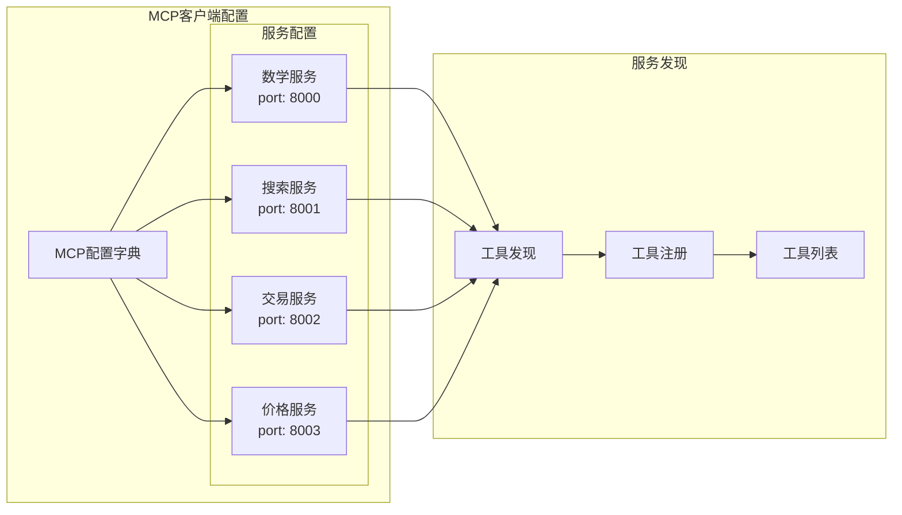

**图表来源**
- [base_agent.py](file://agent/base_agent/base_agent.py#L288-L315)
- [base_agent_astock.py](file://agent/base_agent_astock/base_agent_astock.py#L237-L272)

#### 工具注册流程

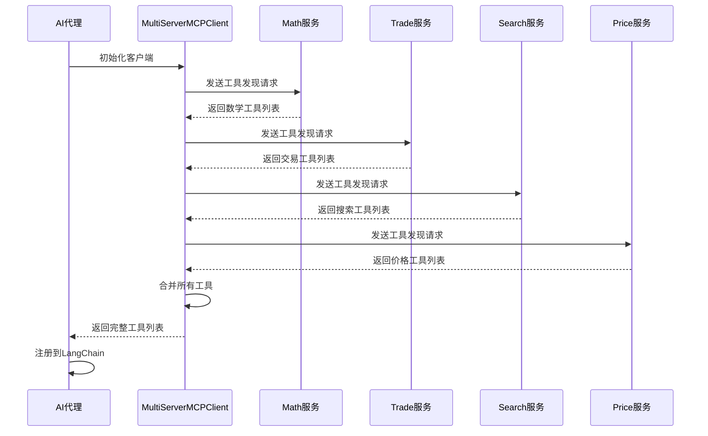

**图表来源**
- [base_agent.py](file://agent/base_agent/base_agent.py#L313-L341)

### LangChain集成

#### 工具注册机制

AI代理将MCP工具注册到LangChain框架中，实现：

- **工具调用链**：支持复杂的工具组合调用
- **参数验证**：自动验证工具调用参数
- **错误处理**：统一的错误处理和恢复机制

#### 动态工具发现

- **运行时发现**：服务启动后自动发现可用工具
- **版本兼容**：支持工具版本的向后兼容
- **热更新**：服务重启时不丢失工具注册信息

**章节来源**
- [base_agent.py](file://agent/base_agent/base_agent.py#L313-L341)
- [base_agent_astock.py](file://agent/base_agent_astock/base_agent_astock.py#L270-L286)

## 数据流与交互

### 交易数据流

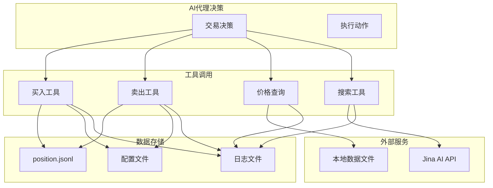

**图表来源**
- [tool_trade.py](file://agent_tools/tool_trade.py#L334-L370)
- [tool_get_price_local.py](file://agent_tools/tool_get_price_local.py#L280-L285)

### 状态同步机制

#### 仓位管理

- **原子操作**：使用文件锁确保仓位更新的原子性
- **版本控制**：每次交易生成唯一的操作ID
- **数据持久化**：交易记录永久保存到JSONL文件

#### 配置同步

- **运行时配置**：通过`.runtime_env.json`文件持久化配置
- **环境变量**：支持环境变量覆盖默认配置
- **签名隔离**：不同AI模型使用独立的配置空间

**章节来源**
- [tool_trade.py](file://agent_tools/tool_trade.py#L334-L370)
- [general_tools.py](file://tools/general_tools.py#L40-L70)

## 性能与扩展性

### 并发处理能力

#### 服务架构

- **独立进程**：每个MCP服务运行在独立进程中
- **无状态设计**：服务之间不共享状态，提高可靠性
- **负载均衡**：支持多个相同类型服务实例

#### 性能优化

- **连接池**：HTTP客户端连接复用
- **缓存机制**：频繁访问的数据缓存
- **异步处理**：非阻塞的网络请求处理

### 扩展性设计

#### 模块化架构

- **插件式工具**：新工具可以轻松添加到系统中
- **配置驱动**：通过配置文件管理服务行为
- **接口标准化**：统一的MCP工具接口规范

#### 监控与告警

- **健康检查**：定期检查服务状态
- **性能指标**：关键性能指标监控
- **错误追踪**：详细的错误日志和追踪

## 故障排除指南

### 常见问题诊断

#### 服务启动失败

**症状**：MCP服务无法启动或立即退出

**排查步骤**：
1. 检查端口占用情况
2. 验证Python依赖安装
3. 查看服务日志文件
4. 检查环境变量配置

**解决方案**：
- 使用`python start_mcp_services.py status`检查服务状态
- 手动指定可用端口
- 重新安装依赖包

#### 工具调用失败

**症状**：AI代理无法调用特定工具

**排查步骤**：
1. 检查MCP服务是否正常运行
2. 验证网络连接
3. 检查工具接口定义
4. 查看客户端错误日志

**解决方案**：
- 重启相关MCP服务
- 检查防火墙设置
- 验证API密钥配置

#### 交易执行异常

**症状**：买入/卖出操作失败

**排查步骤**：
1. 检查账户资金余额
2. 验证股票代码有效性
3. 检查交易规则约束
4. 查看仓位文件权限

**解决方案**：
- 补充账户资金
- 使用正确的股票代码格式
- 等待T+1交易周期
- 修复文件权限问题

### 性能调优建议

#### 服务性能优化

- **内存管理**：定期清理临时文件和缓存
- **磁盘I/O**：使用SSD存储交易数据文件
- **网络优化**：调整HTTP连接超时设置

#### AI代理优化

- **工具缓存**：缓存常用的工具调用结果
- **批量处理**：合并多个小的工具调用
- **错误恢复**：实现智能的错误重试机制

**章节来源**
- [start_mcp_services.py](file://agent_tools/start_mcp_services.py#L200-L250)

## 总结

AI-Trader的MCP工具链架构展现了现代AI交易系统的最佳实践。通过FastMCP框架和Model Context Protocol，系统实现了：

### 架构优势

1. **模块化设计**：每个工具独立部署，便于维护和扩展
2. **标准化接口**：统一的MCP协议确保工具间的互操作性
3. **高并发支持**：独立进程架构支持大规模并发访问
4. **可靠的数据管理**：文件锁机制确保交易数据的一致性

### 技术创新

- **智能市场情报**：集成Jina AI实现实时市场搜索
- **跨市场支持**：同时支持US股票和中国A股市场
- **自动化程度高**：完全无需人工干预的自主交易
- **透明度高**：详细的交易记录和决策过程追踪

### 应用价值

该架构不仅适用于AI交易系统，还可作为其他AI工具链项目的参考模板。通过标准化的MCP协议，开发者可以快速构建自己的AI工具生态系统，实现各种复杂的业务场景。

未来的扩展方向包括：
- 支持更多金融产品类型
- 集成更多的外部数据源
- 实现实时风险管理系统
- 提供更丰富的分析工具

这套MCP工具链为AI驱动的金融应用提供了坚实的技术基础，展示了人工智能在复杂商业环境中的巨大潜力。