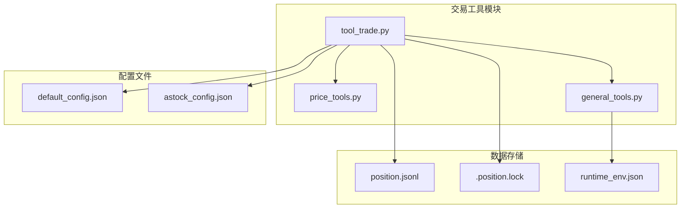
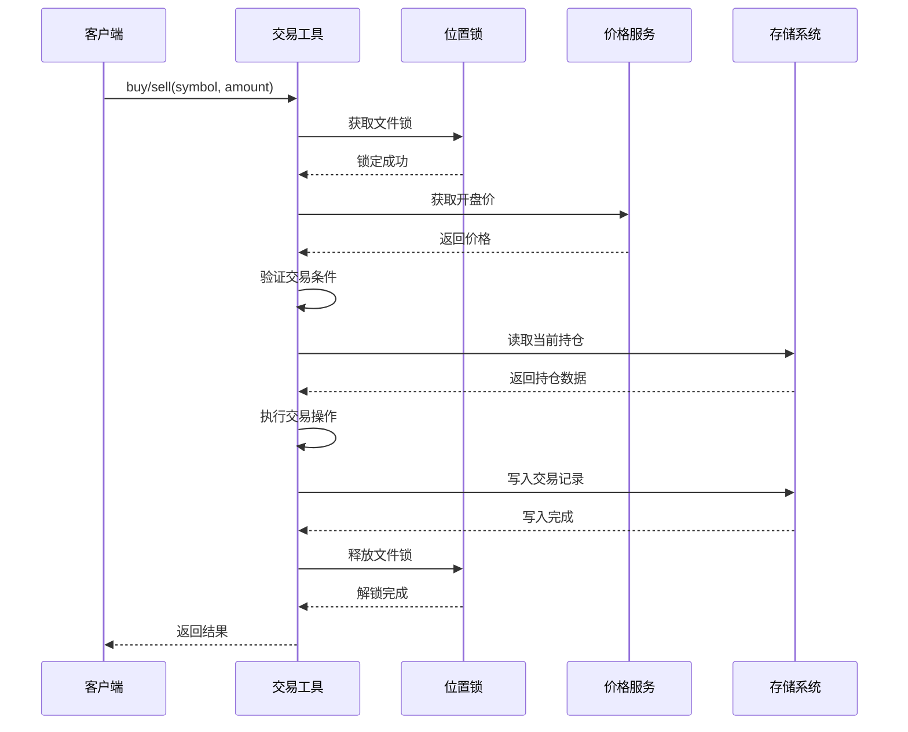
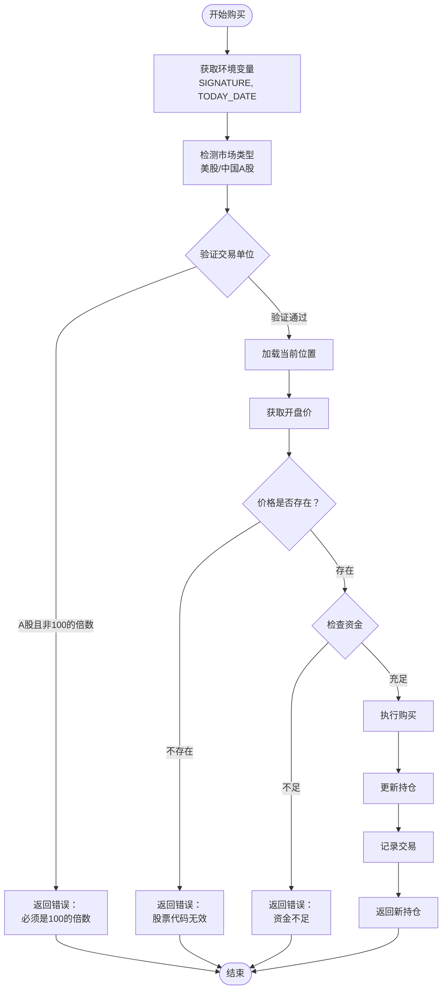
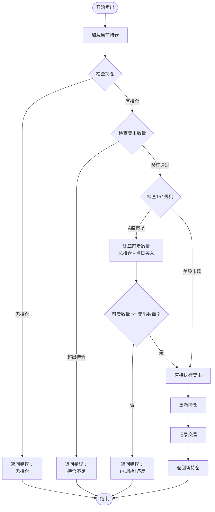
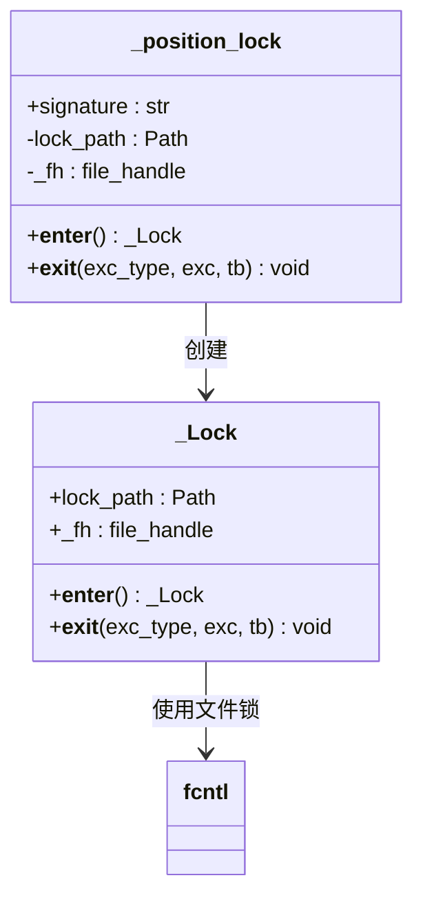
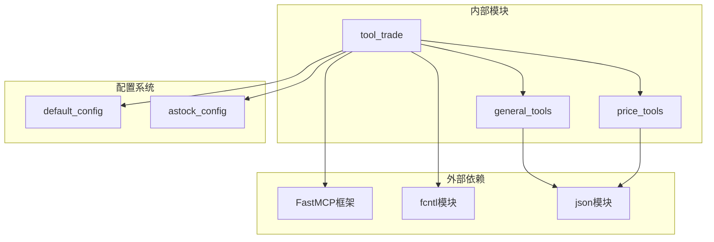

# 交易工具API文档

<cite>
**本文档引用的文件**
- [tool_trade.py](file://agent_tools/tool_trade.py)
- [price_tools.py](file://tools/price_tools.py)
- [general_tools.py](file://tools/general_tools.py)
- [default_config.json](file://configs/default_config.json)
- [astock_config.json](file://configs/astock_config.json)
</cite>

## 目录
1. [简介](#简介)
2. [项目结构](#项目结构)
3. [核心组件](#核心组件)
4. [架构概览](#架构概览)
5. [详细组件分析](#详细组件分析)
6. [依赖关系分析](#依赖关系分析)
7. [性能考虑](#性能考虑)
8. [故障排除指南](#故障排除指南)
9. [结论](#结论)

## 简介

交易工具是一个基于Python的智能交易系统，提供了完整的股票买卖功能。该系统支持美股（NASDAQ 100指数成分股）和A股（上证50指数成分股）两个市场，具有严格的交易规则和数据一致性保障机制。

核心特性：
- **多市场支持**：同时支持美股和A股市场
- **严格交易规则**：A股必须以100股为单位（整手交易），遵循T+1交易制度
- **数据一致性**：使用文件锁机制确保多进程环境下的数据安全
- **实时验证**：交易前进行资金、持仓数量等多重验证
- **完整记录**：所有交易操作以JSONL格式持久化存储

## 项目结构



**图表来源**
- [tool_trade.py](file://agent_tools/tool_trade.py#L1-L372)
- [price_tools.py](file://tools/price_tools.py#L1-L809)
- [general_tools.py](file://tools/general_tools.py#L1-L171)

**章节来源**
- [tool_trade.py](file://agent_tools/tool_trade.py#L1-L50)
- [default_config.json](file://configs/default_config.json#L1-L53)

## 核心组件

### 主要函数

系统提供两个核心交易函数：

1. **buy()** - 购买股票函数
2. **sell()** - 卖出股票函数

### 关键数据结构

- **持仓字典**：包含股票持有量和现金余额的字典
- **交易记录**：以JSONL格式存储的交易历史
- **位置锁**：文件级互斥锁确保数据一致性

**章节来源**
- [tool_trade.py](file://agent_tools/tool_trade.py#L40-L372)

## 架构概览



**图表来源**
- [tool_trade.py](file://agent_tools/tool_trade.py#L40-L150)
- [tool_trade.py](file://agent_tools/tool_trade.py#L152-L372)

## 详细组件分析

### buy() 函数详解

#### 功能概述
`buy()`函数实现了完整的股票购买流程，包括验证、执行和记录三个阶段。

#### 参数验证机制



**图表来源**
- [tool_trade.py](file://agent_tools/tool_trade.py#L40-L150)

#### A股特殊规则处理

对于中国A股市场，系统实施以下特殊规则：

| 规则类型 | 具体要求 | 实现方式 |
|---------|---------|---------|
| 交易单位 | 必须是100的倍数 | `amount % 100 != 0` 验证 |
| T+1限制 | 当日买入不可当日卖出 | `_get_today_buy_amount()` 检查 |
| 市场检测 | 自动识别美股/A股 | `symbol.endswith((".SH", ".SZ"))` |

#### 返回值结构

**成功情况**：
```python
{
    "AAPL": 110,           # 股票持有量
    "MSFT": 5,             # 其他股票持有量
    "CASH": 5000.0,        # 剩余现金
    ...
}
```

**失败情况**：
```python
{
    "error": "错误描述信息",
    "symbol": "股票代码",
    "amount": "交易数量",
    "date": "交易日期",
    "suggestion": "建议的修正方案"
}
```

**章节来源**
- [tool_trade.py](file://agent_tools/tool_trade.py#L40-L150)

### sell() 函数详解

#### 功能概述
`sell()`函数实现了股票卖出流程，包含更严格的验证逻辑。

#### T+1规则实现



**图表来源**
- [tool_trade.py](file://agent_tools/tool_trade.py#L152-L372)

#### T+1规则详细说明

T+1规则通过以下步骤实现：

1. **当日买入统计**：`_get_today_buy_amount()`函数统计当天买入的总数量
2. **可卖数量计算**：`current_position[symbol] - bought_today`
3. **卖出验证**：确保卖出数量不超过可卖数量

**章节来源**
- [tool_trade.py](file://agent_tools/tool_trade.py#L152-L372)

### _position_lock 上下文管理器

#### 设计原理
`_position_lock`使用文件级互斥锁确保多进程环境下的数据一致性。

#### 实现机制



**图表来源**
- [tool_trade.py](file://agent_tools/tool_trade.py#L25-L39)

#### 文件锁特性

| 特性 | 实现方式 | 作用 |
|-----|---------|------|
| 原子性 | `fcntl.flock` | 确保读-修改-写操作的原子性 |
| 进程隔离 | 文件锁机制 | 不同进程间的数据同步 |
| 自动解锁 | 上下文管理器 | 异常安全的资源管理 |
| 路径唯一 | `signature`区分 | 多模型间的独立锁 |

**章节来源**
- [tool_trade.py](file://agent_tools/tool_trade.py#L25-L39)

### 交易记录系统

#### JSONL格式设计

交易记录采用JSON Lines格式，每行一个记录：

```json
{
    "date": "2025-10-16",
    "id": 1,
    "this_action": {
        "action": "buy",
        "symbol": "AAPL",
        "amount": 100
    },
    "positions": {
        "AAPL": 100,
        "CASH": 90000.0
    }
}
```

#### 记录字段说明

| 字段名 | 类型 | 描述 |
|-------|------|------|
| date | string | 交易日期 |
| id | integer | 唯一操作标识符 |
| this_action | dict | 当前操作详情 |
| positions | dict | 交易后的新持仓状态 |

**章节来源**
- [tool_trade.py](file://agent_tools/tool_trade.py#L120-L150)
- [tool_trade.py](file://agent_tools/tool_trade.py#L300-L330)

## 依赖关系分析



**图表来源**
- [tool_trade.py](file://agent_tools/tool_trade.py#L1-L20)
- [general_tools.py](file://tools/general_tools.py#L1-L20)

### 核心依赖关系

1. **FastMCP框架**：提供MCP协议支持
2. **fcntl模块**：实现文件级互斥锁
3. **price_tools模块**：提供价格和持仓查询功能
4. **general_tools模块**：提供配置管理和环境变量处理

**章节来源**
- [tool_trade.py](file://agent_tools/tool_trade.py#L1-L20)
- [price_tools.py](file://tools/price_tools.py#L1-L50)
- [general_tools.py](file://tools/general_tools.py#L1-L50)

## 性能考虑

### 并发控制优化

- **细粒度锁**：按`signature`区分不同的交易账户
- **非阻塞策略**：文件锁等待时间可控
- **异常安全**：确保锁始终被正确释放

### 数据访问优化

- **缓存机制**：避免重复的文件I/O操作
- **批量处理**：一次读取多个交易记录
- **索引优化**：按日期和ID排序快速定位

### 内存使用优化

- **流式处理**：逐行读取JSONL文件
- **对象复用**：避免频繁的对象创建
- **垃圾回收**：及时释放大对象引用

## 故障排除指南

### 常见错误及解决方案

| 错误类型 | 错误信息 | 可能原因 | 解决方案 |
|---------|---------|---------|---------|
| 环境变量缺失 | `SIGNATURE environment variable is not set` | 缺少模型签名 | 设置正确的SIGNATURE环境变量 |
| 资金不足 | `Insufficient cash!` | 现金余额不足 | 检查初始资金配置 |
| 股票无效 | `Symbol {symbol} not found!` | 股票代码不存在 | 验证股票代码是否在支持列表中 |
| T+1限制 | `T+1 restriction violated!` | A股当日买入不可当日卖出 | 等待下一个交易日 |

### 调试技巧

1. **启用详细日志**：观察`print`语句输出
2. **检查文件权限**：确保对position.jsonl有读写权限
3. **验证配置文件**：确认配置文件中的路径设置正确
4. **监控锁文件**：检查`.position.lock`文件是否存在

**章节来源**
- [tool_trade.py](file://agent_tools/tool_trade.py#L40-L150)
- [tool_trade.py](file://agent_tools/tool_trade.py#L152-L372)

## 结论

交易工具提供了一个功能完整、安全可靠的智能交易系统。其主要优势包括：

1. **严格的合规性**：完全符合A股市场的T+1规则和美股市场的交易规范
2. **数据安全性**：通过文件锁机制确保多进程环境下的数据一致性
3. **透明的操作记录**：完整的交易历史以JSONL格式保存，便于审计和分析
4. **灵活的市场支持**：同时支持美股和A股市场，适应不同投资需求

该系统为AI交易代理提供了坚实的基础设施支持，能够满足复杂的交易场景需求，是构建智能投资决策系统的理想选择。