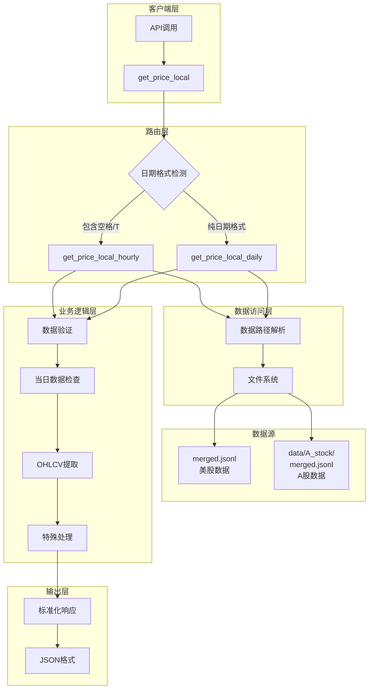
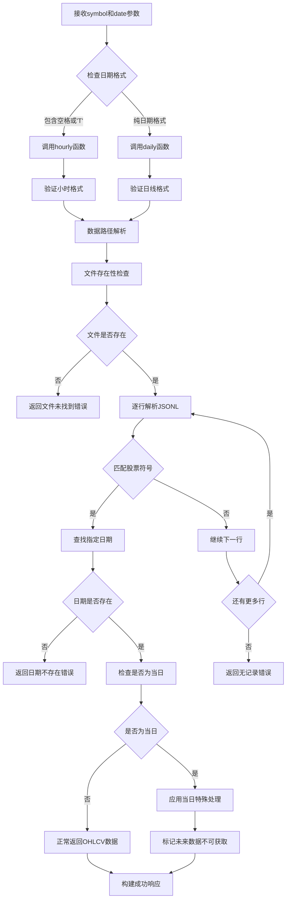
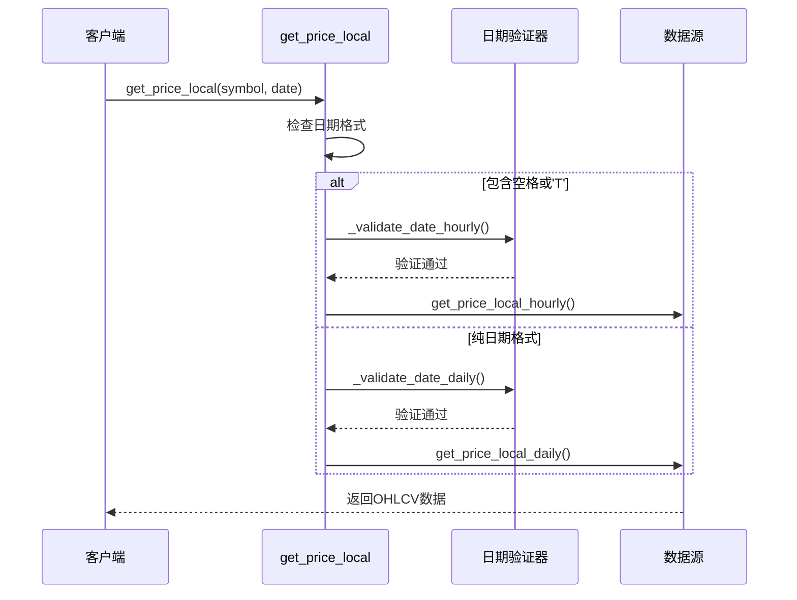
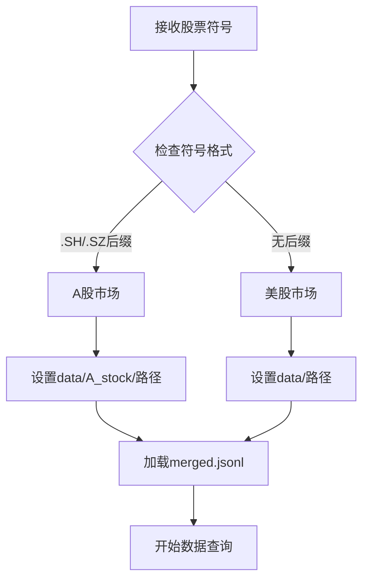
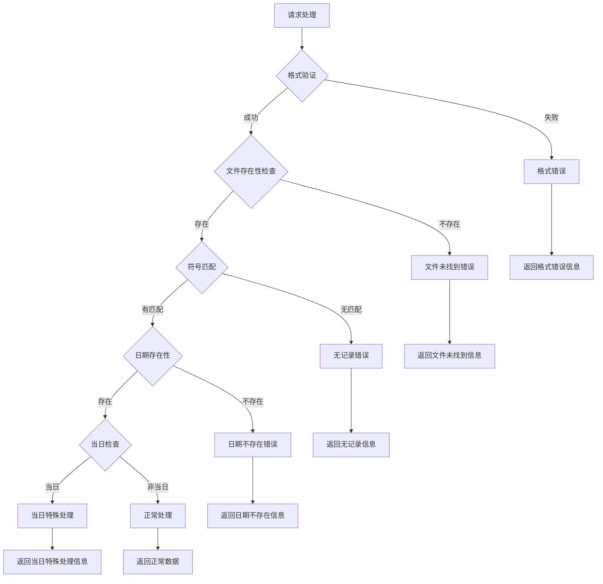

# 价格查询工具技术文档

<cite>
**本文档引用的文件**
- [tool_get_price_local.py](file://agent_tools/tool_get_price_local.py)
- [price_tools.py](file://tools/price_tools.py)
- [general_tools.py](file://tools/general_tools.py)
- [default_config.json](file://configs/default_config.json)
- [start_mcp_services.py](file://agent_tools/start_mcp_services.py)
- [merged.jsonl](file://data/merged.jsonl)
- [merged.jsonl](file://data/A_stock/merged.jsonl)
</cite>

## 目录
1. [概述](#概述)
2. [系统架构](#系统架构)
3. [核心功能模块](#核心功能模块)
4. [数据结构与格式](#数据结构与格式)
5. [日期格式自动路由机制](#日期格式自动路由机制)
6. [市场识别与数据路径解析](#市场识别与数据路径解析)
7. [当日数据特殊处理策略](#当日数据特殊处理策略)
8. [错误处理机制](#错误处理机制)
9. [性能优化与最佳实践](#性能优化与最佳实践)
10. [故障排除指南](#故障排除指南)

## 概述

价格查询工具是一个基于本地JSONL格式数据的高效价格查询系统，支持美股和A股市场的OHLCV（开盘价、最高价、最低价、收盘价、成交量）数据查询。该工具通过智能的日期格式检测机制，自动路由到相应的数据源，并提供完善的数据验证和错误处理机制。

### 主要特性

- **智能路由**：根据日期格式自动区分日线和小时线数据查询
- **多市场支持**：同时支持美股（US）和A股（CN）市场
- **数据完整性**：提供完整的OHLCV数据访问
- **实时性保护**：对当日数据实施特殊保护机制
- **健壮错误处理**：全面的异常处理和用户友好的错误提示

## 系统架构



**图表来源**
- [tool_get_price_local.py](file://agent_tools/tool_get_price_local.py#L71-L115)
- [tool_get_price_local.py](file://agent_tools/tool_get_price_local.py#L117-L181)
- [tool_get_price_local.py](file://agent_tools/tool_get_price_local.py#L183-L246)

## 核心功能模块

### get_price_local函数

这是系统的入口函数，负责接收用户请求并进行智能路由。



**图表来源**
- [tool_get_price_local.py](file://agent_tools/tool_get_price_local.py#L71-L115)
- [tool_get_price_local.py](file://agent_tools/tool_get_price_local.py#L117-L181)

### 数据验证机制

系统实现了严格的日期格式验证：

| 函数 | 验证格式 | 错误处理 |
|------|----------|----------|
| `_validate_date_daily` | `YYYY-MM-DD` | 抛出ValueError异常 |
| `_validate_date_hourly` | `YYYY-MM-DD HH:MM:SS` | 抛出ValueError异常 |

**章节来源**
- [tool_get_price_local.py](file://agent_tools/tool_get_price_local.py#L47-L58)

## 数据结构与格式

### JSONL数据格式

系统使用JSON Lines（JSONL）格式存储历史数据，每行是一个完整的JSON对象：

```json
{
  "Meta Data": {
    "1. Information": "Daily Prices (buy price, high, low, sell price) and Volumes",
    "2. Symbol": "AAPL",
    "3. Last Refreshed": "2025-10-31 15:00:00",
    "4. Interval": "60min",
    "5. Output Size": "Full size",
    "6. Time Zone": "US/Eastern"
  },
  "Time Series (60min)": {
    "2025-10-30 15:00:00": {
      "2. high": "271.8600",
      "3. low": "270.9950",
      "5. volume": "11077995",
      "1. buy price": "271.3500",
      "4. sell price": "271.3800"
    }
  }
}
```

### 字段映射表

| 字段名 | 描述 | 数据类型 | 示例值 |
|--------|------|----------|--------|
| `1. buy price` | 开盘价（买入价） | String | "271.3500" |
| `2. high` | 最高价 | String | "271.8600" |
| `3. low` | 最低价 | String | "270.9950" |
| `4. sell price` | 收盘价（卖出价） | String | "271.3800" |
| `5. volume` | 成交量 | String | "11077995" |

**章节来源**
- [merged.jsonl](file://data/merged.jsonl#L1-L50)
- [merged.jsonl](file://data/A_stock/merged.jsonl#L1-L50)

## 日期格式自动路由机制

### 路由决策流程



**图表来源**
- [tool_get_price_local.py](file://agent_tools/tool_get_price_local.py#L71-L115)

### 支持的日期格式

| 格式类型 | 格式模式 | 示例 | 用途 |
|----------|----------|------|------|
| 日线数据 | `YYYY-MM-DD` | `2025-10-30` | 日度价格查询 |
| 小时线数据 | `YYYY-MM-DD HH:MM:SS` | `2025-10-30 15:00:00` | 分时价格查询 |

**章节来源**
- [tool_get_price_local.py](file://agent_tools/tool_get_price_local.py#L47-L58)

## 市场识别与数据路径解析

### 自动市场识别机制

系统通过股票符号的后缀自动识别市场类型：



**图表来源**
- [tool_get_price_local.py](file://agent_tools/tool_get_price_local.py#L25-L45)

### 数据路径配置

| 市场类型 | 路径格式 | 示例 |
|----------|----------|------|
| 美股（US） | `{项目根目录}/data/merged.jsonl` | `/Users/berton/AI-Trader/data/merged.jsonl` |
| A股（CN） | `{项目根目录}/data/A_stock/merged.jsonl` | `/Users/berton/AI-Trader/data/A_stock/merged.jsonl` |

### 支持的A股股票代码示例

系统预定义了完整的A股市场股票列表，包括沪深两市的主要股票：

```python
all_sse_50_symbols = [
    "600519.SH", "601318.SH", "600036.SH", "601899.SH", "600900.SH",
    "601166.SH", "600276.SH", "600030.SH", "603259.SH", "688981.SH",
    # ... 更多股票代码
]
```

**章节来源**
- [price_tools.py](file://tools/price_tools.py#L121-L192)
- [tool_get_price_local.py](file://agent_tools/tool_get_price_local.py#L25-L45)

## 当日数据特殊处理策略

### 未来数据保护机制

为了防止未来数据泄露，系统对当日数据实施特殊的保护措施：

```mermaid
flowchart TD
A[查询当日数据] --> B{检查是否为当日}
B --> |是| C[标记所有字段为不可获取]
B --> |否| D[正常返回数据]
C --> E[返回特殊标记]
D --> F[返回标准OHLCV]
E --> G[字段标记为"您无法获取当前的xxx价格"]
F --> H[字段包含实际数值]
```

**图表来源**
- [tool_get_price_local.py](file://agent_tools/tool_get_price_local.py#L145-L181)

### 特殊处理字段

当日数据查询时，以下字段会被标记为不可获取：

| 字段 | 处理方式 | 原因 |
|------|----------|------|
| `high` | `"您无法获取当前的最高价"` | 防止未来价格泄露 |
| `low` | `"您无法获取当前的最低价"` | 防止未来价格泄露 |
| `close` | `"您无法获取下一个收盘价"` | 防止未来价格泄露 |
| `volume` | `"您无法获取当前的成交量"` | 防止未来价格泄露 |

**章节来源**
- [tool_get_price_local.py](file://agent_tools/tool_get_price_local.py#L145-L181)

## 错误处理机制

### 错误分类与处理

系统实现了多层次的错误处理机制：



**图表来源**
- [tool_get_price_local.py](file://agent_tools/tool_get_price_local.py#L117-L181)
- [tool_get_price_local.py](file://agent_tools/tool_get_price_local.py#L183-L246)

### 错误响应格式

所有错误都返回统一的JSON格式：

```json
{
    "error": "错误描述信息",
    "symbol": "股票代码",
    "date": "查询日期"
}
```

### 常见错误类型

| 错误类型 | 错误信息 | 处理方式 |
|----------|----------|----------|
| 格式错误 | `date must be in YYYY-MM-DD format` | 提示正确的日期格式 |
| 文件未找到 | `Data file not found: {路径}` | 检查数据文件路径 |
| 符号不存在 | `No records found for stock {symbol}` | 验证股票代码正确性 |
| 日期不存在 | `Data not found for date {date}` | 提供可用日期列表 |
| 当日查询 | `您无法获取当前的xxx价格` | 解释当日数据保护机制 |

**章节来源**
- [tool_get_price_local.py](file://agent_tools/tool_get_price_local.py#L47-L58)
- [tool_get_price_local.py](file://agent_tools/tool_get_price_local.py#L117-L181)

## 性能优化与最佳实践

### 查询优化策略

1. **逐行解析**：采用流式读取方式，避免一次性加载整个文件
2. **早期终止**：找到匹配符号后立即停止不必要的解析
3. **内存管理**：及时释放不再需要的数据对象

### 缓存建议

虽然当前实现没有内置缓存，但建议在高频率查询场景下考虑以下缓存策略：

- **符号缓存**：缓存股票代码到文件路径的映射关系
- **日期缓存**：缓存常用日期的数据片段
- **配置缓存**：缓存配置文件内容

### 批量查询优化

对于批量查询需求，建议：

1. **预加载数据**：一次性加载多个符号的相关数据
2. **并行处理**：利用多线程或异步处理提高效率
3. **数据分片**：按时间范围分片处理大量数据

## 故障排除指南

### 常见问题诊断

#### 1. 数据文件未找到

**症状**：返回 `Data file not found: {路径}` 错误

**解决方案**：
- 检查数据文件是否存在于指定路径
- 验证文件权限是否正确
- 确认项目根目录结构是否正确

#### 2. 日期格式错误

**症状**：返回 `date must be in YYYY-MM-DD format` 错误

**解决方案**：
- 确保日期格式符合要求
- 对于小时线数据，使用完整的时间格式
- 检查是否有多余的空格或字符

#### 3. 股票代码不存在

**症状**：返回 `No records found for stock {symbol}` 错误

**解决方案**：
- 验证股票代码拼写是否正确
- 确认股票代码格式是否符合要求
- 检查数据文件是否包含该股票的历史数据

#### 4. 日期不存在

**症状**：返回 `Data not found for date {date}` 错误

**解决方案**：
- 检查提供的日期是否有效
- 确认该日期在数据范围内
- 查看返回的可用日期列表

### 调试技巧

1. **启用详细日志**：在开发环境中添加调试输出
2. **数据验证**：手动检查JSONL文件的格式和内容
3. **边界测试**：测试极端情况如节假日、停牌日等

**章节来源**
- [tool_get_price_local.py](file://agent_tools/tool_get_price_local.py#L117-L181)
- [tool_get_price_local.py](file://agent_tools/tool_get_price_local.py#L183-L246)