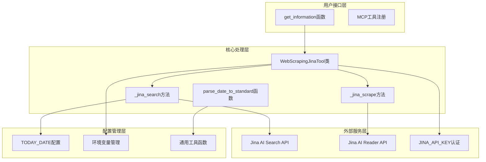
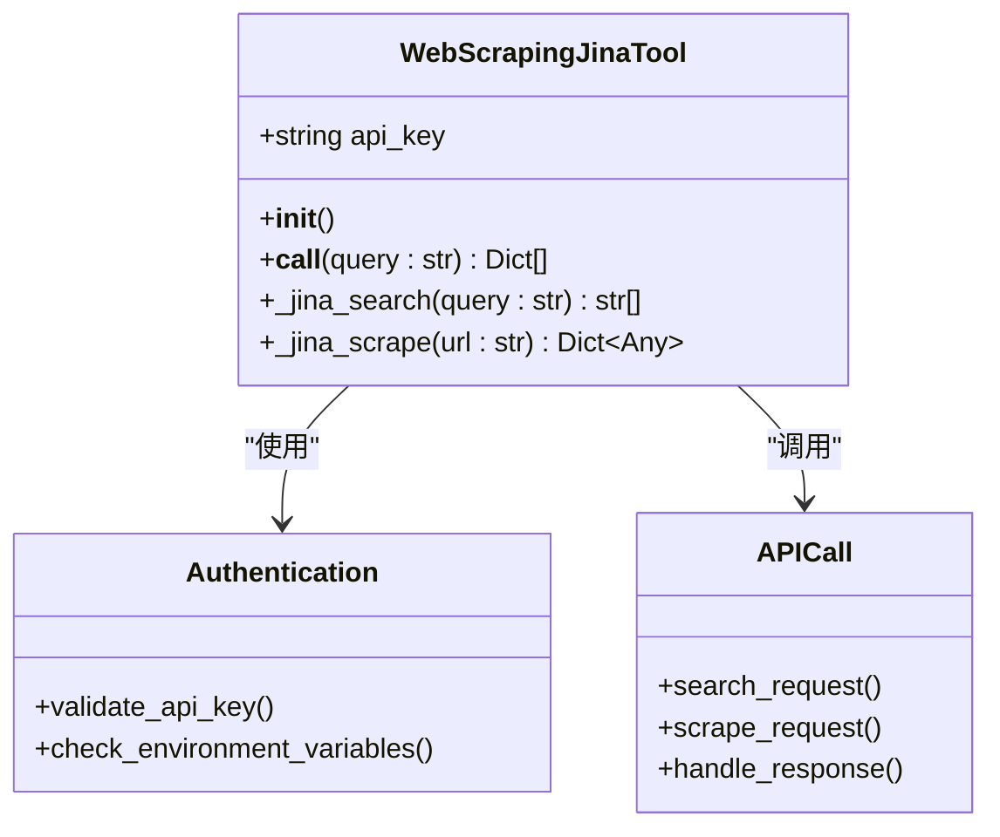
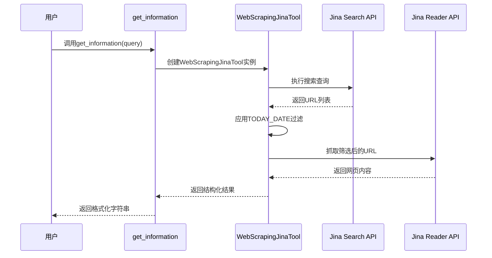
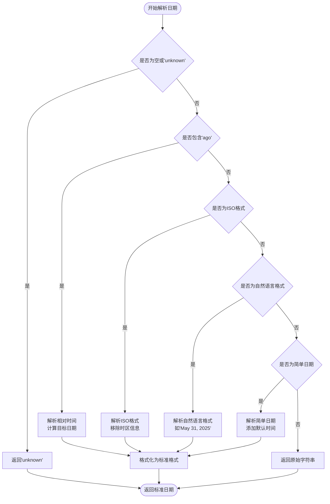
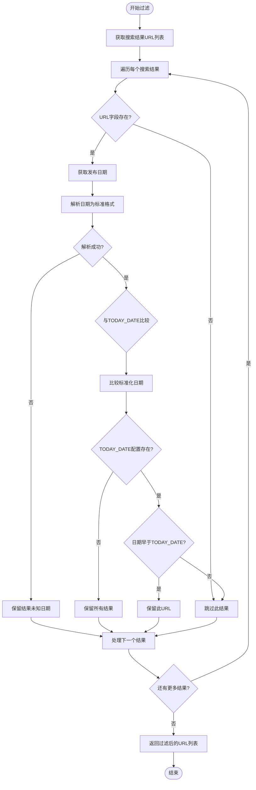
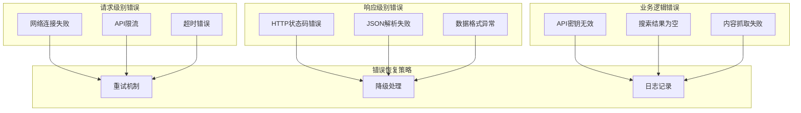

# 市场情报搜索工具集成文档

<cite>
**本文档中引用的文件**
- [tool_jina_search.py](file://agent_tools/tool_jina_search.py)
- [general_tools.py](file://tools/general_tools.py)
- [default_config.json](file://configs/default_config.json)
- [requirements.txt](file://requirements.txt)
- [README.md](file://README.md)
</cite>

## 目录
1. [简介](#简介)
2. [系统架构概览](#系统架构概览)
3. [核心组件分析](#核心组件分析)
4. [日期解析功能](#日期解析功能)
5. [搜索结果过滤机制](#搜索结果过滤机制)
6. [API调用与错误处理](#api调用与错误处理)
7. [使用示例](#使用示例)
8. [故障排除指南](#故障排除指南)
9. [总结](#总结)

## 简介

市场情报搜索工具是AI-Trader平台的核心组件之一，基于Jina AI的Search和Reader API实现智能网络搜索和网页内容抓取功能。该工具通过`get_information`函数提供结构化的市场信息检索能力，支持多种日期格式解析，并实施严格的时间过滤机制以确保信息的时效性和回测的准确性。

## 系统架构概览

市场情报搜索工具采用模块化设计，主要包含以下核心组件：



**图表来源**
- [tool_jina_search.py](file://agent_tools/tool_jina_search.py#L106-L281)
- [general_tools.py](file://tools/general_tools.py#L1-L171)

## 核心组件分析

### WebScrapingJinaTool类

`WebScrapingJinaTool`类是市场情报搜索工具的核心实现，负责协调Jina AI API的调用和数据处理。

#### 类初始化与认证



**图表来源**
- [tool_jina_search.py](file://agent_tools/tool_jina_search.py#L106-L143)

#### 主要方法工作流程

1. **__call__方法**：协调搜索和抓取流程
2. **_jina_search方法**：执行网络搜索并应用时间过滤
3. **_jina_scrape方法**：从搜索结果中提取网页内容

**章节来源**
- [tool_jina_search.py](file://agent_tools/tool_jina_search.py#L106-L143)

### get_information函数

`get_information`函数作为MCP工具的入口点，提供统一的市场信息检索接口：



**图表来源**
- [tool_jina_search.py](file://agent_tools/tool_jina_search.py#L223-L281)

**章节来源**
- [tool_jina_search.py](file://agent_tools/tool_jina_search.py#L223-L281)

## 日期解析功能

`parse_date_to_standard`函数实现了强大的日期格式转换能力，支持多种输入格式并统一输出标准格式。

### 支持的日期格式

| 输入格式 | 示例 | 输出格式 | 处理方式 |
|---------|------|----------|----------|
| ISO 8601 | `2025-10-01T08:19:28+00:00` | `2025-10-01 08:19:28` | 移除时区信息，解析ISO格式 |
| 相对时间 | `4 hours ago`, `1 day ago` | `2025-10-01 08:19:28` | 计算相对时间差 |
| 自然语言 | `May 31, 2025` | `2025-05-31 00:00:00` | 使用datetime.strptime解析 |
| 简单日期 | `2025-10-01` | `2025-10-01 00:00:00` | 添加默认时间部分 |

### 日期解析算法流程



**图表来源**
- [tool_jina_search.py](file://agent_tools/tool_jina_search.py#L18-L104)

**章节来源**
- [tool_jina_search.py](file://agent_tools/tool_jina_search.py#L18-L104)

## 搜索结果过滤机制

市场情报搜索工具实施了严格的时间过滤机制，确保只返回符合时效性要求的信息。

### 过滤逻辑详解



**图表来源**
- [tool_jina_search.py](file://agent_tools/tool_jina_search.py#L184-L221)

### 配置依赖关系

过滤机制依赖于`TODAY_DATE`配置项，该配置通过通用工具函数获取：

**章节来源**
- [tool_jina_search.py](file://agent_tools/tool_jina_search.py#L184-L221)
- [general_tools.py](file://tools/general_tools.py#L30-L35)

## API调用与错误处理

### Jina AI API调用结构

市场情报搜索工具通过两个主要API端点获取信息：

1. **搜索API**: `https://s.jina.ai/?q={query}&n=1`
2. **阅读器API**: `https://r.jina.ai/{url}`

### 错误处理策略



**图表来源**
- [tool_jina_search.py](file://agent_tools/tool_jina_search.py#L184-L221)

### 异常类型与处理

| 异常类型 | 处理方式 | 返回值 | 日志级别 |
|---------|----------|--------|----------|
| `requests.exceptions.RequestException` | 记录错误并返回空列表 | `[]` | ERROR |
| `ValueError` | 记录解析错误 | `[]` | ERROR |
| `Exception` | 记录通用错误 | `[]` | ERROR |
| `_jina_scrape异常` | 返回包含错误信息的结果 | `{"error": str(e)}` | ERROR |

**章节来源**
- [tool_jina_search.py](file://agent_tools/tool_jina_search.py#L184-L221)

## 使用示例

### 基本使用方法

```python
# 导入工具
from agent_tools.tool_jina_search import get_information

# 基本查询示例
result = get_information("最新科技股市场趋势")
print(result)

# 多个关键词查询
result = get_information("人工智能 AI 股票分析")
print(result)
```

### 结果结构化格式

成功查询返回的结构化结果包含以下字段：

| 字段名 | 描述 | 示例值 |
|-------|------|--------|
| URL | 原始网页链接 | `https://example.com/article` |
| Title | 网页标题 | `最新科技股市场趋势分析` |
| Description | 页面简短描述 | `本文分析了近期科技股市场的表现...` |
| Publish Time | 内容发布时间 | `2025-10-01 08:19:28` |
| Content | 主要文本内容（前1000字符） | `随着人工智能技术的快速发展...` |

### API调用示例

```python
# 完整的查询流程
def search_market_intelligence(topic):
    try:
        # 调用搜索工具
        results = get_information(topic)
        
        # 处理结果
        if "⚠️" in results:
            print(f"警告: {results}")
            return None
        
        if "❌" in results:
            print(f"错误: {results}")
            return None
            
        return results
    except Exception as e:
        print(f"搜索失败: {e}")
        return None
```

**章节来源**
- [tool_jina_search.py](file://agent_tools/tool_jina_search.py#L223-L281)

## 故障排除指南

### 常见问题与解决方案

#### 1. API密钥配置问题

**问题症状**：
```
ValueError: Jina API key not provided! Please set JINA_API_KEY environment variable.
```

**解决方案**：
```bash
# 设置环境变量
export JINA_API_KEY="your_jina_api_key_here"

# 或者在.env文件中配置
echo "JINA_API_KEY=your_jina_api_key_here" >> .env
```

#### 2. 网络连接问题

**问题症状**：
```
❌ Jina API request failed: HTTPSConnectionPool(host='s.jina.ai', port=443): Max retries exceeded
```

**解决方案**：
- 检查网络连接
- 验证防火墙设置
- 确认Jina AI服务可用性

#### 3. 搜索结果为空

**问题症状**：
```
⚠️ Search query '特定主题' found no results. May be network issue or API limitation.
```

**解决方案**：
- 尝试更通用的搜索关键词
- 检查TODAY_DATE配置是否正确
- 验证搜索查询语法

#### 4. 日期解析失败

**问题症状**：
```
⚠️ Jina API response format abnormal, query: test, response: {...}
```

**解决方案**：
- 检查搜索结果中的日期格式
- 确认TODAY_DATE配置格式正确
- 验证日期解析函数逻辑

### 性能优化建议

1. **合理设置查询频率**：避免过于频繁的API调用
2. **使用缓存机制**：对重复查询结果进行缓存
3. **监控API配额**：定期检查Jina AI API使用情况
4. **错误重试策略**：实现指数退避重试机制

**章节来源**
- [tool_jina_search.py](file://agent_tools/tool_jina_search.py#L102-L104)
- [tool_jina_search.py](file://agent_tools/tool_jina_search.py#L184-L221)

## 总结

市场情报搜索工具通过Jina AI的强大API能力，为AI-Trader平台提供了可靠的市场信息获取能力。其核心特性包括：

1. **多格式日期解析**：支持ISO 8601、相对时间和自然语言日期格式
2. **严格的时间过滤**：确保信息时效性，防止未来信息泄露
3. **健壮的错误处理**：完善的异常捕获和降级机制
4. **灵活的配置管理**：支持环境变量和运行时配置
5. **结构化结果输出**：提供统一的数据格式便于后续处理

该工具的成功集成显著提升了AI-Trader平台的市场情报获取能力和自动化交易决策质量，为AI模型提供了及时、准确的市场信息支持。