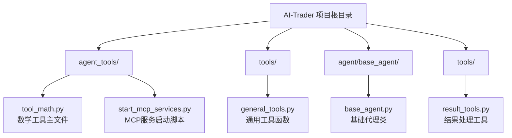
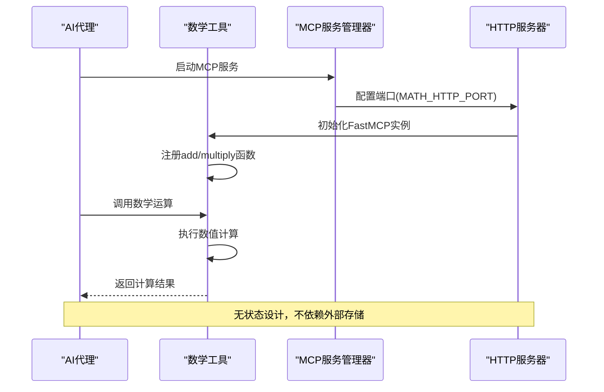
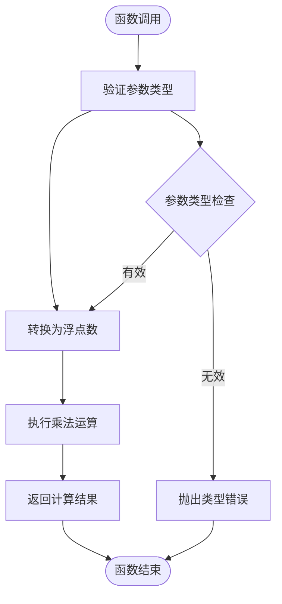
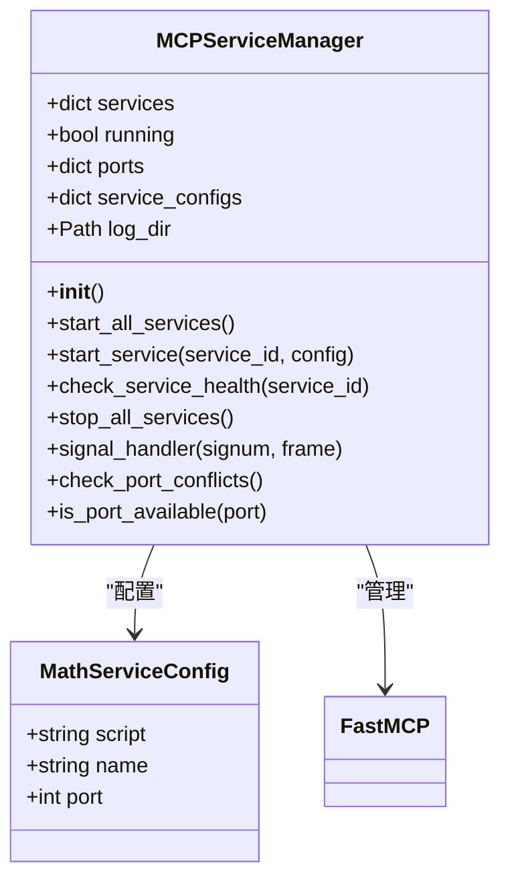
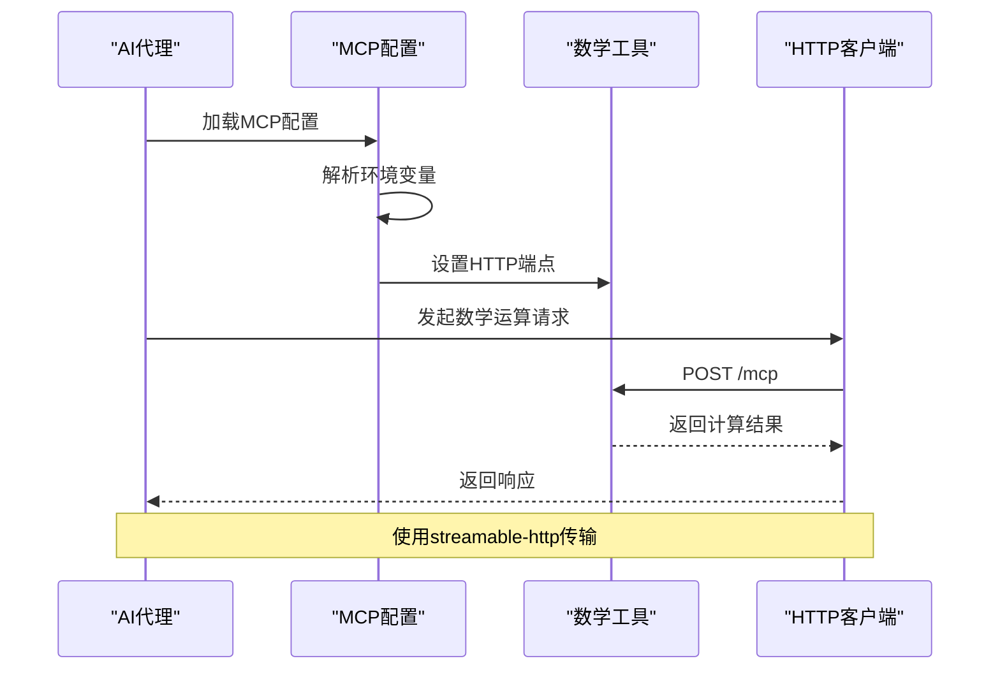
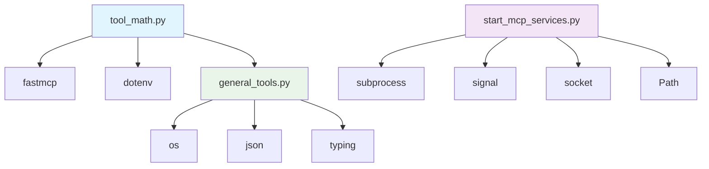

# 数学计算工具API文档

<cite>
**本文档中引用的文件**
- [tool_math.py](file://agent_tools/tool_math.py)
- [start_mcp_services.py](file://agent_tools/start_mcp_services.py)
- [general_tools.py](file://tools/general_tools.py)
- [base_agent.py](file://agent/base_agent/base_agent.py)
- [result_tools.py](file://tools/result_tools.py)
</cite>

## 目录
1. [简介](#简介)
2. [项目结构](#项目结构)
3. [核心组件](#核心组件)
4. [架构概览](#架构概览)
5. [详细组件分析](#详细组件分析)
6. [依赖关系分析](#依赖关系分析)
7. [性能考虑](#性能考虑)
8. [故障排除指南](#故障排除指南)
9. [结论](#结论)

## 简介

数学计算工具是一个轻量级的API服务，为AI代理提供基础的算术运算能力。该工具包含两个核心函数：`add`（加法）和`multiply`（乘法），支持浮点数和整数运算。作为MCP（Model Context Protocol）工具链中最简单的服务组件，它具有无状态特性，不依赖外部数据源或配置文件，在AI代理的决策过程中发挥着关键作用。

该工具的主要应用场景包括：
- 投资组合权重计算
- 预期收益估算
- 风险敞口评估
- 资产价值折算
- 绩效指标计算

## 项目结构

数学计算工具在项目中的组织结构清晰明确：

**图表来源**
- [tool_math.py](file://agent_tools/tool_math.py#L1-L45)
- [start_mcp_services.py](file://agent_tools/start_mcp_services.py#L1-L294)

**章节来源**
- [tool_math.py](file://agent_tools/tool_math.py#L1-L45)
- [start_mcp_services.py](file://agent_tools/start_mcp_services.py#L1-L294)

## 核心组件

数学计算工具的核心组件包括：

### 主要功能函数
- **add()**: 基础加法运算函数
- **multiply()**: 基础乘法运算函数

### 服务管理组件
- **FastMCP框架**: 提供MCP协议支持
- **HTTP服务器**: 支持流式HTTP传输
- **环境变量配置**: 可通过MATH_HTTP_PORT自定义端口

### 工具集成组件
- **MCP服务管理器**: 统一管理多个MCP服务
- **端口配置系统**: 支持灵活的端口分配
- **健康检查机制**: 确保服务正常运行

**章节来源**
- [tool_math.py](file://agent_tools/tool_math.py#L10-L35)
- [start_mcp_services.py](file://agent_tools/start_mcp_services.py#L20-L50)

## 架构概览

数学计算工具采用微服务架构，通过MCP协议实现与AI代理的通信：

**图表来源**
- [tool_math.py](file://agent_tools/tool_math.py#L40-L45)
- [start_mcp_services.py](file://agent_tools/start_mcp_services.py#L100-L150)

## 详细组件分析

### 数学运算函数

#### add() 函数分析

`add()` 函数提供基础的加法运算功能：

**图表来源**
- [tool_math.py](file://agent_tools/tool_math.py#L12-L20)

**函数特点**：
- 支持整数和浮点数输入
- 自动类型转换为浮点数
- 直接返回计算结果
- 不记录操作日志（注释掉的日志功能）

#### multiply() 函数分析

`multiply()` 函数提供基础的乘法运算功能：

**图表来源**
- [tool_math.py](file://agent_tools/tool_math.py#L23-L31)

**函数特点**：
- 支持整数和浮点数输入
- 自动类型转换为浮点数
- 直接返回计算结果
- 不记录操作日志（注释掉的日志功能）

**章节来源**
- [tool_math.py](file://agent_tools/tool_math.py#L10-L35)

### MCP服务管理器

#### 服务启动流程

MCP服务管理器负责数学工具服务的启动和管理：

**图表来源**
- [start_mcp_services.py](file://agent_tools/start_mcp_services.py#L20-L60)

#### 端口配置系统

服务管理器支持灵活的端口配置：

| 服务名称 | 默认端口 | 环境变量 |
|---------|---------|---------|
| Math | 8000 | MATH_HTTP_PORT |
| Search | 8001 | SEARCH_HTTP_PORT |
| Trade | 8002 | TRADE_HTTP_PORT |
| Price | 8003 | GETPRICE_HTTP_PORT |

**章节来源**
- [start_mcp_services.py](file://agent_tools/start_mcp_services.py#L20-L50)

### AI代理集成

#### MCP配置集成

AI代理通过MCP协议访问数学工具：

**图表来源**
- [base_agent.py](file://agent/base_agent/base_agent.py#L295-L305)

**章节来源**
- [base_agent.py](file://agent/base_agent/base_agent.py#L290-L310)

## 依赖关系分析

数学计算工具的依赖关系简洁明了：

**图表来源**
- [tool_math.py](file://agent_tools/tool_math.py#L1-L10)
- [start_mcp_services.py](file://agent_tools/start_mcp_services.py#L1-L20)

**主要依赖项**：
- **fastmcp**: 提供MCP协议支持
- **dotenv**: 环境变量加载
- **general_tools**: 通用配置工具
- **subprocess**: 进程管理
- **signal**: 信号处理

**章节来源**
- [tool_math.py](file://agent_tools/tool_math.py#L1-L10)
- [start_mcp_services.py](file://agent_tools/start_mcp_services.py#L1-L20)

## 性能考虑

数学计算工具的设计遵循以下性能原则：

### 无状态设计
- 每次计算都是独立的，不保存状态
- 不依赖外部数据库或缓存
- 内存占用最小化

### 快速响应
- 直接数值计算，无中间处理
- HTTP服务器采用流式传输
- 最小化的启动时间

### 资源效率
- 单进程运行，资源占用低
- 端口复用机制避免冲突
- 日志记录可选（注释掉）

## 故障排除指南

### 常见问题及解决方案

#### 服务启动失败
**症状**: 数学工具服务无法启动
**原因**: 端口被占用或权限不足
**解决方案**: 
1. 检查端口占用情况：`netstat -an | grep 8000`
2. 修改环境变量：`export MATH_HTTP_PORT=8001`
3. 使用端口冲突检测功能

#### 连接超时
**症状**: AI代理无法连接到数学工具
**原因**: 网络配置或防火墙限制
**解决方案**:
1. 验证本地网络连接
2. 检查防火墙设置
3. 确认端口配置正确

#### 类型转换错误
**症状**: 数学运算返回意外结果
**原因**: 输入参数类型不匹配
**解决方案**:
1. 确保输入为数字类型
2. 使用显式类型转换
3. 检查参数传递格式

**章节来源**
- [start_mcp_services.py](file://agent_tools/start_mcp_services.py#L60-L100)
- [tool_math.py](file://agent_tools/tool_math.py#L12-L35)

## 结论

数学计算工具作为AI-Trader项目的核心基础设施，展现了简洁而强大的设计理念：

### 主要优势
1. **极简设计**: 仅包含两个核心函数，易于理解和维护
2. **高性能**: 无状态设计确保快速响应
3. **可扩展性**: 基于MCP协议，便于集成其他工具
4. **可靠性**: 完善的服务管理和健康检查机制

### 应用价值
- 为AI代理提供基础算术运算能力
- 支持复杂的金融计算场景
- 作为MCP工具链的基础组件
- 具有良好的可测试性和可监控性

### 发展方向
- 支持更多数学运算函数
- 增强错误处理和日志记录
- 优化并发处理能力
- 扩展到分布式部署模式

数学计算工具的成功实现证明了"简单即美"的设计哲学，在保证功能完整性的同时最大化了系统的可靠性和可维护性。