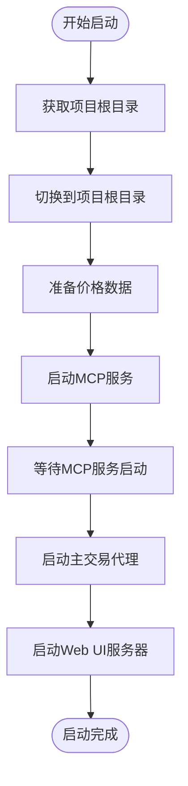

# 更新MCP服务启动脚本

<cite>
**本文档中引用的文件**
- [agent_tools/start_mcp_services.py](file://agent_tools/start_mcp_services.py)
- [scripts/main.sh](file://scripts/main.sh)
- [scripts/start_ui.sh](file://scripts/start_ui.sh)
- [main.py](file://main.py)
- [requirements.txt](file://requirements.txt)
- [agent_tools/tool_math.py](file://agent_tools/tool_math.py)
- [agent_tools/tool_trade.py](file://agent_tools/tool_trade.py)
- [agent_tools/tool_get_price_local.py](file://agent_tools/tool_get_price_local.py)
- [agent_tools/tool_alphavantage_news.py](file://agent_tools/tool_alphavantage_news.py)
- [configs/default_config.json](file://configs/default_config.json)
- [configs/astock_config.json](file://configs/astock_config.json)
- [scripts/main_step1.sh](file://scripts/main_step1.sh)
- [scripts/main_step2.sh](file://scripts/main_step2.sh)
- [scripts/main_step3.sh](file://scripts/main_step3.sh)
- [scripts/main_a_stock_step1.sh](file://scripts/main_a_stock_step1.sh)
</cite>

## 目录
1. [简介](#简介)
2. [项目架构概览](#项目架构概览)
3. [MCP服务系统](#mcp服务系统)
4. [核心组件分析](#核心组件分析)
5. [启动脚本详解](#启动脚本详解)
6. [端口配置与管理](#端口配置与管理)
7. [服务监控与健康检查](#服务监控与健康检查)
8. [故障排除指南](#故障排除指南)
9. [最佳实践建议](#最佳实践建议)
10. [总结](#总结)

## 简介

MCP（Model Context Protocol）服务启动脚本是AI交易系统的核心组件，负责协调和管理四个关键的MCP服务：数学计算服务、搜索服务、交易工具服务和本地价格服务。这些服务为AI交易代理提供了强大的工具支持，实现了复杂的交易策略执行和市场数据分析功能。

本文档详细介绍了MCP服务启动脚本的设计原理、实现细节和使用方法，帮助开发者理解和维护这个重要的基础设施组件。

## 项目架构概览

AI交易系统采用模块化架构设计，MCP服务启动脚本作为系统的核心协调器，连接着各个子系统：


**图表来源**
- [main.py](file://main.py#L1-L50)
- [agent_tools/start_mcp_services.py](file://agent_tools/start_mcp_services.py#L20-L40)

**章节来源**
- [main.py](file://main.py#L1-L296)
- [agent_tools/start_mcp_services.py](file://agent_tools/start_mcp_services.py#L1-L295)

## MCP服务系统

### 服务架构设计

MCP服务系统包含四个核心服务，每个服务都有特定的功能和用途：


**图表来源**
- [agent_tools/start_mcp_services.py](file://agent_tools/start_mcp_services.py#L20-L40)
- [agent_tools/tool_math.py](file://agent_tools/tool_math.py#L1-L45)
- [agent_tools/tool_trade.py](file://agent_tools/tool_trade.py#L1-L50)
- [agent_tools/tool_get_price_local.py](file://agent_tools/tool_get_price_local.py#L1-L50)
- [agent_tools/tool_alphavantage_news.py](file://agent_tools/tool_alphavantage_news.py#L1-L50)

### 服务配置表

| 服务名称 | 脚本文件 | 默认端口 | 功能描述 |
|---------|----------|----------|----------|
| Math | tool_math.py | 8000 | 提供基本数学运算功能 |
| Search | tool_alphavantage_news.py | 8001 | 市场新闻搜索和分析 |
| TradeTools | tool_trade.py | 8002 | 交易操作和持仓管理 |
| LocalPrices | tool_get_price_local.py | 8003 | 本地历史价格数据查询 |

**章节来源**
- [agent_tools/start_mcp_services.py](file://agent_tools/start_mcp_services.py#L26-L40)

## 核心组件分析

### MCPServiceManager类

MCPServiceManager是整个MCP服务系统的核心控制器，负责服务的生命周期管理和状态监控：


**图表来源**
- [agent_tools/start_mcp_services.py](file://agent_tools/start_mcp_services.py#L157-L220)

#### 关键功能特性

1. **端口冲突检测**：自动检测端口占用情况并提供解决方案
2. **服务健康监控**：实时检查服务运行状态
3. **信号处理**：优雅处理中断信号和服务终止
4. **日志管理**：统一的日志记录和文件管理
5. **状态报告**：详细的运行状态信息

**章节来源**
- [agent_tools/start_mcp_services.py](file://agent_tools/start_mcp_services.py#L20-L295)

### 数学服务（Math Service）

数学服务提供基础的算术运算功能，支持交易计算和数据分析：


**图表来源**
- [agent_tools/tool_math.py](file://agent_tools/tool_math.py#L14-L45)

**章节来源**
- [agent_tools/tool_math.py](file://agent_tools/tool_math.py#L1-L45)

### 交易服务（Trade Service）

交易服务是最复杂的服务之一，负责模拟真实的股票交易操作：


**图表来源**
- [agent_tools/tool_trade.py](file://agent_tools/tool_trade.py#L44-L176)

**章节来源**
- [agent_tools/tool_trade.py](file://agent_tools/tool_trade.py#L1-L372)

### 价格服务（Price Service）

价格服务提供历史价格数据查询功能，支持日线和小时线数据：


**图表来源**
- [agent_tools/tool_get_price_local.py](file://agent_tools/tool_get_price_local.py#L60-L226)

**章节来源**
- [agent_tools/tool_get_price_local.py](file://agent_tools/tool_get_price_local.py#L1-L285)

### 搜索服务（Search Service）

搜索服务集成Alpha Vantage API，提供市场新闻和分析功能：


**图表来源**
- [agent_tools/tool_alphavantage_news.py](file://agent_tools/tool_alphavantage_news.py#L162-L216)

**章节来源**
- [agent_tools/tool_alphavantage_news.py](file://agent_tools/tool_alphavantage_news.py#L1-L320)

## 启动脚本详解

### 主启动脚本（main.sh）

主启动脚本定义了完整的AI交易系统启动流程：



**图表来源**
- [scripts/main.sh](file://scripts/main.sh#L1-L39)

#### 启动步骤详解

1. **数据准备阶段**（第16-19行）
   - 切换到数据目录
   - 执行价格数据获取
   - 合并JSONL格式的数据文件

2. **MCP服务启动阶段**（第22-25行）
   - 切换到agent_tools目录
   - 调用MCP服务启动脚本

3. **等待阶段**（第27-28行）
   - 等待MCP服务完全启动

4. **主代理启动阶段**（第30-31行）
   - 使用默认配置启动主交易代理

5. **Web UI启动阶段**（第35-39行）
   - 启动静态文件服务器

**章节来源**
- [scripts/main.sh](file://scripts/main.sh#L1-L39)

### 分步启动脚本

系统提供了分步启动脚本，便于调试和维护：

#### 数据准备脚本（main_step1.sh）


**图表来源**
- [scripts/main_step1.sh](file://scripts/main_step1.sh#L1-L16)

#### MCP服务启动脚本（main_step2.sh）


**图表来源**
- [scripts/main_step2.sh](file://scripts/main_step2.sh#L1-L13)

#### 代理启动脚本（main_step3.sh）


**图表来源**
- [scripts/main_step3.sh](file://scripts/main_step3.sh#L1-L17)

**章节来源**
- [scripts/main_step1.sh](file://scripts/main_step1.sh#L1-L16)
- [scripts/main_step2.sh](file://scripts/main_step2.sh#L1-L13)
- [scripts/main_step3.sh](file://scripts/main_step3.sh#L1-L17)

### A股专用启动脚本

针对A股市场的特殊需求，系统提供了专门的启动脚本：


**图表来源**
- [scripts/main_a_stock_step1.sh](file://scripts/main_a_stock_step1.sh#L1-L21)

**章节来源**
- [scripts/main_a_stock_step1.sh](file://scripts/main_a_stock_step1.sh#L1-L21)

## 端口配置与管理

### 默认端口分配

MCP服务使用以下默认端口配置：

| 服务 | 端口 | 环境变量 | 描述 |
|------|------|----------|------|
| Math | 8000 | MATH_HTTP_PORT | 数学计算服务 |
| Search | 8001 | SEARCH_HTTP_PORT | 新闻搜索服务 |
| Trade | 8002 | TRADE_HTTP_PORT | 交易工具服务 |
| Price | 8003 | GETPRICE_HTTP_PORT | 价格查询服务 |

### 端口冲突检测机制


**图表来源**
- [agent_tools/start_mcp_services.py](file://agent_tools/start_mcp_services.py#L69-L102)

### 动态端口调整

当检测到端口冲突时，系统提供自动修复功能：

1. **冲突检测**：扫描所有服务端口
2. **冲突报告**：列出所有冲突的服务和端口
3. **自动修复**：为冲突端口寻找可用的新端口
4. **配置更新**：更新服务配置以反映新的端口设置

**章节来源**
- [agent_tools/start_mcp_services.py](file://agent_tools/start_mcp_services.py#L69-L102)

## 服务监控与健康检查

### 健康检查机制

MCP服务管理系统实现了多层次的健康检查机制：


**图表来源**
- [agent_tools/start_mcp_services.py](file://agent_tools/start_mcp_services.py#L132-L156)

### 实时监控功能

1. **进程监控**：定期检查各服务进程的运行状态
2. **网络监控**：验证服务端口的可访问性
3. **状态报告**：实时显示服务运行状态
4. **异常处理**：自动检测和报告服务异常

### 服务状态管理


**图表来源**
- [agent_tools/start_mcp_services.py](file://agent_tools/start_mcp_services.py#L221-L247)

**章节来源**
- [agent_tools/start_mcp_services.py](file://agent_tools/start_mcp_services.py#L132-L247)

## 故障排除指南

### 常见问题及解决方案

#### 1. 端口冲突问题

**症状**：服务启动失败，提示端口已被占用

**解决方案**：
```bash
# 检查端口占用情况
netstat -tulpn | grep :8000

# 或使用系统命令
lsof -i :8000
```

**自动解决方案**：
```bash
# 运行MCP服务时，系统会自动提示
python agent_tools/start_mcp_services.py
# 输入'y'接受自动端口调整
```

#### 2. 服务启动失败

**诊断步骤**：
1. 检查日志文件：`../logs/`
2. 查看具体错误信息
3. 验证依赖项安装

**解决方案**：
```bash
# 检查服务状态
python agent_tools/start_mcp_services.py status

# 查看详细日志
tail -f ../logs/math.log
```

#### 3. 网络连接问题

**症状**：代理无法连接到MCP服务

**解决方案**：
1. 验证服务是否在正确端口运行
2. 检查防火墙设置
3. 确认网络连通性

#### 4. 配置文件问题

**症状**：服务启动但功能异常

**解决方案**：
1. 检查配置文件格式
2. 验证必需字段是否存在
3. 确认环境变量设置

### 调试技巧

1. **启用详细日志**：修改日志级别获取更多信息
2. **单独测试服务**：逐个启动服务进行隔离测试
3. **检查依赖关系**：确保所有依赖项正确安装
4. **验证网络配置**：确认网络设置和防火墙规则

**章节来源**
- [agent_tools/start_mcp_services.py](file://agent_tools/start_mcp_services.py#L265-L279)

## 最佳实践建议

### 部署最佳实践

1. **环境隔离**
   - 使用虚拟环境隔离依赖
   - 为不同环境使用不同的配置文件
   - 避免生产环境和开发环境混用

2. **资源管理**
   - 监控内存和CPU使用情况
   - 设置合理的超时时间
   - 实现优雅的关闭机制

3. **安全考虑**
   - 限制服务访问权限
   - 使用HTTPS传输敏感数据
   - 定期更新依赖项

### 性能优化

1. **并发控制**
   - 合理设置服务并发数
   - 实现请求队列管理
   - 避免资源竞争

2. **缓存策略**
   - 缓存频繁访问的数据
   - 实现智能缓存失效机制
   - 监控缓存命中率

3. **网络优化**
   - 使用连接池减少连接开销
   - 实现请求重试机制
   - 优化网络超时设置

### 监控和维护

1. **健康监控**
   - 实现实时健康检查
   - 设置告警机制
   - 定期性能评估

2. **日志管理**
   - 结构化日志记录
   - 日志轮转和归档
   - 关键事件追踪

3. **版本管理**
   - 控制服务版本升级
   - 实现回滚机制
   - 测试新版本兼容性

## 总结

MCP服务启动脚本是AI交易系统的重要基础设施，它提供了完整的服务生命周期管理功能。通过本文档的详细介绍，我们可以看到：

1. **模块化设计**：四个独立的服务模块各司其职，协同工作
2. **健壮性保障**：完善的错误处理和恢复机制
3. **易用性考虑**：自动化的端口管理和状态监控
4. **扩展性支持**：灵活的配置和插件机制

这个系统不仅满足了当前的业务需求，还为未来的功能扩展和性能优化奠定了坚实的基础。对于开发者而言，理解这个启动脚本的工作原理和最佳实践，有助于更好地维护和扩展AI交易系统。

随着AI技术的不断发展，MCP服务系统也将持续演进，为更复杂的交易策略和更智能的市场分析提供强有力的支持。