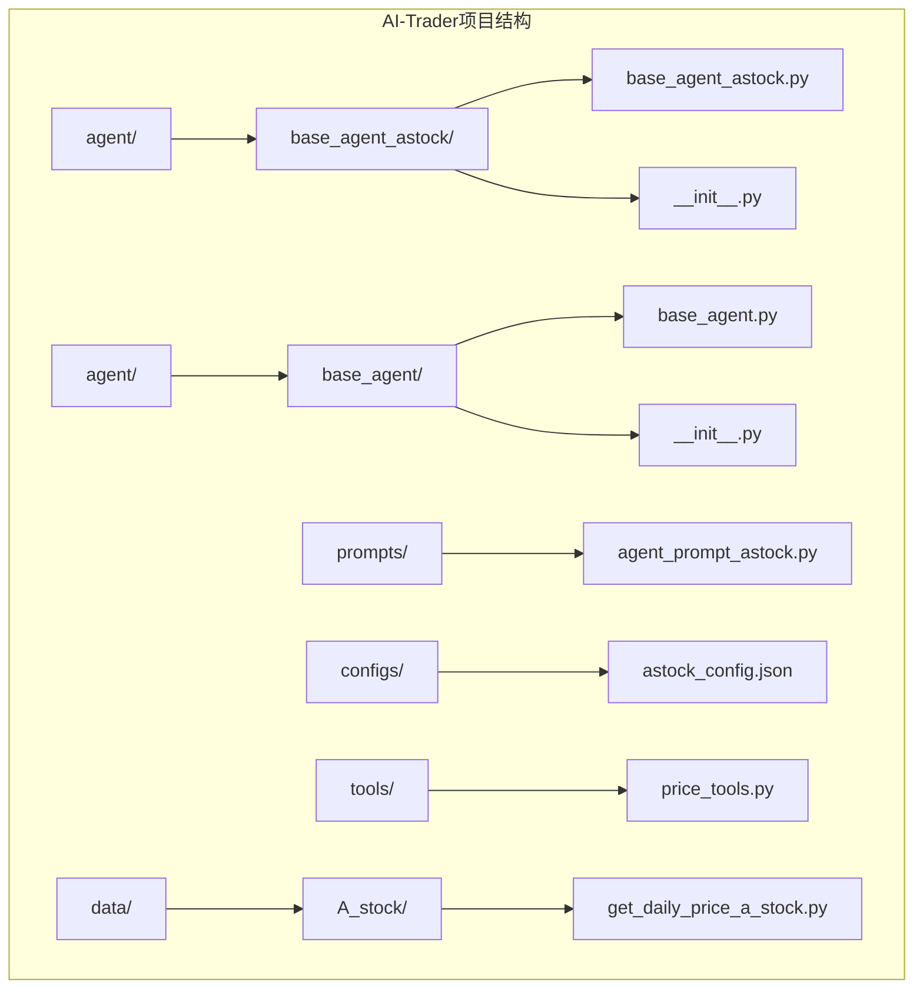
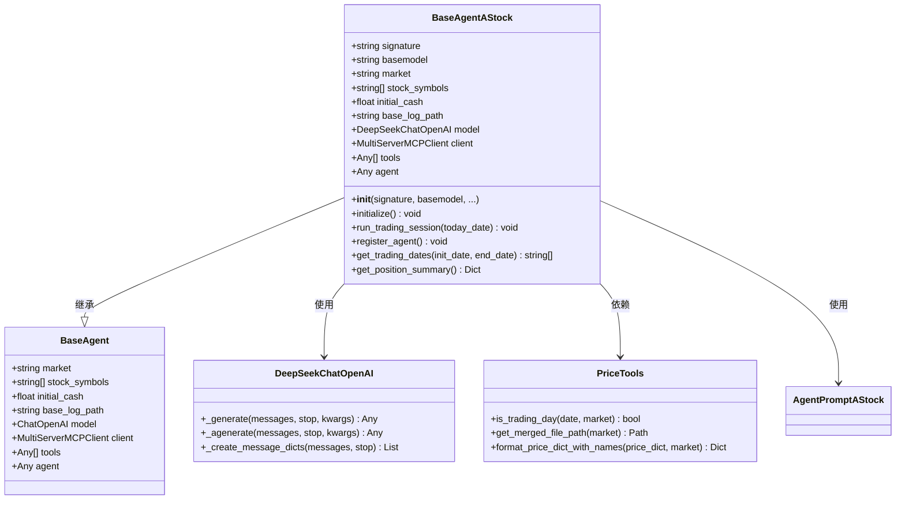
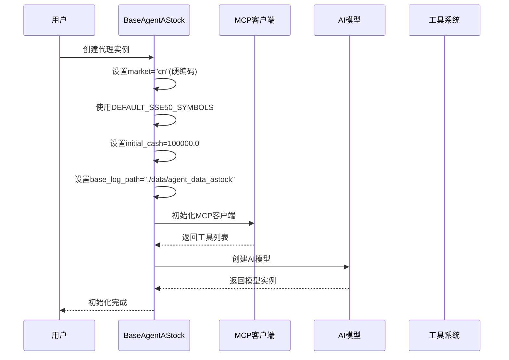
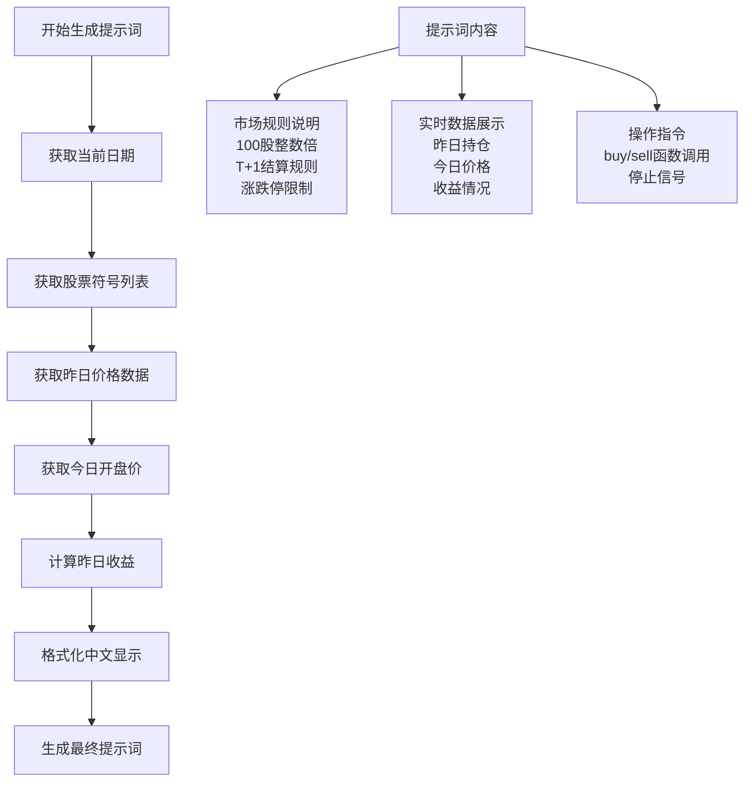
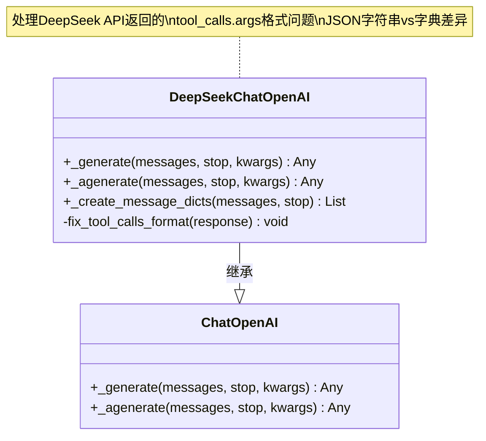
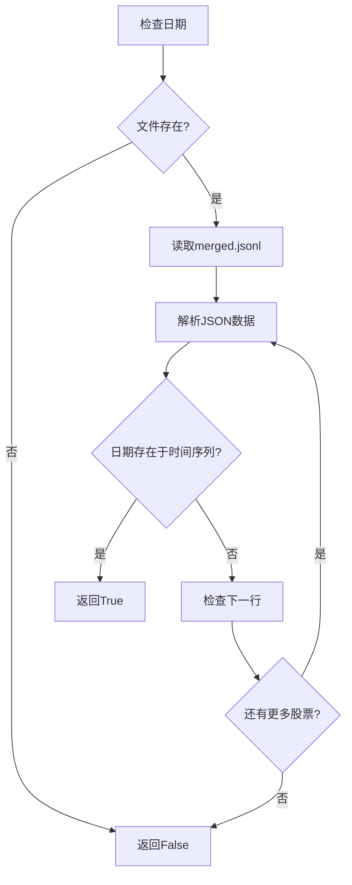
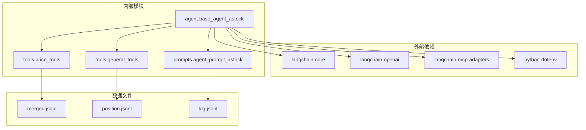

# A股交易代理 (BaseAgentAStock)

<cite>
**本文档中引用的文件**
- [base_agent_astock.py](file://agent/base_agent_astock/base_agent_astock.py)
- [base_agent.py](file://agent/base_agent/base_agent.py)
- [agent_prompt_astock.py](file://prompts/agent_prompt_astock.py)
- [astock_config.json](file://configs/astock_config.json)
- [price_tools.py](file://tools/price_tools.py)
- [general_tools.py](file://tools/general_tools.py)
- [get_daily_price_a_stock.py](file://data/A_stock/get_daily_price_a_stock.py)
</cite>

## 目录
1. [简介](#简介)
2. [项目结构](#项目结构)
3. [核心组件](#核心组件)
4. [架构概览](#架构概览)
5. [详细组件分析](#详细组件分析)
6. [依赖关系分析](#依赖关系分析)
7. [性能考虑](#性能考虑)
8. [故障排除指南](#故障排除指南)
9. [结论](#结论)

## 简介

BaseAgentAStock是AI-Trader项目中专门为A股市场设计的交易代理基类。该类针对中国A股市场的特殊规则进行了深度适配，包括T+1交易制度、100股整数倍交易单位等核心特性。它通过硬编码market参数为'cn'，默认使用上证50成分股作为股票池，并提供了专门的提示词模板进行市场分析。

该类与BaseAgent保持继承关系，但在处理中文用户查询、日志记录和数据路径方面实现了本地化适配，确保与美股代理的配置完全隔离。

## 项目结构

AI-Trader项目采用模块化架构，A股交易代理位于专门的目录结构中：

**图表来源**
- [base_agent_astock.py](file://agent/base_agent_astock/base_agent_astock.py#L1-L50)
- [base_agent.py](file://agent/base_agent/base_agent.py#L1-L50)

**章节来源**
- [base_agent_astock.py](file://agent/base_agent_astock/base_agent_astock.py#L1-L50)
- [base_agent.py](file://agent/base_agent/base_agent.py#L1-L50)

## 核心组件

BaseAgentAStock包含以下核心组件：

### 1. 基础设施组件
- **MCP客户端管理**：负责与多协议客户端服务的连接
- **AI模型集成**：支持多种大语言模型，包括DeepSeek API兼容性
- **工具系统**：集成数学计算、股票价格获取、搜索引擎和交易工具

### 2. A股市场适配组件
- **默认股票池**：内置48只上证50成分股代码
- **交易规则验证**：实现T+1结算和100股整数倍交易规则
- **市场特定提示词**：专门的A股市场分析模板

### 3. 数据管理组件
- **专用数据路径**：隔离的A股交易数据存储
- **位置管理系统**：持仓和现金余额跟踪
- **日志记录系统**：完整的交易过程记录

**章节来源**
- [base_agent_astock.py](file://agent/base_agent_astock/base_agent_astock.py#L107-L178)
- [base_agent_astock.py](file://agent/base_agent_astock/base_agent_astock.py#L214-L235)

## 架构概览

BaseAgentAStock采用分层架构设计，确保A股市场的特殊需求得到充分满足：

**图表来源**
- [base_agent_astock.py](file://agent/base_agent_astock/base_agent_astock.py#L30-L100)
- [base_agent.py](file://agent/base_agent/base_agent.py#L30-L100)
- [price_tools.py](file://tools/price_tools.py#L191-L229)

## 详细组件分析

### 初始化组件

BaseAgentAStock的初始化过程体现了A股市场的特殊要求：

**图表来源**
- [base_agent_astock.py](file://agent/base_agent_astock/base_agent_astock.py#L130-L214)

#### 关键特性说明

1. **市场硬编码**：无论传入什么值，`market`参数始终被设置为"cn"
2. **默认股票池**：使用48只上证50成分股，确保A股市场的代表性
3. **初始资金**：设置10万人民币的初始资金，符合A股投资习惯
4. **专用数据路径**：使用`./data/agent_data_astock`隔离A股数据

**章节来源**
- [base_agent_astock.py](file://agent/base_agent_astock/base_agent_astock.py#L130-L214)

### A股专用提示词系统

BaseAgentAStock实现了专门的提示词模板，用于A股市场分析：

**图表来源**
- [agent_prompt_astock.py](file://prompts/agent_prompt_astock.py#L60-L134)

#### 提示词特色功能

1. **中文本地化**：所有提示词和错误消息都使用中文
2. **市场规则详解**：清晰说明A股特有的交易规则
3. **实时数据整合**：动态获取并展示最新的市场数据
4. **中文股票名称**：自动添加中文股票名称便于理解

**章节来源**
- [agent_prompt_astock.py](file://prompts/agent_prompt_astock.py#L60-L134)

### DeepSeek API兼容性

BaseAgentAStock特别针对DeepSeek API进行了优化：

**图表来源**
- [base_agent_astock.py](file://agent/base_agent_astock/base_agent_astock.py#L30-L81)

#### 兼容性处理机制

1. **自动检测**：根据模型名称自动识别是否为DeepSeek
2. **格式修复**：将JSON字符串转换为字典格式
3. **向后兼容**：不影响其他模型的正常工作

**章节来源**
- [base_agent_astock.py](file://agent/base_agent_astock/base_agent_astock.py#L30-L81)

### 交易日验证系统

BaseAgentAStock实现了精确的A股交易日验证：

**图表来源**
- [price_tools.py](file://tools/price_tools.py#L191-L229)

#### 验证特点

1. **多股票验证**：遍历所有股票确认交易日
2. **文件完整性**：确保数据文件完整可用
3. **异常处理**：优雅处理各种错误情况

**章节来源**
- [price_tools.py](file://tools/price_tools.py#L191-L229)

### 数据路径隔离

BaseAgentAStock实现了严格的配置隔离：

| 配置项 | BaseAgent | BaseAgentAStock |
|--------|-----------|-----------------|
| 基础日志路径 | ./data/agent_data | ./data/agent_data_astock |
| 位置文件路径 | position.jsonl | position.jsonl |
| 日志文件路径 | log/日期/log.jsonl | log/日期/log.jsonl |
| 数据文件路径 | merged.jsonl | A_stock/merged.jsonl |

这种隔离确保了：
- 不同市场数据的独立性
- 避免配置冲突
- 便于维护和调试

**章节来源**
- [base_agent_astock.py](file://agent/base_agent_astock/base_agent_astock.py#L214-L235)
- [price_tools.py](file://tools/price_tools.py#L145-L160)

## 依赖关系分析

BaseAgentAStock的依赖关系体现了其作为A股专用代理的复杂性：

**图表来源**
- [base_agent_astock.py](file://agent/base_agent_astock/base_agent_astock.py#L1-L25)
- [price_tools.py](file://tools/price_tools.py#L1-L25)

### 关键依赖说明

1. **LangChain生态系统**：提供AI代理框架和工具集成
2. **环境变量管理**：通过dotenv加载配置
3. **价格数据工具**：提供A股市场数据访问
4. **通用工具集**：提供对话提取和配置管理

**章节来源**
- [base_agent_astock.py](file://agent/base_agent_astock/base_agent_astock.py#L1-L25)

## 性能考虑

BaseAgentAStock在设计时充分考虑了性能优化：

### 并发处理
- 异步初始化和运行模式
- 工具调用的重试机制
- MCP客户端的连接池管理

### 缓存策略
- 位置数据的本地缓存
- 日志文件的批量写入
- 配置值的内存缓存

### 内存管理
- 流式处理大型数据文件
- 及时释放临时对象
- 合理的并发控制

## 故障排除指南

### 常见问题及解决方案

#### 1. 初始化失败
**症状**：MCP服务连接失败
**原因**：端口配置错误或服务未启动
**解决**：检查`start_mcp_services.py`脚本运行状态

#### 2. 交易日验证失败
**症状**：无法确定交易日
**原因**：数据文件缺失或损坏
**解决**：检查`data/A_stock/merged.jsonl`文件完整性

#### 3. DeepSeek API格式错误
**症状**：工具调用失败
**原因**：API返回格式不一致
**解决**：自动格式修复机制已启用

**章节来源**
- [base_agent_astock.py](file://agent/base_agent_astock/base_agent_astock.py#L288-L320)
- [price_tools.py](file://tools/price_tools.py#L191-L229)

## 结论

BaseAgentAStock作为AI-Trader项目中专门为A股市场设计的交易代理，成功实现了以下目标：

### 主要成就
1. **市场特化**：完美适配A股市场的T+1制度和100股规则
2. **本地化适配**：提供完整的中文用户体验
3. **数据隔离**：确保A股数据与其他市场的完全隔离
4. **API兼容**：支持包括DeepSeek在内的多种AI模型

### 技术创新
- 自动化的交易日验证系统
- 智能的工具调用格式修复
- 分层的架构设计确保可扩展性

### 应用价值
BaseAgentAStock为A股市场的智能交易提供了坚实的基础，其设计理念和实现方式可以为其他市场专用代理的开发提供重要参考。