# AI-Trader代理系统文档

<cite>
**本文档中引用的文件**
- [agent/base_agent/base_agent.py](file://agent/base_agent/base_agent.py)
- [agent/base_agent_astock/base_agent_astock.py](file://agent/base_agent_astock/base_agent_astock.py)
- [agent/base_agent/__init__.py](file://agent/base_agent/__init__.py)
- [agent/base_agent_astock/__init__.py](file://agent/base_agent_astock/__init__.py)
- [configs/default_config.json](file://configs/default_config.json)
- [configs/astock_config.json](file://configs/astock_config.json)
- [prompts/agent_prompt.py](file://prompts/agent_prompt.py)
- [prompts/agent_prompt_astock.py](file://prompts/agent_prompt_astock.py)
- [tools/price_tools.py](file://tools/price_tools.py)
- [tools/general_tools.py](file://tools/general_tools.py)
- [agent_tools/tool_trade.py](file://agent_tools/tool_trade.py)
- [main.py](file://main.py)
</cite>

## 目录
1. [简介](#简介)
2. [系统架构概览](#系统架构概览)
3. [核心类设计](#核心类设计)
4. [BaseAgent详细分析](#baseagent详细分析)
5. [BaseAgentAStock详细分析](#baseagentastock详细分析)
6. [MCP工具链集成](#mcp工具链集成)
7. [交易决策循环](#交易决策循环)
8. [持仓管理机制](#持仓管理机制)
9. [历史回放功能](#历史回放功能)
10. [市场差异对比](#市场差异对比)
11. [总结](#总结)

## 简介

AI-Trader的代理系统是一个高度模块化和可扩展的智能交易框架，专门为美股和A股市场设计。该系统通过BaseAgent和BaseAgentAStock两个核心类，实现了跨市场的统一交易逻辑，同时针对不同市场的特殊规则进行了深度适配。

系统的核心设计理念包括：
- **统一抽象层**：通过BaseAgent提供通用的交易框架
- **市场特化**：通过BaseAgentAStock适配A股市场的特殊规则
- **模块化设计**：基于MCP工具链的松耦合架构
- **历史回放**：支持完整的交易历史重放和测试

## 系统架构概览

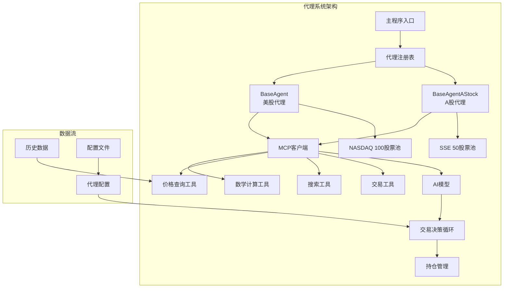

**图表来源**
- [main.py](file://main.py#L15-L30)
- [agent/base_agent/base_agent.py](file://agent/base_agent/base_agent.py#L209-L245)
- [agent/base_agent_astock/base_agent_astock.py](file://agent/base_agent_astock/base_agent_astock.py#L180-L220)

## 核心类设计

### 类层次结构

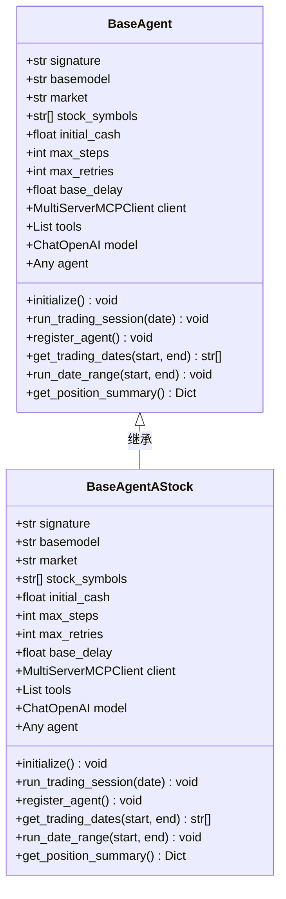

**图表来源**
- [agent/base_agent/base_agent.py](file://agent/base_agent/base_agent.py#L209-L245)
- [agent/base_agent_astock/base_agent_astock.py](file://agent/base_agent_astock/base_agent_astock.py#L180-L220)

### 关键属性对比

| 属性 | BaseAgent | BaseAgentAStock | 说明 |
|------|-----------|-----------------|------|
| 市场类型 | `"us"` | `"cn"` | A股代理硬编码为A股市场 |
| 初始资金 | $10,000 | ¥100,000 | A股市场使用人民币计价 |
| 股票池 | NASDAQ 100 | SSE 50 | 不同市场的代表性指数 |
| 日志路径 | `./data/agent_data` | `./data/agent_data_astock` | 分离的日志存储路径 |
| 交易规则 | 美股T+0 | A股T+1 | 针对不同市场的结算规则 |

**节来源**
- [agent/base_agent/base_agent.py](file://agent/base_agent/base_agent.py#L209-L245)
- [agent/base_agent_astock/base_agent_astock.py](file://agent/base_agent_astock/base_agent_astock.py#L180-L220)
- [configs/default_config.json](file://configs/default_config.json#L40-L45)
- [configs/astock_config.json](file://configs/astock_config.json#L45-L50)

## BaseAgent详细分析

### 初始化过程

BaseAgent采用延迟初始化策略，在创建实例时不立即连接MCP服务，而是在首次运行交易会话时才建立连接。

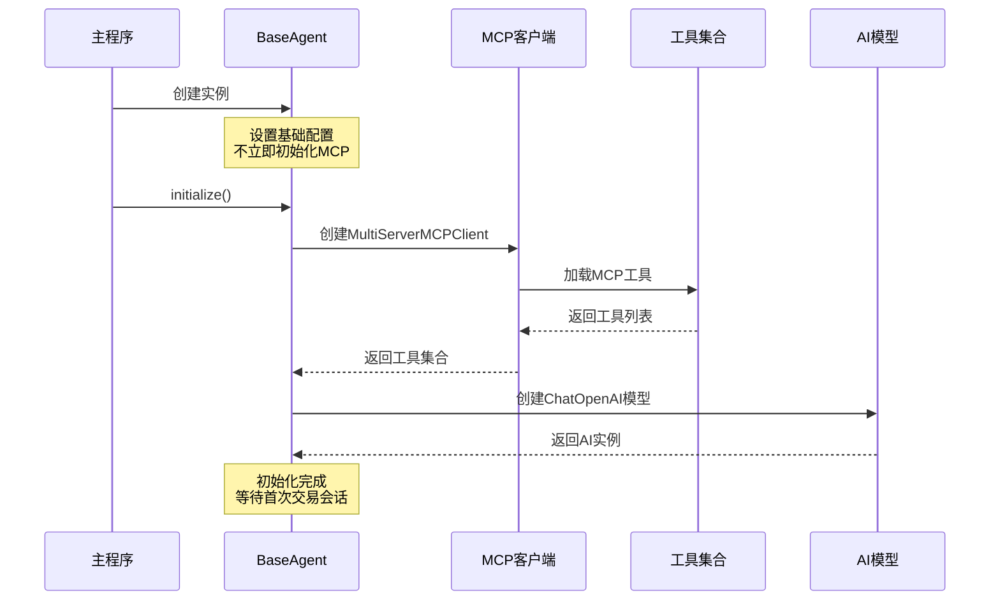

**图表来源**
- [agent/base_agent/base_agent.py](file://agent/base_agent/base_agent.py#L313-L341)

### 核心方法实现

#### run_trading_session方法

该方法是BaseAgent的核心，实现了完整的交易决策循环：

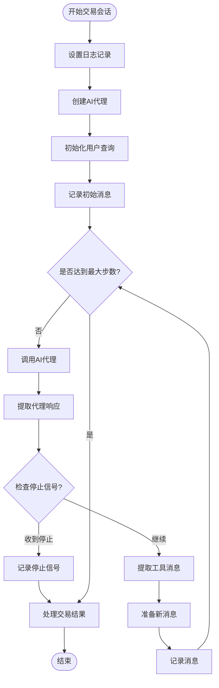

**图表来源**
- [agent/base_agent/base_agent.py](file://agent/base_agent/base_agent.py#L400-L470)

#### register_agent方法

该方法负责创建初始持仓记录：

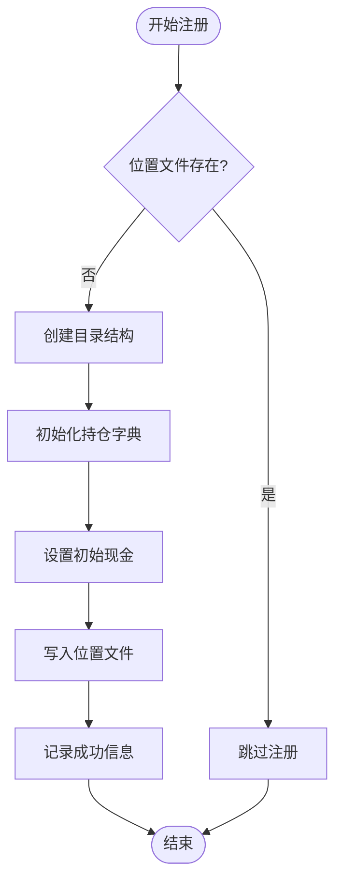

**图表来源**
- [agent/base_agent/base_agent.py](file://agent/base_agent/base_agent.py#L472-L495)

**节来源**
- [agent/base_agent/base_agent.py](file://agent/base_agent/base_agent.py#L400-L470)
- [agent/base_agent/base_agent.py](file://agent/base_agent/base_agent.py#L472-L495)

## BaseAgentAStock详细分析

### A股市场特化

BaseAgentAStock针对A股市场的特殊规则进行了深度适配，主要包括：

#### T+1交易规则适配

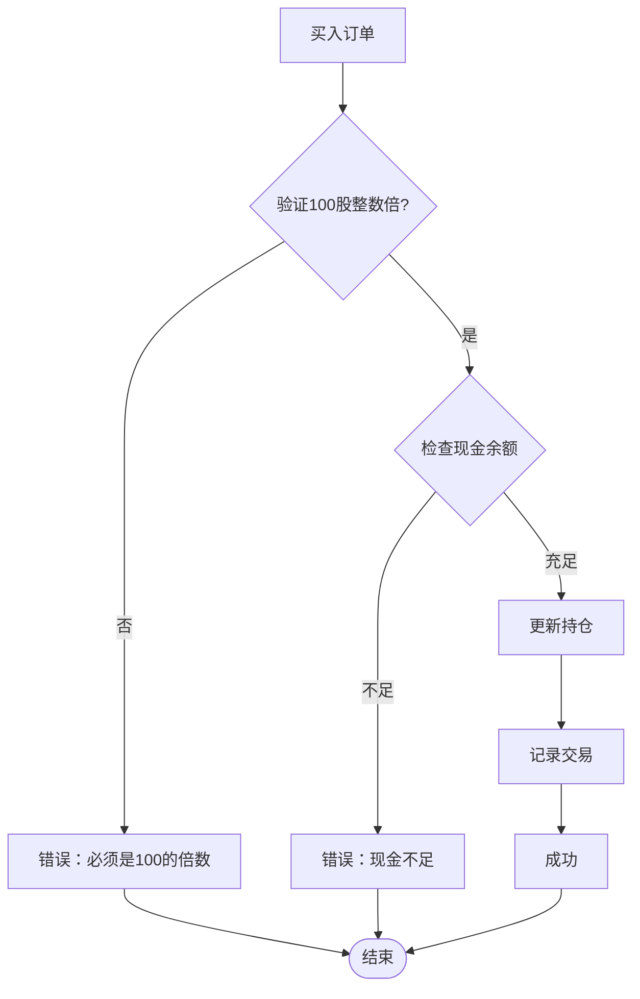

**图表来源**
- [agent_tools/tool_trade.py](file://agent_tools/tool_trade.py#L50-L100)

#### A股专用提示词系统

BaseAgentAStock使用专门的提示词模板，强调A股市场的特殊规则：

| 规则类型 | 描述 | 实现方式 |
|----------|------|----------|
| 一手交易要求 | 必须是100股的整数倍 | 在buy函数中验证`amount % 100 != 0` |
| T+1结算规则 | 当天买入不能当天卖出 | 在sell函数中检查买入时间 |
| 涨跌停限制 | 普通股票±10%，ST股票±5% | 价格验证逻辑 |
| 中文显示 | 股票名称中文显示 | 提示词格式化 |

**节来源**
- [agent/base_agent_astock/base_agent_astock.py](file://agent/base_agent_astock/base_agent_astock.py#L180-L220)
- [prompts/agent_prompt_astock.py](file://prompts/agent_prompt_astock.py#L30-L60)
- [agent_tools/tool_trade.py](file://agent_tools/tool_trade.py#L50-L100)

### MCP工具链配置

BaseAgentAStock使用与BaseAgent相同的MCP工具链，但针对A股市场进行了优化：

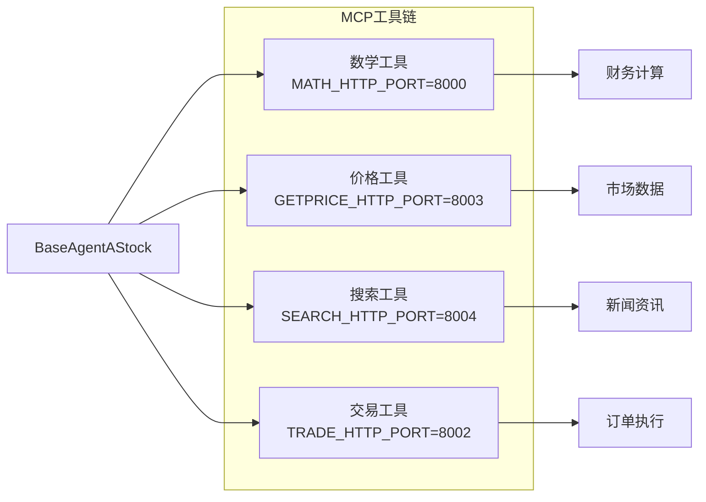

**图表来源**
- [agent/base_agent_astock/base_agent_astock.py](file://agent/base_agent_astock/base_agent_astock.py#L240-L270)

**节来源**
- [agent/base_agent_astock/base_agent_astock.py](file://agent/base_agent_astock/base_agent_astock.py#L240-L270)

## MCP工具链集成

### 工具链架构

MCP（Model Context Protocol）工具链是AI-Trader的核心基础设施，提供了与外部服务的标准化接口：

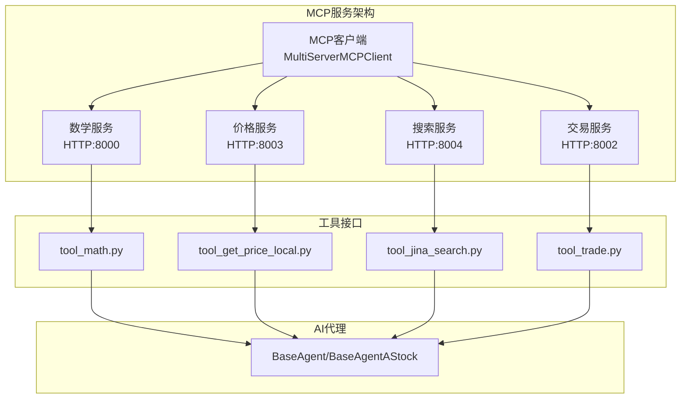

**图表来源**
- [agent/base_agent/base_agent.py](file://agent/base_agent/base_agent.py#L313-L341)
- [agent_tools/start_mcp_services.py](file://agent_tools/start_mcp_services.py#L20-L40)

### 工具链初始化流程

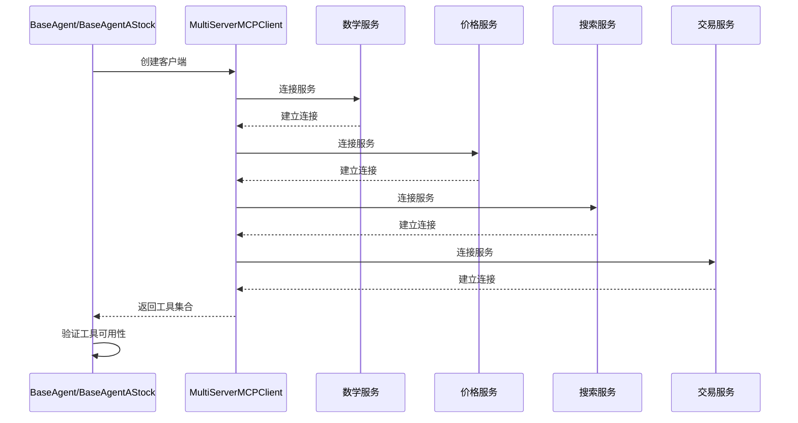

**图表来源**
- [agent/base_agent/base_agent.py](file://agent/base_agent/base_agent.py#L313-L341)

**节来源**
- [agent/base_agent/base_agent.py](file://agent/base_agent/base_agent.py#L313-L341)
- [agent_tools/start_mcp_services.py](file://agent_tools/start_mcp_services.py#L20-L40)

## 交易决策循环

### 核心算法流程

BaseAgent和BaseAgentAStock都实现了相似的交易决策循环，但在具体实现上有所差异：

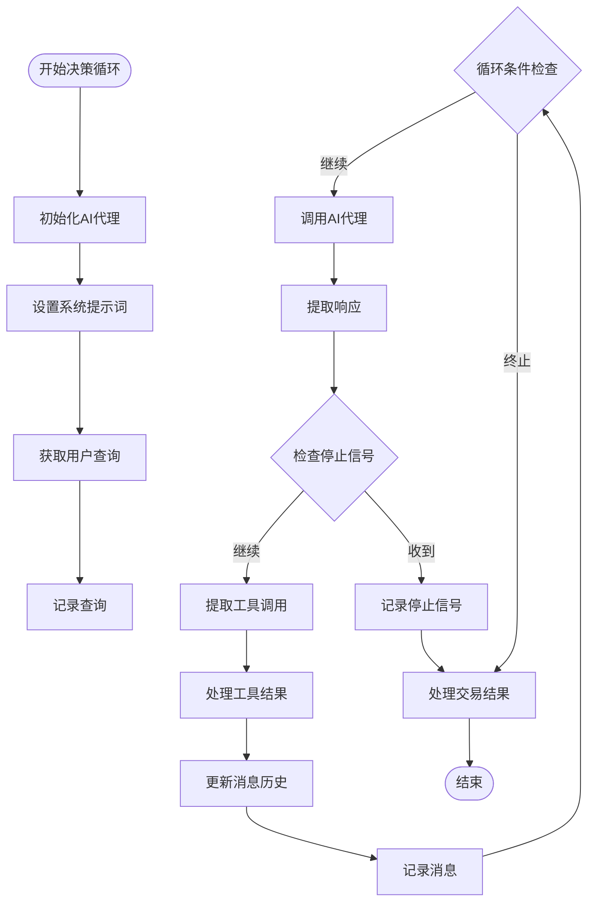

**图表来源**
- [agent/base_agent/base_agent.py](file://agent/base_agent/base_agent.py#L400-L470)

### 停止信号机制

系统使用`<FINISH_SIGNAL>`作为停止信号，当AI代理认为交易决策完成时会输出该信号：

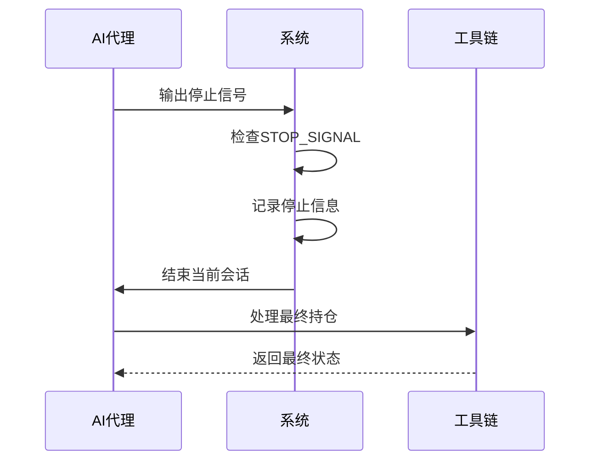

**图表来源**
- [prompts/agent_prompt.py](file://prompts/agent_prompt.py#L25-L30)

**节来源**
- [agent/base_agent/base_agent.py](file://agent/base_agent/base_agent.py#L400-L470)
- [prompts/agent_prompt.py](file://prompts/agent_prompt.py#L25-L30)

## 持仓管理机制

### 位置文件结构

系统使用JSON Lines格式存储持仓信息，每条记录包含完整的时间序列持仓数据：

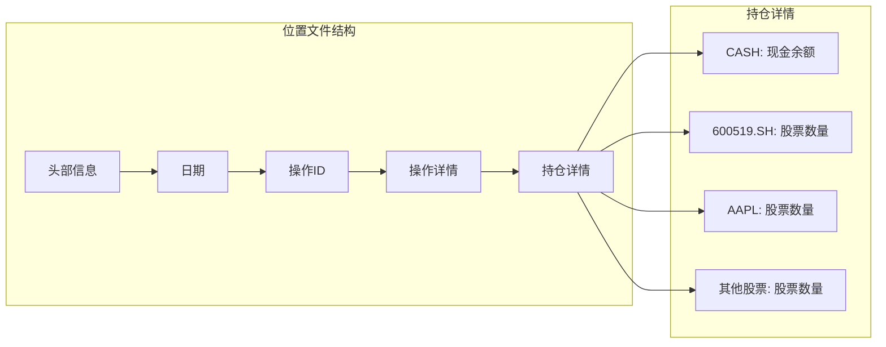

**图表来源**
- [agent/base_agent/base_agent.py](file://agent/base_agent/base_agent.py#L472-L495)

### 位置锁机制

为了确保多代理并发安全，系统实现了基于文件锁的位置更新机制：

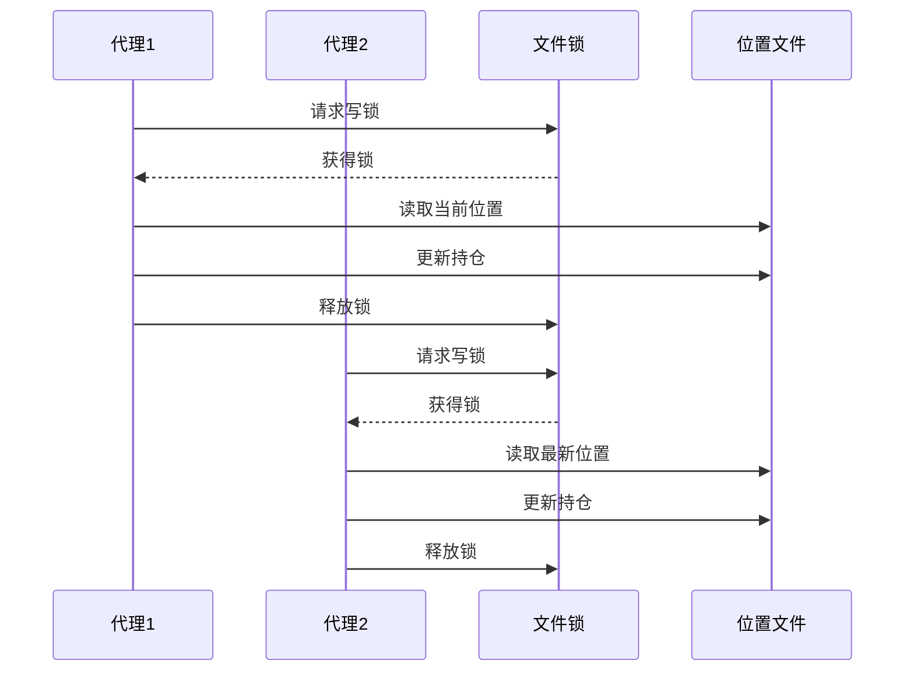

**图表来源**
- [agent_tools/tool_trade.py](file://agent_tools/tool_trade.py#L20-L40)

**节来源**
- [agent/base_agent/base_agent.py](file://agent/base_agent/base_agent.py#L472-L495)
- [agent_tools/tool_trade.py](file://agent_tools/tool_trade.py#L20-L40)

## 历史回放功能

### get_trading_dates方法

该方法实现了智能的交易日过滤机制，确保只处理有效的交易日：

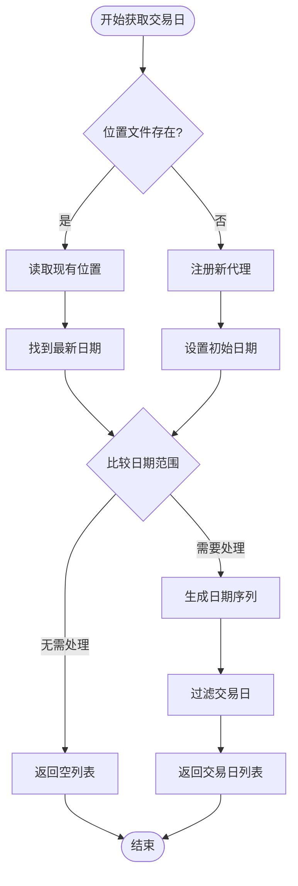

**图表来源**
- [agent/base_agent/base_agent.py](file://agent/base_agent/base_agent.py#L524-L553)

### run_date_range方法

历史回放功能的核心，按顺序处理指定日期范围内的所有交易日：

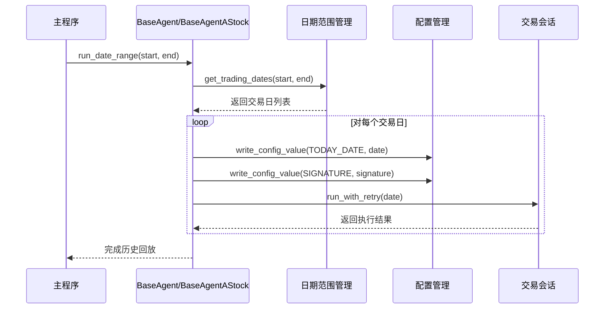

**图表来源**
- [agent/base_agent/base_agent.py](file://agent/base_agent/base_agent.py#L582-L621)

**节来源**
- [agent/base_agent/base_agent.py](file://agent/base_agent/base_agent.py#L524-L553)
- [agent/base_agent/base_agent.py](file://agent/base_agent/base_agent.py#L582-L621)

## 市场差异对比

### 配置参数对比

| 参数 | BaseAgent | BaseAgentAStock | 说明 |
|------|-----------|-----------------|------|
| 初始资金 | $10,000 | ¥100,000 | A股市场使用人民币 |
| 股票池 | NASDAQ 100 | SSE 50 | 不同市场的代表性指数 |
| 日志路径 | `./data/agent_data` | `./data/agent_data_astock` | 分离的数据存储 |
| 市场标识 | `"us"` | `"cn"` | 内部市场标识 |
| 交易规则 | T+0 | T+1 | 结算周期差异 |
| 股票代码格式 | 简单符号 | `.SH/.SZ`后缀 | 市场区分标识 |

### 提示词系统差异

#### BaseAgent提示词特点
- 面向美股市场的通用提示词
- 支持多种美股交易所的股票
- 强调T+0交易的灵活性
- 使用美元计价和英文界面

#### BaseAgentAStock提示词特点
- 专门针对A股市场的提示词模板
- 强调T+1结算规则和100股整数倍要求
- 包含涨跌停限制等特殊规则
- 显示中文股票名称和价格

### 交易工具差异

#### 共同特性
- 都使用相同的MCP工具链
- 都支持买入、卖出操作
- 都有位置管理和风险控制

#### A股特化功能
- **一手验证**：强制100股整数倍交易
- **T+1检查**：防止当日买入当日卖出
- **涨跌停限制**：价格超出限制时拒绝交易
- **中文显示**：股票名称和市场信息的中文显示

**节来源**
- [configs/default_config.json](file://configs/default_config.json#L40-L45)
- [configs/astock_config.json](file://configs/astock_config.json#L45-L50)
- [prompts/agent_prompt.py](file://prompts/agent_prompt.py#L40-L60)
- [prompts/agent_prompt_astock.py](file://prompts/agent_prompt_astock.py#L30-L60)

## 总结

AI-Trader的代理系统通过精心设计的架构，成功实现了跨美股和A股市场的统一交易框架。BaseAgent和BaseAgentAStock两个核心类展现了良好的继承关系和差异化处理：

### 设计优势

1. **统一抽象**：BaseAgent提供了通用的交易框架，封装了MCP工具链集成、AI模型管理等核心功能
2. **市场适配**：BaseAgentAStock针对A股市场的特殊规则进行了深度适配，包括T+1结算、100股整数倍等要求
3. **模块化架构**：基于MCP工具链的松耦合设计，便于扩展和维护
4. **历史回放**：完整的交易历史重放功能，支持科学严谨的性能评估

### 技术特色

- **智能决策循环**：基于AI的自动化交易决策，支持复杂的市场分析
- **并发安全**：位置文件的原子性更新和文件锁机制
- **容错机制**：完善的重试和错误处理机制
- **配置灵活**：支持多种模型和参数配置

### 应用价值

该代理系统为量化交易研究和实践提供了强大的基础设施，特别适合：
- 学术研究中的算法验证
- 量化策略的开发和测试
- 跨市场交易策略的研究
- 机器学习模型的训练和评估

通过这种设计，AI-Trader不仅能够适应不同市场的特殊需求，还保持了代码的简洁性和可维护性，为未来的扩展奠定了坚实的基础。