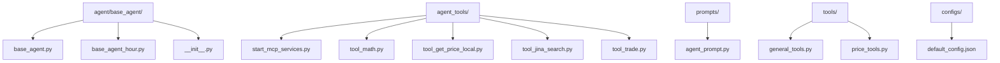
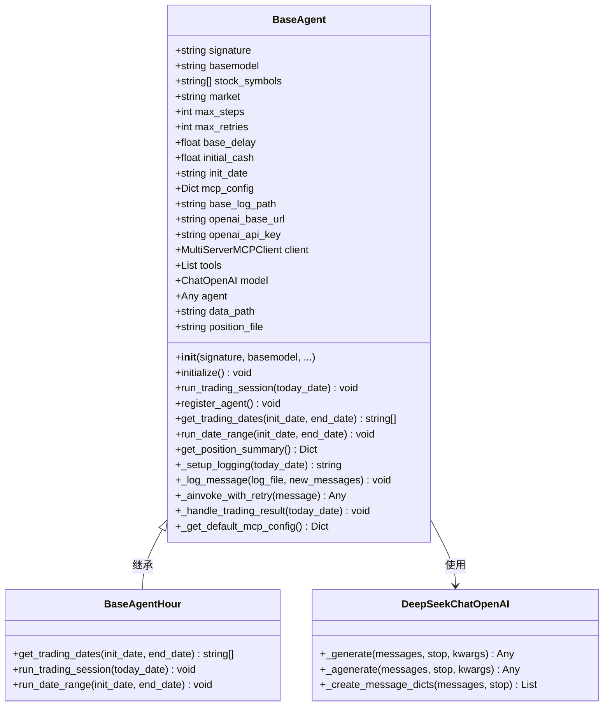
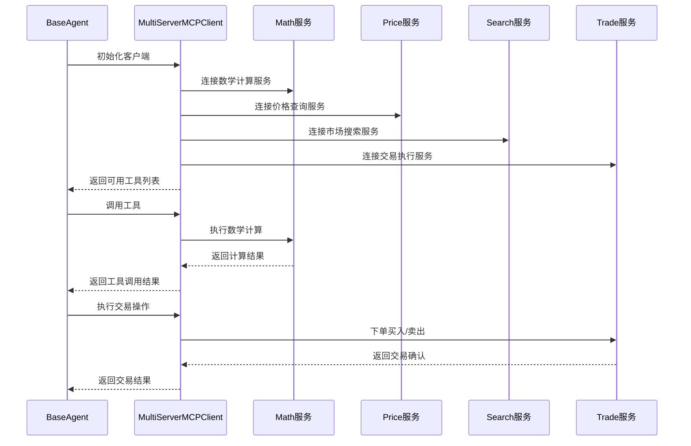
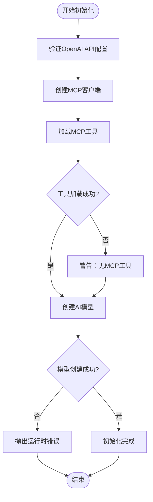
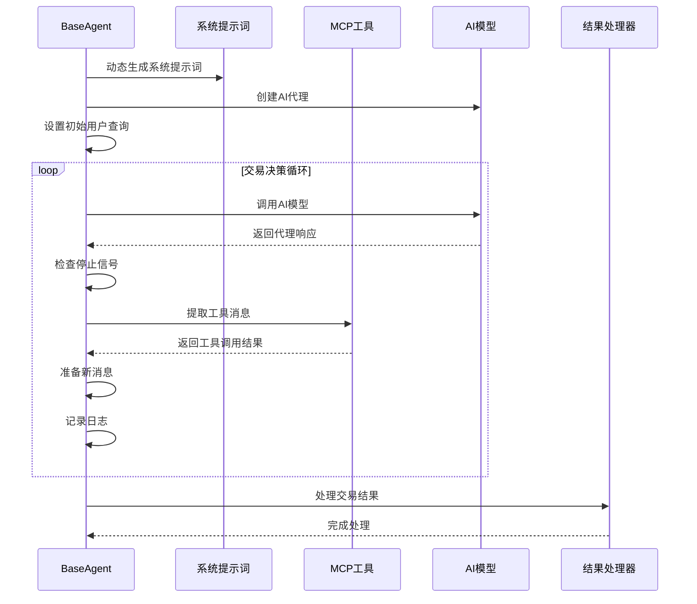
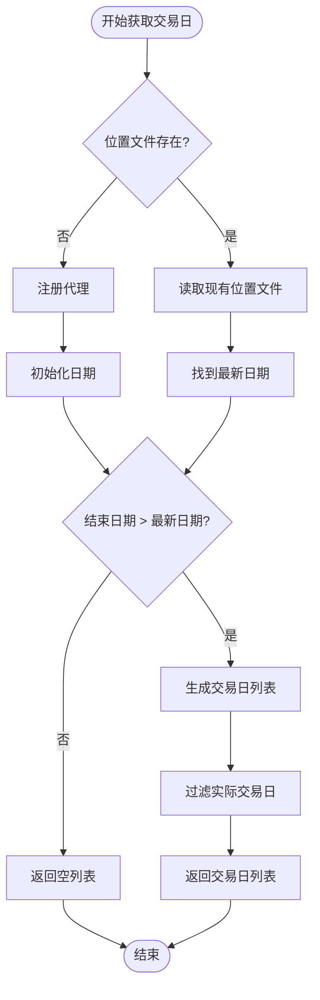
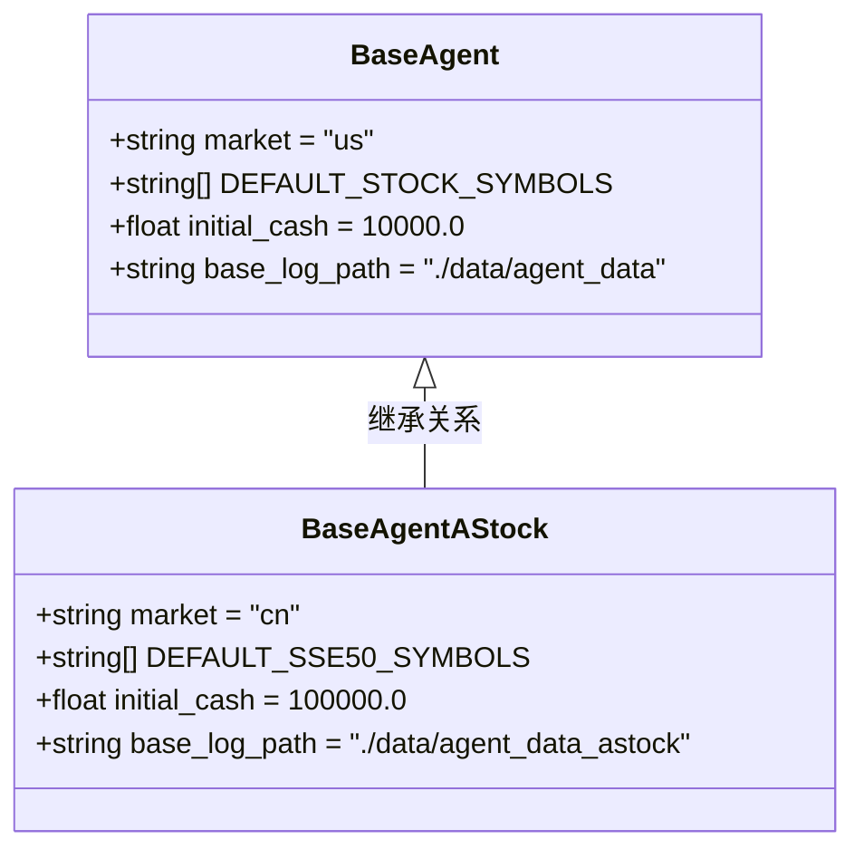

# 美股交易代理 (BaseAgent)

<cite>
**本文档中引用的文件**
- [base_agent.py](file://agent/base_agent/base_agent.py)
- [base_agent_hour.py](file://agent/base_agent/base_agent_hour.py)
- [base_agent_astock.py](file://agent/base_agent_astock/base_agent_astock.py)
- [start_mcp_services.py](file://agent_tools/start_mcp_services.py)
- [tool_math.py](file://agent_tools/tool_math.py)
- [tool_get_price_local.py](file://agent_tools/tool_get_price_local.py)
- [tool_jina_search.py](file://agent_tools/tool_jina_search.py)
- [tool_trade.py](file://agent_tools/tool_trade.py)
- [agent_prompt.py](file://prompts/agent_prompt.py)
- [general_tools.py](file://tools/general_tools.py)
- [default_config.json](file://configs/default_config.json)
</cite>

## 目录
1. [简介](#简介)
2. [项目结构](#项目结构)
3. [BaseAgent类设计](#baseagent类设计)
4. [MCP工具链集成](#mcp工具链集成)
5. [代理初始化过程](#代理初始化过程)
6. [交易决策循环机制](#交易决策循环机制)
7. [交易日历管理](#交易日历管理)
8. [与BaseAgentAStock的对比](#与baseagentastock的对比)
9. [性能考虑](#性能考虑)
10. [故障排除指南](#故障排除指南)
11. [结论](#结论)

## 简介

BaseAgent是AI-Trader项目中用于美股交易的核心代理类，它封装了MCP工具管理、AI代理创建和交易执行等核心功能。该类通过MCP（Model Context Protocol）工具链与外部服务进行交互，包括数学计算、价格查询、市场搜索和交易执行等功能。

BaseAgent专门针对美股市场设计，支持NASDAQ 100指数成分股的自动化交易，并提供了完整的交易决策循环机制和风险管理功能。

## 项目结构

BaseAgent相关的文件组织结构如下：



**图表来源**
- [base_agent.py](file://agent/base_agent/base_agent.py#L1-L50)
- [start_mcp_services.py](file://agent_tools/start_mcp_services.py#L1-L30)

**章节来源**
- [base_agent.py](file://agent/base_agent/base_agent.py#L1-L100)
- [base_agent_hour.py](file://agent/base_agent/base_agent_hour.py#L1-L50)

## BaseAgent类设计

### 核心架构

BaseAgent类采用模块化设计，主要包含以下核心组件：



**图表来源**
- [base_agent.py](file://agent/base_agent/base_agent.py#L80-L150)
- [base_agent_hour.py](file://agent/base_agent/base_agent_hour.py#L30-L80)

### 默认配置和常量

BaseAgent预定义了NASDAQ 100指数的30只成分股作为默认股票池：

| 股票代码 | 公司名称 | 行业领域 |
|---------|---------|---------|
| NVDA | 英特尔 | 半导体 |
| MSFT | 微软 | 软件 |
| AAPL | 苹果 | 科技硬件 |
| GOOG/GOOGL | 谷歌 | 互联网服务 |
| AMZN | 亚马逊 | 电子商务 |
| META | Facebook | 社交媒体 |
| TSLA | 特斯拉 | 汽车制造 |
| NFLX | 奈飞 | 媒体娱乐 |

**章节来源**
- [base_agent.py](file://agent/base_agent/base_agent.py#L100-L180)

## MCP工具链集成

### 工具链架构

BaseAgent通过MCP工具链与多个外部服务进行交互：



**图表来源**
- [base_agent.py](file://agent/base_agent/base_agent.py#L350-L400)
- [start_mcp_services.py](file://agent_tools/start_mcp_services.py#L50-L100)

### 工具服务详解

#### 数学计算工具 (Math)
提供基础的数学运算功能：
- 加法运算：`add(a: float, b: float) -> float`
- 乘法运算：`multiply(a: float, b: float) -> float`

#### 价格查询工具 (Price)
提供历史和实时价格数据查询：
- 日线数据：`get_price_local_daily(symbol: str, date: str)`
- 分钟线数据：`get_price_local_hourly(symbol: str, date: str)`
- 自动检测数据格式并调用相应函数

#### 市场搜索工具 (Search)
基于Jina AI API的网络搜索功能：
- 关键词搜索：`get_information(query: str) -> str`
- 内容抓取：支持网页内容提取和标准化
- 时间过滤：自动过滤与当前交易日相关的新闻

#### 交易执行工具 (Trade)
模拟股票买卖操作：
- 买入功能：`buy(symbol: str, amount: int) -> Dict`
- 卖出功能：`sell(symbol: str, amount: int) -> Dict`
- 支持美股和A股市场规则

**章节来源**
- [tool_math.py](file://agent_tools/tool_math.py#L1-L45)
- [tool_get_price_local.py](file://agent_tools/tool_get_price_local.py#L1-L100)
- [tool_jina_search.py](file://agent_tools/tool_jina_search.py#L1-L100)
- [tool_trade.py](file://agent_tools/tool_trade.py#L1-L100)

## 代理初始化过程

### 初始化流程

BaseAgent的初始化过程包含以下关键步骤：



**图表来源**
- [base_agent.py](file://agent/base_agent/base_agent.py#L350-L420)

### 配置参数详解

BaseAgent支持丰富的配置选项：

| 参数名 | 类型 | 默认值 | 描述 |
|-------|------|--------|------|
| signature | string | 必需 | 代理签名/名称 |
| basemodel | string | 必需 | 基础模型名称 |
| stock_symbols | List[string] | None | 股票代码列表，为空时自动选择NASDAQ 100 |
| mcp_config | Dict | None | MCP工具配置，包含端口和URL信息 |
| log_path | string | "./data/agent_data" | 日志存储路径 |
| max_steps | int | 10 | 最大推理步数 |
| max_retries | int | 3 | 最大重试次数 |
| base_delay | float | 0.5 | 基础延迟时间（秒） |
| openai_base_url | string | None | OpenAI API基础URL |
| openai_api_key | string | None | OpenAI API密钥 |
| initial_cash | float | 10000.0 | 初始资金金额 |
| init_date | string | "2025-10-13" | 初始化日期 |
| market | string | "us" | 市场类型，"us"表示美股 |

### 自动股票池选择

BaseAgent根据market参数自动选择合适的股票池：

```python
# 美股市场自动选择NASDAQ 100
if market == "cn":
    self.stock_symbols = all_sse_50_symbols  # A股市场
else:
    self.stock_symbols = self.DEFAULT_STOCK_SYMBOLS  # 默认美股
```

**章节来源**
- [base_agent.py](file://agent/base_agent/base_agent.py#L200-L280)

## 交易决策循环机制

### run_trading_session方法

`run_trading_session`方法实现了完整的交易决策循环：



**图表来源**
- [base_agent.py](file://agent/base_agent/base_agent.py#L420-L500)

### 系统提示词动态生成

BaseAgent会根据当前日期和市场情况动态生成系统提示词：

```python
# 动态生成提示词内容
system_prompt = get_agent_system_prompt(
    today_date, 
    self.signature, 
    self.market, 
    self.stock_symbols
)
```

提示词包含以下关键信息：
- 当前日期和时间
- 当前持仓情况（股票数量和现金余额）
- 昨日收盘价和今日开盘价
- 交易目标和约束条件

### 工具调用结果处理

代理在每次迭代中都会处理工具调用结果：

1. **提取代理响应**：从AI模型的输出中提取最终决策
2. **检查停止信号**：判断是否达到交易完成条件
3. **处理工具消息**：收集和整理所有工具调用的结果
4. **准备新消息**：构建包含工具结果的新对话轮次

### 最大推理步数控制

通过`max_steps`参数控制交易决策的最大迭代次数，防止无限循环：

```python
while current_step < self.max_steps:
    current_step += 1
    # 执行交易决策逻辑
```

**章节来源**
- [base_agent.py](file://agent/base_agent/base_agent.py#L420-L520)

## 交易日历管理

### get_trading_dates方法

BaseAgent通过`get_trading_dates`方法管理交易日历，确保只在实际交易日进行交易：



**图表来源**
- [base_agent.py](file://agent/base_agent/base_agent.py#L520-L580)

### 与merged.jsonl文件的交互

BaseAgent依赖`merged.jsonl`文件来确定实际的交易日：

```python
# 检查日期是否为实际交易日
if is_trading_day(date_str, market=self.market):
    trading_dates.append(date_str)
```

`is_trading_day`函数通过扫描`merged.jsonl`文件来验证日期的有效性。

### register_agent方法

`register_agent`方法负责初始化代理的位置记录：

1. **检查位置文件**：避免重复注册
2. **创建目录结构**：确保必要的目录存在
3. **初始化持仓**：创建初始持仓记录，包含所有股票0股和1万美元现金
4. **记录初始状态**：保存到position.jsonl文件

**章节来源**
- [base_agent.py](file://agent/base_agent/base_agent.py#L520-L620)

## 与BaseAgentAStock的对比

### 主要差异对比

| 特性 | BaseAgent | BaseAgentAStock |
|------|-----------|-----------------|
| 市场类型 | 美股 (market="us") | A股 (market="cn") |
| 默认股票池 | NASDAQ 100 (30只) | SSE 50 (50只) |
| 初始资金 | $10,000 | ¥100,000 |
| 日志路径 | ./data/agent_data | ./data/agent_data_astock |
| 默认配置 | us市场配置 | cn市场配置 |
| 市场行为 | 支持美股交易规则 | 支持A股交易规则 |

### 代码结构对比



**图表来源**
- [base_agent.py](file://agent/base_agent/base_agent.py#L100-L150)
- [base_agent_astock.py](file://agent/base_agent_astock/base_agent_astock.py#L150-L200)

### 配置差异

两个类在配置上有显著差异：

**BaseAgent配置**：
```json
{
  "market": "us",
  "initial_cash": 10000.0,
  "base_log_path": "./data/agent_data"
}
```

**BaseAgentAStock配置**：
```json
{
  "market": "cn",
  "initial_cash": 100000.0,
  "base_log_path": "./data/agent_data_astock"
}
```

**章节来源**
- [base_agent.py](file://agent/base_agent/base_agent.py#L200-L250)
- [base_agent_astock.py](file://agent/base_agent_astock/base_agent_astock.py#L250-L300)

## 性能考虑

### 并发处理

BaseAgent支持异步操作，提高并发处理能力：

- **异步初始化**：`async def initialize()`方法支持非阻塞初始化
- **异步交易**：`async def run_trading_session()`支持并发交易执行
- **重试机制**：内置指数退避重试策略

### 缓存策略

- **工具调用缓存**：避免重复的工具调用
- **价格数据缓存**：减少对价格服务的频繁请求
- **位置文件缓存**：本地缓存持仓信息

### 资源管理

- **连接池管理**：MCP客户端连接复用
- **内存优化**：及时释放不需要的数据
- **日志管理**：按日期分割日志文件

## 故障排除指南

### 常见问题及解决方案

#### 1. MCP服务未启动
**症状**：`Failed to initialize MCP client`错误
**解决方案**：
```bash
# 启动MCP服务
python agent_tools/start_mcp_services.py
```

#### 2. OpenAI API配置错误
**症状**：`OpenAI API key not set`错误
**解决方案**：
- 设置环境变量`OPENAI_API_KEY`
- 或在配置文件中指定API密钥

#### 3. 交易日历问题
**症状**：无法获取交易日或交易日为空
**解决方案**：
- 检查`merged.jsonl`文件是否存在
- 验证文件格式是否正确
- 确认日期范围设置合理

#### 4. 工具调用失败
**症状**：工具返回错误或超时
**解决方案**：
- 检查对应服务是否正常运行
- 验证网络连接
- 查看服务日志

**章节来源**
- [base_agent.py](file://agent/base_agent/base_agent.py#L350-L420)
- [start_mcp_services.py](file://agent_tools/start_mcp_services.py#L100-L200)

## 结论

BaseAgent作为AI-Trader项目的核心组件，成功地将MCP工具链与自动化交易相结合，为美股市场提供了一个功能完整、可扩展的智能交易代理解决方案。

### 主要优势

1. **模块化设计**：清晰的组件分离，便于维护和扩展
2. **工具链集成**：通过MCP协议实现灵活的外部服务集成
3. **智能决策**：基于AI的交易决策循环机制
4. **风险管理**：完善的交易日历和位置管理
5. **可配置性**：丰富的配置选项适应不同需求

### 技术特色

- **动态提示词生成**：根据市场情况实时调整交易策略
- **多市场支持**：通过继承机制支持不同市场的特定需求
- **异步处理**：充分利用现代编程模型提高效率
- **健壮性设计**：完善的错误处理和重试机制

BaseAgent为AI驱动的量化交易提供了一个坚实的基础，其设计理念和实现方式可以作为其他金融AI项目的参考模板。