# AI-Trader 核心架构文档

<cite>
**本文档中引用的文件**
- [main.py](file://main.py)
- [agent/base_agent/base_agent.py](file://agent/base_agent/base_agent.py)
- [agent/base_agent_astock/base_agent_astock.py](file://agent/base_agent_astock/base_agent_astock.py)
- [agent_tools/start_mcp_services.py](file://agent_tools/start_mcp_services.py)
- [agent_tools/tool_trade.py](file://agent_tools/tool_trade.py)
- [agent_tools/tool_get_price_local.py](file://agent_tools/tool_get_price_local.py)
- [agent_tools/tool_jina_search.py](file://agent_tools/tool_jina_search.py)
- [agent_tools/tool_math.py](file://agent_tools/tool_math.py)
- [prompts/agent_prompt.py](file://prompts/agent_prompt.py)
- [configs/default_config.json](file://configs/default_config.json)
- [tools/general_tools.py](file://tools/general_tools.py)
- [tools/price_tools.py](file://tools/price_tools.py)
</cite>

## 目录
1. [项目概述](#项目概述)
2. [系统架构总览](#系统架构总览)
3. [核心代理类分析](#核心代理类分析)
4. [MCP工具链架构](#mcp工具链架构)
5. [数据流与执行流程](#数据流与执行流程)
6. [代理决策循环机制](#代理决策循环机制)
7. [配置管理系统](#配置管理系统)
8. [性能优化策略](#性能优化策略)
9. [总结](#总结)

## 项目概述

AI-Trader是一个基于人工智能的自动化交易系统，采用完全自主的代理驱动架构。该系统支持NASDAQ 100和SSE 50两个主要市场的股票交易，通过MCP（Model Context Protocol）工具链为AI代理提供标准化的能力接口。

### 核心特性

- **完全自主决策**：AI代理进行100%独立的市场分析、决策和执行
- **工具驱动架构**：基于MCP协议的模块化工具生态系统
- **多模型竞争**：支持多个AI模型在同一环境中公平竞争
- **历史回测能力**：时间可控的历史数据回放功能
- **实时监控**：完整的交易记录和性能分析系统

## 系统架构总览

AI-Trader采用分层架构设计，从底层的数据服务到顶层的AI代理，每一层都有明确的职责分工。

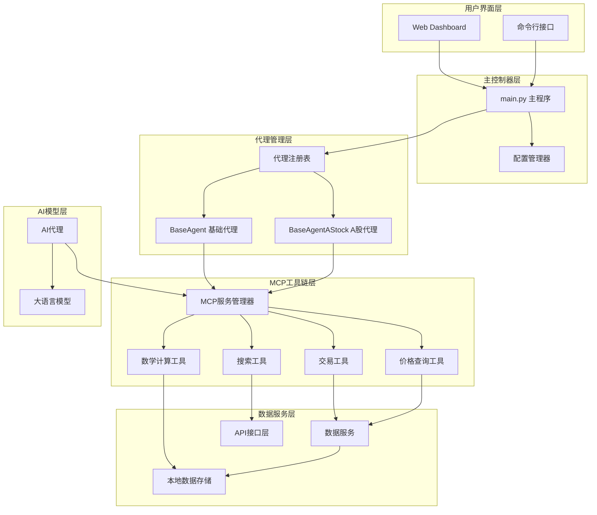

**图表来源**
- [main.py](file://main.py#L1-L50)
- [agent/base_agent/base_agent.py](file://agent/base_agent/base_agent.py#L1-L100)
- [agent_tools/start_mcp_services.py](file://agent_tools/start_mcp_services.py#L1-L50)

## 核心代理类分析

### BaseAgent类设计

BaseAgent是系统的核心抽象类，为US市场和通用场景提供基础功能。

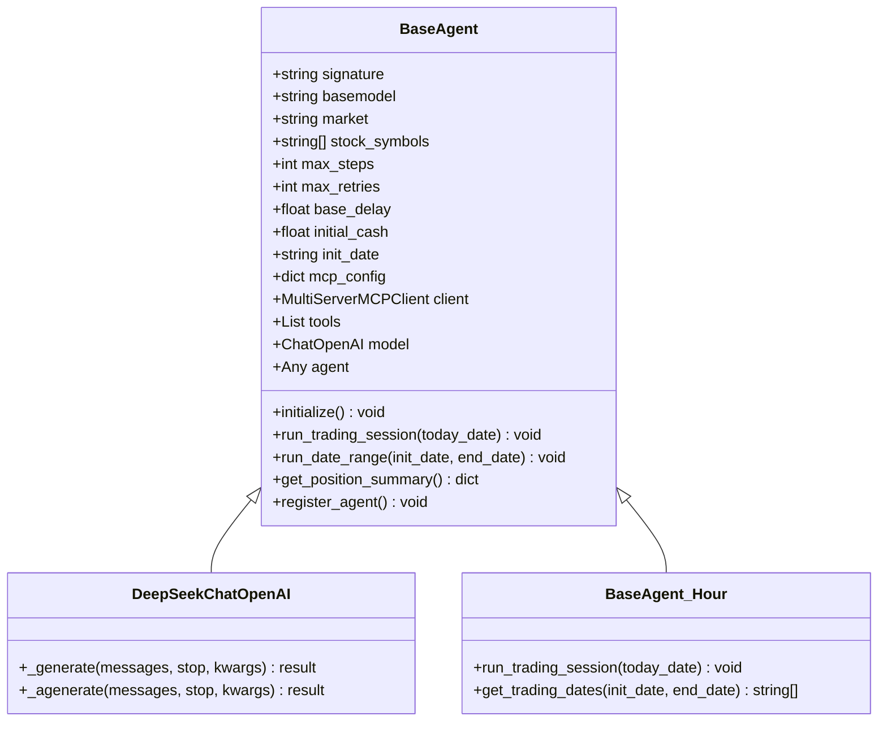

**图表来源**
- [agent/base_agent/base_agent.py](file://agent/base_agent/base_agent.py#L80-L200)
- [agent/base_agent/base_agent.py](file://agent/base_agent/base_agent.py#L25-L80)

#### BaseAgent核心职责

1. **MCP客户端管理**：负责建立与MCP服务的连接
2. **AI模型初始化**：根据配置创建相应的语言模型实例
3. **交易会话执行**：管理单日交易的完整生命周期
4. **位置管理**：维护和更新投资组合状态
5. **日志记录**：记录交易过程中的所有重要事件

#### 关键配置参数

| 参数名称 | 类型 | 默认值 | 描述 |
|---------|------|--------|------|
| `max_steps` | int | 10 | 最大推理步数限制 |
| `max_retries` | int | 3 | 最大重试次数 |
| `base_delay` | float | 0.5 | 基础延迟时间（秒） |
| `initial_cash` | float | 10000.0 | 初始资金（美元） |

**章节来源**
- [agent/base_agent/base_agent.py](file://agent/base_agent/base_agent.py#L150-L250)

### BaseAgentAStock类设计

BaseAgentAStock专门针对中国A股市场设计，具有特定的市场规则和数据处理逻辑。

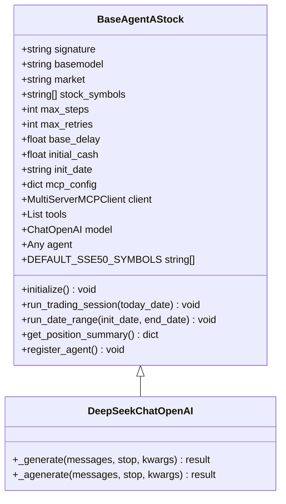

**图表来源**
- [agent/base_agent_astock/base_agent_astock.py](file://agent/base_agent_astock/base_agent_astock.py#L80-L200)

#### A股市场特化功能

1. **默认股票池**：内置上证50成分股列表
2. **市场规则适配**：自动识别并应用A股交易规则
3. **货币单位处理**：使用人民币作为计价货币
4. **时区管理**：适应中国市场的交易时间

#### A股专用配置

| 参数名称 | 类型 | 默认值 | 描述 |
|---------|------|--------|------|
| `initial_cash` | float | 100000.0 | 初始资金（人民币） |
| `market` | string | "cn" | 市场类型标识 |
| `stock_symbols` | List[string] | SSE 50指数成分股 | 默认股票池 |

**章节来源**
- [agent/base_agent_astock/base_agent_astock.py](file://agent/base_agent_astock/base_agent_astock.py#L150-L250)

### 代理注册与动态加载

系统通过AGNET_REGISTRY实现代理类的动态加载和管理。

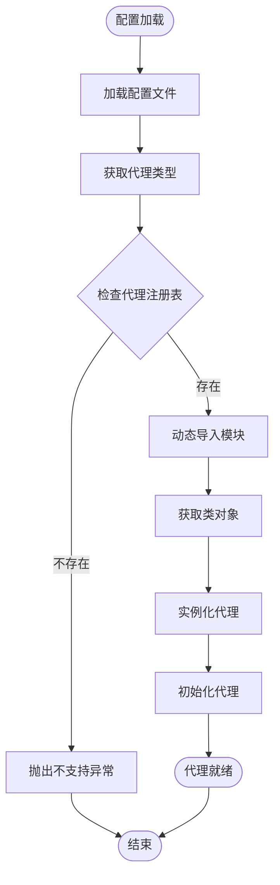

**图表来源**
- [main.py](file://main.py#L20-L50)

**章节来源**
- [main.py](file://main.py#L20-L80)

## MCP工具链架构

MCP（Model Context Protocol）是AI-Trader的核心技术架构，提供了标准化的工具调用机制。

### MCP服务架构

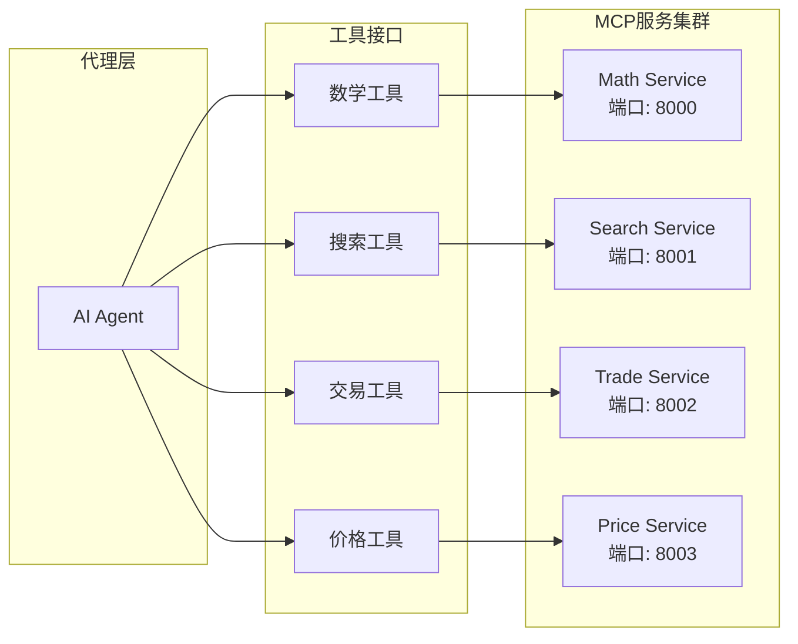

**图表来源**
- [agent_tools/start_mcp_services.py](file://agent_tools/start_mcp_services.py#L40-L60)

### 工具服务启动管理

MCPServiceManager负责统一管理和启动所有MCP服务。

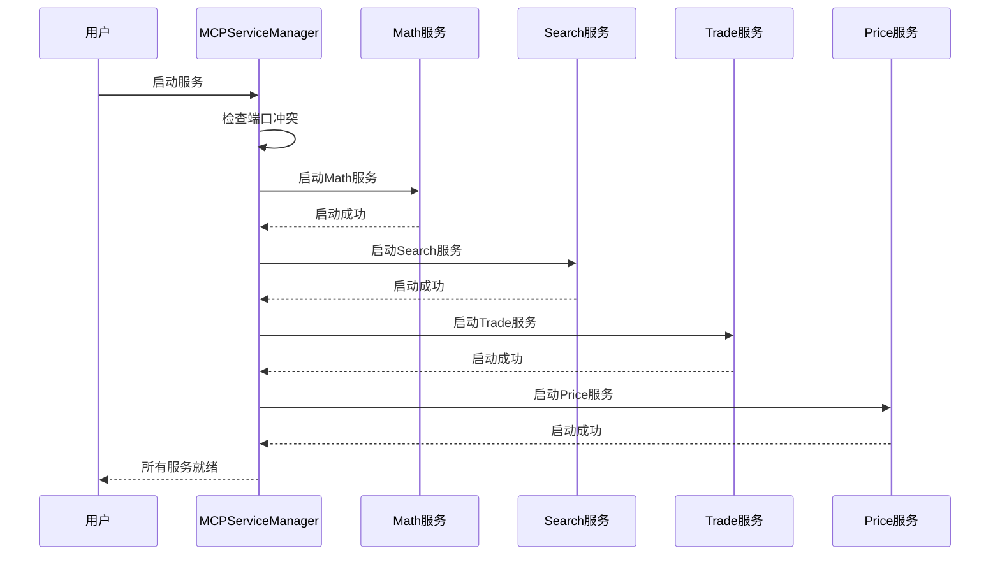

**图表来源**
- [agent_tools/start_mcp_services.py](file://agent_tools/start_mcp_services.py#L150-L200)

**章节来源**
- [agent_tools/start_mcp_services.py](file://agent_tools/start_mcp_services.py#L1-L100)

### 交易工具（Trade Tool）

交易工具提供买卖操作的核心功能，支持US和A股市场的不同规则。

#### 交易规则差异

| 功能特性 | US市场 | A股市场 |
|---------|--------|---------|
| 最小交易单位 | 1股 | 100股（一手） |
| 当日买入限制 | T+0 | T+1（当日买入不可当日卖出） |
| 交易费用 | 标准佣金 | 包含印花税等税费 |
| 涨跌幅限制 | 无 | 10%涨停/跌停 |

#### 交易流程

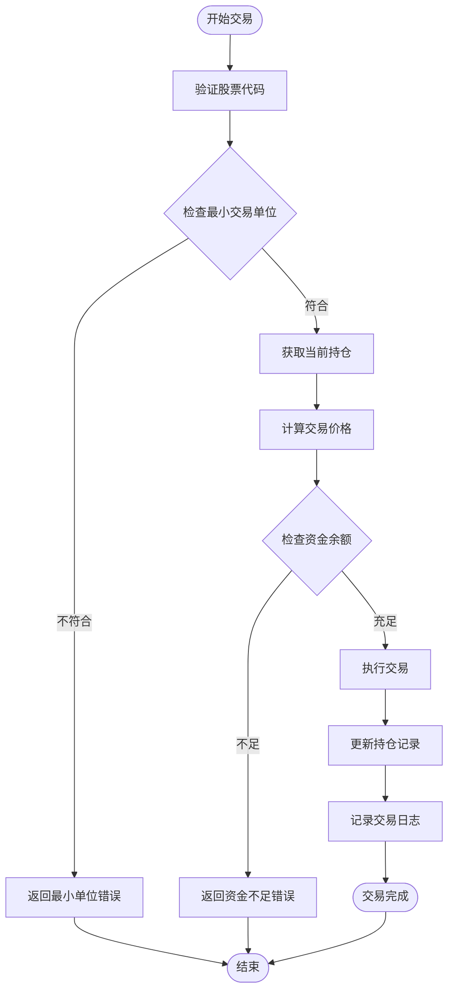

**图表来源**
- [agent_tools/tool_trade.py](file://agent_tools/tool_trade.py#L50-L150)

**章节来源**
- [agent_tools/tool_trade.py](file://agent_tools/tool_trade.py#L1-L100)

### 价格查询工具（Price Tool）

价格工具提供实时和历史价格数据查询功能。

#### 数据源支持

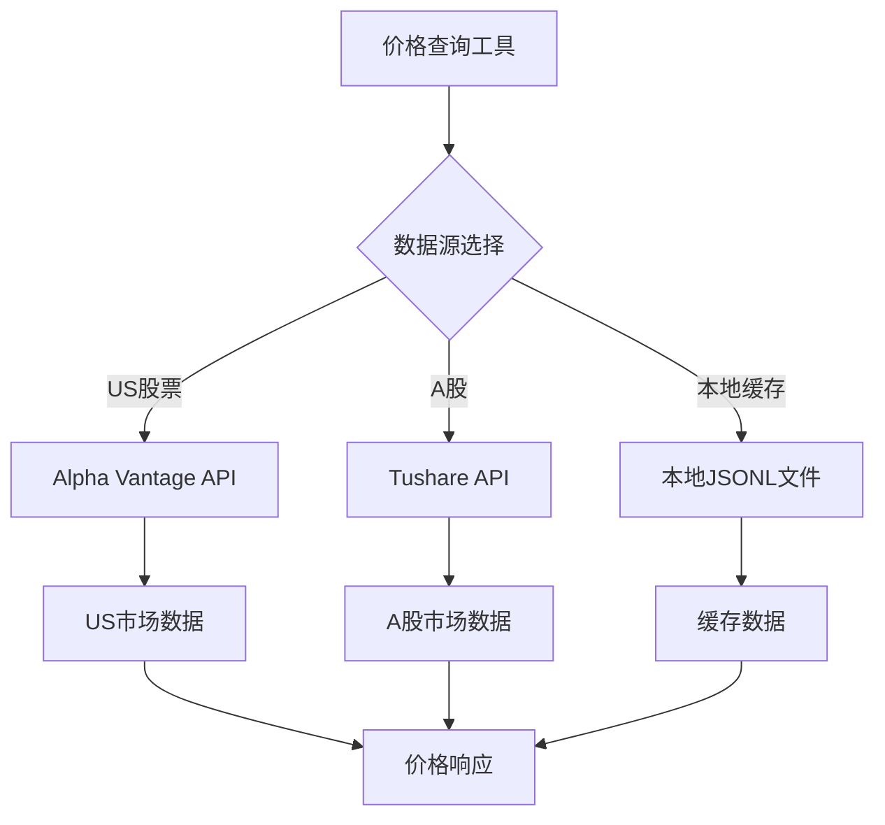

**图表来源**
- [agent_tools/tool_get_price_local.py](file://agent_tools/tool_get_price_local.py#L30-L80)

#### 价格数据格式

| 字段名称 | 描述 | 示例值 |
|---------|------|--------|
| `symbol` | 股票代码 | "AAPL", "600519.SH" |
| `date` | 日期 | "2025-10-30" |
| `open` | 开盘价 | "150.25" |
| `high` | 最高价 | "152.30" |
| `low` | 最低价 | "149.80" |
| `close` | 收盘价 | "151.50" |
| `volume` | 成交量 | "1000000" |

**章节来源**
- [agent_tools/tool_get_price_local.py](file://agent_tools/tool_get_price_local.py#L1-L100)

### 搜索工具（Search Tool）

搜索工具集成Jina AI服务，提供实时市场信息检索。

#### 搜索流程

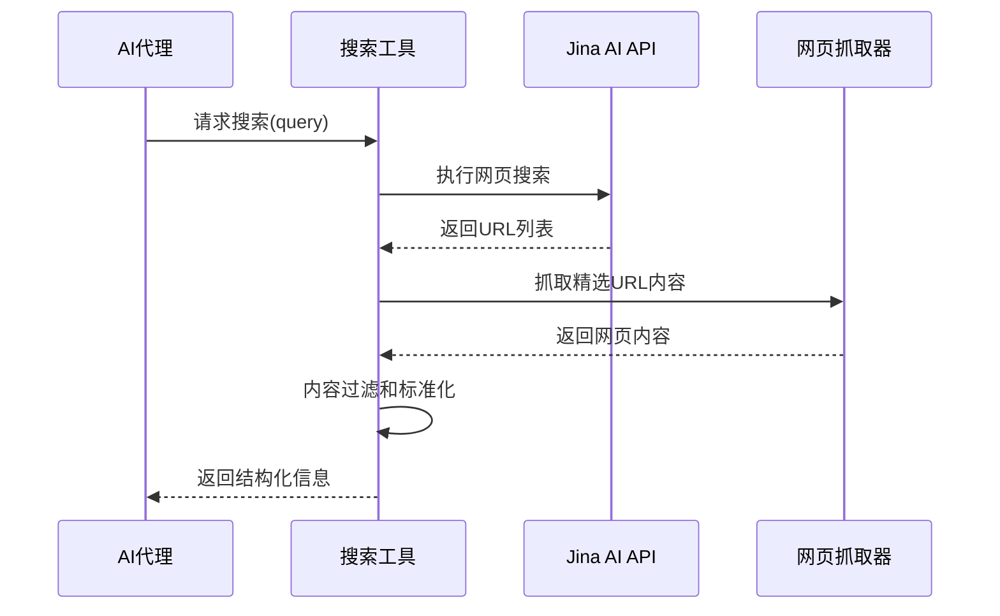

**图表来源**
- [agent_tools/tool_jina_search.py](file://agent_tools/tool_jina_search.py#L100-L150)

#### 信息过滤机制

搜索工具实现了智能的时间过滤机制，确保AI代理只能访问当前时间之前的信息。

**章节来源**
- [agent_tools/tool_jina_search.py](file://agent_tools/tool_jina_search.py#L1-L100)

### 数学工具（Math Tool）

数学工具提供基本的金融计算功能。

#### 支持的计算类型

| 工具函数 | 输入参数 | 输出类型 | 应用场景 |
|---------|---------|---------|----------|
| `add` | a: float, b: float | float | 加法计算 |
| `multiply` | a: float, b: float | float | 乘法计算 |

**章节来源**
- [agent_tools/tool_math.py](file://agent_tools/tool_math.py#L1-L45)

## 数据流与执行流程

### 主程序执行流程

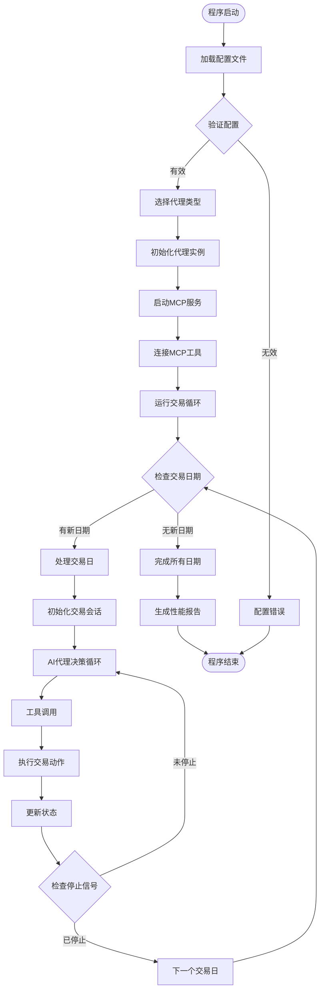

**图表来源**
- [main.py](file://main.py#L80-L150)

### 代理初始化流程

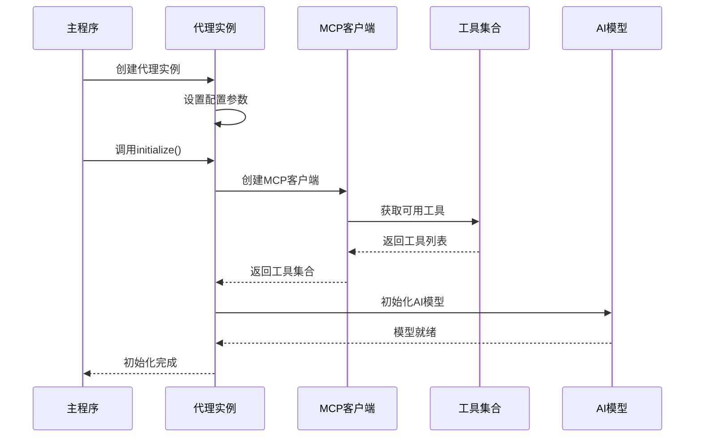

**图表来源**
- [agent/base_agent/base_agent.py](file://agent/base_agent/base_agent.py#L300-L400)

**章节来源**
- [main.py](file://main.py#L80-L200)

## 代理决策循环机制

### 决策循环架构

AI代理的核心是基于工具调用的决策循环，通过不断与MCP工具交互来做出交易决策。

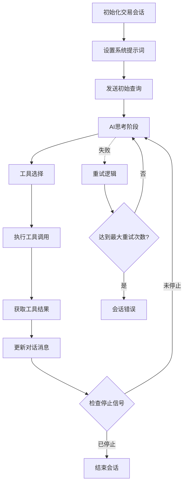

**图表来源**
- [agent/base_agent/base_agent.py](file://agent/base_agent/base_agent.py#L450-L550)

### 工具调用机制

#### 工具调用序列

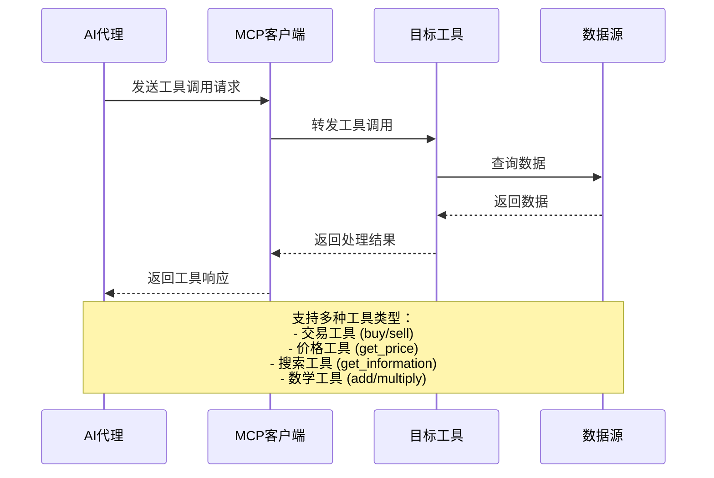

**图表来源**
- [agent/base_agent/base_agent.py](file://agent/base_agent/base_agent.py#L500-L600)

#### 错误处理与重试

代理实现了完善的错误处理和重试机制：

| 重试条件 | 最大重试次数 | 延迟策略 |
|---------|-------------|----------|
| 网络超时 | 3次 | 指数退避 |
| 工具调用失败 | 3次 | 固定延迟 |
| AI模型响应错误 | 3次 | 线性递增 |

**章节来源**
- [agent/base_agent/base_agent.py](file://agent/base_agent/base_agent.py#L400-L500)

### 日志记录系统

系统实现了完整的日志记录机制，支持调试和性能分析。

#### 日志结构

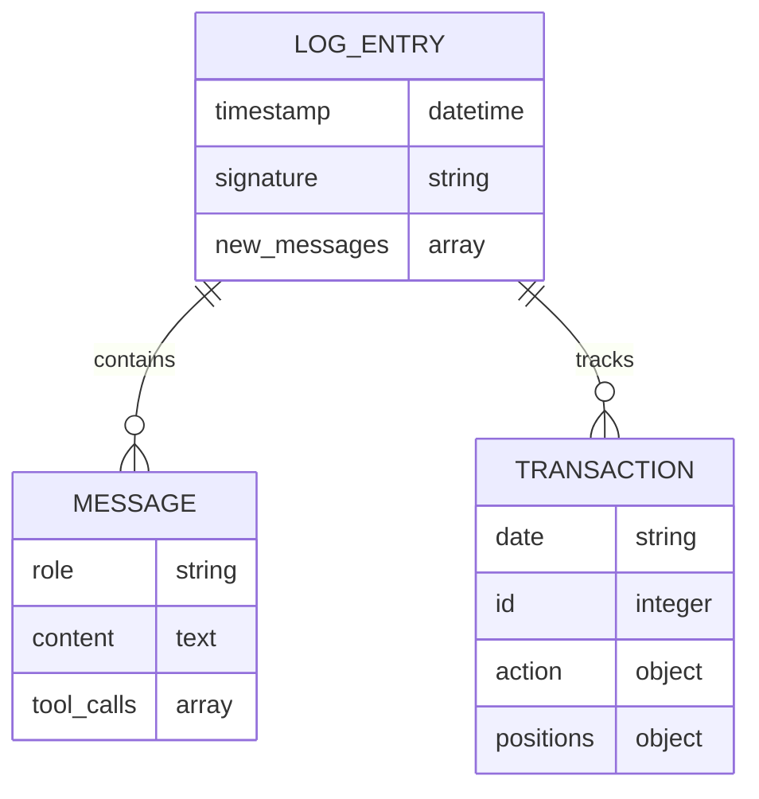

**图表来源**
- [agent/base_agent/base_agent.py](file://agent/base_agent/base_agent.py#L350-L400)

**章节来源**
- [agent/base_agent/base_agent.py](file://agent/base_agent/base_agent.py#L350-L450)

## 配置管理系统

### 配置层次结构

AI-Trader采用多层次的配置管理策略：

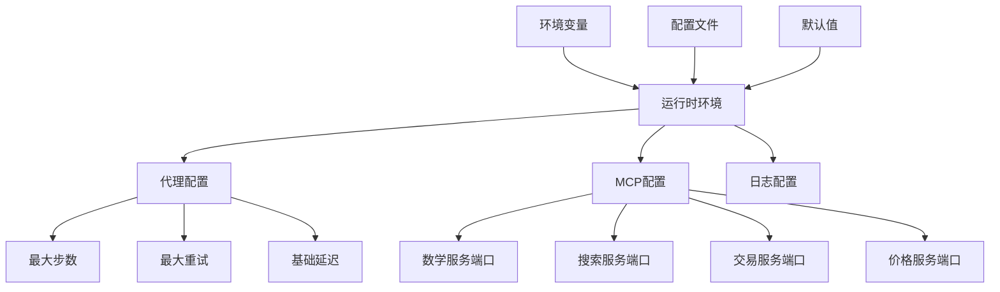

**图表来源**
- [configs/default_config.json](file://configs/default_config.json#L1-L50)
- [tools/general_tools.py](file://tools/general_tools.py#L1-L50)

### 配置优先级

配置值的优先级顺序为：
1. 环境变量（最高）
2. 运行时配置文件
3. 配置文件
4. 默认值（最低）

**章节来源**
- [tools/general_tools.py](file://tools/general_tools.py#L1-L100)

## 性能优化策略

### 并发处理

系统支持多模型并发执行，提高整体处理效率。

### 缓存机制

- **位置缓存**：避免频繁的文件I/O操作
- **价格缓存**：减少对外部API的重复调用
- **工具结果缓存**：存储工具调用的中间结果

### 资源管理

- **连接池**：复用MCP客户端连接
- **内存管理**：及时释放不需要的数据
- **文件句柄管理**：确保文件资源正确关闭

## 总结

AI-Trader的核心架构体现了现代AI系统设计的最佳实践：

1. **模块化设计**：通过MCP工具链实现高度解耦的组件架构
2. **可扩展性**：支持新的代理类型和工具类型的轻松添加
3. **可靠性**：完善的错误处理和重试机制
4. **可观察性**：全面的日志记录和监控能力
5. **标准化**：基于MCP协议的统一工具接口

这种架构设计使得AI-Trader不仅能够支持当前的交易需求，还能够适应未来的新功能扩展和技术演进。通过清晰的职责分离和标准化的接口设计，系统具备了良好的可维护性和可测试性，为AI在金融市场中的应用提供了坚实的技术基础。