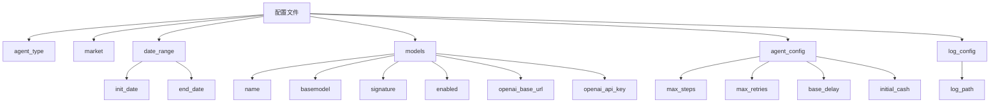
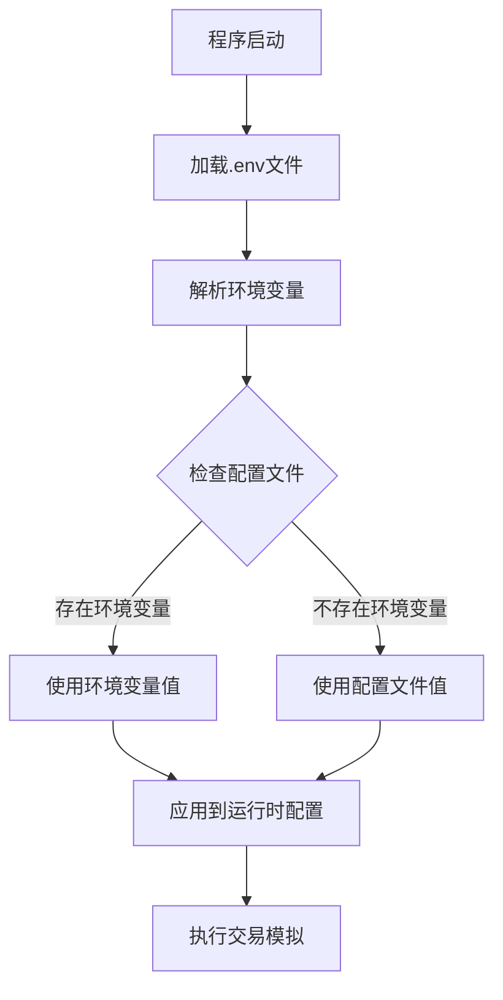
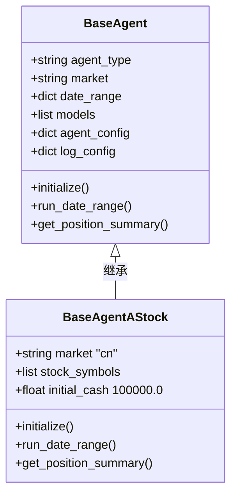
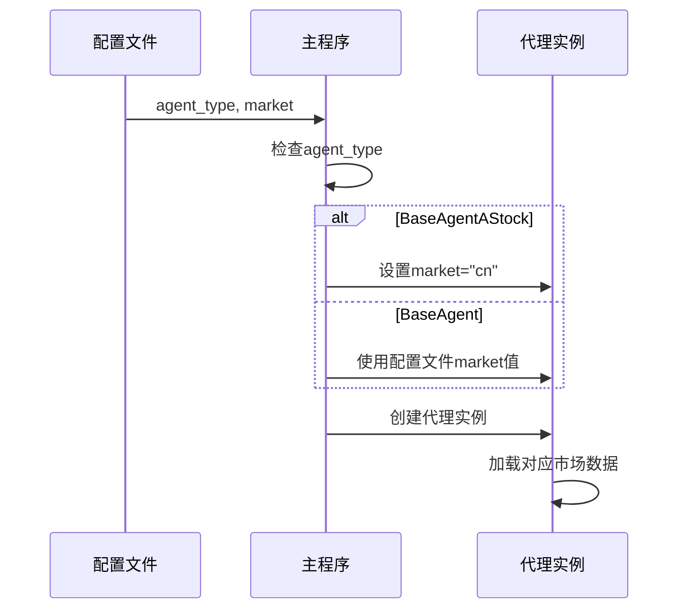
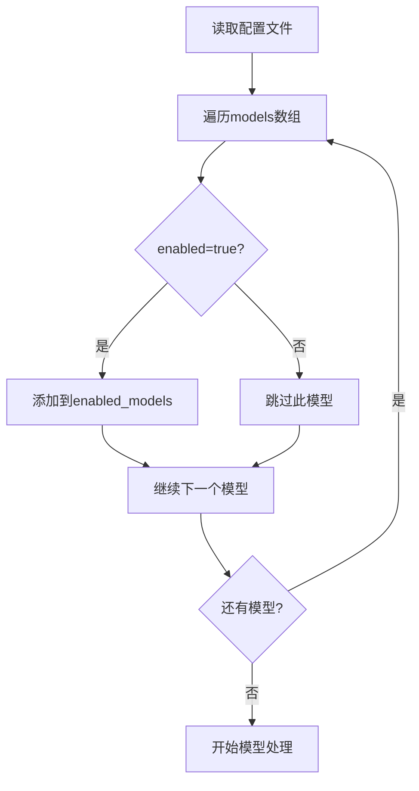
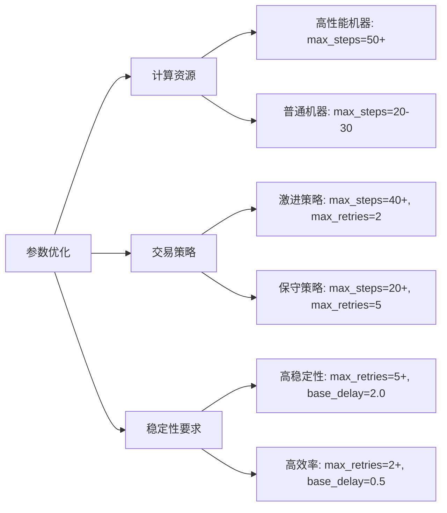
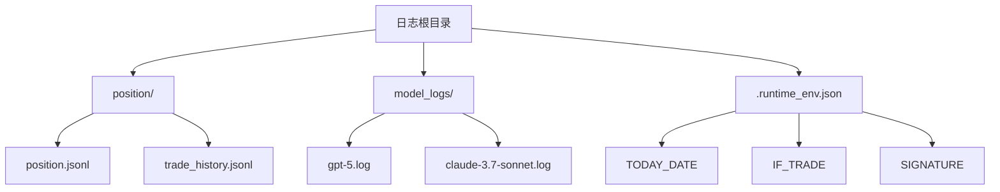
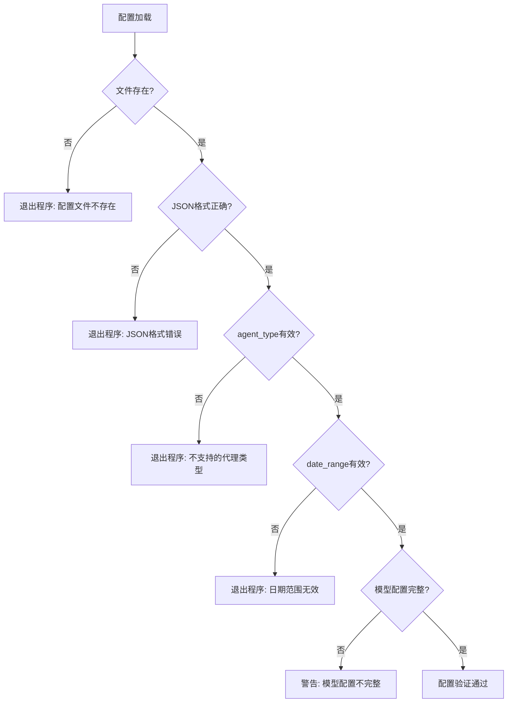
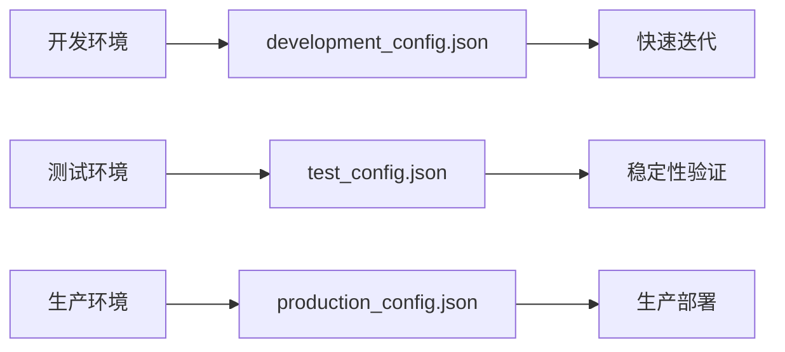

# 配置系统

<cite>
**本文档中引用的文件**
- [default_config.json](file://configs/default_config.json)
- [astock_config.json](file://configs/astock_config.json)
- [default_day_config.json](file://configs/default_day_config.json)
- [default_hour_config.json](file://configs/default_hour_config.json)
- [main.py](file://main.py)
- [general_tools.py](file://tools/general_tools.py)
- [README.md](file://configs/README.md)
- [requirements.txt](file://requirements.txt)
</cite>

## 目录
1. [简介](#简介)
2. [配置文件结构](#配置文件结构)
3. [核心配置参数](#核心配置参数)
4. [环境变量配置](#环境变量配置)
5. [代理类型配置](#代理类型配置)
6. [市场配置](#市场配置)
7. [模型配置](#模型配置)
8. [代理配置](#代理配置)
9. [日志配置](#日志配置)
10. [配置示例](#配置示例)
11. [配置验证与错误处理](#配置验证与错误处理)
12. [最佳实践](#最佳实践)

## 简介

AI-Trader配置系统是一个灵活且功能强大的配置管理框架，允许用户精确控制交易代理的行为、市场选择、时间范围、模型参数等关键要素。该系统采用JSON格式配置文件，支持多种市场（美股和A股）、不同的交易频率（日线和小时线），以及多模型并行处理。

配置系统的核心优势：
- **灵活性**：支持多种市场和交易策略配置
- **可扩展性**：易于添加新的代理类型和模型
- **可维护性**：清晰的配置结构便于理解和修改
- **环境适应性**：支持环境变量覆盖和动态配置

## 配置文件结构

配置系统基于JSON格式，主要包含以下核心部分：



**图表来源**
- [default_config.json](file://configs/default_config.json#L1-L53)
- [astock_config.json](file://configs/astock_config.json#L1-L63)

**章节来源**
- [default_config.json](file://configs/default_config.json#L1-L53)
- [astock_config.json](file://configs/astock_config.json#L1-L63)

## 核心配置参数

### agent_type - 代理类型

指定要使用的AI代理类，支持以下选项：

| 代理类型 | 描述 | 适用市场 | 默认行为 |
|---------|------|---------|----------|
| `BaseAgent` | 通用交易代理 | US / A-shares | 通过`market`参数切换市场 |
| `BaseAgentAStock` | A股专用代理 | A-shares only | 自动设置为CN市场，内置A股规则 |

### market - 市场类型

定义交易市场，支持：
- `"us"`：美国股市（纳斯达克100指数）
- `"cn"`：中国A股市场（上证50指数）

**重要说明**：当使用`BaseAgentAStock`时，`market`参数会被自动设置为`"cn"`，无需手动指定。

### date_range - 日期范围

定义回测的时间范围，支持两种格式：

| 格式 | 示例 | 用途 |
|------|------|------|
| 日线 | `"YYYY-MM-DD"` | 日间交易回测 |
| 小时线 | `"YYYY-MM-DD HH:MM:SS"` | 高频交易回测 |

**章节来源**
- [main.py](file://main.py#L120-L149)
- [README.md](file://configs/README.md#L88-L143)

## 环境变量配置

配置系统支持通过环境变量覆盖配置文件中的某些参数，提供了更大的灵活性。

### 支持的环境变量

| 环境变量 | 功能 | 覆盖对象 | 示例 |
|---------|------|---------|------|
| `INIT_DATE` | 覆盖初始日期 | `date_range.init_date` | `2024-01-01` |
| `END_DATE` | 覆盖结束日期 | `date_range.end_date` | `2024-12-31` |
| `OPENAI_API_KEY` | API密钥 | 所有模型的`openai_api_key` | `sk-xxx` |
| `OPENAI_API_BASE` | API基础URL | 所有模型的`openai_base_url` | `https://api.openai.com/v1` |

### 环境变量加载机制



**图表来源**
- [main.py](file://main.py#L120-L149)
- [general_tools.py](file://tools/general_tools.py#L1-L46)

**章节来源**
- [main.py](file://main.py#L120-L149)
- [general_tools.py](file://tools/general_tools.py#L1-L46)

## 代理类型配置

### BaseAgent - 通用代理

适用于美国股市和A股市场的通用交易代理，具有以下特点：

- **市场灵活性**：通过`market`参数在US和CN之间切换
- **股票池配置**：支持自定义股票池或使用默认池
- **通用接口**：提供统一的交易接口

### BaseAgentAStock - A股专用代理

专门为A股市场设计的交易代理，内置中国市场的特殊规则：

- **市场限制**：仅支持A股市场
- **交易规则**：内置T+1结算、100股一手等规则
- **默认股票池**：使用上证50指数作为默认股票池
- **货币单位**：自动识别并使用人民币(CNY)



**图表来源**
- [main.py](file://main.py#L15-L25)
- [README.md](file://configs/README.md#L144-L195)

**章节来源**
- [main.py](file://main.py#L15-L25)
- [README.md](file://configs/README.md#L144-L195)

## 市场配置

### 美股市场 (US Stocks)

- **默认股票池**：纳斯达克100指数成分股
- **货币单位**：美元(USD)
- **交易规则**：T+0结算，最小交易单位为1股
- **初始资金**：$10,000

### A股市场 (A-Shares)

- **默认股票池**：上证50指数成分股
- **货币单位**：人民币(CNY)
- **交易规则**：T+1结算，最小交易单位为100股
- **初始资金**：¥100,000

### 市场切换机制



**图表来源**
- [main.py](file://main.py#L120-L149)
- [main.py](file://main.py#L209-L242)

**章节来源**
- [main.py](file://main.py#L209-L242)
- [README.md](file://configs/README.md#L144-L195)

## 模型配置

模型配置是配置系统中最复杂的部分，支持多个AI模型的并行处理。

### 模型字段详解

| 字段名 | 类型 | 必需 | 描述 | 示例 |
|--------|------|------|------|------|
| `name` | string | 是 | 显示名称 | `"gpt-4o"` |
| `basemodel` | string | 是 | 完整模型标识符 | `"openai/gpt-4o-2024-11-20"` |
| `signature` | string | 是 | API调用签名 | `"gpt-4o-2024-11-20"` |
| `enabled` | boolean | 否 | 是否启用此模型 | `true` |
| `openai_base_url` | string | 否 | 自定义API基础URL | `"Optional: YOUR_OPENAI_BASE_URL"` |
| `openai_api_key` | string | 否 | API密钥 | `"Optional: YOUR_OPENAI_API_KEY"` |

### 模型启用机制



**图表来源**
- [main.py](file://main.py#L149-L151)

### 支持的模型提供商

| 提供商 | 模型示例 | 签名格式 | 特点 |
|--------|----------|----------|------|
| OpenAI | `gpt-5`, `gpt-4o` | `openai/model-name` | 高质量通用模型 |
| Anthropic | `claude-3.7-sonnet` | `anthropic/model-name` | 推理能力强 |
| DeepSeek | `deepseek-chat-v3.1` | `deepseek/model-name` | 中文优化 |
| Qwen | `qwen3-max` | `qwen/model-name` | 多语言支持 |
| Google | `gemini-2.5-flash` | `google/model-name` | 轻量级模型 |

**章节来源**
- [default_config.json](file://configs/default_config.json#L1-L53)
- [astock_config.json](file://configs/astock_config.json#L1-L63)

## 代理配置

代理配置控制AI交易代理的核心行为参数。

### 核心参数表

| 参数名 | 类型 | 默认值 | 描述 | 影响 |
|--------|------|--------|------|------|
| `max_steps` | integer | 30 | 单次决策最大推理步数 | 决策质量和计算成本 |
| `max_retries` | integer | 3 | 操作失败最大重试次数 | 稳定性和容错能力 |
| `base_delay` | float | 1.0 | 基础延迟时间(秒) | API限流和响应速度 |
| `initial_cash` | float | 10000.0/100000.0 | 初始资金金额 | 交易规模和风险 |

### 参数优化建议



**图表来源**
- [main.py](file://main.py#L149-L151)

**章节来源**
- [main.py](file://main.py#L149-L151)
- [README.md](file://configs/README.md#L521-L569)

## 日志配置

日志配置决定了代理数据和日志文件的存储位置。

### 日志路径配置

| 代理类型 | 默认路径 | 描述 |
|---------|----------|------|
| BaseAgent | `./data/agent_data` | 美股交易数据目录 |
| BaseAgentAStock | `./data/agent_data_astock` | A股交易数据目录 |

### 日志文件结构



**图表来源**
- [main.py](file://main.py#L200-L210)

**章节来源**
- [main.py](file://main.py#L200-L210)

## 配置示例

### 美股配置示例

#### 基础美股配置
```json
{
  "agent_type": "BaseAgent",
  "market": "us",
  "date_range": {
    "init_date": "2025-01-01",
    "end_date": "2025-01-31"
  },
  "models": [
    {
      "name": "gpt-4o",
      "basemodel": "openai/gpt-4o-2024-11-20",
      "signature": "gpt-4o-2024-11-20",
      "enabled": true
    }
  ],
  "agent_config": {
    "max_steps": 30,
    "initial_cash": 10000.0
  },
  "log_config": {
    "log_path": "./data/agent_data"
  }
}
```

#### 多模型美股配置
```json
{
  "agent_type": "BaseAgent",
  "market": "us",
  "date_range": {
    "init_date": "2025-01-01",
    "end_date": "2025-01-31"
  },
  "models": [
    {
      "name": "claude-3.7-sonnet",
      "basemodel": "anthropic/claude-3.7-sonnet",
      "signature": "claude-3.7-sonnet",
      "enabled": true
    },
    {
      "name": "gpt-4o",
      "basemodel": "openai/gpt-4o-2024-11-20",
      "signature": "gpt-4o-2024-11-20",
      "enabled": true
    }
  ],
  "agent_config": {
    "max_steps": 50,
    "max_retries": 5,
    "base_delay": 2.0,
    "initial_cash": 20000.0
  },
  "log_config": {
    "log_path": "./data/agent_data"
  }
}
```

### A股配置示例

#### 基础A股配置
```json
{
  "agent_type": "BaseAgentAStock",
  "market": "cn",
  "date_range": {
    "init_date": "2025-10-09",
    "end_date": "2025-10-31"
  },
  "models": [
    {
      "name": "claude-3.7-sonnet",
      "basemodel": "anthropic/claude-3.7-sonnet",
      "signature": "claude-3.7-sonnet",
      "enabled": true
    }
  ],
  "agent_config": {
    "max_steps": 30,
    "initial_cash": 100000.0
  },
  "log_config": {
    "log_path": "./data/agent_data_astock"
  }
}
```

#### 小时线A股配置
```json
{
  "agent_type": "BaseAgentAStock",
  "market": "cn",
  "date_range": {
    "init_date": "2025-10-23 14:00:00",
    "end_date": "2025-10-27 19:00:00"
  },
  "models": [
    {
      "name": "gpt-4o",
      "basemodel": "openai/gpt-4o-2024-11-20",
      "signature": "gpt-4o-2024-11-20",
      "enabled": true
    }
  ],
  "agent_config": {
    "max_steps": 30,
    "initial_cash": 100000.0
  },
  "log_config": {
    "log_path": "./data/agent_data_astock"
  }
}
```

**章节来源**
- [README.md](file://configs/README.md#L88-L195)
- [default_config.json](file://configs/default_config.json#L1-L53)
- [astock_config.json](file://configs/astock_config.json#L1-L63)

## 配置验证与错误处理

### 验证机制

配置系统实现了多层次的验证机制：



**图表来源**
- [main.py](file://main.py#L79-L122)

### 错误处理策略

| 错误类型 | 处理方式 | 用户提示 |
|---------|---------|---------|
| 配置文件不存在 | 程序退出 | `❌ Configuration file does not exist` |
| JSON格式错误 | 程序退出 | `❌ Configuration file JSON format error` |
| 代理类型无效 | 程序退出 | `❌ Unsupported agent type` |
| 日期范围无效 | 程序退出 | `❌ INIT_DATE is greater than END_DATE` |
| 模型字段缺失 | 跳过模型 | `❌ Model xxx missing basemodel field` |

**章节来源**
- [main.py](file://main.py#L79-L122)

## 最佳实践

### 配置文件组织

1. **命名规范**：使用描述性的配置文件名，如`us_strategy_2025_q1.json`
2. **版本控制**：将配置文件纳入版本控制系统
3. **文档注释**：在配置文件中添加必要的注释说明

### 性能优化配置

#### 高性能配置
```json
{
  "agent_config": {
    "max_steps": 50,
    "max_retries": 2,
    "base_delay": 0.5,
    "initial_cash": 10000.0
  }
}
```

#### 稳定性优先配置
```json
{
  "agent_config": {
    "max_steps": 20,
    "max_retries": 5,
    "base_delay": 2.0,
    "initial_cash": 10000.0
  }
}
```

### 多环境配置管理



### 环境变量最佳实践

1. **敏感信息保护**：将API密钥等敏感信息存储在`.env`文件中
2. **环境隔离**：不同环境使用不同的配置文件
3. **动态覆盖**：利用环境变量实现配置的动态调整

### 监控和调试配置

```json
{
  "log_config": {
    "log_path": "./logs/debug_2025_q1"
  },
  "agent_config": {
    "max_steps": 10,  // 调试时降低步数
    "max_retries": 1  // 减少重试次数
  }
}
```

通过遵循这些最佳实践，用户可以构建稳定、高效且易于维护的AI交易配置系统，充分发挥AI-Trader平台的强大功能。