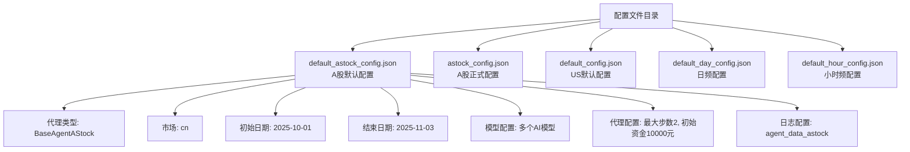
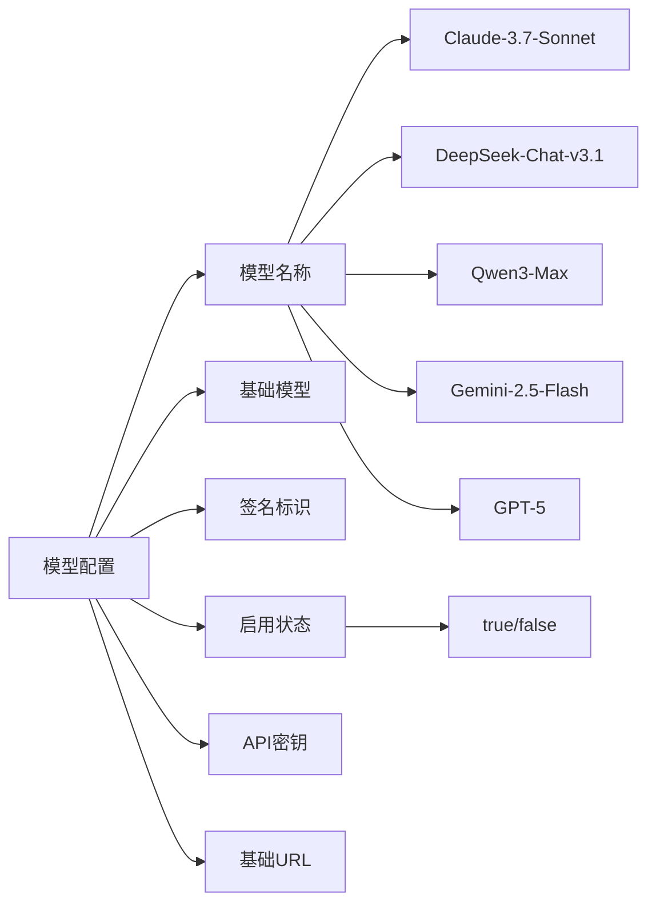
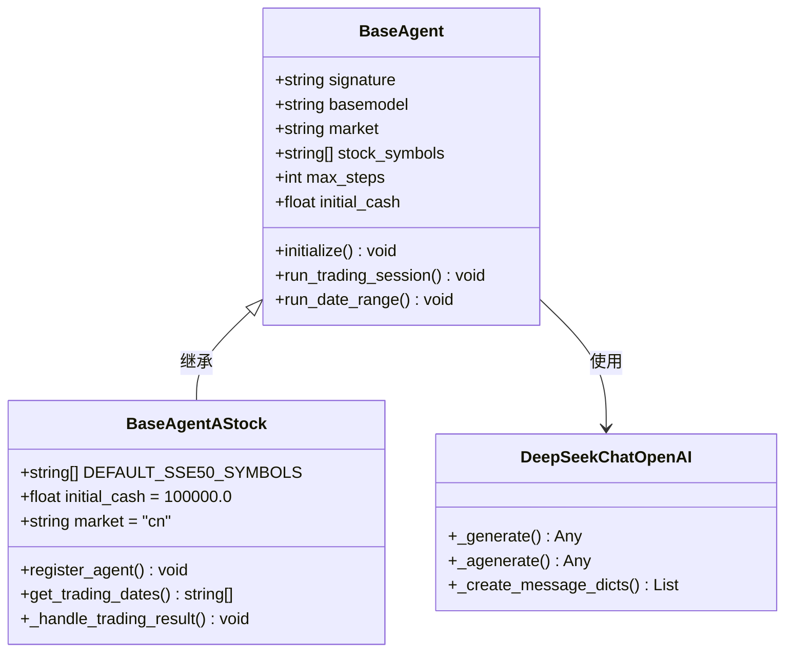
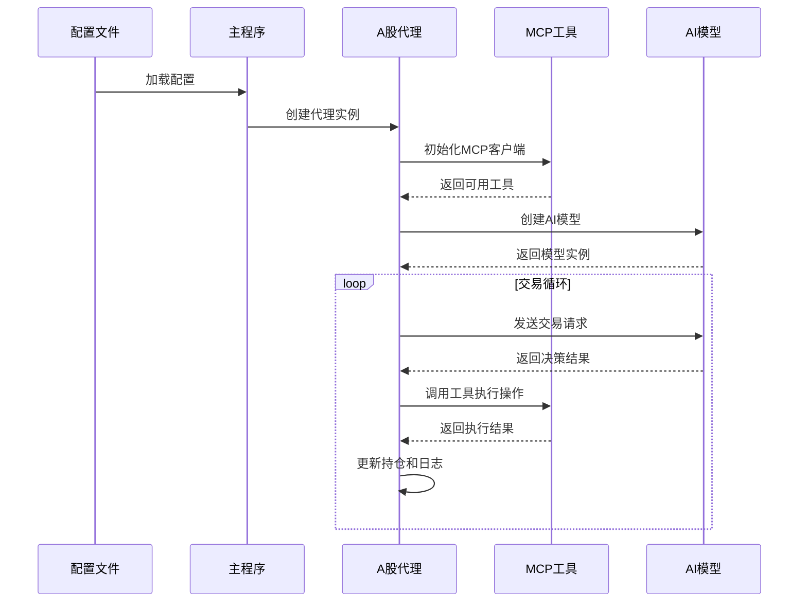
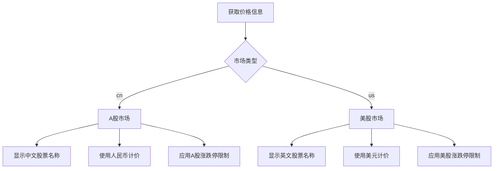
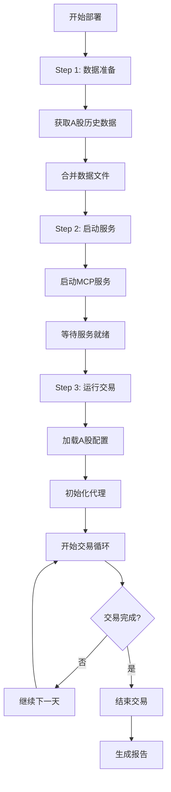

# A股默认配置

<cite>
**本文档中引用的文件**
- [default_astock_config.json](file://configs/default_astock_config.json)
- [astock_config.json](file://configs/astock_config.json)
- [default_config.json](file://configs/default_config.json)
- [default_day_config.json](file://configs/default_day_config.json)
- [default_hour_config.json](file://configs/default_hour_config.json)
- [base_agent_astock.py](file://agent/base_agent_astock/base_agent_astock.py)
- [base_agent.py](file://agent/base_agent/base_agent.py)
- [main.py](file://main.py)
- [README.md](file://configs/README.md)
- [main_a_stock_step1.sh](file://scripts/main_a_stock_step1.sh)
- [main_a_stock_step2.sh](file://scripts/main_a_stock_step2.sh)
- [main_a_stock_step3.sh](file://scripts/main_a_stock_step3.sh)
- [agent_prompt_astock.py](file://prompts/agent_prompt_astock.py)
- [general_tools.py](file://tools/general_tools.py)
- [requirements.txt](file://requirements.txt)
</cite>

## 目录
1. [简介](#简介)
2. [配置文件结构](#配置文件结构)
3. [A股专用配置详解](#a股专用配置详解)
4. [核心组件架构](#核心组件架构)
5. [A股市场规则与约束](#a股市场规则与约束)
6. [配置文件对比分析](#配置文件对比分析)
7. [部署与运行流程](#部署与运行流程)
8. [最佳实践建议](#最佳实践建议)
9. [故障排除指南](#故障排除指南)
10. [总结](#总结)

## 简介

A股默认配置是AI-Trader Bench系统中专门为A股市场设计的交易配置方案。该配置系统支持基于大语言模型的自动化交易决策，针对中国A股市场的特殊规则和交易机制进行了优化设计。

### 主要特性

- **市场专业化**：专为A股市场设计，包含完整的中国股市交易规则
- **多模型支持**：支持Claude、DeepSeek、Qwen、Gemini等多种AI模型
- **灵活配置**：提供多种预设配置文件，适应不同交易场景
- **自动化程度高**：从数据获取到交易执行的完整自动化流程
- **风险控制**：内置多种风险控制机制和错误处理

## 配置文件结构

系统采用分层配置架构，主要配置文件位于`configs/`目录下：

**图表来源**
- [default_astock_config.json](file://configs/default_astock_config.json#L1-L53)
- [astock_config.json](file://configs/astock_config.json#L1-L63)

**章节来源**
- [default_astock_config.json](file://configs/default_astock_config.json#L1-L53)
- [astock_config.json](file://configs/astock_config.json#L1-L63)
- [default_config.json](file://configs/default_config.json#L1-L53)

## A股专用配置详解

### 基础配置参数

A股配置文件的核心参数包括：

| 参数类别 | 参数名 | 默认值 | 描述 |
|---------|--------|--------|------|
| 代理类型 | agent_type | BaseAgentAStock | 使用A股专用代理类 |
| 市场标识 | market | cn | 标识为中国A股市场 |
| 初始日期 | init_date | 2025-10-01 | 交易开始日期 |
| 结束日期 | end_date | 2025-11-03 | 交易结束日期 |
| 最大步数 | max_steps | 2 | 每次交易决策的最大推理步数 |
| 最大重试 | max_retries | 3 | 操作失败的最大重试次数 |
| 基础延迟 | base_delay | 1.0 | 重试间隔时间（秒） |
| 初始资金 | initial_cash | 10000.0 | 初始可用资金（人民币） |

### 模型配置

系统支持多个AI模型，每个模型配置包含：

**图表来源**
- [default_astock_config.json](file://configs/default_astock_config.json#L8-L40)

### 日志配置

日志系统配置用于跟踪交易过程：

- **日志路径**：`./data/agent_data_astock`
- **日志格式**：JSON Lines格式
- **日志内容**：包含时间戳、代理签名、消息记录等

**章节来源**
- [default_astock_config.json](file://configs/default_astock_config.json#L42-L53)
- [astock_config.json](file://configs/astock_config.json#L52-L63)

## 核心组件架构

### 代理类层次结构

**图表来源**
- [base_agent.py](file://agent/base_agent/base_agent.py#L93-L208)
- [base_agent_astock.py](file://agent/base_agent_astock/base_agent_astock.py#L95-L208)

### 数据流架构

**图表来源**
- [main.py](file://main.py#L101-L200)
- [base_agent_astock.py](file://agent/base_agent_astock/base_agent_astock.py#L259-L315)

**章节来源**
- [base_agent_astock.py](file://agent/base_agent_astock/base_agent_astock.py#L95-L588)
- [base_agent.py](file://agent/base_agent/base_agent.py#L93-L647)

## A股市场规则与约束

### 交易规则详解

A股市场具有独特的交易规则，系统严格遵循这些规则：

#### 1. 一手交易要求
- **最小交易单位**：100股（1手）
- **正确示例**：`buy("600519.SH", 100)`、`sell("600519.SH", 300)`
- **错误示例**：`buy("600519.SH", 13)`、`sell("600519.SH", 50)`

#### 2. T+1结算规则
- **买入限制**：当天买入的股票不能当天卖出
- **卖出条件**：只能卖出在今天之前购买的股票
- **特殊情况**：可以卖出之前持有的股票

#### 3. 涨跌停限制
- **普通股票**：±10%
- **ST股票**：±5%
- **科创板/创业板**：±20%

### 价格显示规则

系统根据市场类型显示不同的价格信息：

**图表来源**
- [agent_prompt_astock.py](file://prompts/agent_prompt_astock.py#L115-L118)

**章节来源**
- [agent_prompt_astock.py](file://prompts/agent_prompt_astock.py#L48-L82)

## 配置文件对比分析

### 默认配置对比表

| 配置项 | default_astock_config.json | astock_config.json | default_config.json |
|-------|---------------------------|-------------------|-------------------|
| 代理类型 | BaseAgentAStock | BaseAgentAStock | BaseAgent |
| 市场 | cn | cn | us |
| 初始日期 | 2025-10-01 | 2025-10-01 | 2025-10-01 |
| 结束日期 | 2025-11-03 | 2025-10-29 | 2025-10-21 |
| 最大步数 | 2 | 30 | 30 |
| 初始资金 | 10000.0 | 100000.0 | 10000.0 |
| 日志路径 | agent_data_astock | agent_data_astock | agent_data |

### 关键差异说明

1. **最大步数差异**：
   - A股默认配置：max_steps=2，适合快速决策
   - A股正式配置：max_steps=30，适合深入分析
   - US配置：max_steps=30，平衡效率与深度

2. **初始资金差异**：
   - A股配置：100000.0元，符合A股市场特点
   - US配置：10000.0美元，符合美股市场特点

3. **日期范围差异**：
   - A股默认配置：较长的测试周期
   - A股正式配置：较短的实际交易期

**章节来源**
- [default_astock_config.json](file://configs/default_astock_config.json#L42-L53)
- [astock_config.json](file://configs/astock_config.json#L52-L63)
- [default_config.json](file://configs/default_config.json#L42-L53)

## 部署与运行流程

### 完整部署流程

**图表来源**
- [main_a_stock_step1.sh](file://scripts/main_a_stock_step1.sh#L1-L21)
- [main_a_stock_step2.sh](file://scripts/main_a_stock_step2.sh#L1-L13)
- [main_a_stock_step3.sh](file://scripts/main_a_stock_step3.sh#L1-L14)

### 脚本执行顺序

1. **数据准备阶段** (`main_a_stock_step1.sh`)
   - 获取AlphaVantage或TuShare的A股历史数据
   - 合并JSONL格式的数据文件

2. **服务启动阶段** (`main_a_stock_step2.sh`)
   - 启动MCP（Model Context Protocol）服务
   - 包括数学计算、价格查询、搜索和交易服务

3. **交易执行阶段** (`main_a_stock_step3.sh`)
   - 使用`astock_config.json`配置运行交易
   - 执行完整的A股交易模拟

### 环境变量配置

系统支持通过环境变量覆盖配置：

| 环境变量 | 描述 | 示例值 |
|---------|------|--------|
| INIT_DATE | 覆盖初始日期 | 2025-10-01 |
| END_DATE | 覆盖结束日期 | 2025-11-03 |
| OPENAI_API_KEY | OpenAI API密钥 | sk-xxx |
| OPENAI_API_BASE | API基础URL | https://api.openai.com/v1 |

**章节来源**
- [main_a_stock_step1.sh](file://scripts/main_a_stock_step1.sh#L1-L21)
- [main_a_stock_step2.sh](file://scripts/main_a_stock_step2.sh#L1-L13)
- [main_a_stock_step3.sh](file://scripts/main_a_stock_step3.sh#L1-L14)

## 最佳实践建议

### 配置优化建议

1. **模型选择策略**
   - 对于A股交易，推荐使用GPT-5作为主要模型
   - 可同时启用多个模型进行对比验证
   - 确保至少有一个模型处于启用状态

2. **资金管理**
   - A股初始资金设置为100000.0元
   - 根据实际交易规模调整初始资金
   - 注意控制单笔交易的资金比例

3. **风险管理**
   - 设置合理的最大重试次数（建议3次）
   - 实施基础延迟机制防止API限流
   - 监控交易频率和成功率

### 性能优化

1. **并发处理**
   - 利用异步编程提高数据获取效率
   - 并行处理多个股票的价格查询
   - 异步执行交易决策和工具调用

2. **缓存策略**
   - 缓存常用的价格数据
   - 缓存模型响应结果
   - 实现智能的缓存失效机制

3. **资源管理**
   - 合理设置最大步数避免过度计算
   - 监控内存使用情况
   - 实施优雅的错误恢复机制

### 监控与维护

1. **日志监控**
   - 定期检查交易日志
   - 监控错误率和成功率
   - 分析交易决策的质量

2. **性能监控**
   - 监控API调用频率
   - 跟踪交易执行时间
   - 分析模型响应质量

3. **配置管理**
   - 定期备份配置文件
   - 测试新配置的有效性
   - 维护配置变更记录

## 故障排除指南

### 常见问题及解决方案

#### 1. MCP服务连接失败

**症状**：无法连接到MCP服务，出现超时或连接拒绝错误

**解决方案**：
- 确认MCP服务已正确启动
- 检查端口配置是否正确
- 验证防火墙设置
- 查看服务日志获取详细错误信息

#### 2. API密钥配置错误

**症状**：出现401未授权错误或API访问被拒绝

**解决方案**：
- 验证OPENAI_API_KEY环境变量
- 检查API密钥的有效性
- 确认API基础URL配置正确
- 检查API配额和使用限制

#### 3. 数据获取失败

**症状**：无法获取股票价格数据或数据不完整

**解决方案**：
- 检查网络连接
- 验证数据源可用性
- 确认股票代码格式正确
- 检查日期范围是否有效

#### 4. 交易规则违反

**症状**：出现一手交易、T+1结算或涨跌停限制错误

**解决方案**：
- 检查交易数量是否为100的倍数
- 验证买入日期和卖出日期关系
- 确认价格是否在涨跌停范围内
- 检查ST股票的特殊限制

### 调试技巧

1. **启用详细日志**
   - 设置日志级别为DEBUG
   - 记录详细的交易过程
   - 监控API调用详情

2. **分步测试**
   - 单独测试MCP服务
   - 验证模型连接
   - 测试数据获取功能

3. **配置验证**
   - 检查JSON配置语法
   - 验证必需字段存在
   - 测试配置加载过程

**章节来源**
- [base_agent_astock.py](file://agent/base_agent_astock/base_agent_astock.py#L259-L315)
- [general_tools.py](file://tools/general_tools.py#L50-L70)

## 总结

A股默认配置为AI-Trader Bench系统提供了专业化的A股市场交易能力。通过精心设计的配置文件、完善的市场规则支持和可靠的执行框架，该系统能够：

1. **准确反映A股市场特征**：严格遵循一手交易、T+1结算和涨跌停限制等规则
2. **提供灵活的配置选项**：支持多种模型、交易策略和参数设置
3. **确保稳定可靠运行**：具备完善的错误处理和重试机制
4. **便于扩展和维护**：模块化设计支持功能扩展和配置优化

### 核心优势

- **专业性**：专门针对A股市场设计的功能特性
- **可靠性**：经过充分测试的稳定实现
- **可扩展性**：支持自定义扩展和配置
- **易用性**：简化的部署和配置流程

### 应用前景

随着人工智能技术的发展和A股市场的不断成熟，这套A股默认配置系统将在智能投顾、量化交易和算法交易等领域发挥重要作用，为投资者提供更加智能化和自动化的交易解决方案。