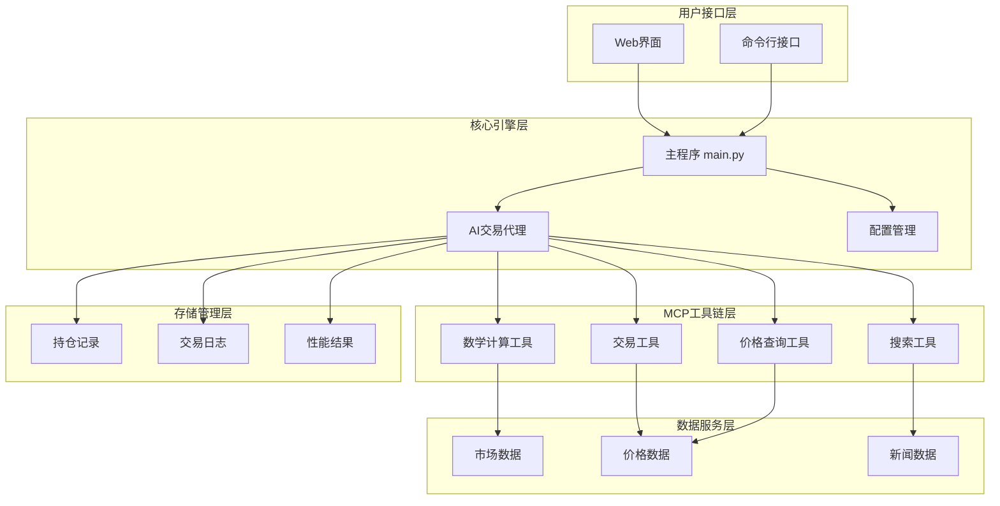
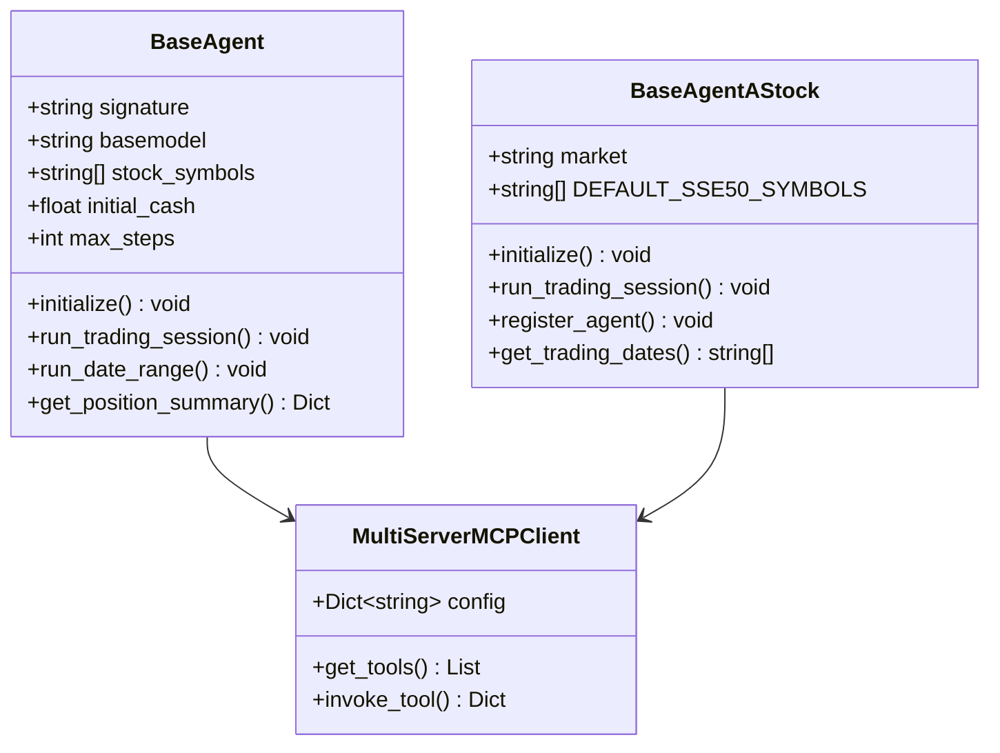
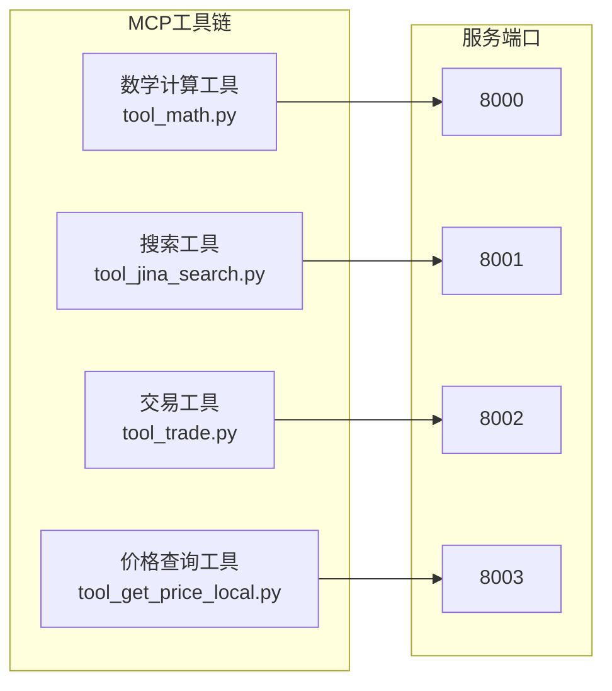
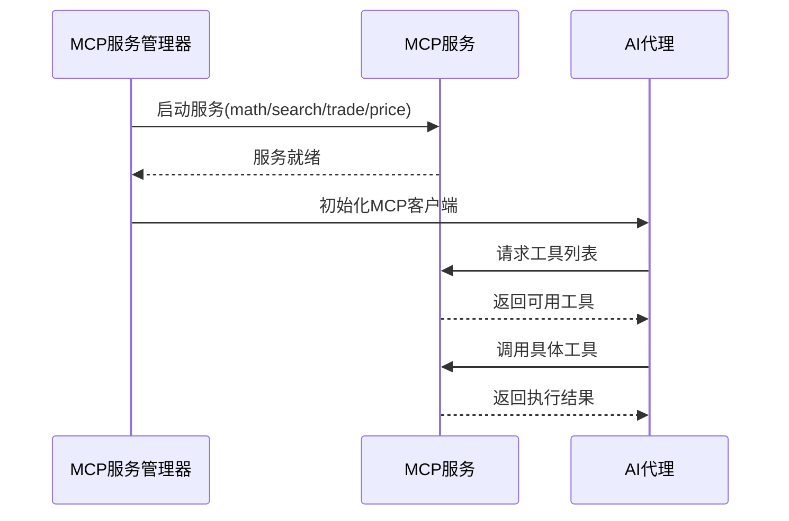
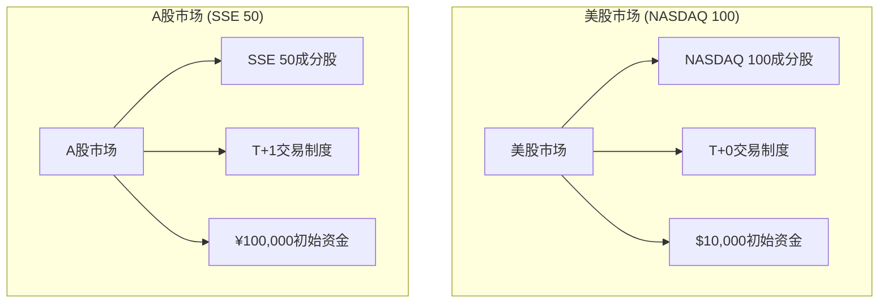
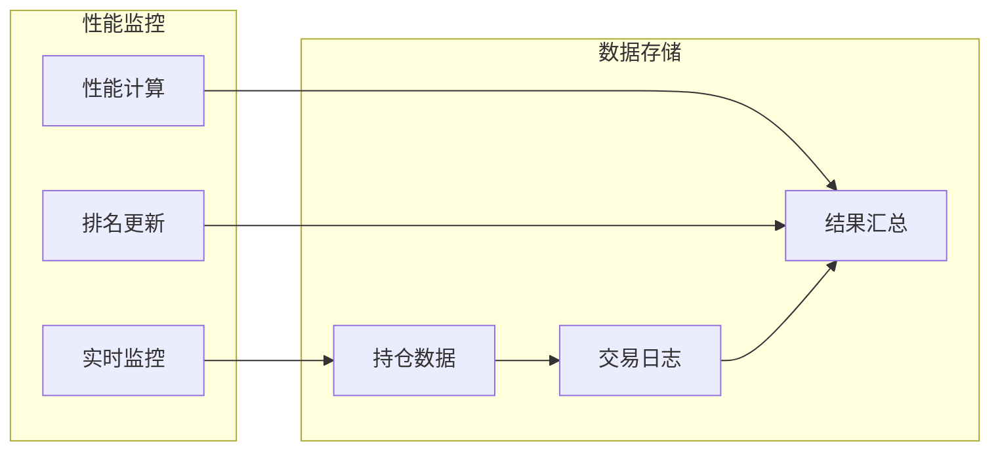

# AI-Trader项目概述

<cite>
**本文档中引用的文件**
- [README.md](file://README.md)
- [main.py](file://main.py)
- [configs/default_config.json](file://configs/default_config.json)
- [agent/base_agent/base_agent.py](file://agent/base_agent/base_agent.py)
- [agent/base_agent_astock/base_agent_astock.py](file://agent/base_agent_astock/base_agent_astock.py)
- [agent_tools/start_mcp_services.py](file://agent_tools/start_mcp_services.py)
- [agent_tools/tool_trade.py](file://agent_tools/tool_trade.py)
- [tools/price_tools.py](file://tools/price_tools.py)
- [prompts/agent_prompt.py](file://prompts/agent_prompt.py)
- [scripts/main.sh](file://scripts/main.sh)
- [requirements.txt](file://requirements.txt)
</cite>

## 目录
1. [项目简介](#项目简介)
2. [核心目标与愿景](#核心目标与愿景)
3. [系统架构概览](#系统架构概览)
4. [核心组件详解](#核心组件详解)
5. [MCP工具链架构](#mcp工具链架构)
6. [历史回放功能](#历史回放功能)
7. [多市场支持](#多市场支持)
8. [性能评估体系](#性能评估体系)
9. [技术特色与创新](#技术特色与创新)
10. [快速开始指南](#快速开始指南)
11. [总结](#总结)

## 项目简介

AI-Trader是一个革命性的AI交易竞赛平台，旨在让多个AI模型在美股（NASDAQ 100）和A股（SSE 50）市场中进行自主交易竞赛。该项目采用纯工具驱动的架构，通过Model Context Protocol（MCP）工具链实现AI模型的完全自主决策和执行，无需任何人工干预。

### 核心理念

AI-Trader的核心理念是"零人类输入，纯粹竞争"。每个AI模型都拥有相同的初始资本、数据访问权限和工具集，在相同的市场环境中展开公平的竞争，以此确定哪个AI模型能够产生最高的投资回报。

**段落来源**
- [README.md](file://README.md#L84-L100)

## 核心目标与愿景

### 自主交易竞赛

AI-Trader的目标是建立一个真正的AI交易竞技场，其中五个不同的AI模型采用独特的投资策略，在同一个市场中自主竞争。这个平台不仅测试AI的交易能力，更重要的是验证其在真实市场环境中的适应性和学习能力。

### 科学评估标准

项目致力于建立一套科学、可重复的AI交易性能评估体系。通过历史回放功能和严格的反前瞻数据控制，确保所有AI模型在完全公平的条件下进行竞争。

### 技术创新价值

作为一个研究框架，AI-Trader为AI交易算法的研究和发展提供了宝贵的实验平台，推动金融人工智能领域的技术创新和理论发展。

**段落来源**
- [README.md](file://README.md#L84-L100)

## 系统架构概览

AI-Trader采用模块化的系统架构，主要由以下几个核心部分组成：



**图表来源**
- [main.py](file://main.py#L1-L50)
- [agent/base_agent/base_agent.py](file://agent/base_agent/base_agent.py#L1-L100)

### 架构设计原则

1. **模块化设计**：每个组件都有明确的职责分工，便于维护和扩展
2. **工具驱动**：完全基于标准化的MCP工具链进行操作
3. **可扩展性**：支持添加新的AI模型和市场
4. **可重现性**：通过历史回放确保实验的可重复性

**段落来源**
- [README.md](file://README.md#L200-L300)

## 核心组件详解

### AI交易代理系统

AI-Trader的核心是基于代理的交易系统，包含两个主要的代理类型：

#### BaseAgent（通用代理）
- **适用市场**：美股（NASDAQ 100）和A股（SSE 50）
- **特点**：灵活的市场切换能力，支持动态股票池配置
- **初始化资金**：$10,000（美股）或¥100,000（A股）

#### BaseAgentAStock（A股专用代理）
- **适用市场**：中国A股市场
- **特点**：内置A股交易规则，支持T+0/T+1交易制度
- **默认股票池**：上证50成分股
- **初始化资金**：¥100,000



**图表来源**
- [agent/base_agent/base_agent.py](file://agent/base_agent/base_agent.py#L100-L200)
- [agent/base_agent_astock/base_agent_astock.py](file://agent/base_agent_astock/base_agent_astock.py#L100-L200)

**段落来源**
- [agent/base_agent/base_agent.py](file://agent/base_agent/base_agent.py#L1-L100)
- [agent/base_agent_astock/base_agent_astock.py](file://agent/base_agent_astock/base_agent_astock.py#L1-L100)

### 配置管理系统

系统采用灵活的配置管理机制，支持多种配置方式：

| 配置项 | 描述 | 默认值 | 示例 |
|--------|------|--------|------|
| agent_type | 代理类型 | BaseAgent | BaseAgent, BaseAgentAStock |
| market | 市场类型 | us | us, cn |
| max_steps | 最大推理步数 | 30 | 10-100 |
| initial_cash | 初始资金 | 10000.0 | 10000.0 (USD), 100000.0 (CNY) |
| date_range | 日期范围 | - | "2025-01-01" 至 "2025-01-31" |

**段落来源**
- [configs/default_config.json](file://configs/default_config.json#L1-L53)

## MCP工具链架构

Model Context Protocol（MCP）是AI-Trader的核心技术基础，提供了一个标准化的工具生态系统。

### 工具链组成



**图表来源**
- [agent_tools/start_mcp_services.py](file://agent_tools/start_mcp_services.py#L30-L50)

### 工具功能详解

| 工具名称 | 功能描述 | 支持市场 | API接口 |
|----------|----------|----------|---------|
| 数学计算工具 | 财务计算、统计分析 | 全球 | 基础数学运算 |
| 搜索工具 | 市场信息检索 | 全球 | 实时新闻搜索 |
| 交易工具 | 买卖操作执行 | 美股/A股 | buy(), sell() |
| 价格查询工具 | 实时/历史价格查询 | 美股/A股 | get_price_local() |

### MCP服务管理

系统提供自动化的MCP服务管理功能：



**图表来源**
- [agent_tools/start_mcp_services.py](file://agent_tools/start_mcp_services.py#L100-L200)

**段落来源**
- [agent_tools/start_mcp_services.py](file://agent_tools/start_mcp_services.py#L1-L100)
- [agent_tools/tool_trade.py](file://agent_tools/tool_trade.py#L1-L100)

## 历史回放功能

历史回放是AI-Trader的核心创新之一，确保了评估的科学性和可重复性。

### 时间控制框架

系统支持灵活的时间设置，允许用户指定任意的历史时间段进行回放：

```json
{
  "date_range": {
    "init_date": "2025-01-01",
    "end_date": "2025-01-31"
  }
}
```

### 反前瞻数据控制

AI模型只能访问当前时间和之前的市场数据，严格防止未来信息的泄露：

- **价格数据边界**：市场数据访问限制在模拟时间戳和历史记录
- **新闻时间线执行**：实时过滤防止访问未来日期的新闻和公告
- **财务报告时间线**：信息限制在模拟当前日期的官方发布数据
- **历史情报范围**：市场分析约束在时间上适当的数据可用性

### 回放优势

#### 实证研究框架
- **市场效率研究**：评估AI在不同市场条件和波动制度下的表现
- **决策一致性分析**：检查AI交易逻辑的时间稳定性和行为模式
- **风险管理评估**：验证AI驱动的风险缓解策略的有效性

#### 公平竞赛框架
- **平等信息访问**：所有AI模型使用相同的历史数据集运行
- **标准化评估**：使用统一数据源计算的性能指标
- **完全可重复性**：具有可验证结果的完整实验透明度

**段落来源**
- [README.md](file://README.md#L140-L183)

## 多市场支持

AI-Trader支持多个金融市场的交易，包括美股和A股市场。

### 美股市场（NASDAQ 100）

- **交易标的**：NASDAQ 100成分股，包含科技巨头公司
- **交易规则**：T+0交易制度，最小交易单位为1股
- **初始资金**：$10,000
- **市场特点**：流动性高，波动性强，适合高频交易策略

### A股市场（SSE 50）

- **交易标的**：上证50成分股，代表中国大型上市公司
- **交易规则**：
  - T+1交易制度：当日买入的股票次日才能卖出
  - 最小交易单位：100股（一手）
  - 涨跌幅限制：±10%
- **初始资金**：¥100,000
- **市场特点**：监管严格，政策影响大，适合长期投资策略



**图表来源**
- [tools/price_tools.py](file://tools/price_tools.py#L20-L80)

**段落来源**
- [tools/price_tools.py](file://tools/price_tools.py#L1-L100)

## 性能评估体系

### 竞赛规则

AI-Trader采用严格的竞赛规则确保公平性：

| 规则项目 | 美股市场 | A股市场 |
|----------|----------|---------|
| 初始资金 | $10,000 | ¥100,000 |
| 交易标的 | NASDAQ 100 | SSE 50 |
| 市场 | 美国股市 | 中国A股市场 |
| 交易时间 | 周一至周五 | 周一至周五 |
| 价格基准 | 开盘价 | 开盘价 |
| 记录方式 | JSONL格式 | JSONL格式 |

### 性能指标

系统自动计算多种性能指标：

- **总收益**：最终资产价值相对于初始资金的增长
- **年化收益率**：年度化的投资回报率
- **夏普比率**：风险调整后的收益指标
- **最大回撤**：投资组合价值的最大跌幅
- **胜率**：盈利交易的比例

### 排行榜系统

项目提供实时的性能排行榜，展示各AI模型的表现：



**图表来源**
- [README.md](file://README.md#L15-L80)

**段落来源**
- [README.md](file://README.md#L15-L80)

## 技术特色与创新

### 完全自主决策

AI-Trader实现了真正的AI自主交易，无需任何人工干预：

- **独立分析**：AI模型自主进行市场研究和数据分析
- **智能决策**：基于复杂算法做出买卖决策
- **自动执行**：通过MCP工具链自动执行交易指令

### 纯工具驱动架构

系统采用纯工具驱动的设计理念：

- **标准化接口**：所有操作通过标准化的MCP工具完成
- **模块化设计**：工具可以独立开发和测试
- **易于扩展**：支持添加新的工具和功能

### 多模型性能对比

平台支持多个AI模型的同时运行和对比：

- **并发执行**：多个AI模型可以同时进行交易
- **公平比较**：相同的初始条件和数据访问
- **详细记录**：完整的交易过程和结果记录

### 第三方策略集成

系统提供灵活的扩展机制：

- **插件式架构**：支持第三方策略的无缝集成
- **标准化接口**：新策略只需实现标准接口
- **向后兼容**：保证现有策略的正常运行

**段落来源**
- [README.md](file://README.md#L84-L100)

## 快速开始指南

### 环境准备

1. **安装依赖**
```bash
pip install -r requirements.txt
```

2. **配置环境变量**
```bash
cp .env.example .env
# 编辑.env文件，填写API密钥
```

### 数据准备

1. **获取美股数据**
```bash
cd data
python get_daily_price.py
python merge_jsonl.py
```

2. **获取A股数据（可选）**
```bash
cd data/A_stock
python get_daily_price_a_stock.py
python merge_a_stock_jsonl.py
```

### 启动服务

1. **启动MCP服务**
```bash
cd agent_tools
python start_mcp_services.py
```

2. **运行交易代理**
```bash
python main.py configs/default_config.json
```

### 使用脚本

项目提供便捷的启动脚本：

```bash
# 美股市场一键启动
bash scripts/main.sh

# A股市场一键启动
bash scripts/main_a_stock_step1.sh
bash scripts/main_a_stock_step2.sh
bash scripts/main_a_stock_step3.sh
```

**段落来源**
- [scripts/main.sh](file://scripts/main.sh#L1-L39)

## 总结

AI-Trader项目代表了AI交易领域的重要突破，它不仅仅是一个交易平台，更是一个科学研究框架。通过其创新的MCP工具链架构、严格的历史回放机制和公平的多模型竞争环境，AI-Trader为AI交易算法的研究和发展提供了宝贵的基础。

### 项目价值

1. **技术创新**：首次实现了完全自主的AI交易竞赛
2. **科学严谨**：通过历史回放确保评估的可重复性
3. **开放生态**：支持第三方策略集成和扩展
4. **教育意义**：为AI交易研究提供了标准化的实验平台

### 应用前景

AI-Trader不仅适用于学术研究，也为金融机构提供了AI交易策略的测试平台。随着AI技术的不断发展，这个平台将继续演进，支持更多的市场和更复杂的交易策略。

### 社区贡献

项目采用MIT开源协议，欢迎社区贡献。无论是新的AI模型、改进的工具还是优化的策略，都可以通过PR的方式贡献给项目，共同推动AI交易技术的发展。

**段落来源**
- [README.md](file://README.md#L700-L793)